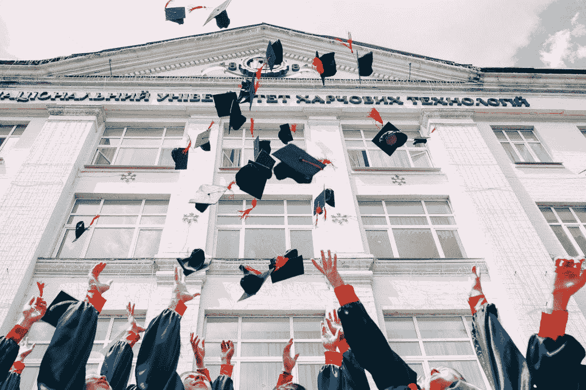
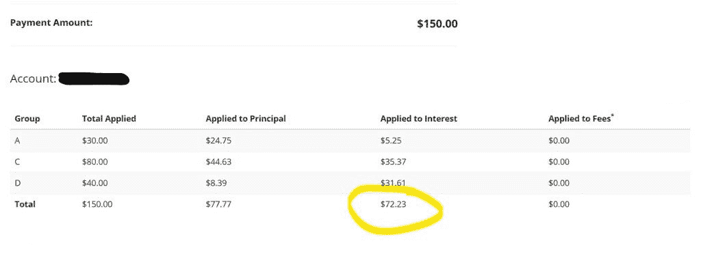

# 为什么现在是偿还学生贷款的最佳时机

> 原文：<https://medium.datadriveninvestor.com/why-now-is-the-perfect-time-to-pay-down-your-student-loans-ae5221411bca?source=collection_archive---------9----------------------->

## 即使新冠肺炎暂停，如果可以的话，你也应该继续付款

我在这里分享一些好消息:由于新冠肺炎，政府决定在 2020 年 9 月 30 日之前暂停支付所有联邦学生贷款的款项和利息。这意味着你在九月底之前不用支付你的学生贷款。另外，他们不会获得利息。准备为一个(数字)聚会买一箱酒，因为你不用支付你的学生贷款？我是来警告你不要这样做的。

 [## 更好的预算，打造更大的|数据驱动型投资者

### 即使是专家也承认它们并不完美。从 1 到 10 的范围内，安东尼·科普曼和德尔…

www.datadriveninvestor.com](https://www.datadriveninvestor.com/2018/11/08/budget-better-to-build-bigger/) 

对许多人来说，冻结付款是必要的。你[可能正在为支付食物而挣扎](https://tiffanyverbeck.com/how-to-cope-with-lost-income-during-coronavirus/)。但是如果你有能力的话，现在绝对是你尽可能多的投资学生贷款的最佳时机。为什么？你所有的现金都将用于本金——或者你实际欠的金额——而不是利息。

下面以我的学生贷款为例，对我的意思进行细分。

# 利息增加得多快

我有三笔不同金额的学生贷款，都来自联邦政府。每笔贷款的利率都在 5.5%左右徘徊，对于贷款来说，这已经算是不错的了。尽管如此，在一个月内，这些贷款获得了超过 72 美元的利息。

我每月的典型收入是 150 美元。几个月前的图片中突出显示了这笔付款，其中几乎一半直接变成了利息。我的总支付额中只有不到 78 美元流向了本金。哦。那很痛苦。这就像把我一半的钱扔进篝火里，看着它闷烧，只不过篝火是联邦政府。

好的一面？接下来的五个月政府不会收你利息。

# 最大化你的学生贷款的影响

你现在可能正在苦苦挣扎——这条建议不是给失业者或难以支付日常账单的人的。然而，如果你能负担得起你的学生贷款，这是一个很好的主意。

从现在到 9 月底，你为学生贷款支付的每一美元都会降低你的欠款额。当我支付下一笔 150 美元的时候，这 150 美元将会直接变成本金。你现在支付的越多，当利息回升时，你欠的就越少。

此外，当你的欠款总额较低时，你支付的利息也会较少。这是省钱的双重打击。

# 不要停止支付你的学生贷款

如果你有能力，不要因为你有能力就中断学生贷款的支付。我知道把钱用在其他地方很诱人。但是如果继续还款不会影响你的生活能力，那就继续吧。

当你在五个月内不用支付利息时，你可能会惊讶于你降低了多少你欠学生贷款的总额。当你在九月底看到你的欠款总额时，你就可以开派对了。你将还清这么多钱，这和任何事情一样值得庆祝。

然后你就可以庆祝摆脱了比你原本能够摆脱的更多的债务。

*原载于 2020 年 4 月 16 日*[*【https://tiffanyverbeck.com】*](https://tiffanyverbeck.com/why-to-pay-off-student-loans-during-covid-19/)*。*