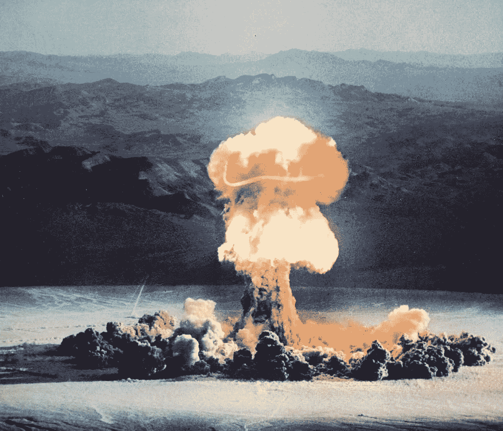

# 为什么核弹在太空爆炸时效率会低很多

> 原文：<https://medium.datadriveninvestor.com/why-nuclear-bombs-are-much-less-efficient-when-they-explode-in-space-cb8221f22e0c?source=collection_archive---------23----------------------->

## 释放的能量是一样的……但是后果却完全不同

主要由美国设计并因在广岛和长崎爆炸而闻名的核弹是非常不同于常规武器的强大武器。核弹，不管是裂变还是聚变，都不会“着火”。在爆炸过程中没有燃烧，尽管这个过程本身会引起附近物体的燃烧——甚至是那些不那么近的物体。但是由于炸弹爆炸本身不需要氧气，所以它可以发生在大气层内外。

然而，空气的缺乏对武器的效率有巨大的影响。

我们将在本文中讨论这些差异。

## 核弹如何工作

常规炸弹爆炸是因为它们里面有可燃物质。这种物质中积累了化学能，就像 TNT 一样，与氧气反应燃烧。产生的气体迅速膨胀，燃烧并物理破坏其作用范围内的一切。

核弹完全不同。

在它们的核心，有原子核容易裂变的物质，也就是元素周期表末尾的元素，有巨大且容易“破碎”的原子核。由于具有这些特性，当受到刺激并破碎时，释放的亚原子粒子本身会引起连锁反应，打碎更多的原子核，从而释放出大量的能量。

*核能*能源，不是化学能。

化学能来自原子之间的相互连接，而核能来自每个原子的组成部分之间的连接。正因为如此，常规爆炸产生的质量*与炸弹爆炸前的质量*相同，而核爆炸的质量*比炸弹爆炸前的质量*要小。

也就是说，核弹的部分物质转化为能量。

因此，核武器的核心不会真的“燃烧”。但它释放出如此多的能量，以至于其范围内的一切最终都被烧毁。伽马射线在这种爆炸中大量存在，是所有射线中能量最大的。它的存在将物质加热到如此之高，以至于它接触到的原子变成了唯一能够处理这种荒谬能量的物质状态，即等离子体。

 [## 蓝色起源能摧毁 SpaceX 的垄断吗？数据驱动的投资者

### 争夺太空主导权的战争即将升级吗？距离第一枚 SpaceX 猎鹰 9 号火箭升空已经过去 7 年了…

www.datadriveninvestor.com](https://www.datadriveninvestor.com/2020/11/26/could-blue-origin-demolish-the-spacex-monopoly/) 

## 大气层内的核爆炸

正如我所说的，核弹核心中的许多裂变材料在爆炸时转化为能量。这种主要由伽马射线代表的能量到达设备周围的空气中，将其转化为等离子体，并导致其组件荒谬地快速膨胀。热空气开始以过高的速度移动，产生冲击波，能够摧毁并烧毁建筑物、森林、人和附近的一切。下面你可以看到这次爆炸的最初时刻是什么样的:

Photo by U.S. Air Force 1352nd Photographic Group, Lookout Mountain Station. Source: [Wikimedia commons](https://commons.wikimedia.org/wiki/Main_Page) — PUBLIC DOMAIN

这些气体继续传播，摧毁它们接触到的一切。随着时间的推移，一个大的“蘑菇”形成了:热气体上升穿过更冷更稠密的大气。然而，冲击波继续扩大并带走地面上的物体。这就是下图中发生的情况:

The PRISCILLA Event, conducted at the Nevada Test Site, June 24, 1957, was a 37 kiloton device exploded from a balloon. Photo by Federal Government of the United States. Source: Nevada National Security Site Tour Booklet — PUBLIC DOMAIN

除了冲击波之外，它携带的热量会将遇到的一切都烧成灰烬。正是空气携带了这种热量。

这就是为什么没有空气会使核弹在太空中的效果如此不同。

## 核空间爆炸

核弹在太空中爆炸释放的能量与释放到大气中的能量完全相同。

但是这种能量不会转化为动能和热能，因为空气不存在。

这使得太空核爆炸的破坏性大大降低。炸弹爆炸，出现大量闪光——主要由伽马射线形成，也就是说，当这种情况发生时，它不适合在周围出现——但是，在此之后，几乎没有发生什么。

由于这种能量不会加热任何东西，所以它会无限期地在太空中传播。随着能量的扩散而消散，爆炸在几十公里后变得无害。

## 但是如果我把飞船停在炸弹旁边看爆炸呢？

然后你的飞船、你和你的客人将扮演大气层的角色。极高数量的伽马射线会激发你的船体，将其转化为等离子体，等离子体将扩展到你的船中，并结束你的派对。除非你在一个安全的距离，距离伽马射线仍然致命的极限只有几公里，否则观看这样的爆炸不是一个好主意。

即使从太空也不行。

## 总结

化学爆炸，发生在常规炸弹中的爆炸，将制造它们的材料转变成迅速膨胀的热气体云。

核爆炸将部分炸弹材料转化为能量，加热了周围的大气气体，从而形成了它们迅速膨胀的热气云。

如果在太空中发生核爆炸，将没有气体被加热，释放的能量尽管巨大，也只会消散。

然而，靠近其中一个是一个坏主意，因为你的船，内部气氛，你，你的客人，以及你为活动订购的昂贵的香槟将变成等离子体。

## 访问专家视图— [订阅 DDI 英特尔](https://datadriveninvestor.com/ddi-intel)