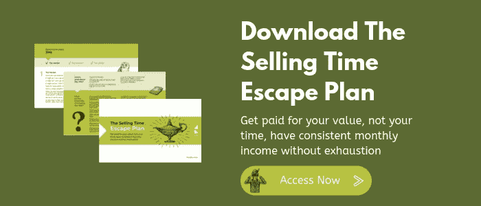

# 为什么提供不同的东西可能值得冒险

> 原文：<https://medium.datadriveninvestor.com/why-offering-something-different-might-be-worth-the-risk-6f8ed5ae771c?source=collection_archive---------25----------------------->

Photo by [Jehyun Sung](https://unsplash.com/@jaysung?utm_source=medium&utm_medium=referral) on [Unsplash](https://unsplash.com?utm_source=medium&utm_medium=referral)

有些人喜欢在世界上鹤立鸡群……他们很容易被发现，通常是因为他们喜欢鹤立鸡群这个事实。

他们勇敢无畏，毫无歉意。他们知道他们是谁，他们想要什么，他们想如何“把自己放在那里”,他们去做了。

但他们是少数。

出于某种原因，我们大多数人都有一种想要合群的自然倾向…

我们害怕“脱颖而出”……害怕太与众不同，或者让自己*太*引人注目。

我们希望被认为是*正常的*，不管那是什么……我们不想因为做事情的方式不同，或者喜欢不“酷”的东西而被嘲笑或奚落。

然而，与此同时，我们通常确实希望被注意到……被尊重……因为我们是谁。

 [## 摔倒不是失败。数据驱动的投资者

### 你只有在放弃的时候才会失败。每个英雄都会倒下，我们活着就是为了失败者出现的时刻；上升到…

www.datadriveninvestor.com](https://www.datadriveninvestor.com/2019/01/17/falling-isnt-failing/) 

所以，很复杂。我们想要那种完美的平衡，既能从人群中脱颖而出，又不必真的从人群中脱颖而出。

因为*和*带来了我们想要避免的被嘲笑的风险。

然而……除了我们的学生时代，我们都应该感谢从那个角度把我们抛在脑后，作为孩子——我们都知道——当然可能是残酷的……你真的曾经因为与众不同而被嘲笑过吗？

如果你是…你真的像你认为的那样在乎吗？

希望不会……因为作为成年人，我们倾向于对自己的身份有足够的安全感，意识到我们不会被每个人喜欢……或注意到，或欣赏……这很好。

所以作为成年人，我们倾向于让自己在一些小的方面更加突出。也许通过我们的衣服，也许在我们承认的“喜欢”中，也许在更容易表达我们的观点中…

但是当涉及到工作的时候…尤其是当涉及到自主创业的时候…我们中的许多人仍然太害怕而无法真正脱颖而出。

这可能是一个大错误。

自主创业时“合群”的危险

回想一下上一次你需要购买某种服务的时候。

你如何决定使用或雇佣谁？

你可能会看他们的网站，或者职业简介。看了他们的评论、推荐信、资历等等。

把范围缩小到提供你所需要的确切服务的人或提供者，然后你可能会根据使他们脱颖而出的某些东西来选择最终的人…

也许是因为他们能够提供一些与众不同的东西……一些独特的东西，或者给你——他们的客户——增加了很多价值的东西。

也许这是你自己更“个人”的因素……也许这甚至是潜意识的，因为*这个*是另一个典型的人类特征:我们本质上被*某些*人所吸引。

不管是因为他们的穿着方式，还是表现自己的方式；不管是因为他们说话的方式，还是写作的方式；他们的生活信念、生活方式、哲学…

不管我们对这个人感兴趣的目的是什么，我们几乎总是会被某些*人所吸引，因为他们拥有我们所拥有的特质，不管是有意还是无意，这些特质会让一个人成为某个特定角色的完美*。

那么，合群有什么危险呢？

通过融入，你不仅让自己看起来和其他人一样…消除了那种*差异*，那种*独特的*提供让你更引人注目…让你的价值更明显…

但是你可能也隐藏了你的完美品质。让你成为特定客户的完美人选的特质。

**如何脱颖而出，以及这样做的好处……**

首先，不要道歉，你……用你最喜欢的风格写作，使用让你微笑的形象……坦率地说出你自己的价值观和工作方法。对自己诚实，让它在你所有的工作、营销和交流中表现出来。

不是每个人都会喜欢；对每个人来说，你都不会是完美的 T21。但是没关系。因为你也不能和所有人一起工作。

那些选择你的人，会因为你是谁而选择你。因为他们喜欢你的风格，你的价值观，你的方法。这意味着他们也可能成为你更好的客户。

然后…与众不同。或者至少，不要*害怕*与众不同。

提供一些独特的东西，提供一些“额外”的东西，提供一些能增加更多价值的东西，你将立即在你的潜在客户可能考虑的其他服务提供商中脱颖而出。

更好的是，当你与众不同时，你的定价也会不同。

基于你的价格，基于你的服务的价格，基于你的出众而不是合群的事实的价格……并获得客户来找你的回报，因为他们确切地知道你是谁，你做什么，并因此选择了你。

要学习如何与众不同，现在就下载销售时间逃脱计划。

