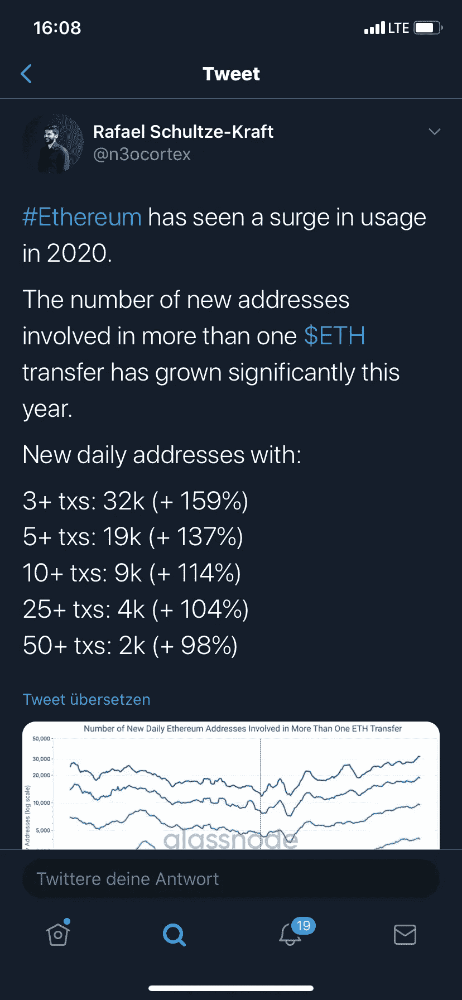
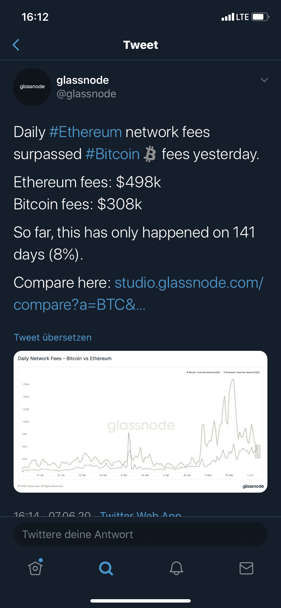
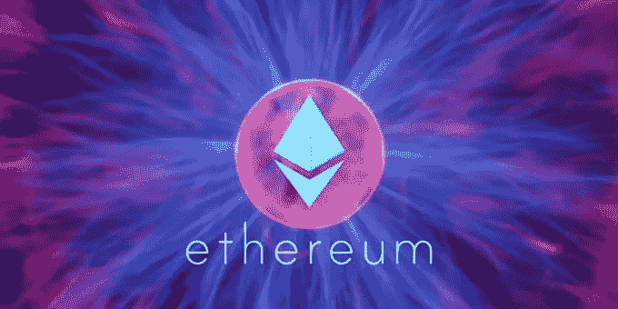

# 为什么在线数据向我们展示了一个以太网牛市

> 原文：<https://medium.datadriveninvestor.com/why-onchain-data-shows-us-an-ethereum-bullrun-9127c9652e58?source=collection_archive---------16----------------------->

以太坊仍比其历史高点低 80%以上，但这并没有阻止加密货币的用户越来越多地接受这种资产。

区块链分析公司 Glassnode 的首席技术官 Rafael Schultze-Kraft([@ n3o cortex](http://twitter.com/n3ocortex)在 Twitter 上)最近公布了如下图表。这表明，超过一笔交易的每日新增以太坊地址数量自年初以来急剧增加，并达到 2018 年以来未见的水平。

“以太坊在 2020 年的使用量有所增加。RAFAEL SCHULTZE-KRAFT 在图表上评论道:“今年，不止一次 ETH 迁移的新地址数量显著增加。

# 推动联邦理工学院的牛市案例

分析师表示，以太坊网络的使用越来越多，正在推动网络下的加密货币。Mythos Capital 创始人 Ryan Sean Adams 解释说，在过去四年中，ETH 的价格与以太坊用户支付的交易费密切相关。

由于区块链活动的增加，费用在最近几周飙升。如果历史关系成立，瑞士联邦理工学院愿意收取百分之十。

分散融资中的加密货币价值最近第二次达到了 10 亿美元。分析师认为，DeFi 的增长将成为以太坊未来几年的主要增长动力之一。

 [## 数字货币、区块链和货币的未来|数据驱动的投资者

### “区块链”、“加密货币”、“令牌化”，以及现在的“央行数字货币”已经成为…

www.datadriveninvestor.com](https://www.datadriveninvestor.com/2020/02/18/digital-currencies-blockchain-and-the-future-of-money/) 

例如，MakerDAO 的创始人 Rune Christensen 表示，以太坊将通过 DeFi 吸引加密货币领域的“所有价值”:

> “400 万戴刚刚与在一次交易中铸就。这确实显示了对非 EET 资产的潜在需求，这是一个更广泛趋势的开始，即 DEFI 正在充当一个经济真空，最终将吸引区块链以太坊的几乎全部价值。”

我在每月一期的 [**简讯中分享了更多私密的想法，你可以在这里查看**](https://mailchi.mp/bf8f8e8ed697/keep-in-touch-with-lukas) 。请在评论中告诉我，并在各种社交媒体平台上加入我:

[**推特**](https://twitter.com/WiesfleckerL)●[**insta gram**](https://www.instagram.com/lukaswiesflecker/)●[**脸书**](https://www.facebook.com/lukaswiesfleckerr)●[**Snapchat**](https://www.snapchat.com/add/luggooo)**●[**LinkedIn**](https://www.linkedin.com/in/lukas-wiesflecker-1b11251a5/)**

**无论你做什么，都要带着爱和激情去做！**