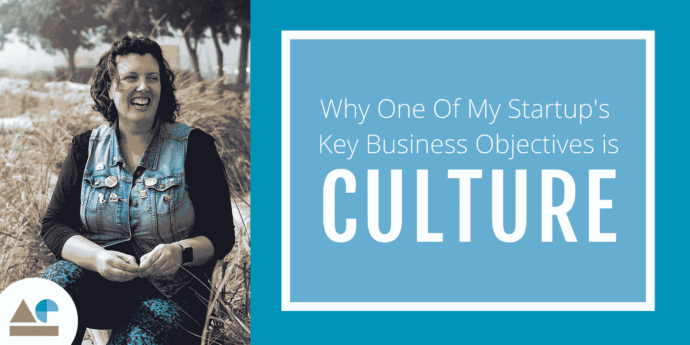
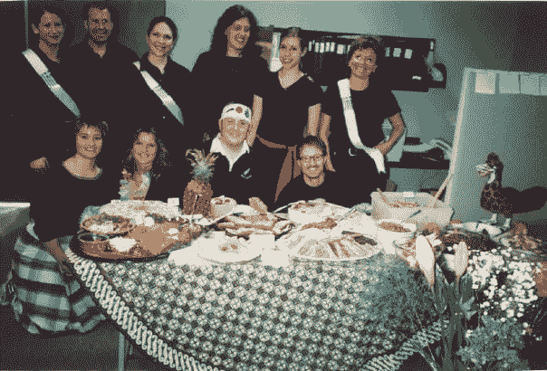
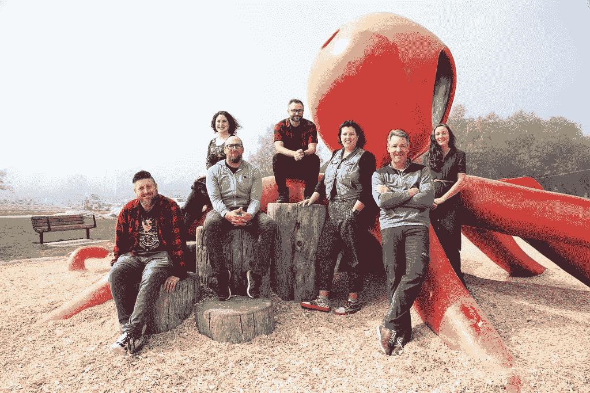
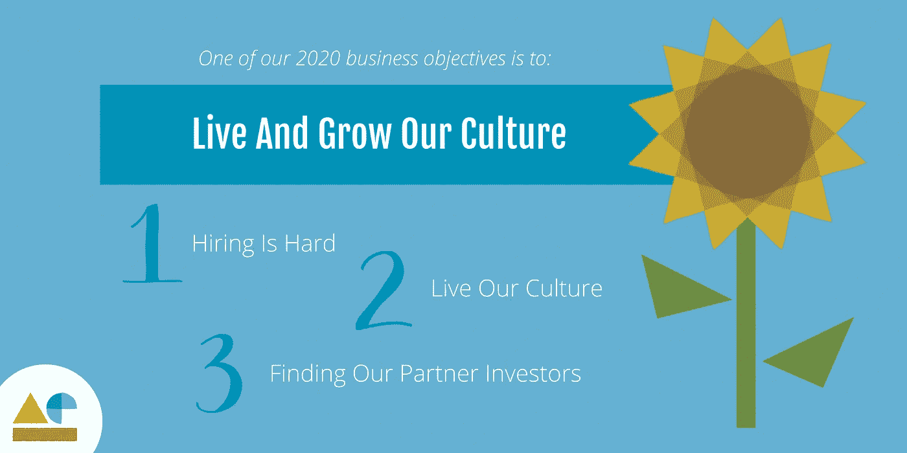

# 为什么我的创业公司 2020 年的关键商业目标之一是文化

> 原文：<https://medium.datadriveninvestor.com/why-one-of-my-startups-key-2020-business-objectives-is-culture-4becdb5746de?source=collection_archive---------6----------------------->

我的第一份真正的工作是在一家名为 Abebooks.com T2 的初创公司，现在归亚马逊所有。这是一家文化正确的公司，巩固了我一些最亲密的长期友谊。

我们一起参加了各种各样的活动。我们每年做的一件特别的事情是高尔夫球杆。整个公司都会参与其中，不管他的高尔夫球技如何。那一年，我和哥哥住在一个被我们戏称为“豪宅”的大房子里，我们提出在家里举办高尔夫后烧烤。我记得周末的时候，我拿起小桶，帮忙准备烧烤。晚会结束时，我们在地下室举办了一场即兴演奏会，让整个房子充满了音乐。当我回想这一天，我很高兴能组织和主持这次聚会。我们甚至为能在家里举办公司活动而感到自豪。每个人都喜欢在一起。

> 这是怎么发生的？为什么我觉得自己与我工作的公司及其员工联系如此紧密？即使在我因工作问题而沮丧的日子里，为什么我会把它视为一个需要克服的挑战，一个推动业务向前发展的快乐目标？

在 Abebooks 工作期间，我结交了一些最亲密的朋友，这并非偶然。我现在能够看到这些友谊是因为我在我的角色中被赋予的挑战、乐趣和责任而建立的。

The marketing team, in the 2001, Abebooks cook off

那么，相对于我们只是口头上说说的东西，文化为什么重要呢？

**一切都与人有关。**这是关于创造独特的联系。而是成为你关心的事情的一部分，关心你周围的人。

# 文化的阴暗面

虽然我看到了职场文化的光明面，但我也经历过它的阴暗面。我在一个早已失去光彩的政府机构工作了三年。虽然我被赋予了责任，我的团队也是很好的合作伙伴，但是组织中的很多人似乎并不在乎。我记得我和几个私人助理一起去组织一个会议，当时我们可以召开会议来启动一个项目。我觉得自己好像置身于《办公室》的某一集。

这种信号一次又一次地出现。慢慢地，我的工作产量下降了。我成了一个看钟的人。直到有一天我丈夫告诉我，我需要出去走走。他没有错。我工作单调乏味。我感到厌倦了。我感到沮丧。我已经变成了那种人——我其实并不那么在乎。

 [## 在创业之旅中，拥抱学习|数据驱动的投资者

### 好像建立一个数百万美元的公司还不够困难，企业家必须额外照顾他们的…

www.datadriveninvestor.com](https://www.datadriveninvestor.com/2018/10/16/on-the-entrepreneurial-trek-embrace-the-learning/) 

谢天谢地，我和我丈夫开始了咨询生涯，这为我们第一次创业创造了空间。我已经忘了我有多在乎做有意义的工作。意识到这一点很可怕。

# 为什么我有自己的公司

昨天，我早上很不顺利，不到 10 点就流泪了。从来都不是好兆头。当我走进办公室时，我的队友们都笑了，我们开了一些晨间玩笑，挂在我肩膀上的低云消散了。我的一天又重新开始了。**这就是人和关系的力量。这种人类体验很重要。这就是我经营自己公司的原因。我可以选择每天和我一起工作的*。***

My AE team

文化不是免费的小吃，啤酒星期五和桌上足球，(尽管这些都很好)。它意识到我们都是人，我们在工作之外的许多方面都是相互联系的。我们面临家庭成员的挑战，有时你的汽车或自行车坏了，打乱了你一天的计划，家里没有咖啡！你会感到愤怒和悲伤，因为即使是你的国家运动也不能幸免于欺凌和种族歧视，那次你和朋友吃饭的时候用完了堆肥袋，因为你在一大堆杂乱无章的文件中找不到账单而错过了付款，在看完《大卫·爱登堡的生活》后与生态悲伤作斗争……等等。

> 在我们走进办公室之前，我们有自己的生活，当我们下班后离开时，我们又回到了那些生活中。虽然那种生活可能感觉像是我们工作日的结束，但那些“东西”实际上就是我们。这是我们生活的实质，也是我们身份的很大一部分，也是我们相互联系的方式。仅仅因为它发生在我们工作时间之外，并不意味着它就在外面。

# 我们的文化年

2020 年是我们团队关注文化的一年。事实上，我们的四个可衡量的商业目标之一就是生存和发展我们的文化。哇哦。我知道有些人读到这里会想，*等等，这是你今年的四个主要目标之一？你到底要怎么成功？*我相信任何生意都可以短时间爆发成功。你可以有狗屎文化，可以盈利，可以成功，但这种情况不会持续太久。

文化是 OKR 的重要组成部分，也是我们关注的焦点，这有三个主要原因:

## 1 —招聘很难

招聘很难，尤其是在不列颠哥伦比亚省的维多利亚。我们的科技行业发展迅速，需求远远超过了供给。我希望我们的公司能够脱颖而出，有所作为。我希望加入我们团队的人明白文化是至关重要的，他们希望加入我们的团队并建立联系。

## 2 —寻找我们的合作投资者

我们正在为第一轮北美融资做准备，我正在寻找合适的投资者。在过去的十年里，我和很多投资者**谈过话，我接触过的投资者中有几个是关于文化的力量的。*那些*是我想合作的投资者。目标、快乐和成功是一个可持续的组合。我认为我们的商业文化目标是一种偷偷摸摸的方式，我可以从谷壳中剔除投资者。**

## **3 —活出我们的文化**

**随着我们的团队在 2020 年扩大，我们发展和保留我们的文化对我的每一个同事来说都很重要。在我们的成长过程中保留我们伟大的文化是每个人在我们最近的年度战略规划中提到的事情。当你从所有团队成员那里听到这条消息时，没有什么比这更令人满意的了。你知道你雇对了人。**

****

**我期待着在 2020 年分享更多我们的文化之旅。对我来说，深入了解文化、它的代码、它的根源以及你如何培养它，是我的运营职责中的一大重点。我很想听听什么对你有效，以及你是否在你的企业中设定了文化目标。**

**安娜贝尔·尤恩斯是增值引擎公司[***AE***](https://get.theappreciationengine.com/)***的联合创始人兼首席营销官。*****

**安娜贝尔写下并讲述了她的经历**[*对营销的信任*](https://medium.com/@ayouens/trust-is-the-next-big-data-opportunity-ae-c65799c6d0d6) *，以及她目前正在努力打造一种富有创造力和包容性的公司文化。她也用自己的* [*缝纫练习*](https://medium.com/@ayouens/one-stitch-at-a-time-my-unconventional-method-to-de-stress-and-get-focussed-153be505f11) *让自己保持理智。*****