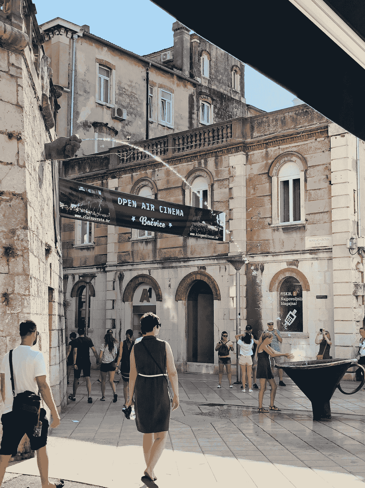
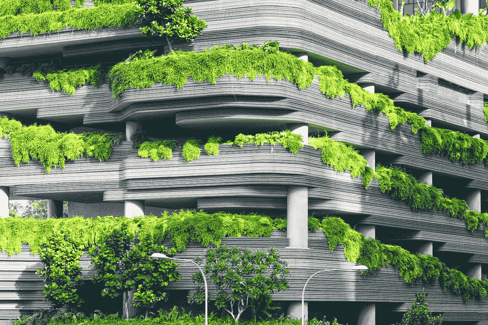

# 为什么我们的城市需要快速改变

> 原文：<https://medium.datadriveninvestor.com/why-our-cities-need-to-change-fast-4b5e558b2139?source=collection_archive---------25----------------------->

Photo by [Alessio Fiorentino](https://unsplash.com/@ale_fiorentino?utm_source=medium&utm_medium=referral) on [Unsplash](https://unsplash.com?utm_source=medium&utm_medium=referral)

我们大多数人都生活在城市里，在去年的疫情期间，我们发现城市对于人类的健康来说是多么的不舒服和糟糕。

从糟糕的公共交通到绿色空间的严重缺乏，我们意识到我们的社区不能满足我们的核心需求，也不能让我们过上有意义的生活。

在家工作引起了我们的注意。例如，随着健身房被关闭，我们看到城市经常忽视我们自己的身体健康。然而，随着正常生活的停止，疫情可以成为一个改变的机会。交通流量下降，我们的经济严重受损。一个停顿。新思想的时代。

我在我居住的城市阿姆斯特丹看到了这一点。老实说，它处于积极变革的前沿。在过去的几年里，它已经采纳了一个[循环经济计划](https://cities-today.com/amsterdam-launches-next-stage-of-circular-economy-programme/)。这是正在采取的行动的核心，以使城市更加绿色，并增加整个社会的福祉。

[循环经济](https://www.ellenmacarthurfoundation.org/explore/the-circular-economy-in-detail)基于三个关键原则:

*   设计出废物和污染
*   保持产品和材料的使用
*   再生自然系统。

如果你在想，与任何北美城市相比，阿姆斯特丹这个因沉迷于骑自行车而闻名的城市没有什么可担心的，这也许是真的。但是仍然沿着运河边的狭窄街道蜿蜒前行，你仍然要应付从你身边飞驰而过的汽车。

将来，我们这些生活在城市的人将不得不问自己，我们对汽车的热爱是否仍然有保证。

此外，如果我们想在家工作，我们需要弄清楚新来的人如何建立社会生活并完全融入社会。这也需要重新配置我们的中央商务区，除非我们希望它们变成衰败的鬼城。

一个潜在的答案可能存在于最近的概念*[*十五分钟城市*](https://www.youtube.com/watch?v=McGyONofhi4) *。**

**

*Photo by [Tom Sekula](https://unsplash.com/@tomsekula?utm_source=medium&utm_medium=referral) on [Unsplash](https://unsplash.com?utm_source=medium&utm_medium=referral)*

*从巴黎到波特兰，它已经被纳入公共政策。它侧重于许多不同的层面，其核心是让公民在离家 15 分钟的范围内拥有满足生活所需的一切。它还纳入了包容性、可负担性和环保主义等因素。*

*最终，它的目标是实现两个世界的最佳效果，城市的机会和设施，但生活在你自己的*“乡村社区*”中，在那里你会感觉像一个*当地人*。*

> ****“一个城市能做的最重要的事情就是提供一个有趣、聪明的人愿意和家人一起生活的社区”——马尔科姆·格拉德威尔****

# *如果我们的城市无法适应呢？*

*如果城市不能适应，我们将会看到更多的不平等和无法运转的城市。此外，如果在家工作的情况继续下去，他们将需要*彻底改造自己。**

*如果住房成本居高不下，质量不佳，我们将会看到越来越多的人逃离我们的城市。我们可以看到这已经在 [*大苹果*](https://eu.usatoday.com/story/news/politics/2020/12/23/new-york-population-decline-coronavirus-house-seats/4023477001/) 中发生了。*

*租金更便宜，空间更大，所以有很多动机搬到郊区。过去，我们的城市之所以繁荣，是因为它们是创新和新思想汇集和试验的中心。在未来，我们可能会看到它们变成专属于富裕的老年精英的地方。甚至超过了我们近几十年来所看到的。*

*我们的郊区，变成了真正的生活发生的地方。可悲的是，尽管他们缺乏基础设施来培育或整合它。生活越来越在线化。文化中心分散开来，没有真正的中心地位。*

*一个反乌托邦，也许不是，但我们在 20 世纪看到的创新的动态城市可能会成为我们在历史书上读到的东西。*

# *那么最有可能的结果是什么呢？*

**

*Photo by [贝莉儿 DANIST](https://unsplash.com/@danist07?utm_source=medium&utm_medium=referral) on [Unsplash](https://unsplash.com?utm_source=medium&utm_medium=referral)*

***都有，其实是**。在疫情之后，我们将会看到许多城市成功实现“锁定时代”的重新校准。我们的市政府需要继续致力于它们的更新。*

*因此，随着经济的反弹，他们需要继续鼓励“绿色”措施，并确保住房仍然是负担得起的。*

*但与此同时，对于许多行业来说，远程工作仍将以某种形式存在。所以，是的，有些人会离开城市，但吸引力会一直存在。他们的社会潜力，他们团结人们的能力。*

*尽管如此，他们仍然有一个关键因素:人。像“*十五分钟城市*”或“*循环经济计划*”这样的想法不太可能被完全实施。然而，它们所包含的核心思想可以由公民自己来推动。*

*行动主义，以确保绿色空间仍然存在，并确保空白空间用于所有人的福祉。从社区拥有的菜园到独立经营。与此同时，来自市民的压力将鼓励城市从为汽车设计转向为自行车和行人设计。*

*如果人们聚集在一起，渴望真正的改变，我们可能有机会见证城市生活的新复兴。*

## *感谢阅读，随时分享，关注我获取更多内容。*

***进入专家视角—** [**订阅 DDI 英特尔**](https://datadriveninvestor.com/ddi-intel)*