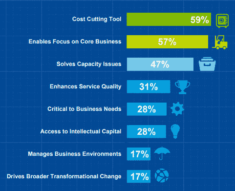
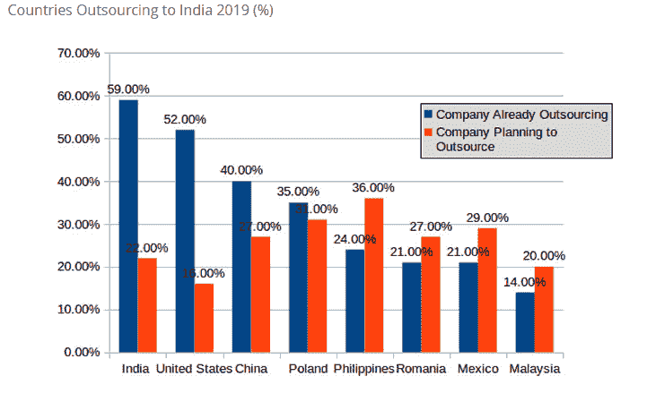
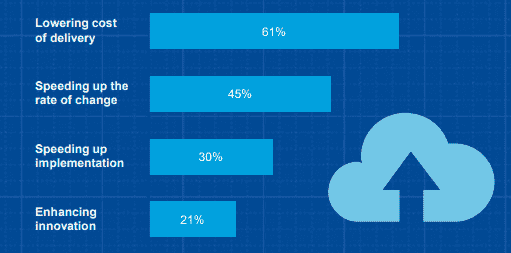
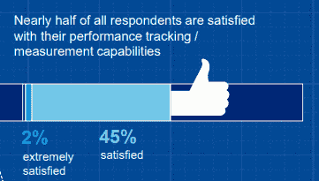

# 为什么在 2021 年外包一个专门的 Web 开发人员变得如此重要？(已更新)

> 原文：<https://medium.datadriveninvestor.com/why-outsourcing-a-dedicated-web-developer-has-become-so-important-in-2020-16ce9db0088?source=collection_archive---------5----------------------->

那么，你是否打算为你的企业创建一个数字化的存在，但仍然进退两难，你是否应该外包专门的网站开发团队或继续与内部开发团队？

的确，将您的 it 开发需求外包给离岸开发公司是一个最紧迫的问题，但目前有三分之一的小企业使用第三方 IT 服务，超过 52%的企业计划在 2019 年外包。凭借 2019 年 10300 亿美元的收入，预计 2022 年将产生 1140 美元的收入，可以肯定地说，未来将有更多比例的企业选择外包最好的离岸网络开发公司。

Image Source: [https://clutch.co/bpo/virtual-assistants/resources/small-business-outsourcing-statistics](https://clutch.co/bpo/virtual-assistants/resources/small-business-outsourcing-statistics)

> **现在你一定想知道使用外包服务的 37%的小企业是谁…所以这些是主要的:**

Image Source: [https://clutch.co/bpo/virtual-assistants/resources/small-business-outsourcing-statistics](https://clutch.co/bpo/virtual-assistants/resources/small-business-outsourcing-statistics)

> **那么，为什么这些公司选择将 IT 需求外包给离岸开发公司呢？**

无论你是初创企业还是企业家，每个人的首要关注点都是节省成本，59%的企业认为外包有助于控制成本和提高工作效率。而 57%的企业更加关注核心业务功能，并能够提高其业务投资回报率。

Image Source: [https://www2.deloitte.com/content/dam/Deloitte/nl/Documents/operations/deloitte-nl-s&o-global-outsourcing-survey.pdf](https://www2.deloitte.com/content/dam/Deloitte/nl/Documents/operations/deloitte-nl-s&o-global-outsourcing-survey.pdf)

总而言之，全球 70%的企业主对他们的外包合作伙伴感到满意。此外， [42%的美国人选择在印度外包](https://www.provab.com/42-percent-usa-companies-outsourcing-web-development-to-India-why.html)网络开发服务，40%的企业选择从中国雇佣开发人员，14%的公司更愿意从马来西亚雇佣专家。

Image Source: [https://www.provab.com/42-percent-usa-companies-outsourcing-web-development-to-India-why.html](https://www.provab.com/42-percent-usa-companies-outsourcing-web-development-to-India-why.html)

> 现在让我们快进到 2021 年你应该寻找离岸网站开发服务的主要原因？

## **外包专业网站开发人员、设计人员和营销人员的理由**

无论你是想创建一个新网站，升级旧版本还是想提高网站的排名，你都需要一个包括设计师、营销人员和开发人员在内的专门开发团队的支持。雇佣顶级 [**网络开发公司**](https://www.xicom.biz/offerings/web-development/) 的最大优势之一是，你将获得一个经验丰富的完整团队，他们将带领你的业务更上一层楼。

> **让我们来了解一下为您的企业雇佣专门的 web 开发团队的主要原因:**

*   **专注的开发人员效率更高，确保项目快速交付**

开发一个网站并不像在 WordPress 上拿起设计模板那么简单。有成百上千的东西可以让它平稳运行。

无论是在 Shopify 上开发电子商务网站，在 WordPress 上开发单页网站，还是在 Magneto 上开发高度动态的网站，每个网站都有自己的代码、模板、小程序和小部件。随着网站的发展，您需要相应地更新整个源代码和小部件，以确保无缝的用户体验。

 [## 多平台 SaaS 应用的 2020 年发展选择|数据驱动的投资者

### 我目前正在为公司做一个新项目。该项目包括一个移动应用程序，由一个…

www.datadriveninvestor.com](https://www.datadriveninvestor.com/2020/07/13/2020-development-choices-for-multi-platform-saas-application/) 

在这种情况下，与定制网站设计的专门开发团队合作可能是最佳选择，因为他们不需要熟悉网站编码、功能和小部件。通过快速分析，他们可以评估在哪里进行必要的更改。

*   **专注的开发人员确保更好的周转时间并降低开发成本**

选择一个专门的开发团队的主要原因之一是，它总是确保在最短的时间内进行最高质量的开发。不管你的项目需求有多复杂或多关键，它们总是会超出你的期望并满足需求。

在 web 开发社区中，它的开发成本直接关系到你的网站开发需要多长时间。由于总的开发时间将与开发人员每小时的成本计算，因此开发时间越少，成本越低。

*   **专门的开发人员利用最新的技术和成熟的方法**

作为一个企业主，你很难让自己跟上所有最新的技术。然而，作为一家 [**网络开发公司**](https://www.xicom.biz/offerings/web-development/) 与最新的技术世界保持同步是他们工作不可或缺的一部分。

> 根据德勤的[调查报告，第三方网页开发公司可以降低 61%的交付成本，并加快最新技术的实施过程，因为他们知道如何有效地利用新战略。](https://www2.deloitte.com/content/dam/Deloitte/nl/Documents/operations/deloitte-nl-s&o-global-outsourcing-survey.pdf)

70%的公司目前正在实施或正在讨论在网站上使用机器人和认知过程自动化来改善结果。

Image Source: [https://www2.deloitte.com/content/dam/Deloitte/nl/Documents/operations/deloitte-nl-s&o-global-outsourcing-survey.pdf](https://www2.deloitte.com/content/dam/Deloitte/nl/Documents/operations/deloitte-nl-s&o-global-outsourcing-survey.pdf)

*   **专门的开发团队可以增加一系列专业知识**

建立一个专业的网站不是一个人的工作。相反，网站开发包含了广泛的技能，包括平面设计师，文案，编码，网页开发，数字营销，托管支持，等等。为每项任务聘请专家不仅是一项令人生畏的工作，而且会增加您开发预算的巨大成本。这就是为什么与专门的开发团队合作是真正的价值，因为他们有内部专家来做一切事情，从设计一个完美的标志，内容开发到网站推广。

> 其次，近[一半的企业对外包公司的表现感到满意](https://www2.deloitte.com/content/dam/Deloitte/nl/Documents/operations/deloitte-nl-s&o-global-outsourcing-survey.pdf)，因为跟踪项目表现和他们的能力更容易。

Image Source: [https://www2.deloitte.com/content/dam/Deloitte/nl/Documents/operations/deloitte-nl-s&o-global-outsourcing-survey.pdf](https://www2.deloitte.com/content/dam/Deloitte/nl/Documents/operations/deloitte-nl-s&o-global-outsourcing-survey.pdf)

*   **专门的开发团队可以提供数字营销支持**

不管你的网站有多漂亮，多实用，如果没有访问者，你所有的努力都白费了。有几种数字营销策略可以帮助你推广业务，提高在 SERPs 上的知名度。但是，随着网络上数以百万计的网站，使您的网站在首页可见是最重要的和令人生畏的业务任务之一。因此，网络开发公司使用下面提到的策略来推广网站:

> **点击付费(PPC)**
> 
> **社交引擎优化(SEO)**
> 
> **文案**
> 
> **社交媒体营销**

*   **专门的开发公司可以提供全面的网络支持**

因此，最后你建立了一个定制的网站设计，并准备推出它。但是等等，你会在哪里推出它，你想过吗？

当与顶级网站开发公司合作时，你不需要担心任何事情，因为他们为主机和域名管理提供全方位的网站支持。这还不是全部，一个负责任的开发者会在你的网站上线后进行速度测试，以保证页面的快速加载。

此外， [**雇佣网络开发人员**](https://www.xicom.biz/offerings/hire-web-developers/) 提供月度支持，继续更新网站上的所有内容，修复可能随着时间推移而产生的错误，这将是一个很好的选择。

*   **专门的开发团队确保更好的客户保护**

雇佣自由职业者来创建一个定制的网页设计可能比雇佣一个专业的 DDT 花费少一点，但是请记住，一旦一个自由职业者拿到了现金，那么你就完全没有保护了，并且有可能带着你的钱消失。

然而，当你与一家好的 [**软件开发公司**](https://www.xicom.biz/) 合作时，你所购买的一切都将在适当的协议中列出。这意味着你将确切地知道你得到了什么，代价是什么。一切都将在详细的合同中得到加强，所以在这种情况下，网络开发公司不能在服务和项目交付的质量上妥协。

## **简单地说:**

无论你是初创企业、企业还是中小企业，与第三方开发公司的合作可以帮助你增加业务的竞争优势，因为他们致力于独特的方法和实际有效的规划策略。但是，你们中的许多人想知道在哪里雇佣最好的网站开发公司，以及你需要记住哪些关键因素。

> 让我们找到这些问题的答案…

## 哪里可以找到 IT 外包公司来雇佣专门的 Web 开发人员？

当谈到为 web 开发项目雇用专门的开发人员时，企业有四个主要关注点:

*   开发人员的经验
*   领先技术堆栈的知识
*   开发成本和时间
*   项目的安全性

对于许多企业来说，使用搜索引擎来获得最佳 [**网络开发公司**](https://www.xicom.biz/offerings/web-development/) 的名单是最容易获得最佳开发人员的方法。但是，如果要在不影响质量的情况下在预算内开发项目，**那么你需要努力用不同的参数评估每个公司的概况，包括:**

*   公司简介
*   他们处理的项目类型
*   他们交付的 web 开发项目的数量
*   客户满意政策
*   客户的反馈和评价
*   web 开发人员的每小时成本
*   NDA 形式的追随者
*   客户评级

但是，对于任何企业来说，用如此详细的参数来比较每个公司的概况都是非常耗时的。所以这里有几个知名的 B2B 平台，你可以信任并考虑雇佣最好的网站设计师:

*   [**离合器:**](https://clutch.co/) 最大的 B2B 平台，由 500 个类别的 150，000 多家代理机构提供支持，帮助各级公司探索跨领域的顶级服务和解决方案，以找到满足其需求的最佳资源。从公司简介、定价、服务到位置，当你考虑聘请网站开发人员时，你将在一个地方获得公司的所有细节。
*   [**goodforks:**](https://www.goodfirms.co/)goodforks 是一个成熟的研究和评论平台，帮助企业选择最好的软件和网站开发商或公司。同时，这个平台提供了详细的收购数据、市场份额和品牌知名度。事实上，这个平台可以通过简单地将客户评论、公司内容和资源、产品和服务以及目录进行分类来推荐高性能 IT 公司的名称。
*   这是世界上最大的市场之一，在这里你可以找到各种顶级的网络开发机构和网络开发人员，他们更喜欢按小时收费。Upwork 在分析和审查概况、投资组合、技能组合和成本并帮助企业找到最适合其发展需求的公司后，仅列出了知名公司的名称。

# **最终想法**

对于资源有限的开发人员来说，开发一个网站是最令人望而生畏的任务的日子已经一去不复返了。然而，现在有了最好的内容管理系统(CMS)和 web 开发工具，开发一个网站对开发者来说不再是一项遥不可及的工作。然而，与此同时，这里出现了一个中心问题，如何在竞争激烈的市场中脱颖而出，数以百万计的网站已经在万维网上运行，并在同一领域提供服务？

当你需要定制网页设计并希望它在搜索中排名靠前时，真正的挑战来了。雇佣一个自由职业者对许多企业来说可能是一个不错的选择，但与最好的人握手- [**专门的开发团队**](https://www.xicom.biz/) 可以在一个小包装中提供多种好处。

**访问专家视图—** [**订阅 DDI 英特尔**](https://datadriveninvestor.com/ddi-intel)