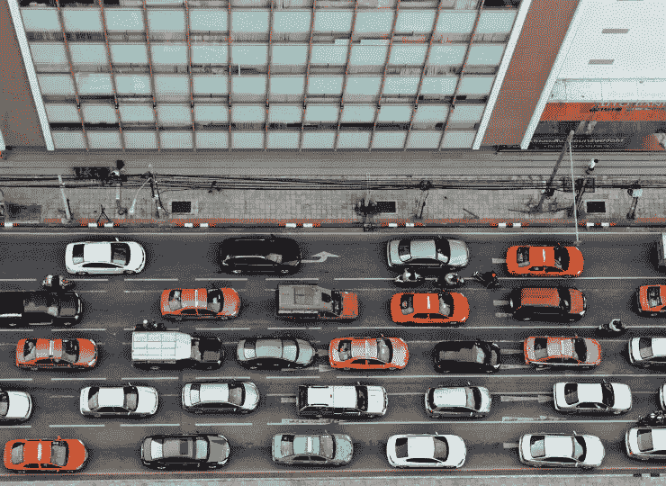

# 当从一个地方到另一个地方成为一种按需服务时，为什么还要拥有一辆豪华汽车呢？

> 原文：<https://medium.datadriveninvestor.com/why-own-a-fancy-car-when-getting-from-a-to-b-becomes-an-on-demand-service-b133c92e88ad?source=collection_archive---------9----------------------->

由哈拉尔德·伍特斯和提金·凯珀制作

在未来的几年里，移动性将会发生巨大的变化。一方面，对环境的担忧将迫使汽车工业逐渐淘汰汽车中的内燃机。但是真正的变化将会出现在我们如何使用汽车上， [*这些汽车 95%的时间都停在路边*](https://www.citymetric.com/transport/once-driverless-cars-are-road-human-drivers-should-be-banned-4641) *。拥有一辆汽车可能变得无关紧要，驾驶一辆汽车也是如此，这将比我们预期的更快发生。在数字服务的时代，我们需要提醒自己，在上个世纪初，购买 CD 或 DVD 播放器似乎是完全正常的。*

# 增强颠覆信念的消费者转变

在关于创新的对话中，总有一个人会引用亨利·福特的名言:“如果我问人们想要什么，他们会说是更快的马。”虽然没有明确的证据表明这位大规模汽车生产的先驱曾经说过这句话，但在 20 世纪 10 年代初，福特的 T 型车突然从马匹转向了其他车型，这绝对是一个惊人的现象。在 20 世纪初，曼哈顿第五大道上的所有车辆都是马拉的。仅仅过了大约十年，[同一条街上仅有的“马力”都在车内](https://www.businessinsider.com/5th-ave-1900-vs-1913-2011-3)。

当考虑电动汽车的潜力时，特斯拉等制造商认为这是他们自己雄心的典范。他们颠覆汽车行业的神圣信念被最近的消费转变所强化，比如智能手机的繁荣。当教皇方济各 2013 年首次在圣彼得广场发表讲话时，他的观点与不到十年前的前任完全不同。2013 年，[梵蒂冈广场点亮了](https://www.instagram.com/p/W2BuMLQLRB/)，所有的智能手机和平板电脑都捕捉到了这一场景，但 2005 年的奇观主要是由人眼捕捉的。

# 震撼整个汽车行业

汽车世界最具颠覆性的变化可能不是转向电池作为动力来源。虽然这对我们星球的福祉至关重要，但对人们(以及利润)来说，真正的革命将是[承诺的从个人拥有车辆到完全共享使用的转变。](https://www.fleetnews.co.uk/smart-transport/features/can-shared-transport-really-help-tackle-pollution)

共享所有权的关键在于将从 A 地到 B 地的不同交通方式整合成一个流动服务系统；一个将潜在乘客的实时需求与移动服务提供商基于位置的服务相结合的数字平台。因此得名移动即服务(MaaS)。

# 深深植根于我们的自我和表达中

将优步、Lyft 或谷歌地图路由放在这十年的时间线上，我们将看到更多联网和自动驾驶将为大众提供的东西。大约到那时，T2 的汽车工业可能会变得非常不稳定。几十年来，汽车制造商一直在深思熟虑地开发和设计汽车，以适应个人口味；不同的品牌、类型和风格适合不同的个性。就像鞋子、衬衫和太阳镜一样。只要提到一个刻板印象——足球妈妈、美国农村人或中年父亲——你就能立即想象出他们可能会开什么类型的车。汽车仍然是生活方式的一部分，是我们个性的一部分，深深植根于我们的自我和我们的表达中。但是该放手的时候到了。

# 轻松规划、预订和支付

随时随地从一个地方到另一个地方，就像遥控器上的点播电视一样，触手可及。MaaS 支持从车辆所有权到车辆使用的范式转变，这不仅是为了针对特定乘客需求提供更好的服务，也是为了应对不断增长的城市移动需求带来的持续[挑战。](https://www.cerre.eu/publications/shared-mobility-and-maas-regulatory-challenges-urban-mobility)

MaaS 的中心思想——对 Top Gear 爱好者和全球新建立的中产阶级来说可能听起来很陌生——是当你可以在任何需要的时候使用一辆车时，拥有一辆车将是不必要的。[拉斯维加斯的 CES 2020](https://technical.ly/philly/2020/01/17/ces-2020-epam-future-automotive-transportation-mobility-electric/)和巴塞罗纳的[智慧城市博览会](http://www.smartcityexpo.com/en/topics/mobility)都在很大程度上依赖于 MaaS 概念和平台。他们向世界展示了一些概念，允许用户在一个地方计划、预订和支付使用多种车辆的费用，最大限度地减少麻烦。MaaS 还能够为更广泛的目标群体提供移动性，例如行动不便、收入较低或居住在农村偏远地区的人。

# 在全球范围内进行 MaaS 实验

全球各地的城市都在尝试将公共交通与共享电动汽车(如汽车、自行车、踏板车和轻便摩托车)结合起来。有趣的 MaaS 概念正在欧洲试行，例如在哥本哈根( [Movia](https://www.moviatrafik.dk/) )、巴塞罗那( [MaaS Catalonia](http://www.carnetbarcelona.com/index.php/2018/07/23/maas-catalonia/) )、安特卫普( [Civitas Portis](https://civitas.eu/portis) )和汉诺威( [Mobility Shop](http://www.uitp.org/news/maas-hannover) )。但是在南美最大的城市圣保罗( [Bike Sampa](https://thecityfix.com/blog/bike-sharing-now-viable-commuting-choice-sao-paulo-porto-alegre-priscila-pacheco-bruno-batista/) )和东南亚的城市国家新加坡([突发奇想](https://www.marketing-interactive.com/comfortdelgrp-positions-new-app-as-netflix-of-transport/))也有类似的事情发生。在荷兰，基础设施部正准备利用该国的高人口密度在七个不同的地区针对不同的目标群体(如通勤者、老年人和残疾人)全面推广 MaaS。其目的不仅是在城市交通枢纽及其主要机场(史基浦机场)周围提供按需服务，还在于找到一种比铺设更多沥青更有效的替代方案，以适应不断增长的公路交通。

# 优化日常城市系统中的出行

最近，芬兰初创公司 Maas Global [筹集了 3300 万美元的投资](https://venturebeat.com/2019/11/07/maas-global-raises-33-million-to-bring-multi-modal-transport-subscriptions-to-cities-globally/),以促进替代交通概念在全球的使用。该公司最出名的是 Whim，它提供了许多订阅和预付费模式。该应用程序让你决定如何通过使用公共交通、租赁汽车和共享自行车从 A 到 B 到 C(等等)。这是即将到来的从所有权到使用的转变的一个主要例子，也是日常城市系统中的不同方如何通过优化出行体验来有效合作的一个主要例子。MaaS 平台连接供应商(交通运营商)、使用者(城市基础设施)、推动者(投资者)和使用者(乘客)。

# 标准化是成功的关键

根据 Gartner 的说法，为了提供 MaaS 概念，我们的整个运输系统需要改变[，这些挑战既有技术性的，也有非技术性的。合适的移动服务的开发和集成需要与该过程中涉及的所有各方协作。国家和地方政府需要提供适当的法律框架，以及充足的有形和数字基础设施。移动服务提供商需要彻底合作，整合他们的方法和程序。标准化是成功的关键。投资者需要参与进来，为支持这些发展提供资金。考虑到 MaaS 的跨国实施，这些障碍可能会变得更加严重。](https://www.gartner.com/en/documents/3957421/3-ways-transportation-cios-can-shape-a-mobility-as-a-ser)

# 对乘客的好处

由于没有从头开始的选项，将新的移动服务与现有的公共交通网络相结合可能是一个障碍，也是 MaaS 发展停滞的主要原因。例如，在共享开放和实时数据以及整合支付和票务系统方面，必须与现有运输运营商签订合同，并就专用基础设施的使用达成协议。

然而，将需求驱动的移动服务与公共交通系统相结合，可以为乘客提供巨大的优势。它提高了运营和财务效率，并将农村地区与更大的系统连接起来。希望在不久的将来，一些新兴技术可以加快整个过程，并帮助更快地克服这些挑战。5G 的引入提供了更加可靠的物联网网络，这是互联和自动驾驶的必要条件。区块链技术可以帮助克服售票和保护乘客数据方面的障碍。

*共享移动的未来看起来很光明，MaaS 可能比我们想象的更近。*