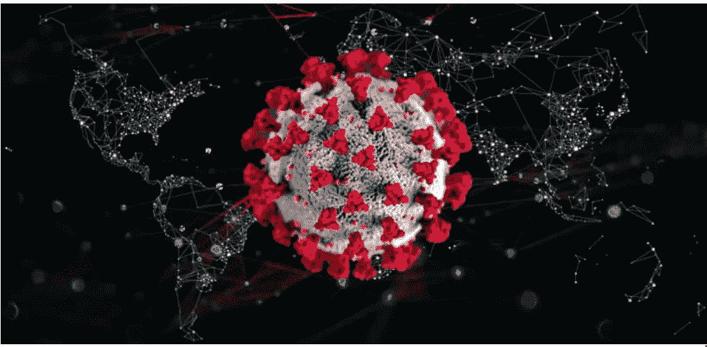

# 为什么牛津的“超级疫苗”在与 COVID19 的竞赛中似乎遥遥领先？

> 原文：<https://medium.datadriveninvestor.com/why-oxfords-super-vaccine-seems-to-be-ahead-in-the-race-against-covid19-a5511aba84bd?source=collection_archive---------3----------------------->

Image Credits:[https://gcn.com/articles/2020/02/25/geoai-covid-19-mapping.aspx](https://gcn.com/articles/2020/02/25/geoai-covid-19-mapping.aspx)

# 牛津大学的科学家们计划在临床试验之前，在 9 月份生产 100 万剂超级疫苗。

> “我们已经开始冒险生产这种疫苗，不仅是小规模生产……而且在全世界多达七个不同地方都有制造商网络，”
> 
> 据路透社报道，牛津大学詹纳研究所教授兼主任阿德里安·希尔在一次在线简报中说。

这意味着，如果人体试验失败，无效疫苗仍将被投放市场，这可能导致目前疫情价值数百万欧元的损失。却没有拯救任何生命。

# 问题是为什么这些科学家愿意冒这么大的风险去挽救几个月的时间？

目前，有 70 种疫苗正在与 COVID19 竞争，其中只有 5 种已经进入人体临床试验阶段。而 ChAdOx1 nCoV-19 就是其中之一。

根据协议，这五种疫苗在投入使用前都要在志愿者身上进行测试。

除了 ChAdOx1 nCoV-19，它跳过了疫苗测试的最重要阶段，直接上市。

 [## 冠状病毒；惊慌失措；字里行间的 z |数据驱动的投资者

### 围绕冠状病毒的话题；更准确地说，新冠肺炎几乎占据了整个新闻预报的头条…

www.datadriveninvestor.com](https://www.datadriveninvestor.com/2020/03/23/coronavirus-a-to-panic-z-between-the-lines/) 

Chadox1 是以前为 MERS- COV 开发的疫苗，类似于 SARS-COV 或 COVID19。

它针对 MERS 的试验显示，人体内有很强的免疫反应来对抗病毒。但也可能导致因患者而异的继发性症状。

MERS 和 SARS 有大约 90%的结构相似性，这意味着对这种疫苗进行一些调整应该能够以对抗 MERS 的相同方式解决 COVID19 危机。

因此，尽管风险很高，但这种疫苗成功的可能性甚至更高。

# 技术面

MERS 和 SARS 在基因上就像两个兄弟姐妹一样相似。如果同样的疾病影响了你和你的兄弟姐妹，很可能由于你们的基因相似，同样的药物能够治愈你们两个。虽然我们作为人类可能仍有例外，但病毒兄弟姐妹彼此非常相似。

目前的 ChAdOx1 nCoV-19 治疗是腺病毒疫苗载体。一种叫做腺病毒的病毒被引入体内。然而，这种病毒被编程为产生与 COVID19 病毒表面存在的蛋白质相同的蛋白质。这种刺突蛋白有助于附着在人体细胞上。一旦这种刺突蛋白通过病毒载体在我们体内产生。我们的身体会产生一种免疫反应，类似于我们体内的战争召唤。这将导致几种化学物质、抗体和其他因子的释放，从而产生强大的免疫屏障，保护我们免受任何未来的 COVID19 攻击。这意味着一旦我们服用这种疫苗，即使这种病毒进入我们的身体，我们的身体也将对任何未来的 COVID19 攻击免疫。

这种疫苗如果成功，将成为数百万紧急病例的第一条生命线。尽管在接下来的一年中将会有几种针对 COVID19 的疫苗问世。这将是第一次。

现在是我们支持科学界、医学界和其他许多人的时候了，他们拯救生命，让世界继续前进，即使是通过这个疫情。

> 正如霍夫曼所说:“没有正常发挥作用的疫苗，就没有解决这场危机的办法。”

关于牛津大学疫苗活动的更多信息，见他们的网站[这里](https://www.covid19vaccinetrial.co.uk/home)。