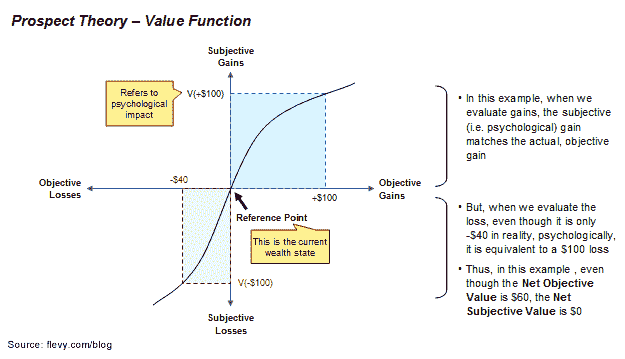

# 为什么即使你的产品很棒，人们也不会买

> 原文：<https://medium.datadriveninvestor.com/why-people-wont-buy-your-product-even-though-it-s-awesome-3233cb73746d?source=collection_archive---------38----------------------->

*注:本文由我的同事***原创发布。**

**

*这是任何规模的公司，无论大小，都面临的一个普遍的商业问题。*

*情况是你开发了一个出色的产品。与现在或现有的做事方式相比，你的产品功能更多，更容易使用，对客户来说更经济。*

*问题是你的销售很差。为什么顾客不敲门？*

****客户是否不理智？****

*答案是肯定的。大量研究表明，消费者行为是非理性的。如果你不这样认为，那么你的行为也是不理性的。*

*要理解为什么人们不买你的产品，必须理解行为经济学中的一些关键概念。这里有三个需要认识的重要原则。*

***原则 1。损失大于收益***

*每一种新产品都会给顾客带来可感知的收益和损失。这些得失不一定是财务上的。例如，假设您正在为您的自治市开办一家在线杂货店。有了食品送货上门的承诺，感知到的收益可能是方便、节省时间和精力。另一方面，你正在改变顾客执行某个过程的方式——购买杂货。这种变化将转化为可感知的损失(即财务和非财务成本)，这可能包括无法精选农产品和肉类、送货费以及在送货窗口期间不得不呆在家里。*

*当我们客观地看待这一点时，网上杂货显然是一个更好的选择。毕竟，方便、节省时间和精力是很好的价值主张。*

*然而，当顾客主观地评估选择时，网上食品杂货是否是更好的选择就变得不清楚了。事实上，很可能顾客认为网上购物是较差的选择。这是因为损失远大于收益。*

*消费者有一种固有的**消费者偏见**。这种偏见的损失是收益的三倍。换句话说，要让顾客认为新产品比现有产品更好，收益的客观价值需要超过损失的客观价值三倍。*

***原则二。参考点很重要***

*要理解的第二个原则是不同的人有不同的参考点。这些参考点很重要。参考点只是指人当前的状态。*

*继续我们的网上杂货商的例子，典型客户的参考点是目前去实体超市买杂货的人。这个过程可能已经是客户每周例行工作的一部分。得失是相对于这种存在状态而言的。*

*对于具有不同参考点的两个人来说，一个人的收益可能被认为是另一个人的损失。为了说明这个概念，让我们看看天然气的价格。假设美国每加仑汽油的平均价格是 3 美元，而英国是 10 美元。如果一个美国顾客偶然发现一个加油站收费 6.50 美元/加仑，她会大发雷霆。如果一位英国顾客遇到同样的情况，她会欣喜若狂。(此外，请注意，尽管两个客户的客观差异是相同的，但美国客户的情绪会比英国客户受到更大的影响，因为损失大于收益。)*

**

*价值函数说明了客观价值和主观价值*

*通过了解你的客户的参考点，你可以确定她的感知得失。在大多数情况下，您的参考点与客户的不同。这是因为你已经使用和体验过你的产品，而你的客户还没有。你的产品已经成为你存在状态的一部分。这种判断上的差异体现在被称为**创新者的诅咒**的概念中。*

***原则三。禀赋效应***

*根据禀赋效应，人们对自己拥有的物品(即禀赋的一部分)比对不拥有的物品更看重。这是因为人们厌恶损失。*

*这种行为解释了为什么损失大于收益。如果客户已经习惯了现有的产品或现有的做事方式，她就很难放弃和改变——即使替代方案能带来更大的好处。*

****这些原则有没有阻碍你的销售？****

*认识和理解行为经济学的这三个原则至关重要。它使我们能够制定产品策略，专门应对消费者的采纳障碍，并利用行为倾向。*

*现在，让我们来看三个这样的策略——每个原则一个。*

***10X 法则***

*如果损失大于收益，那么我们需要创造一种收益大大超过损失的产品。创造一个收益是损失 10 倍的市场，这样所有的经济和心理转换成本都可以被克服。这也被称为安迪·格罗夫的 10X 法则。英特尔的第三名员工、前首席执行官安迪·格罗夫曾表示，要想被广泛采用，新产品必须比现有产品提高 10 倍。*

*当然，这个策略说起来容易做起来难。*

***参考点枢轴***

*因为参考点决定了客户如何看待收益和损失，所以寻找具有有利参考点的客户是有意义的。这么想吧。在一个市场中，你的产品可能符合 10 倍法则。在另一种情况下，你同样的产品可能会被认为差 10 倍！*

*早些年，沃尔玛只在农村地区开店，与当地的夫妻店竞争。与这些现有零售商相比，沃尔玛明显提高了 10 倍。相反，如果沃尔玛开始在已经建立了大型百货连锁店的大都市地区开店，沃尔玛的增长将会受到阻碍。*

*理想的市场是充满首次购房者的市场。对于第一次购买者，她的参考点是中性的。她对现有的利益损失和产生的新成本没有任何先入为主的偏见，因为她目前没有使用现有的解决方案。因此，对于许多产品来说，在新兴市场推出是最容易的。这是因为新兴市场(如金砖国家)充满了首次购房者。点击阅读更多关于[进入新兴市场的信息。](https://flevy.com/blog/craft-a-successful-strategy-for-emerging-markets/)*

***免费增值模式***

*禀赋效应有一个有趣的含义。这意味着顾客会花更多的钱、时间和精力来保留她所拥有的东西，而不是第一次获得。*

*有了对消费者心理的这种认识，许多公司提供免费样品来让顾客对他们的产品着迷。一旦客户开始使用该产品，她会欣赏它提供的好处，并可能会花钱保留这些好处。本质上，这是参考点旋转的一个例子。*

*同样，许多 SaaS 互联网公司采用的流行商业模式是“免费增值”模式。在免费增值模式中，客户首先会看到产品的免费版本。然后，向客户提供(或强迫)一个高级版本。*

*关于产品采用、消费者心理和产品策略的更深入的讨论，请看这个商业文件:[产品采用心理](https://flevy.com/browse/business-document/Psychology-of-Product-Adoption-203)。*

****还没骰子？****

*当然，如果你的产品很棒——你这么认为，你的客户也同意——那么销售的缺乏可能是因为营销不善。加大你的营销、销售和业务开发力度。*

*对商业战略感兴趣？查看 Flevy 收集的商业框架，大部分是由顶级咨询公司的前顾问创建的。*

*编辑:我刚刚发表了一篇新文章，[产品采用完全指南](https://flevy.com/blog/the-complete-guide-to-product-adoption/)。本文从市场层面、产品层面、消费者层面和策略层面分析了产品采用；并且基于许多已建立的商业战略框架。*

*也请在评论中分享你的想法、经历和建议。谢谢！*

# *想在战略发展方面取得卓越成就吗？*

*获取知识，发展专业技能，成为战略发展专家。我们的框架基于领先的咨询公司、学者和公认的主题专家的思想领导力。[点击这里了解全部细节。](https://flevy.com/browse/stream/strategy-development)*

*“没有战术的战略是最慢的胜利之路。没有战略的战术，是战败前的噪音。”——孙子*

*为了有效的战略发展和战略规划，我们必须掌握战略和战术。我们的框架涵盖战略的所有阶段，从战略设计和制定到战略部署和执行；以及各个层面的战略，从公司战略到商业战略再到“战术”战略。这些方法中有许多是由全球战略咨询公司编写的，并且已经在他们的财富 100 强客户组织中成功实施。*

*这些框架包括波特的五种力量、波士顿咨询公司的增长份额矩阵、格雷纳的增长模型、能力驱动战略(CDS)、商业模式创新(身体质量指数)、价值链分析(VCA)、残局利基战略、价值模式、价值创造的综合战略模型、情景规划等等。*

*[在此了解我们的**战略发展最佳实践框架**。](https://flevy.com/browse/stream/strategy-development)*

*在 [**管理和企业咨询**](https://app.ddichat.com/category/management-and-corporate-consulting) **:** 中安排一次 DDIChat 会议*

* [## 专家-管理和企业咨询- DDIChat

### DDIChat 允许个人和企业直接与主题专家交流。它使咨询变得快速…

app.ddichat.com](https://app.ddichat.com/category/management-and-corporate-consulting) 

在此申请成为 DDIChat 专家[。
与 DDI 合作:](https://app.ddichat.com/expertsignup)[https://datadriveninvestor.com/collaborate](https://datadriveninvestor.com/collaborate)
点击订阅 DDIntel [。](https://ddintel.datadriveninvestor.com/)*