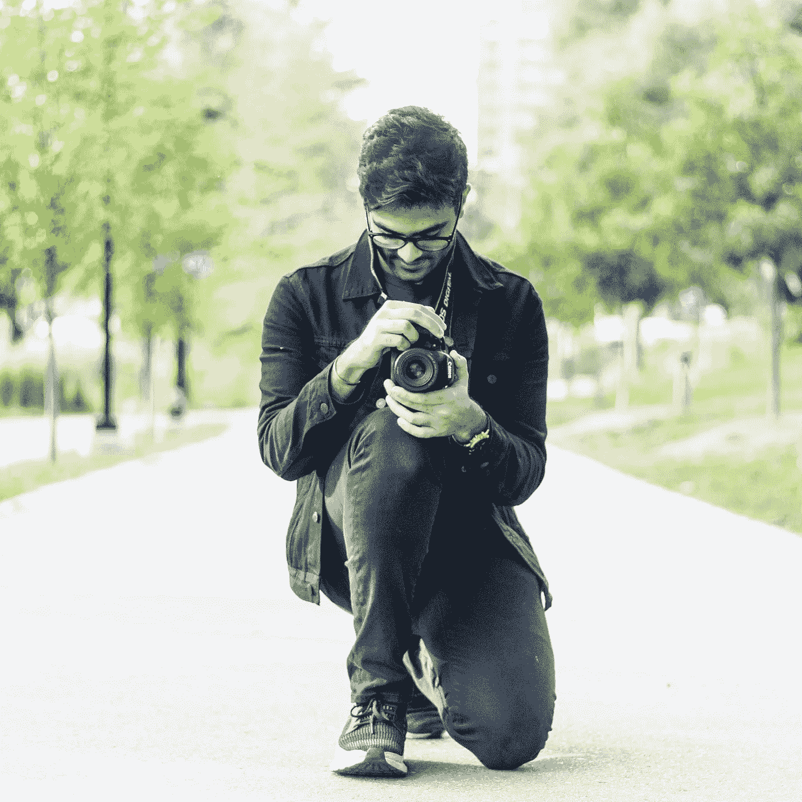

# 为什么摄影师“贵”

> 原文：<https://medium.datadriveninvestor.com/why-photographers-are-expensive-27546e67de25?source=collection_archive---------22----------------------->

## 摄影师收费如此之高的原因

Photo of me by Annabelle Hartwich

我觉得很多人在得知摄影师收费时都很惊讶。许多人经常会想“为什么我要花那么多钱请人拍照，而我可以用我的手机拍照，手机的性能和相机一样好”。

事实是，成为一名专业摄影师是昂贵的，需要大量的时间、练习和技巧。是的，这可能是真的，你手机上的相机可能比市场上的大多数相机都好，但如果你不知道如何使用它，它就毫无意义。

像许多其他技能和职业一样，要成为一名专业摄影师，从竞争中脱颖而出，成为一名拥有 DSLR 的普通人，需要多年的实践和知识。补充一下，成为一名摄影师需要做的事情太多了，这些事情加起来很快就会变得昂贵。

首先，如果我们看一看摄影师使用的所有设备和软件，它会很快累加起来。相机的价格从几百美元到几万美元不等。显然，这将取决于摄影师，技术水平和他们想从相机中得到什么，但很可能一个专业摄影师已经在相机机身上花了几千美元。现在，在等式中加入透镜，这是一个类似的情况，透镜可能花费几百到几千美元。接下来，你有更小的配件，如相机电池、反光镜、遥控器、存储卡、硬盘、闪光灯、三脚架等。一些摄影师，取决于他们做什么样的工作，会走得更远，有一个备用的相机机身，更大的灯，甚至工作室空间。接下来，是用来编辑和经营摄影业务的软件。大多数摄影师使用 Adobe Lightroom 和 Photoshop 来编辑他们的照片，所以他们需要每月大约 30 美元的 Adobe Creative Cloud 订阅，加上一些摄影师会在 SquareSpace 等网站上建立自己的网站，并为自己做广告，每年一百或更多。如你所见，所有这些加起来接近或超过 10，000 美元，还不包括他们作为普通公民的基本生活费用。

现在，不是所有的摄影师都是一样的，由于有许多相机，镜头和软件选项，很难确定一个准确的数量，但是，可以肯定地说，摄影师的价格是他们设备价格的一部分。

其次，也是最重要的，你雇佣摄影师的原因是因为他们的技术、审美和专业。找一个摄影师和找一个纹身师很相似:你想要一个符合你审美的人，并且捕捉到你想要的风格。摄影师确实收费很高，所以重要的是要确保你做了调查，找到一个花了时间，体验过他们的过去，掌握了他们的技术的摄影师，这样你就知道你花的钱是值得的。当你雇佣一名摄影师时，你是在花钱让他们捕捉你生活中重要的一部分，无论是一个特别的生日，为你的餐馆拍摄食物，为你的商店拍摄时尚，无论是什么，你都会想要最好的，因为这对你来说很重要。花在拍照上的时间只是花在家里的时间的一小部分，在家里浏览成百上千的照片，选择最好的，然后编辑它们。幕后有大量的工作要做。

由于硬件、软件和花费在摄影师身上的时间的价格，你很少会找到一个想为“曝光”而拍摄的摄影师，这是有原因的，因为曝光不能支付账单，不允许他们投资设备和升级技术。摄影师有冻结瞬间的天赋，并让它们永远持续下去，如果你仔细想想，这是无价的。