# 为什么 Pret 的订阅模式对我们很好，但对 Pret 却很糟糕

> 原文：<https://medium.datadriveninvestor.com/why-prets-subscription-model-is-great-consumers-but-terrible-for-business-8061112f1a32?source=collection_archive---------0----------------------->

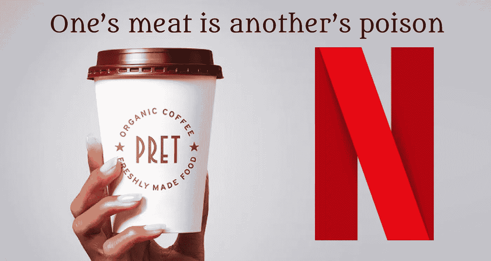

## 订阅模式在咖啡连锁店是行不通的。随着潘多拉魔盒的打开，预计会有一场价格战。

在英国，Prêt à Manger 的 20 英镑/月订阅计划一直受到[的不良](https://www.dailymail.co.uk/news/article-8697297/Customers-slam-Prets-five-drinks-day-subscription-scheme-not-worth-commuting-for.html)接待。在我看来这有点粗暴。

作为一名(以前的)订阅者，我确实认为 Pret 过度满足了我对“订阅体验”的期望。Pret 免费提供了一个月的咖啡，让我从一个爱喝茶的人变成了一个咖啡迷。太棒了！

还有，**Pret 的订阅值 20/月**吗？

此外，Pret 复制网飞订阅模式的举动令人费解。

【Pret 怎么赚钱？Pret 是否做出了明智之举？

**还有，为什么每个企业都在谈论订阅模式？**

## *下面是你将从这篇文章中学到的东西*

是的，订阅是值得的。

如你所料，大量喝咖啡的人/伦敦人会节省很多。然而，Leon 也以更低的价格提供订阅服务。如果你希望经常为同事们送咖啡，那就订阅 Leon 吧。

对于 Pret 来说，它已经在订阅战中获得了先发优势。用户体验简单、流畅且精通技术，由幕后的顶级订阅管理软件(ChargeBee 和 EagleEye)提供支持。尽管如此，Pret 将输掉这场由它发起的订阅战。

这是因为网飞的订阅模式在商品化的咖啡连锁店中根本不起作用。竞争对手将竞相压价，开始一场订阅价格战。

Pret 赢得了这场战斗，但将输掉这场战争。

这对美国消费者来说很好，但对 Pret 及其竞争对手来说却很糟糕。

成为咖啡迷的最佳时机。

最后，我还将指出我们可以从订阅模式的兴起中学到什么。对于投资者来说，这意味着*认购正在吞噬世界*。

## **本文将涵盖:**

**👉🏻Pret 的订阅是什么？**

**👉🏻我的 Pret 订阅体验如何？**

**👉🏻值 20/月吗？**

**👉🏻Pret 如何从订阅中赚钱？**

**👉🏻Pret 的订阅是明智之举吗？**

**👉🏻Pret 的 YourBarista 有其他选择吗？**

**👉🏻外卖:订阅吃天下**

麦当劳也会推出订阅服务吗？？？

# 1.Pret 的订阅是什么？

今年九月，咖啡连锁店 Pret A Manger [**推出了**](https://www.pret.co.uk/en-GB/your-pret) **热饮订阅服务。**

没有。Pret 不会把你的咖啡送到你家门口。

这是一种咖啡合同。“Pret”俱乐部的会员。就像你每个月为网飞疯狂观看《王冠》付费一样，你每个月也要为 Pret 的咖啡付费。

它叫做 YourPret 咖啡师。很时髦吧？！

**简而言之，Pret 的订阅套餐允许你走进英国的任何一家 Pret，在基本上无限制的基础上买到任何你喜欢的咖啡，每月只需支付 20 英镑的固定费用。**

订阅规定每 30 分钟可以点一杯饮料，一天最多 5 次。这可以是咖啡师准备的任何热饮或冷饮。

思慕雪，弗瑞普斯和☕️茶也包括在内！

# 2.我的 Pret 订阅体验如何？

## **报名简单顺利**

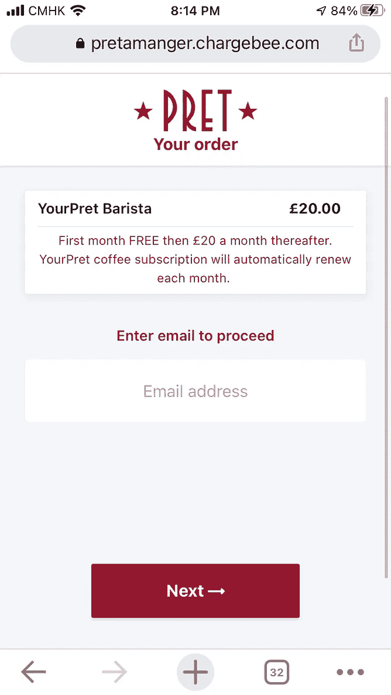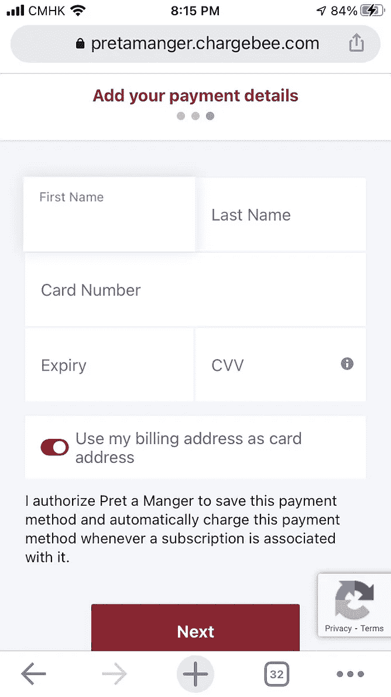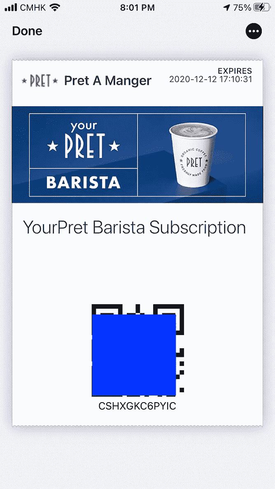

Signup Trilogy: Email, add card details, QR code in your email

## **逛 Pret 商店总是一件痛苦的事**

我住在牛津，一个学生城。Pret 外面总是排着长队。

Just another day in Oxford. Credits [Andre T D Parola](https://medium.com/u/2fd1997e1a71?source=post_page-----8061112f1a32--------------------------------)

你在上图中看到的队列是可以管理的。有时候，队伍排得太长，以至于排到了拐角处的另一条街上。

## **咖啡只要……就可以了**

在免费订阅的第一个月，我几乎尝试了所有种类的咖啡。是的，Pret 咖啡是淡而无味的。

因此，我通过“定制”我的首选饮料来玩转这个系统:榛子浓淡白。

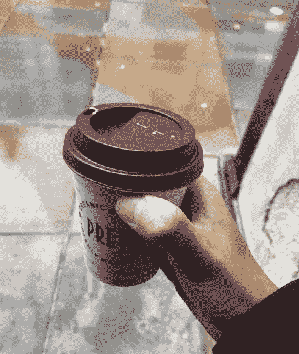

My favourite: hazelnut flat white

仅供参考，平白是 2.50。多拍 50p。榛子丸 50p。总计:3.50 英镑💰

反正我的第一个月是免费的。不妨充分利用！

## **当你想取消**的时候 Pret 很粘人

在你的第一个免费月之后，不容易取消你的订阅。

首先，我必须在我的电子邮件收件箱里寻找“欢迎来到你的 Pret 咖啡师”。然后我不得不滚动到邮件的底部，找到一个按钮“管理您的订阅”。

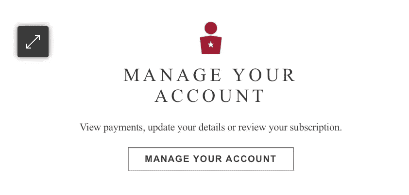

在我取消订阅之前，Pret 再次希望我留下。

*“你确定要取消吗？”*

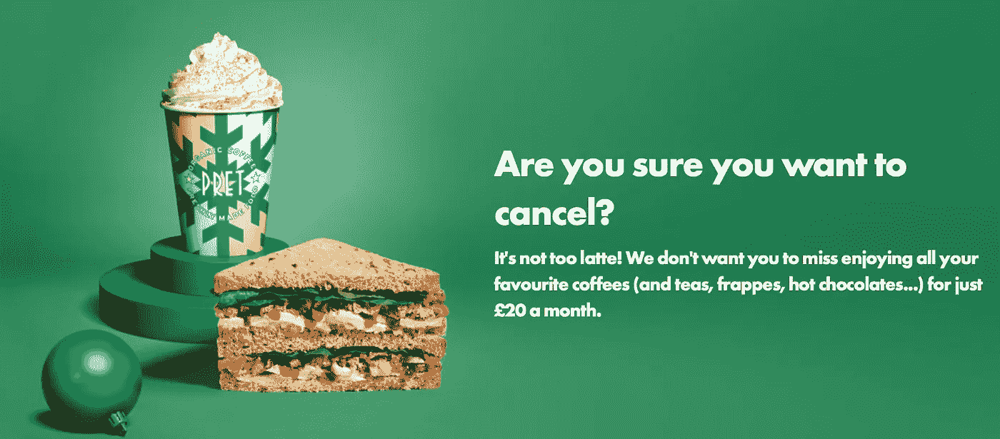

Pret, It’s too latte to apologize….

干得好，普雷特。

这是一种非常粘人但聪明的留住顾客的方法。Pret 从成功的软件公司那里借鉴了这种订阅商业模式。例如 Spotify。

但是高街咖啡连锁店 Pret 能从软件公司成功借到多少呢？

继续读📖你会知道 Pret 的订阅模式是否有商业意义。

# 3.值 20/月吗？

作为消费者，我们都面临一个简单的问题:这种订阅是否为我们省钱？好吧，我们来算算。

## 是的，如果你每月至少喝 10 杯酒

好吧，假设你的首选饮料是拿铁、摩卡、卡布奇诺或一杯纯牛奶。这些普通订单在 Pret 的价格都是 2.50 英镑，尽管各地的价格有所不同。请记住，你也可以得到茶，冰沙，或 frappes。

其中 10 个月没有订阅(25)已经值 20 订阅。一个月 10 杯咖啡相当于一周 3 杯咖啡。

那么问题来了，*你能不能每周至少从 Pret 买 3 杯咖啡？*

*   如果你是住在大学城的学生……

早上去图书馆前买一个。当你从图书馆回到学生宿舍时，再去拿一张。然后在一周的另一天再做一次。简单。

*   如果你在伦敦工作……

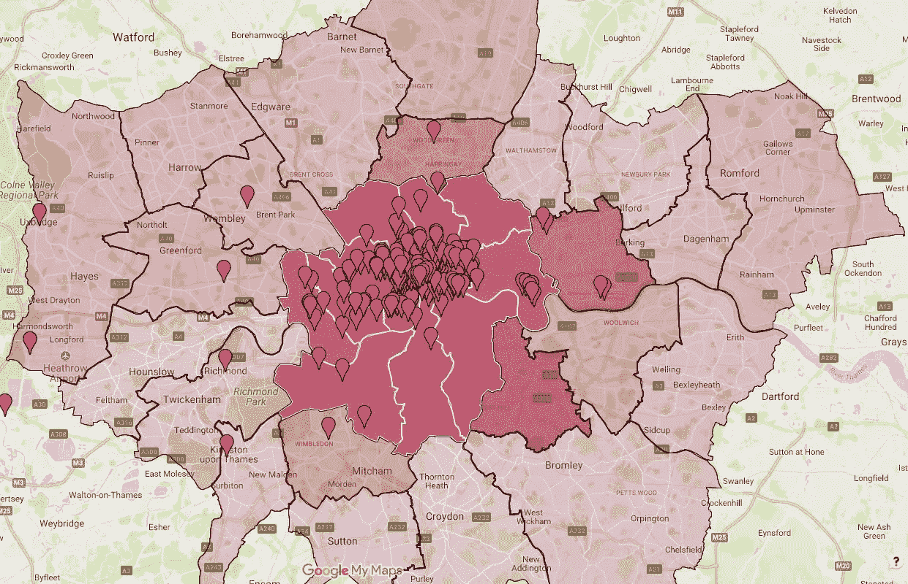

Pret is everywhere in London….

比方说，周一到周五，你每天上班路上都会喝咖啡。那是一周五杯咖啡！简单。

## **是的，当你一个月只花 20 美元就能买到 140 杯咖啡的时候**

一杯咖啡 2.50 英镑，140 杯咖啡通常一个月 350 英镑。订阅的话，你花 20 英镑就能买到价值 350 英镑的饮料！

这听起来不可思议。如果你想尽最大努力。你的收益，你可以混淆你的订单。每天，喝两杯咖啡，两杯咖啡，或者一杯茶。

但实际上，我已经受够了 Pret。

## 不会，因为你最终会花掉 20 多/月

首先，预付 20 英镑/月意味着你必须坚持 Pret，即使你附近没有 Pret。

第二，你每次去 Pret 商店都只买咖啡吗？如果你在午餐时间去，你会很想吃三明治或法棍面包(~ 3)或沙拉或卷饼(~ 4)。

所以，如果你也每天在那里吃午餐，你很快就会比平时花更多的钱。

记住:你每 30 分钟只能喝一杯。如果你想充分利用你的订阅，你必须更频繁地访问 Pret。

# 4.Pret 如何从订阅中赚钱？

## 平均而言，订阅不会为消费者节省任何费用

Pret 允许你每天最多喝 5 杯咖啡。也就是每周 35 杯咖啡。

然而，Pret 每周只向普通顾客出售约 5 杯咖啡。这个星期你从同一家商店买了多少次饮料？就几次，对吧？

假设你每周喝两杯咖啡，价格是 3.50 英镑(榛子味浓咖啡的价格)，你已经在省钱了。这相当于每月节省 8 英镑！

如果你想节省更多，你可以改为每周喝 10 杯咖啡。上班路上买一辆白色平板。午餐时间喝杯咖啡。去开会的时候再买一瓶纯白色的。

你现在已经改变了你的行为:

*   你每周多去五次。每次访问时，你更有可能为别人购买其他东西(小吃、午餐、饮料)
*   如果你也在 Pret 开会，你可以带其他没有订阅的人来。他们将支付全价，例如每杯 3 英镑

多亏了你，Pret 的收入增加了很多(不，我们不会在这里做算术)。

除了每周 5 英镑的订阅费，你还可以轻松地为 Pret 带来每周 5 英镑的收入。

## **Pret 每周多 5 英镑，Pret 的竞争对手每周少 5 英镑**

你还记得星巴克、Costa 和 Caffe Nero 吗？

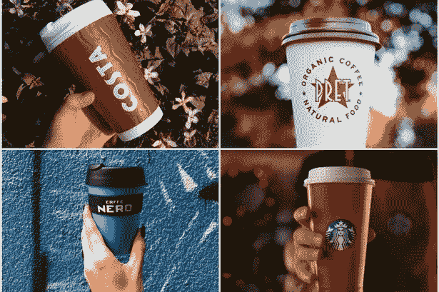

Costa v Pret v Caffe Nero v Starbucks

他们以同样的价格出售同样的咖啡。但是你为什么选择去 Pret 呢？

**当涉及沉没成本(20)时，你会变得更加忠诚于 Pret。**

# 5.Pret 的订阅是明智之举吗？

我之前提到过，Pret 大量借鉴了网飞/Spotify 的剧本。准确地说，网飞/Spotify 的商业模式被称为软件即服务(SaaS)，也称为订阅模式。那么，SaaS 模式在多大程度上适用于 Pret 的咖啡业务**？**

## **首先，客户会为 Pret 的订阅付费吗？**

你订阅网飞，因为坦白说，这是最好的流媒体服务。你订阅 Pret 是因为它有最好的咖啡吗？

不幸的是，我们真的不能将软件与 Pret 的饮料相提并论，因为 Pret 的核心产品——咖啡——在很大程度上是一种商品。这意味着星巴克拿铁和 Pret 拿铁之间没有产品差异。至少我尝不出也“感觉不到”有什么不同。

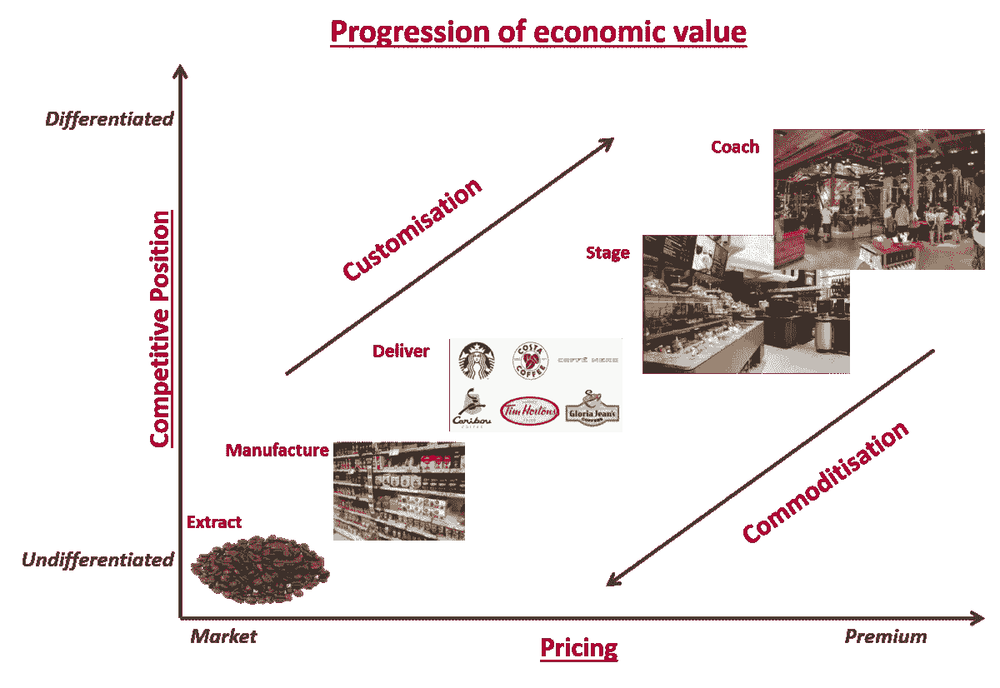

“Deliver” has also become a commodity now…

咖啡连锁店知道这一点，所以他们试图在其他方面与众不同。对星巴克来说，是品牌忠诚度。对 Pret 来说，这是他们在伦敦的黄金地段。

因此，与网飞/Spotify 订阅**访问**或 Peloton 订阅**所有权相比，** Pret 的订阅是一种沉没成本。

顾客只关心**他们预付了多少钱**和**他们能得到多少咖啡来使订阅物有所值。**在这种情况下，客户是价格敏感的。

 [## SpaceX vs 维珍银河——太空旅游业务主导地位的竞赛|数据驱动的投资者

### 只有 566 个人去过太空。这些人 85%以上来自三个民族。超过一半的…

www.datadriveninvestor.com](https://www.datadriveninvestor.com/2020/11/25/spacex-vs-virgin-galactic-the-race-to-a-space-tourism-business-dominance/) 

## **二、Pret 要收多少钱？**

该做些数学了！让我们借用 SaaS 的一些指标:

*   *MRC(每月经常性费用)*

为顾客服务的每月费用。对于 Pret 来说，这是生产饮料的月成本。

直觉上，订阅的饮料越多，MRC 越高！

*   *MRR(每月经常性收入)*

来自订阅(20)和其他购买的月收入。正如我们上面所说的，你最终会每个月在 Pret 上花费超过 20 英镑，即 MRR > 20 英镑。

*   *CAC(客户获取成本)*

获得一个客户的成本。Pret 为你提供免费的第一个月，所以这是他们的 CAC。

*   *LTV(生命时间值)*

在订阅的“生命周期”内从客户处获得的收入。如果平均订阅 6 个月，LTV 就是 6*MRR。

*   *搅动*

取消订阅的客户百分比。Pret 已经使取消变得相当困难，所以这将减少他们的流失率！

现在我们知道什么是 MRC，MRR，CAC，LTV 和流失。有什么意义？

要点是:**所有订阅业务都应最大化其 LTV/CAC 比率**。更简单地说:Pret 在不给你折扣的情况下从你那里获得的收入越多，就越好。

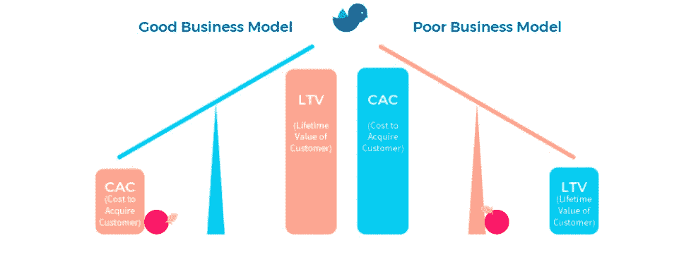

The larger LTV, the smaller CAC, the better.

LTV 的上升潜力有限，因为球在客户的球场上。客户在他们的订阅“生命周期”中决定他们将在 Pret 上花费多少。

然而，CAC 取决于 Pret。我相信你知道很多人注册了免费的第一个月。免费赠送一个月的咖啡不是很蠢吗？

你看，有了一个月的免费咖啡，通常不去 Pret 的顾客现在可以从 Pret 买到咖啡了。Pret 抢走了其他咖啡连锁店的市场份额。

但我认为，这里最大的潜力是扩大市场。

在 Pret 的 YourBarista 之前，我真的不喝咖啡，更不用说付钱买咖啡了。比起咖啡，我更喜欢茶；比起茶，我更喜欢热巧克力。

在享受了 Pret 一个月的免费咖啡后，我对咖啡因上瘾了，尽管我现在已经取消了订阅。

让我们假设大约 20%的新近转变的咖啡上瘾者成为全付费顾客。这对 Pret 来说是个好结果。

第一个免费月把不喝咖啡的顾客变成了咖啡迷。

这也被称为蓝海战略。成长为“蓝海”新的市场空间，创造新的需求。相比之下，《红海》充满了竞争和血腥的🩸

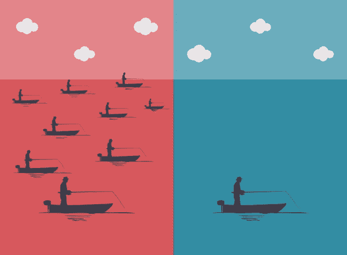

Red Ocean is overfished. Blue Ocean is the uncharted waters, literally.

Pret 避免了红色市场与星巴克、caffeèNero、星巴克和 Costa 的竞争。相反，它驶入了“蓝海”,发展了咖啡连锁店市场。

这里是[关于蓝海战略的更多](https://www.clearpointstrategy.com/blue-ocean-strategy/)。

因此，成功取决于 Pret 能从蓝海获得多少消费者增长，以及能向其用户收取多少费用。

## **第三，Pret 成功执行了订阅模式吗？**

这款 Pret 背后的技术如此流畅，却又如此简单。原来订阅支付是由 [Chargebee](https://www.chargebee.com) 提供支持，而二维码是由[鹰眼处理。](https://www.eagleeye.com/solutions/connecting-with-new-customers)

Chargebee 是一家初创公司，[最近](https://techcrunch.com/2020/10/06/chargebee-raises-55-million-to-help-businesses-move-to-subscriptions/)筹集了 5500 万美元的资金，迄今为止总计 1 . 05 亿美元，它通过计费、发票、支付和收入确认流程实现了收入运营的自动化。客户包括 Freshworks、Pret-a-manger 和 Study.com。这是 SaaS 的 SaaS。*时髦。*

另一方面，鹰眼将自己定位为营销公司。他们整合了他们的 AIR 平台(销售分析)和“Pret 的店内 Oracle MICROS Simphony 销售点”(咖啡师使用的机器)。

ChargeBee 抓住了我的鹰眼。它最近宣布[与 Pipe 合作](https://www.prnewswire.co.uk/news-releases/chargebee-and-pipe-partner-to-supercharge-saas-growth-870097522.html)，Pipe 是一家帮助 SaaS 企业将其年度订阅收入转换为即时资本的初创公司。Pipe 独特的商业模式在 Packy 的时事通讯《不无聊》中得到了很好的介绍。

此外，Pret 非常擅长留住客户。当我试图取消订阅时，它终于向我展示了继续订阅的美妙之处:

做得好，Pret！

最后，Pret 三个潜在改进:

*   在主页上展示节省的费用

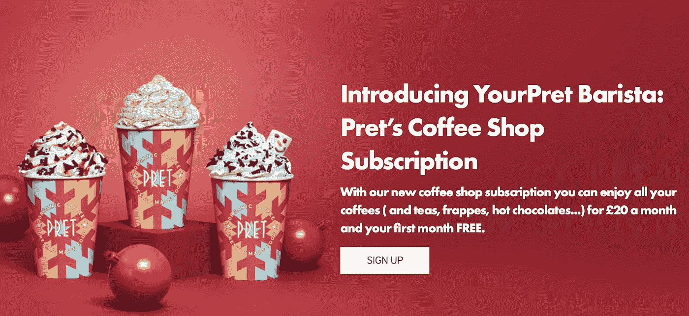

Very Christmas-y 🎄

价格是中肯的。20 足够高，以至于人们会充分使用该产品或服务，以至于他们觉得他们的钱花得值(沉没成本效应)，但也足够低，以至于他们会在一个月后继续使用它。

但也要记住，Pret 的客户对价格很敏感。这意味着他们想立即知道他们能存多少钱。

*   利用客户的购买和位置数据

Pret 知道我对纯白很着迷，而且我只点过一次 frappe。所有这些信息都是通过销售点机器收集的。

Pret 应该利用这一点，向我发送“个性化”的电子邮件，让我来取我的“日常美白产品”。或者推荐我试用 frappe！

在伦敦，地理位置数据也特别重要，因为在这里“拿了就走”很流行。我是更常去牛津街还是邦德街？Pret 能否为消费者重新定向，从而最大限度地减少排队时间？Pret 也许可以给我在某些商店经常购买的折扣吗？

*   将饮料与“小吃/三明治——Pret 的膳食交易”捆绑在一起

经常性收入束(RRB)是圣杯。想想亚马逊 Prime。Pret 能否将经常购买的饮料与很少购买的零食/水果捆绑销售？当然，有很多可能的组合，Pret 可以尝试。

# 6.Pret 的 YourBarista 有其他选择吗？

Leon 也加入了咖啡订阅战，在 30 天的时间里推出了 75 种咖啡，每月仅售 15 英镑。

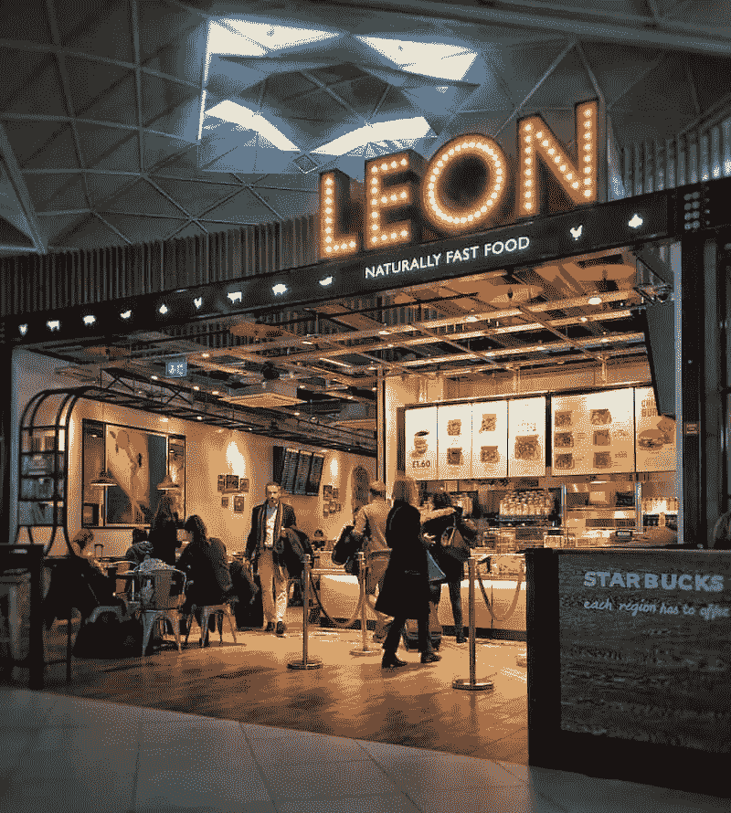

Leon, Prêt a Náturally Fást Föod

然而，与 Pret 不同的是，它没有单次发球的限制。所以你一天能拿多少就订多少。

这实际上是以 15 英镑的价格批量购买 75 杯咖啡。办公室肯定会利用这一点，每天运行大量的咖啡运行。

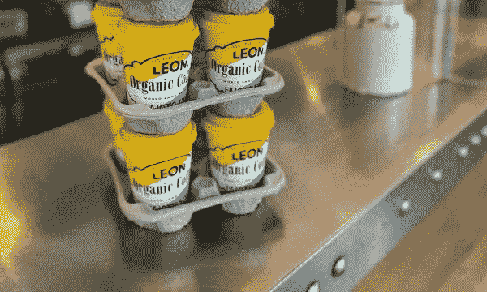

Poor interns will have to carry 20+ coffees each coffee run

里昂的咖啡平均也比 Pret 的略贵，这意味着每月节省的费用也会更多。

有什么条件？对于普通客户来说，这种订阅并不太好。与 Pret 不同，Leon 的订阅不包括茶、热巧克力和其他饮料。

Leon 也不像 Pret 那样精通技术。虽然你可以用二维码在咖啡师点 Pret 饮料，但你需要通过点击订购来点 Leon's。你将不得不预先计划好你的咖啡之旅，而不是自发地去见里昂。

不过 Leon 的主要问题是，他们在英国的 65 家商店中，大多数都位于伦敦。

# 7.关键要点

## 对于消费者:你应该订阅 Pret/Leon 吗？

**不，如果你一周喝咖啡少于 3 次。**咄。如果你仍然不知道为什么，向上滚动阅读我解释数学如何工作的部分。

**是的，如果你一周喝咖啡超过 3 次。**尽管现在你不得不坚持去 Pret/Leon 喝咖啡，但你每月至少可以节省 20 英镑！

如果你在伦敦工作/学习，选择里昂的而不是 Pret 的。你可以节省更多，并请你的朋友和家人喝一杯“免费”拿铁。

## 对投资者而言:认购正在吞噬整个世界

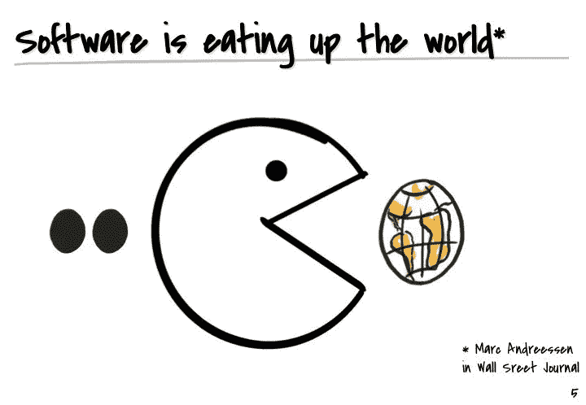

Marc Andreessen’s famous [essay](https://a16z.com/2011/08/20/why-software-is-eating-the-world/) in 2011, predicting the inevitability of SaaS

著名风险投资公司 a16z 的联合创始人马克·安德森在他的著名文章中认为，软件将吃掉世界。软件将消费大多数行业，如医疗保健、教育、消费等。

另一方面，亿万富翁投资者、橡树资本(Oaktree Capital，一家管理着 1400 亿美元资产的投资基金)创始人霍华德·马克斯(Howard Marks)曾经创造了“二级”思维(secondary-level thinking)一词，即考虑二级效应的能力。

如果 SaaS 的崛起是一个既成事实，那么二级效应是，这些新兴的 SaaS 初创公司需要平台来满足他们的需求。

因此，第二层投资主题可以是投资于解决软件公司痛点的公司。例如，ChargeBee 和 Pipe 都是支持 SaaS 的平台。ChargeBee 帮助订阅公司处理自动支付、计费、分析等。Pipe 帮助 SaaS 的初创公司用他们的年度预测订阅收入换取前期资本。

此外，不要忘记，作为一种资产类别，经常性收入的可能性越来越大。这里有很大的发展空间。

## **针对企业主**

如果你销售产品/商品，例如 Pret，甚至是服务，你应该认真考虑订阅模式。虽然一次性购买很直观，但订阅锁定了客户，并提供了更大的追加销售潜力。

是时候驾驭“一切即服务”的浪潮了(AAA，而不是屁股)

## 对于 Pret

除非 Pret 能够保持目前的 CAC 水平(一个月的免费咖啡)来对抗 Leon 和其他潜在的新进入者，否则进入订阅是一个战略错误。Pret 今年可能获得了一些额外的支持。但它能维持其炒作水平吗？

咖啡是一种商品。所以咖啡订阅最终都是关于价格。

Pret 无意中将叙述框定为“节约成本”。当所有的消费者想到的都是如何节约时，竞争对手就会**竞到最后**。

价格战不可避免。*成为咖啡迷的好时机。*

总结一下:

> 甲之珍馐

## 还有一点🍎

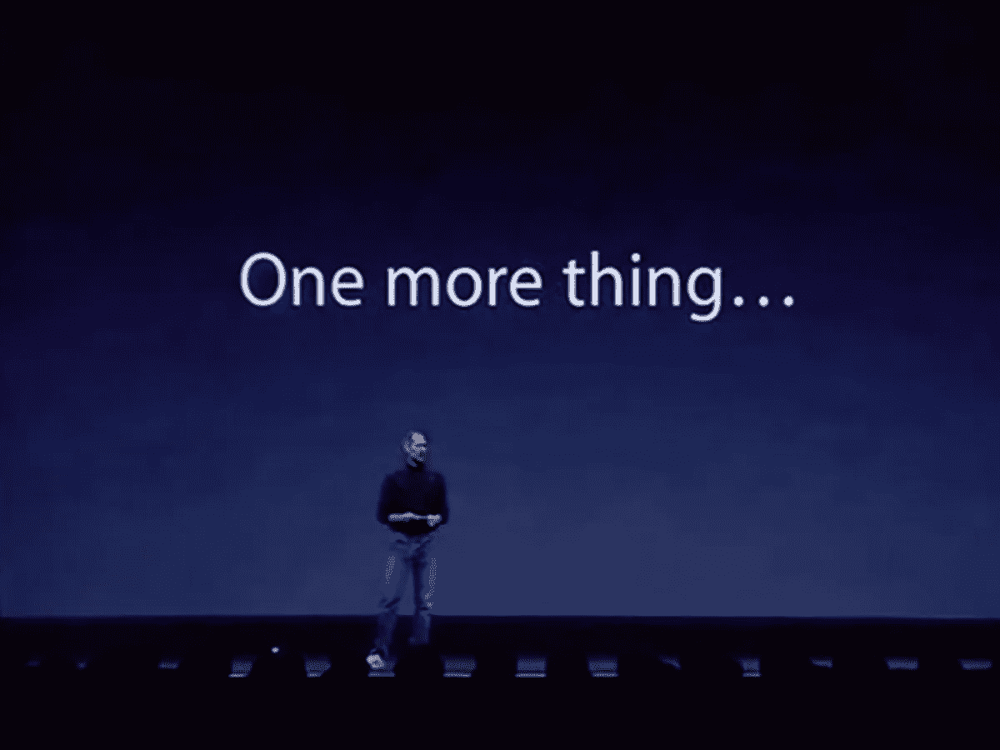

当我们讨论将咖啡和水果捆绑销售的可能性时，捆绑销售通常是如何运作的？

我目前正在撰写关于软件捆绑/非捆绑策略的文章(例如 Slack vs Office Suite)。

此外，我还在调查将初创公司的经常性收入证券化的可能性，类似于抵押贷款被证券化以形成 CDO 的方式。

如果你觉得这些有趣，请在 Medium 上订阅，敬请关注！

请随时通过 [LinkedIn](http://www.linkedin.com/in/jack-chong) 联系我

## 访问专家视图— [订阅 DDI 英特尔](https://datadriveninvestor.com/ddi-intel)