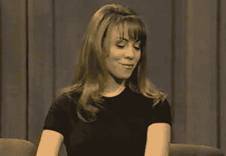
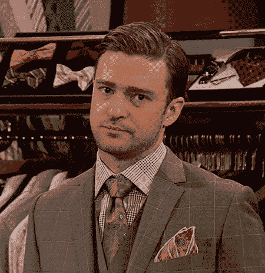
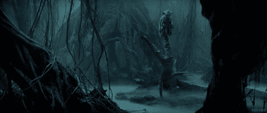

# 为什么隐私不能“回归正常”

> 原文：<https://medium.datadriveninvestor.com/why-privacy-cant-return-to-normal-915419f1a634?source=collection_archive---------27----------------------->

2020 年已经过去了四分之三，感觉好像一月还是十年前。考虑到社会动荡、经济动荡、分裂和难以驾驭的政治竞选，以及四代人以来最致命、最具影响的疫情，这怎么可能不是呢？我们生活在一个似乎只会加速的旋转周期中，这种令人眩晕的混乱甚至使我们使用的语言开始显得不适应时代。

不足为奇的是，许多人只想回归正常，回到从前的状态。九个月前，当 2019 年结束时，我们都松了一口气，确信在新的一年里事情不会*可能*一样糟糕，却发现我们现在错过了英国退出欧盟争论和弹劾的宁静日子。是的，回去的冲动有些道理。这些时代日益加深的强度使得我们疾病的治疗方法似乎是取消 2020 年并重新开始。以为我在开玩笑？无线电台已经收到玛丽亚·凯莉的“圣诞节我想要的只有你”的请求。上周。

“Well, it is only April 3, but, hit it!”

这种逃避的欲望也是这个夏天美国人争相开放海滩、开放酒吧和开放面孔背后的动力。在几个月的承诺后，事情将“很快”恢复原样，人们只是决定不再等待，拥抱前疫情生活方式的时刻已经到来。结果是感染、住院和死亡人数不可避免地激增，加上双方的相互指责，这成了一场希腊悲剧。而且这种加速正在加深:佛罗里达州(人口 2100 万)报道的[上个月](https://covidtracking.com/data/state/florida)*比[多一倍，波兰(人口 3700 万)报道的](https://www.statista.com/topics/6242/coronavirus-covid-19-in-poland/)*。**

**回归正常的想法看起来似乎是解除封锁的一个可喜的喘息，但这种想法的后果告诉我们，“过去的方式”绝不是“前进的方式”。**

****精神错乱的定义****

**从某种意义上说，完全按照过去的方式做事，有一种熟悉事物的令人欣慰的吸引力。事实上，对于西方人来说，关于疫情和禁闭的一切都是陌生的。对封锁的描述从“不幸的必要性”到类似于“对自由不可接受的限制”不等。因此，一些人表现得好像公共卫生专家呼吁的限制都不重要，在夏季的几个月里照常进行。这就是为什么不可避免地要引用爱因斯坦的名言:做同样的事情，却期待不同的结果。即使爱因斯坦说过，对精神错乱更好的定义肯定是“完全脱离现实的冲动行为，不考虑原因、事实或背景。”**

**上下文，当然在这里，很重要。律师很早就要学习的一件事就是如何解析语言。无论是回顾一项法律判决、起草一份合同，还是破译一个复杂的法规，文字都是律师和法律的生命——事实上，它是法律哲学的一部分。他们说法学院不是要学习成为一名律师，而是要学习像律师一样思考，这是真的——但这实际上意味着学习如何像律师那样理解语言。如果你问任何一个曾经在休息时间遇到一年级法学学生的人，讨论任何事情是什么感觉，你就会明白我的意思。**

****

**“So…so you don’t want to hear about torts again?”**

****对我来说全是拉丁语****

**那么，律师和哲学家有什么共同点呢？除了不受欢迎？有时，我们使用的词语缺乏精确性、清晰性或细微差别来真正表达我们的意思。你有没有在另一种语言中遇到一个英语完全没有的词——比如[*saudade*](https://en.wikipedia.org/wiki/Saudade)*——*——需要一连串半解释才能表达出来？或者试图解释当你自己都不知道是怎么回事的时候，你是如何或为什么会有这种感觉的？那你应该知道我的意思。**

**你应该明白为什么我们对“隐私”这个词有很大的问题**

**等等，这和隐私有什么关系？嗯，想一想隐私是什么意思。花点时间仔细想想。你的回答是“将他人排除在自己的领域和合理预期不受侵犯的空间之外的权利吗？”没有吗？那“不受打扰的权利”呢也许吧？关键是，不管你选择什么定义，它都将与我的定义大相径庭，当然也不同于美国、欧洲和全世界的多重法律定义。**

** [## 隐私指南，关于应用开发|数据驱动投资者

### 挪威隐私机构 DPA 对当地的一个现实处以 20 万欧元的罚款，原因是…

www.datadriveninvestor.com](https://www.datadriveninvestor.com/2020/04/29/privacy-guidelines-about-app-development/) 

这个词本身有一些模糊的起源，但它(广泛地)来自拉丁语 *privatus* ，意思是(有点像)“剥夺，排斥。”换句话说，分离，冷漠。不出所料，这又是一个令人不满意的答案，尤其是在当前这个时代。如果隐私就是与他人分离和远离他人，那么为什么当我们更加孤立的时候(在家一呆就是几个月),我们会觉得自己的隐私更少，更容易被观察到？

**捡线**

你可以从语言的角度来思考积极和消极的自由:消极的自由广义上是“来自”某事，而积极的自由是“去”或“做”某事。有时，权利或自由具有两者的特征。例如，良心自由包括不受压迫的自由(参加宗教仪式不会被监禁，有神论没有被官方禁止)以及积极的自由活动的自由(无论你是否信教，你都可以投票或担任公职，如果你愿意，你可以参加宗教仪式)。当然，这里有重叠，概念也很混乱，但它在一般意义上是有意义的。消极自由是关于其他人做什么(以及阻止他们)，而积极自由是关于你，以及你能做什么，或者决定不做什么。

现在让我们试着把它应用到隐私上。仅仅从语言学的角度来看，隐私给人的感觉是负面的:一种剥夺，一种排斥，一种把别人从自己身边推开的感觉。我们甚至曾经把世界上最私密的地方叫做“厕所”从法律上来说，隐私的经典定义是“不受打扰的权利”，正如未来的最高法院大法官路易斯·布兰代斯在 1890 年所说。尽管隐私被定义为不受打扰的权利，但我们真正谈论的是不受其他人*打扰的权利——政府扫描电子邮件传输，警察驾驶无人机，你的老板在 Zoom 上监视你，你的邻居观察你的房屋清洁方法。*

**

*St. Gladys of Kravitz, Patron Saint of Nosey Parkers*

*我们真正寻找的是一个词或概念，它抓住了我们成为 T1 的权利，在这种事情可能的情况下不受不想要的或不请自来的影响，以及我们在特定背景下不受这些事情影响的更普遍的权利。我们所说的“隐私”并不是一种排斥(还是有*特权*)，而是对一个区域的认可，在这个区域中，我们的性格、个性、人格或身份向外延伸并触及周围的世界，但仍在我们广泛的控制范围内变化。我们希望“隐私”给我们的不是墙或裹尸布，而是像缰绳一样抓住我们生活各个方面的线——每条线都可以追溯到我们自己生活的起点，甚至可能是在我们生活之前或之外，如家庭、文化、习俗。*

*这些线索的相互关联性意味着它们有多种用途。它们是我们控制生活的缰绳；他们是束缚我们的锁链；它们是把我们彼此联系起来的纽带；他们把我们束缚在指挥我们的权力结构上；它们是故事的线条，是织锦的组成部分；它们是我们丢在一边的零碎东西；它们是缠绕在我们手指上的提醒，提醒我们需要做什么；它们是已经逝去的事物的遗迹。*

***一些个人空间***

*这些线索正是隐私如此重要的原因——合在一起，它们有助于识别作为一个人的*我是谁——尽管从来不是我的全部——并且在某种意义上，有助于识别*我在哪里——在我自己的线索的中心，但也与其他人和地方联系在一起。如果我们认为隐私是我们周围的一种物理空间，在那里我们可以允许他人进入，但永远不需要他人进入，那么我们就更接近于一种想法，这种想法满足了隐私所具有的无法定义的感觉。***

*现在在 COVID 的上下文中考虑这个想法。在家里，在我们的屏幕前，我们大多数人从其他非家庭成员那里获得的物理空间比我们生活中的任何时候都多。在家工作，不去餐馆，我们所有的社交距离让我们与其他人更加疏远。与此同时，尽管我们不像以前那样被“关注”,但我们比以前更容易被关注。录制的视频会议、新的生物特征数据收集、我们笔记本电脑上的生产力跟踪应用程序都是一种新的、不完全私人的存在方式的象征，即使是在最私人的空间——我们的家里。显然，其中一些对于继续我们的工作生活和我们不得不放弃的活动是必不可少的。但是毫无疑问，我们周围大多数被认为是私人的空间被刺破了。*

*更进一步，问问你自己，当疫情减弱，我们回到正常的工作日程或外出时，你是否认为这些新的监控措施可能会在(希望不久的将来)消失。我们的办公空间会拆除用来识别注意力不集中的生产力监视器或网络摄像头扫描仪吗？健康追踪设备的大量涌现会催生一个贩卖健康数据的新产业吗？更广泛地说，回归“正常”会标志着走向更多隐私、更少侵扰和更完整的私人领域吗？*

**

*A simple “no” would have done, but okay.*

*大概不会吧？我们通常认为监控，以及由此带来的对私人空间的侵犯，就是律师所说的“单向棘轮”。你可以让事情朝着一个方向发展，但它们永远不会回到原来的样子。*

*这听起来可能不可接受，如果你从这个角度考虑，不管你是谁，都会有人在看着你。在早期工业时代，老板们看着工人，这是摩擦的来源。但是今天，雇主和雇员，业主和合作伙伴，每个人都是同一个可见空间的一部分，每个人都有自己的隐私意识和他们想要为自己定义的私人空间。这就是为什么隐私在国际法中被认为是一项人权——对地方和空间感的渴望是每个人都有的，尽管它在不同的文化和国家中表现得不同。*

*要做些什么？部分原因是，我们需要停止将隐私视为需要“回归”的东西，某种黄金时代的恢复。隐私从来就不是绝对的——除非你的祖先是禁欲的隐士，否则他们几乎肯定住在构成他们整个世界的人附近(同样，你的祖先也不太可能是禁欲的隐士，因为，你知道，独身。)*将隐私确立为一项基本权利是为了确定我们今天在自己的环境和时间里想要什么样的空间。前瞻性的隐私方法将接受技术和系统的好处，而不会默许不必要的入侵和监视。我们说了很多，但这是一个平衡的行为，一个很难做对的行为，但如果我们想在我们的空间里保持自我意识，无论我们在哪里，这是至关重要的。**

**

*Even Dagobah.*

***访问专家视图—** [**订阅 DDI 英特尔**](https://datadriveninvestor.com/ddi-intel)***