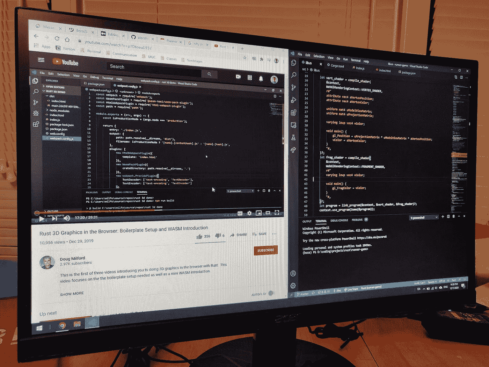

# 为什么编程教程不是浪费时间

> 原文：<https://medium.datadriveninvestor.com/why-programming-tutorials-arent-a-waste-of-time-cb5ca2552046?source=collection_archive---------12----------------------->

## 后续编码教程的辩护。

Candid photo of my monitor as I struggle to use WebGL in Rust

因此，也许你正在学习编码，并试图在无穷无尽的信息中导航，或者也许你是一个有经验的程序员，你已经逐渐理解了编程教程的缺点。对于初学者，我想说明为什么你应该考虑跟随 React 的井字游戏教程，或者 YouTube 上的一个关于构建 Twitter 克隆的系列。至于其他程序员，我有一种感觉，你会在职业生涯中的某个时候获得一个新的堆栈，所以这可能对你也有帮助。

我将首先回顾一下我所理解的编程教程的缺点，以及为什么如此多的人已经开始将它们抛在脑后，转向其他的东西，即~基于项目的学习~。

# 为什么编程教程不好

编程教程不会教你如何编码。通过编写代码和学习教程，你可能会对你正在使用的任何语言有一点熟悉，但是复制别人的代码，不管你是否使用不同的变量名，都不会有什么有价值的编码实践。因为你自己没有弄清楚，你没有运用你的思维去思考算法或者设计你的程序。

# 为什么基于项目的学习是好的

因为这些技能构成了编程工作的一大部分，人们通常转向基于项目的学习，因为它在帮助你学习这些技能方面做得更好。通过让自己一头扎进一个项目，你强迫自己自己独立解决问题，通过这样做，你学到了项目所需的所有技能和资源。使用项目的技术堆栈，您对自己的编码能力建立了信心，所有这些经验将更好地服务于您未来的项目和工作经历。

# 为什么编程教程也不错，只是原因不同

首先，我想说，我同意很多程序员对我刚才所说的事情的看法。我认为，对于实际学习和建立对编码能力的信心来说，项目比编程教程好得多。但是我也相信编程教程的优点会因为这种比较而被忽略。

这学期我花了一些时间探索 web 开发。我开始对前端开发非常感兴趣，我想学习一个主要的前端框架，React。他们的网站上有一个教程，教你如何构建一个简单的井字游戏网络应用。

学完这个教程，我知道 React 了吗？不，不是真的。但是我知道组件看起来像什么，并且我知道它们的用法。我无法立即构建一个受控的输入，但是我了解了这个概念，并且当我后来在 React 中从事自己的项目时，我知道要查找什么，并且我有自己的工作代码可以使用。

 [## 如何用 Python |数据驱动投资者构建 Twitter 抓取应用

### 每秒发出约 6000 条推文，每天发布 5 亿条推文，普通人甚至不能…

www.datadriveninvestor.com](https://www.datadriveninvestor.com/2020/12/01/how-to-build-a-twitter-scraping-app-with-python/) 

编程教程在一开始会很有帮助，因为它们会让您立即熟悉代码的工作示例。它为你提供了一个经验的基础，提供了事情是如何做的证据，以及你知道你能做的事情，从而让事情开始运转起来。

一个伟大的数据科学 YouTuber Ken Jee 经常建议去 Kaggle 上看看其他人的代码，以熟悉常见的包、工具、用例等。你开始识别模式，事情开始在潜意识里联系起来，变得有意义。这是类似的事情。

很多编码都是查找如何做事情，并且对你的搜索引擎足智多谋。我认为花时间学习编程教程是值得的，因为它能让你更好地在网上找到你想要的东西。

所以编程教程毕竟没那么差因为你有了基础，它帮你认清了 bla bla bla。但是为什么不直接派生或克隆别人的代码呢？

你说对了。如果你是自己打出来的，你可能会得到和教程一样多的价值。这完全取决于个人喜好，所有这些都是如此。有些人会喜欢在听视频时对部分代码的简要理解，然后再自己去理解，而另一些人可能会发现直接自己去理解更有效。如果某件事被很好地记录下来，直接参与进来可能同样有效，甚至更有效。

学习和熟悉一门语言有不同的方法，当然，只做适合你个人的事情总是最好的选择，但是我要说的是不要完全放弃编程教程，因为它们比人们认为的要多得多。

## 访问专家视图— [订阅 DDI 英特尔](https://datadriveninvestor.com/ddi-intel)