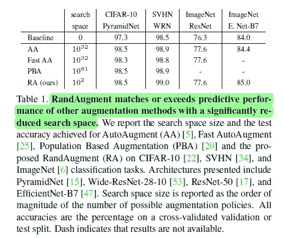
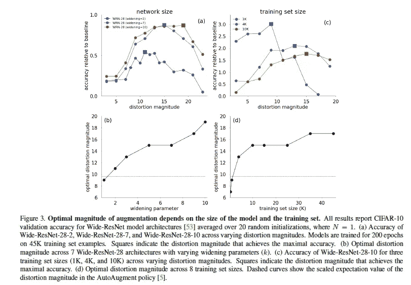
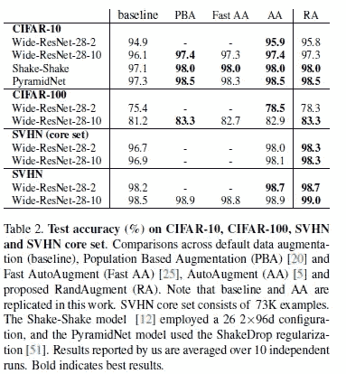
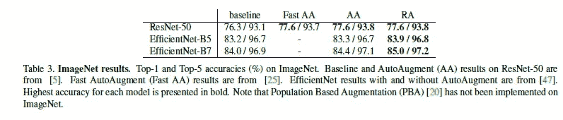
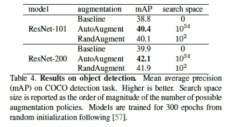

# 为什么 RandAugment 是图像的最佳数据扩充方法

> 原文：<https://medium.datadriveninvestor.com/why-randaugment-is-the-best-data-augmentation-approach-4a48f22b2152?source=collection_archive---------0----------------------->

## 提摩西的两个词:性能和成本效益

为了帮助我了解您[请填写此调查(匿名)](https://forms.gle/7MfQmKhEhyBTMDUD7)

因此，如果你读过我的上一篇文章(点击这里查看，我分析了谷歌**的研究人员如何在使用**成倍减少的资源**(剧透:魔术)的情况下大幅超越**当前的图像分类系统。研究人员提到使用 RandAugment 来产生输入噪声。自然，我对此很好奇。我学到的东西令人惊讶。所以请继续阅读为什么 RandAugment 是游戏中最好的。通过这篇文章，我们将了解山羊是如何工作的。由 Cubuk 等人提出的[**RandAugment:具有缩小的搜索空间的实用自动数据扩充**](https://arxiv.org/abs/1909.13719) 。

# 背景资料

因为我的内容已经超过 1000 次浏览，我想我应该给我的文章增加一些变化。这里有一个视频描述了数据增强的重要性，以及 RandAugment 的工作原理。请投个赞并留下你的反馈。

Let's get this trending bois.

RandAugment 就是这么简单。取一幅图像，输入 2 个整数 N 和 M，N 是随机变换的次数，M 是变换的幅度。仅通过这些参数，RandAugment 就能够生成完全不同的图像，并提高学习者的水平。例如，在视频(N=2)中，在给定的 M 值下，我们可能有 13 = 169 个图像。这种随机性给了它基于 ML 的数据扩充的优势，因为我们正在处理更多的随机数据。这使得学习噪音的趋势变得不可能。这种简单性意味着" *RandAugment 可以跨不同的任务和数据集统一使用
，并且开箱即用，* ***匹配或超过 CIFAR-10/100、SVHN 和 ImageNet 上所有以前的自动扩充*** *方法。*”

Automated Augmentation models often struggle on larger datasets where they can’t adjust regularization strength. RandAugement is able to avoid that.

# 为什么质量噪声很重要

## (为什么习得性增强会失败)

> 我们证明了数据扩充的最佳强度**取决于模型大小和训练集大小**。这一观察表明，对较小代理任务的增强策略的单独优化对于学习和转移增强策略来说可能是次优的。

这是报纸上的一段引文。起初这个看似简单的陈述过于琐碎，以至于没有注意到。然而，这是不容忽视的。一般来说，数据样本越小，行为越极端。然而，本文提出了一个新的角度。

团队改变两个因素:模型大小和网络大小。图 3a 示出了对于不同的宽范围模型，随着失真幅度的增加而训练的模型的精度的相对增益。图 3a 展示了失真幅度的系统趋势。特别是，绘制所有宽 ResNet 架构与最佳失真幅度的关系图，突出了网络规模不断增加的明显单调趋势(图 3b)。*更大的网络需要更大的数据失真来进行正则化*。基于的**学习策略为所有架构提供了固定的失真幅度**(图 3b，虚线)，因此显然是次优的*。*

图 3b 和 d(右栏)也显示了类似的情况。很明显，在较小训练集上训练的模型可以从数据扩充中获得更多改进(例如，图 3c 中的 3.0%对 1.5%)。这是有意义的，因为对于较小的数据集，添加另一个图像时数据大小的相对增加更高。有趣的是，“*图 3d 展示了最佳失真幅度随着训练集大小单调增加。”*结合这两个因素，*“这种趋势突出了在更大的数据集上增加数据增强的强度的需要，以及在由训练数据的子集组成的代理任务上优化学习增强策略的缺点。* ***即，所学习的增强可以学习更适合于代理任务的增强强度，而不是更大的感兴趣的任务*** *。”*

> *即，所学习的增强可以学习更适合于代理任务的增强强度，而不是感兴趣的更大任务*

简而言之，RandAugment 之所以胜出，是因为它能够以经济高效的方式根据数据和网络的规模进行扩展。这使得它非常适合大型网络和大型数据集。

 [## 沃尔克法案被解雇，企业巨头受益|数据驱动的投资者

### 金融市场极其复杂。虽然在某种程度上可以由中央政府管理，但布局最好的…

www.datadriveninvestor.com](https://www.datadriveninvestor.com/2020/06/30/volcker-act-gets-sacked-corporate-giants-stand-to-benefit/) 

# 衡量绩效

既然我们已经了解了 RandAugment 的作用，以及它为什么如此有效，那么让我们来了解一下评估的细节。通过评估所使用的不同指标，我们可以了解论文的潜在扩展。它让我们通过查看基准测试的性能来评估这种技术的优势。

# 平均的

This image makes a comeback

平均性能是惊人的。RandAugment 经历了一个非常小的。AA，下一个最小的有一个**非百万倍大的**搜索空间。那是**的 10 亿倍**的差异。呀。而 RA 还是比它做的好。PBA 的搜索空间最大。可能的解的数量比我们太阳中的原子数量还要多(10，000 倍)。RA 也打败了它。

## 超过不同的模型尺寸

该表完美地代表了噪声部分提出的观点。我们看到，随着模型规模的增加，RA 领先于其他增强技术。这在不同的架构中是一致的。

## 图像分类(ImageNet)

Performance on ImageNet

ImageNet 是图像分类的行业标准。在 ImageNet 的所有架构中，RA 将自己与其他增强技术区分开来。

## 目标检测

The one area where it doesn’t win

目标检测是一个蓬勃发展的领域。这对自动驾驶汽车和其他类似领域至关重要。在这个任务中，我们看到 RA 的性能低于 AA。然而，有趣的是，RA 仍然提高了基线，并且与 AA 具有竞争力。这令人印象深刻，因为 AA 使用 15K GPU 小时，而 RA 在 6 个参数上进行了调整。

## 高亮纸

找到下面的注释文件。

请务必下载并阅读它，以获得对论文更完整的理解。我为初学者增加了重要的定义。

# 向我伸出手

请在下面留下您对这篇文章的反馈。如果这对你有用，请分享并跟我来这里。

查看我在 Medium 上的其他文章。:【https://rb.gy/zn1aiu 

我的 YouTube。这是一个正在进行中的工作哈哈:[https://rb.gy/88iwdd](https://rb.gy/88iwdd)

在 LinkedIn 上联系我。我们来连线:[https://rb.gy/f7ltuj](https://rb.gy/f7ltuj)

我的推特:[https://twitter.com/Machine01776819](https://twitter.com/Machine01776819)

我的子任务:[https://devanshacc.substack.com/](https://devanshacc.substack.com/)

如果你想和我一起工作，请发邮件给我:devanshverma425@gmail.com

twitch 现场对话:[https://rb.gy/zlhk9y](https://rb.gy/zlhk9y)

获取我的内容更新-insta gram:[https://rb.gy/gmvuy9](https://rb.gy/gmvuy9)

获得罗宾汉的免费股票:[https://join.robinhood.com/fnud75](https://www.youtube.com/redirect?redir_token=QUFFLUhqa0xDdC1jTW9nSU91WXlCSFhEVkJ0emJvN1FaUXxBQ3Jtc0ttWkRObUdfem1DZzIyZElfcXVZNGlVNE1xSUc4aVhSVkxBVGtHMWpmei1lWWVKNzlDUXVJR24ydHBtWG1PSXNaMlBMWDQycnlIVXNMYjJZWjdXcHNZQWNnaFBnQUhCV2dNVERQajFLTTVNMV9NVnA3UQ%3D%3D&q=https%3A%2F%2Fjoin.robinhood.com%2Ffnud75&v=WAYRtSj0ces&event=video_description)

**访问专家视图—** [**订阅 DDI 英特尔**](https://datadriveninvestor.com/ddi-intel)