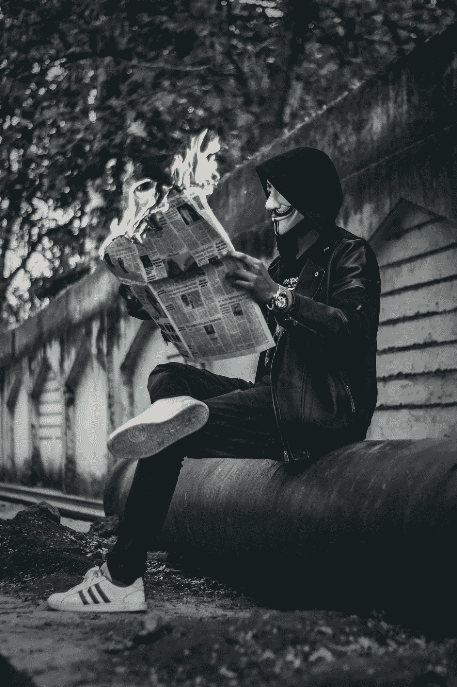
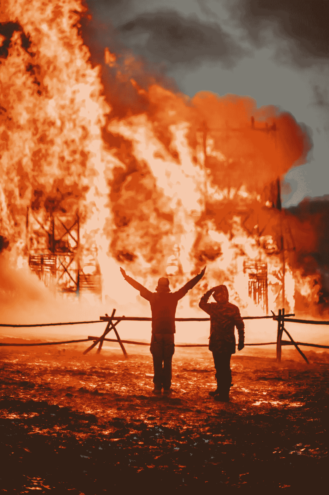

# 罗宾汉为什么真的停止交易

> 原文：<https://medium.datadriveninvestor.com/why-robinhood-really-stopped-trading-6112c260d09d?source=collection_archive---------3----------------------->

## 让我们抛开卡农式的阴谋论，好吗？

Photo by [Ashutosh Sonwani](https://www.pexels.com/@ashutoshsonwani?utm_content=attributionCopyText&utm_medium=referral&utm_source=pexels) from [Pexels](https://www.pexels.com/photo/man-wearing-mask-sitting-down-and-holding-newspaper-with-fire-1852389/?utm_content=attributionCopyText&utm_medium=referral&utm_source=pexels)

比起狂热本身，我更惊讶的是对 GameStop 交易狂潮的反应。作为一名价值投资者，我知道市场并不总是理性的，有时一群人会努力改变一种证券的价格。当事情变得太疯狂时，经纪人通常会停止特定证券的交易。此外，对冲基金一直在输钱，这也是它们难以跑赢标准普尔 500 指数的部分原因。

对我来说新的是 ***媒体和其他地方支持的大量阴谋论*** 指责罗宾汉在没有证据支持指控的情况下落入对冲基金的口袋。

> 我觉得我在读一个 QAnon 会议的营销材料。

这是一个在介质上旋转的例子:

> “……经纪人为大玩家操纵股票市场，同时剥夺散户的自由。”([*Gamestop 发生的事情表明谁真正控制了市场*](https://medium.com/datadriveninvestor/what-happened-with-gamestop-showed-who-really-controls-the-markets-53718af8881d) )
> 
> 无论从哪个角度看，罗宾汉都展现了他的本色。美国人应该考虑永远不要再相信这家公司的钱。 *" (* [*Robinhood:是骗局吗？*](https://medium.com/@jeffreydutton/robinhood-review-is-it-a-scam-c3dc5158ea8f) )
> 
> “罗宾汉今天的行动树立了一个危险的先例。它发出了一个明确的信息，即当市场操纵被华尔街精英投资者利用时，它将得到支持和辩护。”( [*继 GameStop 剧*](https://medium.com/millennial-money-masters/people-are-outraged-after-robinhood-blocks-reddit-traders-following-gamestop-drama-73c10df6f2b7) 之后罗宾汉阻止交易引发众怒)

但是为什么罗宾汉(和其他人)停止交易呢？真的这么穷凶极恶吗？

从我目前看到的[证据](https://www.independent.co.uk/news/business/robinhood-gamestop-class-action-trading-suspended-b1794934.html)(不仅仅是愤怒的人大喊大叫的观点)来看，归结为两个主要原因: ***用于支付交易的资本储备，以及一旦发生巨额亏损，害怕来自监管机构和交易员的诉讼和处罚。***

## 做市商

大部分文章都只是“有钱人都是恶的！”打字没有证据或真正理解华尔街如何运作的话语。有一些像[GameStop Madness 不是 David vs . Goliath——它是 Goliath vs. Goliath](https://marker.medium.com/the-gamestop-madness-isnt-david-vs-goliath-it-s-goliath-vs-goliath-2a7231fe19b3) 由了解华尔街的人编写，因此是更好的信息来源。

这些更有见识的作家提出，罗宾汉的主要客户是 Citadel Securities。由于交易者免费使用 Robinhood，他们不是顾客，而是产品——我怀疑他们大多数人都不太明白这一点。Citadel Securities 是一家 T2 做市商，是所有证券交易的重要组成部分。没有做市商，就没有我们所知的交易或股票市场。

***按个按钮就能拥有股票，这不是魔法。必须有人找到另一边的一方，以商定的价格出售这些股份。当人们愿意为一只股票支付的价格和他们愿意卖出的价格相差很大时，这只股票就不会交易。***

> 做市商保持股票市场的流动性；它们就像建筑中的管道，而大多数人只看到浴室。

Citadel Securities 在华尔街处理大量交易，他们通过从处理的每笔交易中获取少量利润来赚钱。当你处理数十亿美元的交易时，它会开始增加。Citadel group 的另一家公司参与了向 Melvin Capital 提供流动性，Melvin Capital 是受到价格快速升值挤压的卖空者之一。

尽管这看起来不太妙，但这并不意味着它与罗宾汉停止交易的决定有关。根据 SEC 的规定，Robinhood 必须拥有一定的资本储备，以覆盖其平台上的头寸，该公司暂停交易，同时获得了额外的 15 亿美元资金和信用额度，以确保其保持偿付能力。

> 如果你认为罗宾汉暂停交易几个小时以保持偿付能力看起来很糟糕，你应该看看罗宾汉的另一种选择:随着 GME 和其他股票的价格暴跌，罗宾汉破产并彻底关闭，而那些拥有罗宾汉股票的人只能惊恐地看着。

相信我，他们选择的另一个选择要痛苦得多。

Photo by [Anna Vedischeva](https://www.pexels.com/@anna-vedischeva-3574032?utm_content=attributionCopyText&utm_medium=referral&utm_source=pexels) from [Pexels](https://www.pexels.com/photo/faceless-firemen-by-building-on-fire-5352939/?utm_content=attributionCopyText&utm_medium=referral&utm_source=pexels)

## 监管者

我认为，Robinhood 关闭交易的另一个主要原因是，害怕监管执法，害怕在高风险押注中亏损的交易员提起诉讼。

不管你同意与否，证券交易委员会和其他监管机构认为经纪人有法律责任保护小交易者免受其害。使用对冲基金的富有的、被认可的投资者得不到这些保护。 ***这就是为什么经纪人和对冲基金对 GameStop trading 的行为是不同的——法律是不同的。***

Robinhood 目前正在接受马萨诸塞州监管机构的调查，他们声称该公司没有采取足够措施保护个人投资者不参与市场[的高风险交易。](https://www.marketplace.org/2020/12/18/robinhood-slapped-with-two-separate-regulatory-complaints/)

对于大多数经纪人来说，如果你想交易期权或保证金，你必须提供一些关于你自己的信息和你在期权或保证金交易方面的历史/知识。如果你没有足够的历史，经纪人可能不允许你交易。如果你不知道自己在做什么，这些都是有风险的事情。

我确信 Robinhood 上的一些交易员知道他们在做什么(这并不意味着他们不会亏损，问问对冲基金就知道了)，但许多人不知道。

> 如果罗宾汉袖手旁观，看着成千上万的个人投资者在高风险交易中血本无归，头条新闻会怎么看？

在这种情况下，无论他们做什么，罗宾汉都是反派。停止交易，做“保护对冲基金”的恶人，或者让人们做他们想做的事，做未能阻止他们损失所有资金的恶人。

请注意，其他经纪人，如 Merril，也停止了 GME 的交易，但没有得到同样的宣传，因为他们有不同的客户。

## 摘要

我建议人们不要编造娱乐性和耸人听闻的故事来描述华尔街是如何试图欺骗小人物的，而是应该看看基于事实和知识的关于股票市场如何运作的文章。

更不用说卖空者实际上是华尔街上的一小群局外人，他们的一个有用目的是防止股票在投机泡沫中疯狂上涨，所以想象一下一群局外人自豪地坚持与另一群局外人合作的讽刺。真正的华尔街资金正坐在那里笑着。

> 很多愤怒来自于对市场如何运作以及我们如何在其中赚钱缺乏理解。

坏事肯定会关起门来，如果有任何不当行为的证据浮出水面，美国证券交易委员会将进行调查。我并不担心对冲基金会赔钱——它们知道自己在做什么，只是赌输了。这是他们玩的游戏。我对围绕 Robinhood 和 GameStop 的猖獗的虚假信息和阴谋论感到担忧。

这种愤怒的程度让我想起了几周前对国会大厦的突袭。

> 所以，让我们低调一点，看看事实，教育自己，继续我们的生活。

Photo by [Oluremi Adebayo](https://www.pexels.com/@oluremi-adebayo-1507823?utm_content=attributionCopyText&utm_medium=referral&utm_source=pexels) from [Pexels](https://www.pexels.com/photo/woman-meditating-in-the-outdoors-2908175/?utm_content=attributionCopyText&utm_medium=referral&utm_source=pexels)

## 资源

如果你想了解更多关于投资和积累财富的知识，而不是把钱扔在 GME，看看下面的文章:

 [## 如何通过投资获得成功

### 来自本杰明·格拉哈姆的永恒教训

medium.com](https://medium.com/the-innovation/how-to-find-success-with-investing-411fb59d54f8)  [## 教孩子投资的新方法

### 我们如何利用游戏来改善我们的金融教育。

medium.com](https://medium.com/datadriveninvestor/a-new-way-to-teach-your-kids-about-investing-c7c2707ca934)  [## 不要羡慕投资者——成为一名投资者！

### 从我的财富之旅中吸取经验，让你从 2021 年开始

medium.com](https://medium.com/the-ascent/dont-envy-investors-be-one-72a6855bb9c5) 

我与列出的任何网站都没有关系，也没有从任何合作伙伴或我的文章推荐中赚钱。我不是律师，会计师，或注册理财规划师。所有材料都是基于我的知识和经验，出于提供信息的目的而真诚呈现的。它无意取代专业建议。在做出任何法律、税务或财务决定之前，你都应该向专家咨询。