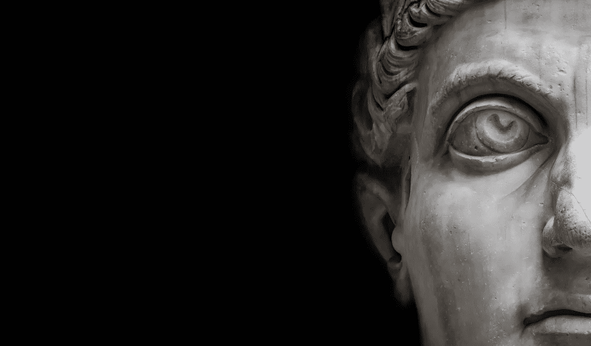
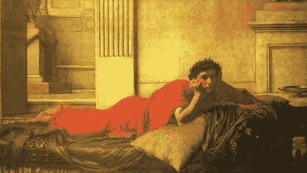

# 罗马皇帝尼禄是一个顶级的恶棍

> 原文：<https://medium.datadriveninvestor.com/why-romes-emperor-nero-was-a-top-class-villain-41c798dae2d?source=collection_archive---------2----------------------->

## 历史

## 罗马黑暗扭曲的领袖的历史。

Rights purchased via [iStock](https://stock.adobe.com/search/images?filters%5Bcontent_type%3Aphoto%5D=1&filters%5Bcontent_type%3Aillustration%5D=1&filters%5Bcontent_type%3Azip_vector%5D=1&filters%5Bcontent_type%3Avideo%5D=0&filters%5Bcontent_type%3Atemplate%5D=0&filters%5Bcontent_type%3A3d%5D=0&filters%5Binclude_stock_enterprise%5D=0&filters%5Bis_editorial%5D=0&filters%5Bfree_collection%5D=0&order=relevance&serie_id=196086234&asset_id=196086234)

只有 25%的罗马皇帝死于自然原因，许多“非自然”死亡并非没有充分的理由。

在罗马的 70 位皇帝中，有几位才华横溢，鼓舞人心，理所当然地被镌刻在大理石上。其他人则极度扭曲。他们的堕落是无止境的，他们的暴力是由恶意、不安全感和完全缺乏怜悯推动的。

尼禄体现了暴政和疯狂。在他的阴影下，大多数现代政治“坏人”看起来像和平人物。

# 为什么有那么多腐败堕落的皇帝掌权？

罗马皇帝通过下属进行统治，下属代表他们制定法律。反过来，被选中的少数人可以直接接触皇帝。从最纯粹的定义来看，顾问是“唯唯诺诺的人”，是奉承者。他们孤立了统治者，并经常支持他的疯狂，因为这保持了他们自己的影响力。

这一点，再加上极度的放纵和近乎无限的权力，导致了已经崩溃的男人们的堕落。

卡利古拉经常被认为是典型的“疯狂的皇帝”，但尼禄也是如此。如果这是一场皇帝疯了的比赛，这将是一个照相结束。卡利古拉是尼禄的叔叔并不奇怪。

# **他的上升和被杀**

皇帝克劳迪斯死后，尼禄于公元 54 年加冕。

尼禄的崛起可能激发了《权力的游戏》中的[杰佛瑞勋爵](https://gameofthrones.fandom.com/wiki/Joffrey_Baratheon)。尼禄只有 16 岁，身体并不强壮。他渴望权力的母亲是他溺爱的顾问，在他的每一个决定中倾听他的意见，并对所有出席他的宫廷的人给出详细的意见。

尼禄对暴力的嗜好是一种迅速而自然的发展。如果说有什么不同的话，那就是他的母亲在鼓励他。然而，尼禄和他母亲的关系在三年后恶化了。这一故障的细节尚不清楚。

一些历史学家怀疑这种紧张关系与尼禄和波普·萨宾娜的风流韵事有关。其他人把这归因于他母亲对他越来越多的控制。没有争议的是，尼禄在五岁左右杀死了自己的母亲。具体来说，他命令他的军队在一次旅行中击沉她的船，他们照做了。

她活了下来，当她的逃生船靠岸时，尼禄的士兵正在等待。他们完成了工作。从那以后，事情只会变得更糟。

# 他的第一次婚姻以暴力告终

尼禄谋杀他的母亲，或称弑母罪，对他的心智健全产生了持久的影响。他被负罪感所困扰，但这并没有阻止一种正在出现的、可怕的在两个自我之间转换的模式。

Nero mourning the murder of his mother. Artist John Williams Waterhouse (Source: [Wikimedia commons)](https://upload.wikimedia.org/wikipedia/commons/a/aa/John_William_Waterhouse_-_The_Remorse_of_the_Emperor_Nero_after_the_Murder_of_his_Mother.JPG)

在压力、挫折和偏执的驱使下，尼禄的代理感崩溃了。像一头野兽，他默认了肆无忌惮的暴力。22 岁时，他的基础和理性仅仅是常态的一闪而过。

尼禄与奥克塔维亚的婚姻仅过了两年就破裂了。这很不幸，因为她受到了高度的尊重和爱戴。从各方面来看，她都是一位伟大的妻子:美丽、善良、坚忍、慷慨。

尼禄没有和奥克塔维亚离婚，而是试图勒死她，但没有成功。然后，他指控她犯有通奸罪，并下令将她处决。街头出现了广泛的反弹。抗议者遭遇了军事力量，导致数百名平民被屠杀。

那些接近天皇的人知道奥克塔维亚是无辜的。他们中的许多人关心她。在她被处决期间，那些负责这项工作的人非常不情愿。然而，由于担心自己的生命安全，他们总是屈服并执行黑暗的行为。

 [## 为什么唐纳德·特朗普是生活游戏的最终赢家|数据驱动的投资者

### 用唐纳德·特朗普(Donald Trump)的话说，他的“一生都在争取胜利。我不常输。我几乎从没输过。”特朗普会…

www.datadriveninvestor.com](https://www.datadriveninvestor.com/2020/10/28/why-donald-trump-is-the-ultimate-winner-in-the-game-of-life/) 

尼禄的禁卫军不适合那些有强烈良知的人。除了这起谋杀，还有很多其他的。原因和方法更可怕，不值得描述。

每一次暴力行动，尼禄都更加堕落。根据牛津历史学家米里亚姆·T·格里芬的说法，“尼禄完全丧失了对与错的判断力，完全轻信了别人的奉承”

# 他的下一次婚姻也很糟糕

尼禄在一年内再婚。他的妻子，Poppae，是一个青少年，也在他们的婚礼上怀孕了。

起初，一切都很好，直到他们的女儿出生三个月后去世。尼禄宣布他死去的婴儿为女神。然后 Poppae 又怀孕了，这应该是一个美好的时刻。

随着开关的拨动，尼禄的感情发生了变化。波普的怀孕和生命都被缩短了。波普的死因有争议。一种说法是他踢了她的肚子，另一种说法是她被勒死了。

有一件事是真实的:成为尼禄的爱人是一件非常危险的事情。

# 这座城市被夷为平地

公元 64 年，马克西穆斯竞技场发生了一场大火，火势蔓延到了整个罗马。如果你站在高处观看，地狱似乎吞噬了整个城市。

Circus Maximus arena, where many sporting events occurred. (Source: [Wikimedia Commons)](https://commons.wikimedia.org/wiki/File:Plan_de_Rome_du_Cinquantenaire_%C3%A0_Bruxelles_-_Circus_Maximus.jpg)

一个城市传说出现了，尼禄在他的宫殿的屋顶上拉小提琴。这是不可能的，因为小提琴还没有被发明出来。但大多数人都同意，根据他导师的描述，有人看到他开心地唱歌。许多人还怀疑是他自己放的火。

几天后，在另一场疾病表演中，尼禄的喜悦变成了愤怒。他指责基督徒，并利用这一事件在整个帝国进行迫害和大规模屠杀。

然后，他再次转变，声称这一事件是对他有利的祝福。他宣布他们将以他的名义重建这座城市。但在此之前，他命令他的士兵洗劫了闷烧的居民的家以及他们当地的寺庙。也有很多关于他的军队强奸和攻击的报道，这是尼禄允许的。

公众已经不耐烦了。

# **尼禄之死和奇怪的风流韵事**

公元 66 年，尼禄开始与一个青春期前的男孩斯波鲁斯相恋，斯波鲁斯被称为“pauer delicatus”，这是一个对漂亮男孩的称呼。男孩恋爱在罗马很普遍，部分原因是它比同性恋更容易被接受。

不幸的是，对这个男孩来说，这导致了他被尼禄阉割。这种暴力行为增加了他婚礼的可信度，在婚礼上，男孩被打扮成新娘。在他们的关系持续期间，他也被称为皇后，并且总是按照尼禄的命令穿女装。

在罗马帝国经历了几波流血和屠杀之后，尼禄于公元 68 年终结。当尼禄的疯狂在民众中蔓延时，成千上万的无辜者因为无关紧要的原因被杀害。经济正在崩溃。没有食物和机会。他们看到尼禄在挨饿的时候建造了一座金色的宫殿来纪念他自己。

几个军事领导人相继宣布尼禄是人民的敌人。尼禄撤退到他的庄园，知道末日即将来临。他试图自杀，但无法控制自己。

他在走廊里疯狂地走来走去。最后，他冲着他的一名警卫喊了一声，让他动手。守卫，不需要太多的鼓励，用长矛刺穿他，结束了他的生命。

# **外卖**

下次有人提到卡利古拉时，提醒他们尼禄是谁。

尼禄杀了自己的母亲。他处决了他的两个妻子。他一时兴起杀害了数千人，很可能是故意烧毁罗马。他残害了一个小男孩，把他变成了自己的丈夫。

尼禄是如此遭人憎恨，以至于几个世纪以来，关于他的虚假故事数不胜数。他那个时代的历史学家特意埋葬了他，并把他描绘成一个超级暴君，作为一种报复。

尽管尼禄并不像人们所描述的那样，但他确实是一个非常非常坏的人。

# 来源

[1]雅各布斯，弗兰克(2017)韦尼，维迪，去了:罗马皇帝的死亡地图

[2]米里亚姆·格里芬(2013 年)。尼禄:一个王朝的终结。伦敦:劳特利奇

[3]雅鲁斯，欧文(2013)《尼禄皇帝:事实与传记》

## 获得专家观点— [订阅 DDI 英特尔](https://datadriveninvestor.com/ddi-intel)