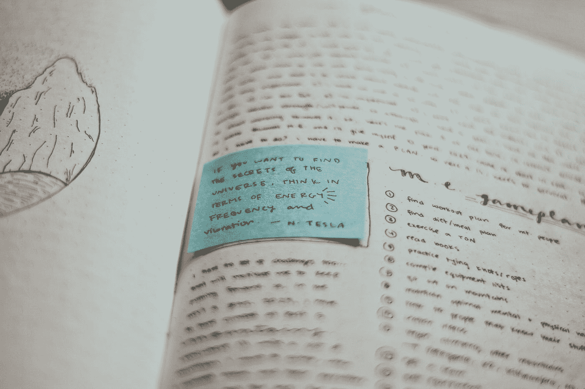
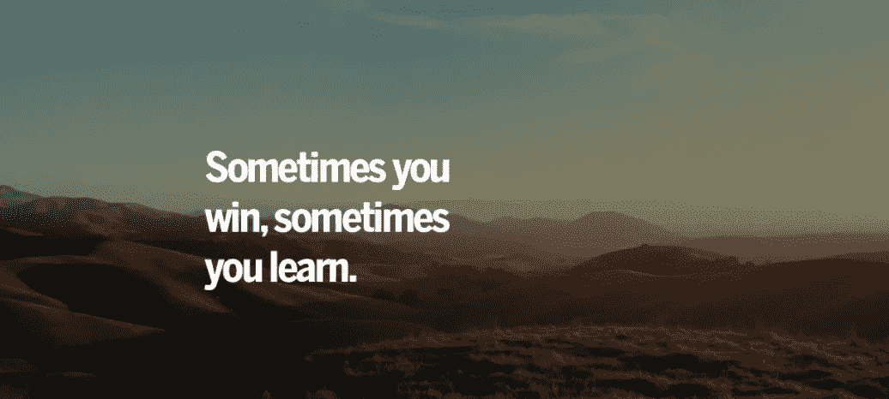
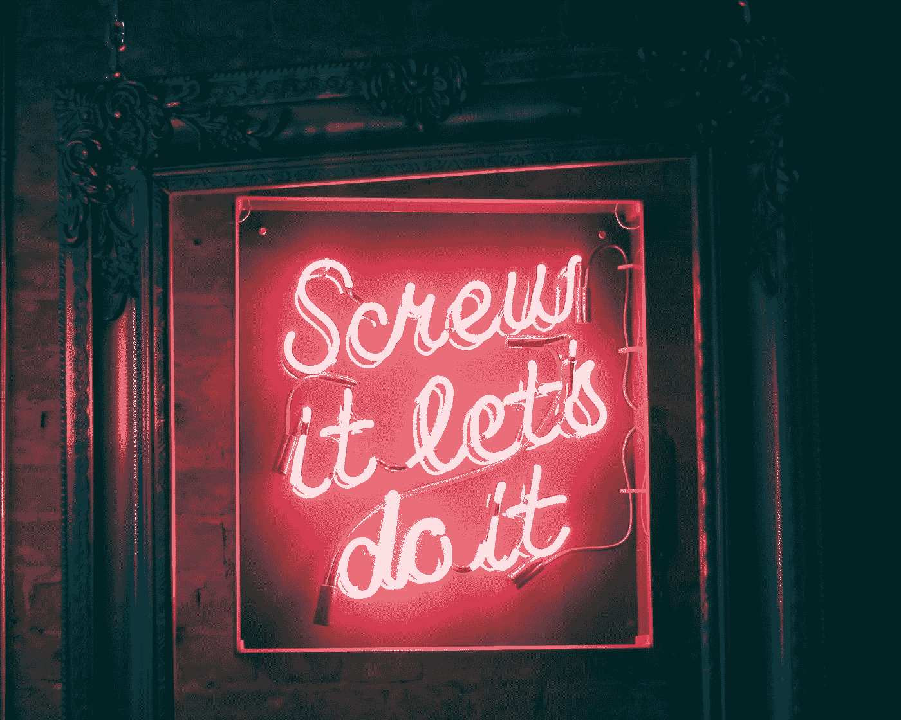
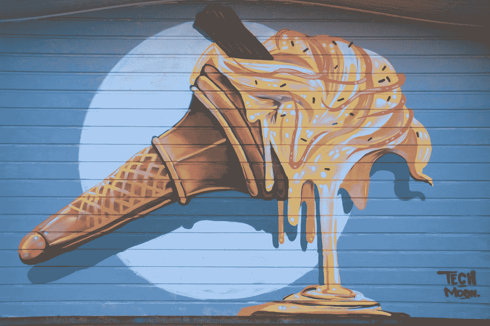

# 为什么自助书籍是扯淡

> 原文：<https://medium.datadriveninvestor.com/why-self-help-books-are-bullshit-a29e501f4e2f?source=collection_archive---------3----------------------->

## 真正的改变是关于剂量和自我意识 Lori Gottlieb 谈影响理论

Photo by [Noémi Macavei-Katócz](https://unsplash.com/@noemieke?utm_source=medium&utm_medium=referral) on [Unsplash](https://unsplash.com?utm_source=medium&utm_medium=referral)

> “你良好习惯的代价是现在。你的坏习惯的代价在未来。”—詹姆斯·克利尔

# 上午 9:00:自我提升的意义何在？

我的意思是，这不是自助狗屎都一样吗？

我听自助播客，阅读自助和自我提升的书籍，并总是试图不断学习领导力、个人成长和成长心态，但为什么呢？

为什么我想改变？变化的根源是什么？改变的心理是什么，我一直想要过的生活的障碍是什么？

一方面，我有自怜、耐心和自爱，但另一方面，我内心的斯多葛派想要练习勇气、韧性和批判性反馈(基本上就是踢我自己的屁股！)

当我已经知道为什么习惯会创造复合的成就回报——无论是财务上的、人际关系上的还是事业上的——自助类型还重要吗？

虽然自助和自我提升的书籍通常是关于个人成长的，但它真的应该被称为个人改变。我认为你不应该把 ***停留在*** 的学习中。除非你将所学付诸行动，否则阅读不是个人成长或改变。

> “当世界以结果为导向时，为什么要关注过程呢？结果不重要吗？是的，结果很重要。但是如果你优化了结果，你就赢了一次。
> 
> 如果你为一个能带来好结果的过程而优化，你就能一次又一次地获胜。”—詹姆斯·克利尔

# 我相信有比阅读自助书籍更好的成长方式:

我敢打赌，如果你报名参加铁人三项赛，你会更了解什么是铁人三项。

我敢打赌，如果你像现在一样开始创业，你会学到更多关于创业的知识。

我敢打赌，如果你想成为一个更好的父母，你可以养成在场、参与、积极和沟通的习惯。

没有个人成长教练或自我提升作者能为你做这件事——这是重点——做艰苦的工作，如果你偏离了潮流，尽快回来。

# 上午 11:00:成功是优化你的过程，而不是实现一个结果。

在职业体育和大学体育的世界里，教练和运动员都想赢得冠军，但是要付出什么代价呢？

我意识到成功的艺术在于掌握(并享受)成为最好的自己的过程。

如果我能在第一次或第二次练习之前，每天早上投篮一次，或者练习我的基础，或者我的体能，那对我来说就是一个胜利。如果你不愿意付诸行动，就没有必要去阅读新的自助想法，这正是问题所在——改变很难。

Photo by [Jean-Karim Dangou](https://unsplash.com/@jdkcaptures?utm_source=medium&utm_medium=referral) on [Unsplash](https://unsplash.com?utm_source=medium&utm_medium=referral)

# 上午 11:45:我们嫁给能帮(或不帮)我们打开行李的伴侣。

[洛里·戈特利布](https://lorigottlieb.com/)，谢谢。

我忘记了这一点——我们的行李总是在那里，等待着我们的伴侣、最亲密的商业(或篮球)队友和孩子把它带出来。它们是我们不想看到的潜意识自我的镜子。

为什么我们会对情况做出消极的反应？

审视自己，问自己:在这种情况下，我不能控制自己的反应是什么？

# 下午 1:00:我们告诉自己的故事是阻碍我们前进，还是推动我们前进？

Photo by [Nick Fewings](https://unsplash.com/@jannerboy62?utm_source=medium&utm_medium=referral) on [Unsplash](https://unsplash.com?utm_source=medium&utm_medium=referral)

我太老了，今天不能锻炼两次。

我太老了，爬不动那座山了。

我太累了，不想写了。

我太怪异了，找不到一个会完全爱我的伴侣。

我太喜欢运动了，无法成功创业。

*吖哒吖哒吖哒*—[猴子的想法](https://trevor-huffman.medium.com/5-ways-to-beat-your-distraction-addiction-a93a0f5d33ce#a7f6)不断出现。

精英中的精英学会如何以积极的方式对待这些消极的想法和经历。

他们把柠檬变成柠檬水。

日复一日——它永远不会完美。不，恰恰相反，它有时很乱，那是因为精通需要时间。

> “重大的生活变化——搬到一个新的城市，开始一份新的工作，结束一段关系，结婚，生孩子，等等。—通常会在改善前的前 100 天让生活变得更加艰难。
> 
> 这并不总是正确的，但这是一个很好的提醒，经历早期的斗争并不意味着这是一个糟糕的选择。”—詹姆斯·克利尔

 [## 在家工作如何提高我的工作效率|数据驱动型投资者

### 在家工作确实激发了我最大的潜能，让我更有效率。因为在家工作给了我…

www.datadriveninvestor.com](https://www.datadriveninvestor.com/2020/07/29/how-working-from-home-increased-my-productivity/) 

# 下午 3:00:有意的实践(行动)是行为改变自我完善、自我帮助、自我认知的关键。

看看你的五个最亲密的朋友、同事或导师。他们是什么样的？他们是做什么的？他们如何行动，如何表现，如何谈论他们自己的生活？他们会为自己的梦想、包袱或生活方式负责吗？

如果你不打算变得健康、自由、有爱、明智、开悟或当下，是因为你不在乎自己是否如此吗？

成熟需要用心。如果意图和行动之间有差距，你可能是那些阅读自助书籍却没有任何真正改变的人之一。

Photo by [Daniel van den Berg](https://unsplash.com/@danielvandenberg?utm_source=medium&utm_medium=referral) on [Unsplash](https://unsplash.com?utm_source=medium&utm_medium=referral)

# 下午 5:00:成长或变化是否发生在我们的舒适区之外？

大多数时候，变化以我们看不到的微小方式发生——无论是积极的还是消极的增长。

一支烟可以让你感觉很好，然后一支接一支，一支接一支。几个月后，你可能一天抽一盒。这种类型的负增长是舒适的。简单。隐形的。几年后，你的肺可能只工作了一半容量，指甲发黄，健康状况恶化。

另一种积极的成长通常在前端感觉不好——比如变得健康，这是通过坚持锻炼、冥想、练习自我保健、吃真正有营养的食物来实现的，然而，我们都知道，但每年新年，健身房会员人数都会激增，成年人不会坚持去。大多数成年人不明白，大多数人体每周会减少大约 0.25%的脂肪。要看到任何真正的结果，需要几个月的持续行动才能看到任何结果。

> 詹姆斯·克利尔说:“每一个小小的行动都是为你明天想成为什么样的人投下的一票。”

是的，放下蒜蓉面包棒，去买 Peloton。)

我发现试图以积极和消极的方式改变就像一条鲻鱼。我可以在前端吮吸，我发现尝试以消极的方式改变在前端感觉很好。就像我喜欢糟糕的饮食，但讨厌自己一贯如此时的感觉(以及六个月后的样子)。

我讨厌吃得很好，但我喜欢我坚持这样做时的感觉(以及六个月后的样子)。

健康和不健康变化的二分法很讽刺，不是吗？

我想知道最高最大的橡树会不会像树苗一样挣扎着把根留得越来越远。

# 我们都找过借口:

“我将开始这种饮食，这种锻炼，在这本自助书之后，我将对我的生活做点什么，我将改变我的思维模式，这种习惯，不，等等，我将得到这辆 2500 美元的 Peloton 自行车，并减掉 20 磅！”我们说，然后 *whampf* ，变化击中了我们的鼻子，因为我们在舒适区之外，当到了付钱的时候…

# 晚上 11 点:如果你想要积极的改变，确保你改变的剂量是正确的。

健身是行为改变的一个简单例子。

我的朋友说，“我想变得健康，我要去跑马拉松。”

好吧，为什么是马拉松？

“因为我需要一些大的东西来激励我。”

许多跑步者(和人们)可能想要大的改变或马拉松来激励他们改变，但事实是，每天的小变化累积起来。

就是下一步加起来一万。

是日复一日持续的 1 英里让你跑完马拉松。

畅销书作家詹姆斯·克利尔说，随着时间的推移，小习惯会变成大变化。阿尔伯特·爱因斯坦称复利为世界第八大奇迹。所以不管你读的自助书籍，还是你尝试实施的自我提升，记住剂量(从小处开始，经常)和自我意识是关键。

随着时间的推移，我们都可以养成改变生活的小习惯(好的和坏的)。所以，如果你吃了一些蛋糕，或者聚会太过，或者错过了一次锻炼，或者忘记了坚持你的新年决心、目标、习惯、惯例，或者掉了车，只要尽快重新开始。

记住，改变是困难的，所以善待自己。

> 如果你想了解更多关于我的职业篮球生涯，请报名我的自强(我知道，讽刺！)简讯在[www.trevorhuffman.com。](http://www.trevorhuffman.com)

## 获得专家视图— [订阅 DDI 英特尔](https://datadriveninvestor.com/ddi-intel)