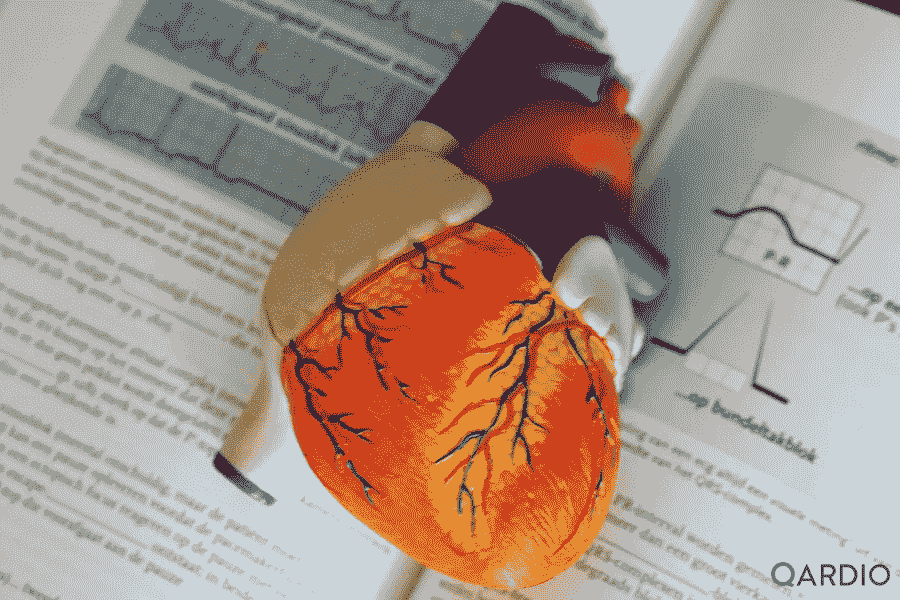

# 为什么自我保健对心脏健康很重要

> 原文：<https://medium.datadriveninvestor.com/why-selfcare-is-important-for-heart-health-7de1e9b9c334?source=collection_archive---------42----------------------->

心血管疾病表现为一种无声的状态，因此尽早解决你的风险因素至关重要。

Photo by [Robina Weermeijer](https://unsplash.com/@averey?utm_source=unsplash&utm_medium=referral&utm_content=creditCopyText) on [Unsplash](https://unsplash.com/s/photos/heart-health?utm_source=unsplash&utm_medium=referral&utm_content=creditCopyText)

自我保健是个人通过促进健康的实践来保持健康和控制疾病的过程。通过这些自我保健实践，你可以增强你的身体和情绪健康。

衰老是某些慢性疾病如心血管疾病(CVD)和中风的主要风险因素。在全球范围内，在老年人中，心血管疾病是死亡的主要原因。CVD 表现为一种无声的状态，只有在 50 岁以后才开始出现症状。因此，尽早解决你的风险因素至关重要。

 [## 新的健康技术如何让我们活过 100 岁？数据驱动的投资者

### 不久前，我们都在看一台黑色电视，不得不带着天线跑遍整个公寓，以确保…

www.datadriveninvestor.com](https://www.datadriveninvestor.com/2020/08/12/how-new-health-technology-makes-us-live-past-100-years/) 

以下是一些关于心脏健康自我护理的实用技巧:

自我保健行为的坚持
在遵循医生的建议时，要负责任，让自己负起责任。让自己了解正在服用的药物及其副作用。根据健康专家的说法，由于药物治疗方案依从性差，我们有时无法实现 CVD 治疗目标。

**了解自己的风险**
为了更好地对 CVD 进行自我护理，您应该了解自己目前的健康状况和未来的威胁，以便进行充分的自我护理。美国心脏协会的“了解你的数字”活动鼓励人们确定他们的心血管疾病风险。五大危险因素包括血压、总胆固醇、高密度脂蛋白胆固醇、血糖和身体质量指数。

**饮食建议**
坚持饮食建议很重要。主要成分包括:
蔬菜——深绿色、红色和橙色、豆类和淀粉类食物
水果——全果，如浆果、橙子、哈密瓜等。
不饱和脂肪油——大豆、玉米、橄榄、菜籽油和红花
蛋白质——海鲜、家禽、瘦肉、鸡蛋、坚果、种子和豆制品

**体重控制**
保持健康的体重对自理行为至关重要。一些数字干预可能是有吸引力的工具，有助于卡路里控制和日常锻炼。这些工具可以让你保持动力，并在需要时提供支持团体。

**体育活动**
有规律的有氧运动是最好的自我保健行为，可以提高你的耗氧量，从而改善睡眠和生活质量。久坐不动的人呆在家里不活动，看电视的时间越长，患心脏并发症的风险就越大。因此，遵循健康积极的生活方式对心脏健康至关重要。

**戒烟**
从不吸烟或戒烟是一种必不可少的自我保健行为。如果你在 CVD 事件后戒烟，你会有更好的结果。远程咨询和心理咨询可以帮助你戒烟，防止复发。

**酒精使用**
饮酒增加高血压和心肌病的风险。目前的指南表明，对于心脏健康稳定的患者来说，每天喝一两杯酒是可以的。你应该知道过量饮酒的风险，并尽量减少每天的摄入量。

**最后一句话**
要通过自我保健来预防心脏病风险，你必须有意识、技能、动力和信心来遵循自我保健实践。许多障碍，包括家庭和社区的影响，可能会使你偏离健康的行为。

为了最大化这些自我保健实践的效果，它们应该成为你生活的一部分。无论年龄大小，每个人都应该遵循健康的习惯。

健康的生活方式是一个持续的旅程，而不是命运。为了更好的健康和健康的心脏，练习自我保健。

*最初发表于*[*https://www.getqardio.com*](https://www.getqardio.com/healthy-heart-blog/self-care-heart-health/)*。*

## 访问专家视图— [订阅 DDI 英特尔](https://datadriveninvestor.com/ddi-intel)