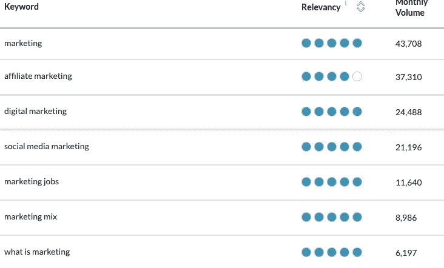
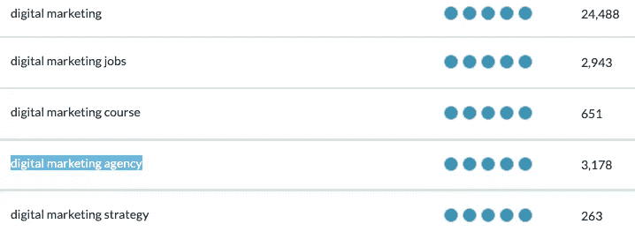
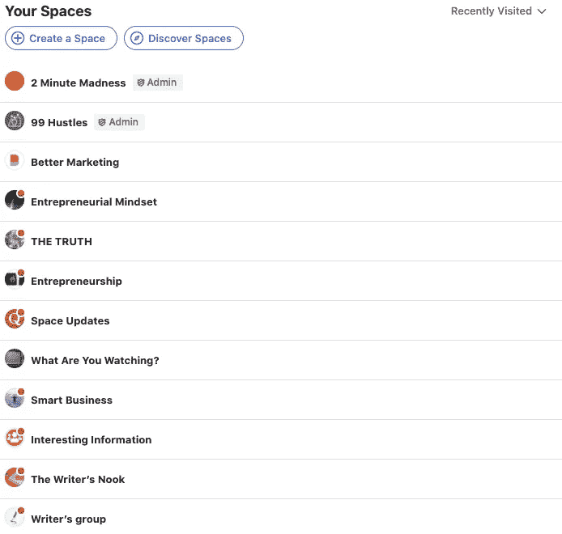
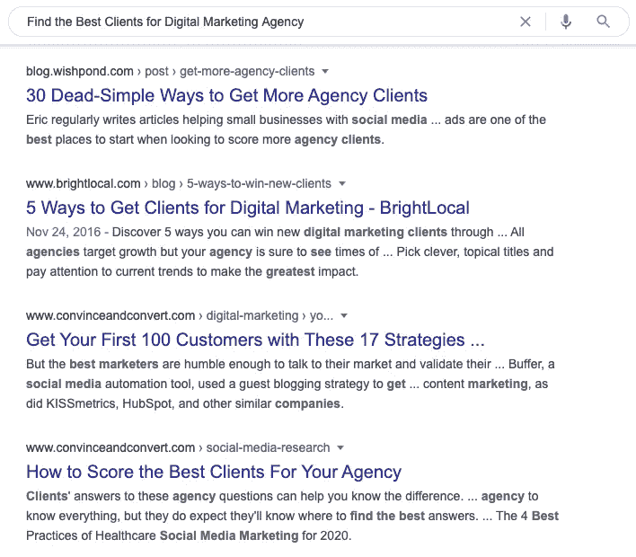

# 为什么 SEO 不仅仅是搜索引擎优化

> 原文：<https://medium.datadriveninvestor.com/why-seo-is-more-than-just-search-engine-optimization-285f75337702?source=collection_archive---------7----------------------->

## 一个简单的策略，无限的交通思想来源。

Image by [janjf93](https://pixabay.com/users/janjf93-3084263/?utm_source=link-attribution&utm_medium=referral&utm_campaign=image&utm_content=3614766) from [Pixabay](https://pixabay.com/?utm_source=link-attribution&utm_medium=referral&utm_campaign=image&utm_content=3614766)

指望谷歌有机流量的日子已经一去不复返了。谷歌正在无耻地颠覆搜索结果，以阻止流量离开平台。然而，并不是一切都失去了。你仍然可以使用搜索引擎优化带来大量的流量，但它可能不仅仅是通过搜索引擎。

我最近建立了另一个博客，试图帮助我的客户充分利用谷歌的“*有机*”流量。我们已经成功地把一些文章放在了头版，但是流量不是你所期望的。原因如下:

*   [域名权威](https://moz.com/learn/seo/domain-authority)比选择正确的关键词和寻找低竞争的长尾短语更重要。没有权威，再好的关键词也帮不了你的网站排名。
*   谷歌答案、片段、谷歌自有网站和付费广告都排在第一位。[谷歌](https://themarkup.org/google-the-giant/2020/07/28/google-search-results-prioritize-google-products-over-competitors)搜索结果的 40%是谷歌。
*   49%的谷歌搜索结果从未离开谷歌。由于 Google Snippets 的出现，即使是第一名有时也意味着几乎没有流量。
*   我们正在寻找与 10 年前不同的新事物。
*   本地搜索引擎优化现在是搜索引擎优化的金鹅

在谷歌上获得第一个位置仍然是一个无价的流量来源。但是，你不能再指望它了，你的事业的未来也不能指望它了。由于谷歌的行为，公司纷纷关门，欧盟反垄断委员会甚至就此类政策起诉谷歌。

谷歌[支付反垄断罚款](https://ec.europa.eu/commission/presscorner/detail/en/IP_19_1770)并继续照常营业。该公司通过颠倒搜索结果赚了比法律罚款还多的钱。

谷歌不再是我们的朋友，但 SEO 仍然非常重要，可以帮助创造一个病毒式的故事。搜索引擎优化的黄金法则仍然完好无损。

(*我们不是在这里谈论本地搜索引擎优化。*)

# SEO 是人

*搜索引擎优化*是一个暗示机器和算法的技术术语。但是你不必了解计算机代码和帕洛阿尔托的管理人员来使用 SEO。

人们在互联网上寻找解决方案、想法和娱乐。SEO 就是人。当你今天做搜索引擎优化研究时，你会发现以下几点:

*   人们使用的确切语言
*   受欢迎的想法
*   如何创造一个相关的故事

这是一个 SEO 如何帮助你选择正确的语言和标题的例子。想象一下，你已经没有好主意可以写了，你想在一般的*营销*利基市场中找一个话题。

关键词工具是最简单的开始方式。在你喜欢的关键词应用中输入 *Marketing* 开始。我们在这个故事中使用了 Moz 美国搜索结果。

Screenshot: Author

营销是个笼统的词，第一个结果是非具体的。看着前面几行，我们看到人们在寻找:

*   不同类型的营销
*   社交媒体营销策略
*   市场营销方面的工作信息
*   营销技巧和策略
*   营销的定义

每一点都能给你下一个故事的灵感。有了基本的 SEO，你知道人们对你写的东西感兴趣，这有助于你为观众写作。

在进入下一步之前，你可以马上写出几个标题。

*   营销与广告:有什么区别？
*   以下是 2020 年社交媒体的最佳营销策略
*   目前正在招聘的顶级营销公司
*   如何才能找到一份营销方面的工作
*   假人营销:你应该知道什么？
*   数字营销是营销的唯一未来吗？

标题是普通的，但仍然相关。寻找营销工作的人可能会忍不住想知道在这个行业工作需要什么。你可以进一步搜索。让我们为*数字营销*找一个具体的话题。

Source: Author

你可以看到“*数字营销机构*”有相当数量的每月搜索结果。如果你从事数字营销，那么你可能已经知道数字代理。你可以通过在[回答公众](https://answerthepublic.com/)、谷歌或 Youtube 中输入这个术语来研究它。以下是潜在的标题列表:

*   这个 25 岁的年轻人如何为他的数字营销机构找到最好的客户？
*   尼尔·帕特尔关于创办一家数字代理公司的建议将帮助你获得第一个客户
*   您的数字营销机构的热门新产品

现在，下一步是写故事。你已经完成了繁重的工作。因为你对你写的东西有信心，所以在研究之后写作是自然而然的。

当你写完这个故事，继续在你的平台上发表。这些视图可能不会立即出现，有时轻轻一推会有所帮助。

# 相关网站和反向链接

我们必须建立一些反向链接。故事里的出站链接和反向链接都很重要。总是包括支持你的主要观点的链接。

建立反向链接对私人网站和 Medium 这样的平台都有好处。但是你可能只是得到了你的中型岗位的外部流量，这取决于你的目标，可能不符合你的兴趣。

你可以用很多方法建立反向链接。这里有两个很酷的例子:

Quora Spaces 是一个好的开始。创建一个 Quora 账户，搜索相关空间。留意接受访客帖子和链接的空间。像企业家思维这样的一般空间接受与企业家精神有关的故事。

当你列出相关的空间时，去每个地方提交你的链接。你的帖子的质量和相关性很重要，因为 QS 管理员可以批准或传递你的故事。一旦你的故事被大众 Quora 空间批准，你的外部数据可能会增加。

## 建立联系的老方法

搜索相关网站，让他们突出你的链接。在谷歌上为你的学期排名的网站是一个好的开始。

搜索相关网站、博客和媒体报道。然后，联系用户和网站管理员，让他们加入你的故事。如果你用的是 Medium，一定要提供好友链接。常规链接带有付费墙，网站管理员可能会传递付费墙的故事。正确的反向链接是给你的故事和网站带来持续流量的可靠方法。

# 最后的话

你可以使用一个简单的 SEO 策略来建立相关的博客想法，并建立持续的流量。这里是快速纲要。

*   研究你所在领域的关键词
*   入围标题创意
*   写一个相关的故事
*   建立反向链接
*   欢迎交通

SEO 可能不再是打开无限谷歌流量之门的神奇学科，但是你仍然可以通过 SEO 策略产生巨大的价值。