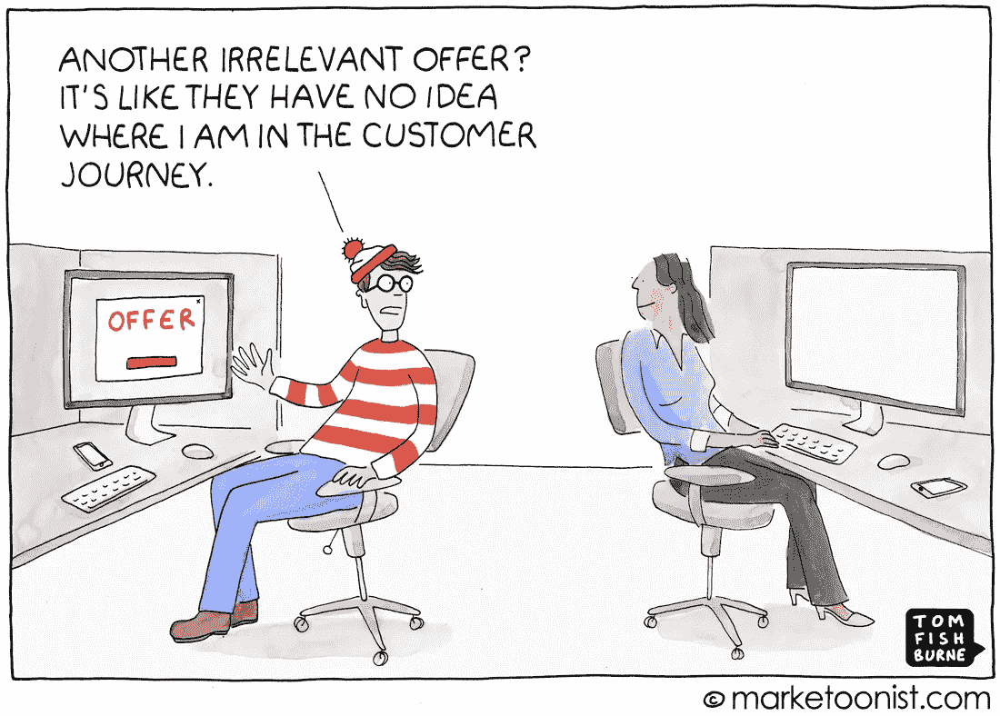

# 为什么您应该关注个性化和客户体验

> 原文：<https://medium.datadriveninvestor.com/why-should-you-care-about-personalisation-and-customer-experience-7f0b8f778068?source=collection_archive---------38----------------------->

在线市场和平台大幅增长，2019 年在线购买的商品和服务总额估计为 19.2 亿英镑。

今天的技术已经变得非常大众化，不再是区分因素。人们很少需要从头开始编写代码或算法——因为很多东西都可以通过可以复制或分支的开源库轻松获得。难以复制的是市场能提供给顾客的体验。

> 在这十年中取得成功的市场不会是那些拥有最新或闪亮技术的市场，而是那些能够为客户提供愉快体验的市场。因为每个市场都可以获得相同的技术。

个性化是客户体验的一个方面，一个非常重要的方面。为了演示，让我们创建一个类似于餐馆的在线市场体验。你去，你吃饭，付钱，然后离开。

你常常没有意识到去餐馆吃饭的意义远不止于此。我们留下的不仅仅是付款和小费——我们留下了我们的足迹。

# 您对餐厅的访问:Lamu🥘🍱🍢🍸

> **参观 1:** 你去一家餐厅；女主人告诉你等 15 分钟，直到你的桌子准备好；你坐在桌旁；你点餐；你付了帐就走。
> 
> 如果你喜欢这里的食物，你会回去的。
> 
> **拜访 2:** 女主人不记得你是谁；等待 10 分钟后带您入座；你点一些食物；买单走人。
> 
> (你回去是因为食物，不是因为服务)
> 
> **第三次拜访:**第三次拜访时，厨师碰巧生病了，所以换了一个厨师。这次的食物很普通。你付了帐，然后离开。

# 您对 Milliways 餐厅的访问🥘🌮🍱🍢🍸🍹🍾

> 拜访 1: 你走进餐厅；告诉女主人你的预约。
> 不用等；她带你去你的桌子。她倒水；帮你拿餐巾和刚出炉的面包。留给你菜单和酒单🍷📖。她告诉你她最喜欢的食物，并询问你是否有过敏反应。
> 
> 过了一会儿，她回来了；接受您的订单；食物端上来了，没有令人不满意的等待。你的酒杯总是满满的。没有一刻你会觉得缺少什么。
> 
> 女主人甚至会给你一小杯他们自制的香槟和免费的甜点。
> 
> (你心里想的不是食物，而是服务。员工彬彬有礼，关心让你觉得自己与众不同)
> 
> **拜访 2:** 你走进餐厅，这位辣妹记得你，并问你是喜欢和上次一样的桌子还是去餐厅的其他地方。
> 
> 她记得你上次点了哪种葡萄酒，并根据你的购买情况推荐你可能喜欢的葡萄酒。她甚至回忆起你对鱼过敏，并推荐了一份菜单来适应这种情况。
> 
> (你感觉餐厅真的很了解你，照顾你所有的愿望)
> 
> **拜访 3:** 和之前一样的经历。女主人记得你，带你去你的桌子。
> 
> 但这一次厨师生病了，所以有一个替代者，食物最终不是那么好。

# 大问题:你第四次去哪家餐馆？

前两次去两家餐馆都很棒。你第一次和第二次拜访时的美味食物的形象已经成为过去。你几乎记不起来了。

唯一让你回到 Lamu 的是食物，也就是产品。当产品不能满足你的需求时，你会用未来的访问来换取一家新餐馆(新产品)。

如果你像大多数人一样，当 Milliways 未能提供美味的食物时，你可能会倾向于忽视劣质产品，因为在他们那里的体验会让你感到愉悦。女主人记得你的名字，你通常点的酒，你对鱼过敏，这些都给你留下了印象。你知道他们最关心你的利益。

让我们的焦点回到在线市场和平台。就像 Milliways 一样，客户更宽容，更愿意忽略偶尔出现的劣质产品错误，否则他们会有愉快的体验。另一方面，如果你不注重客户体验，你的整个声誉都依赖于你的产品，当你的产品失败时，客户就会转向下一个产品。

在这个时代，能够为客户提供真正难忘和愉悦体验的公司才会成功。

# **Tl；博士**

对于在线市场，客户产生大量数据并留下足迹。公司应该这样做，为我们下次进入他们的网上商店提供量身定制的体验。幸运的是，许多公司已经在这么做了，而且几年后会有更大的改进。

能够建立主动个性化系统的公司必然会看到客户购买更多他们的产品。**个性化导致收购。**这并不奇怪，因为我们都期待“特殊待遇”，就像 Milliways 对待顾客的方式一样，让他们觉得自己很特别。那些为客户提供这种特殊待遇的公司将在业绩和回头客方面获得最大的提升。

如今，随着手机和数字产品的广泛使用，大多数人对他们认为的良好的网络和移动体验有了明确的定义，并有一套适用于所有产品的标准。这就产生了一种预期，这种预期会蔓延到他们尝试的所有其他产品，如果一个网站不吸引人、难以使用或提供糟糕的体验，客户就会在几分钟内离开该网站。这种趋势迫使更多的企业重新设计产品，提供令人愉快的体验，并个性化到一定程度，这有助于客户取得进展，但不会令人毛骨悚然。

今天，如果你在易贝或 Gumtree 上的体验很差，或者发现他们的网站很古老，很难使用，你一定会转向另一个市场，比如亚马逊。

我相信消费者将不再把他们的忠诚度放在已知品牌中，而是放在整体体验上。能够通过有意义和个性化的用户体验使自己与众不同的在线市场和平台将受益最大。对于来说，个性化导致收购。

**进入专家视角—** [**订阅 DDI 英特尔**](https://datadriveninvestor.com/ddi-intel)