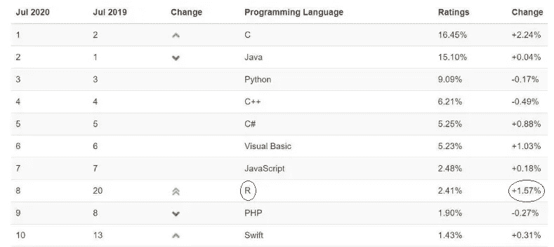

# 为什么要学 R？—在 5 个标题下

> 原文：<https://medium.datadriveninvestor.com/why-should-you-learn-r-under-5-headings-8c1ebdbd97f0?source=collection_archive---------10----------------------->

Photo by [NESA by Makers](https://unsplash.com/@nesabymakers?utm_source=medium&utm_medium=referral) on [Unsplash](https://unsplash.com/?utm_source=medium&utm_medium=referral)

## R 语言在数据分析方面的显著进步——R 语言流行的分析视角

在这篇文章中，我们将重点介绍“ **5** 主要话题”。你将能在下面一步一步地看到它们。但是在我开始之前，我想简单地提一下 r。

# R 简史

众所周知，R 是用于统计计算和图形的软件环境，也是一种编程语言。

由新西兰奥克兰大学的 Ross Ihaka 和 Robert Gentleman(1993)开发，R 目前正由“R 开发核心团队”开发。可以说类似于 S 编程语言，甚至是 S 的一种改编。

 [## 一瞬间学会数据科学！？数据驱动的投资者

### 在我之前的职业生涯中，我是一名训练有素的古典钢琴家。还记得那些声称你可以…

www.datadriveninvestor.com](https://www.datadriveninvestor.com/2020/07/23/learn-data-science-in-a-flash/) 

# 现在，让我们通过以下标题更深入地探讨一下:

# 1.我为什么要学 R？

*   **R 是免费的:**作为一个开源项目，你可以免费使用、访问、审查和编辑 R。
*   R 的兼容性:与其他编程语言相比，R 是一种容易学习的语言。另外，R 程序可以兼容 C、Java 等多种编程语言。
*   **R 中基本设计的图形:** R 中有高效的工具来创建图形。如果你愿意，你也可以创建自己的图形。
*   **促进工具:**一个大型的、整合的、组织良好的中间工具集，用于分析数据
*   R:R 程序员世界大约有 100 万个职位空缺。像 LinkedIn，Glassdoor，Indeed，Monster 等工作门户网站。都有数千份数据科学家和 R 程序员的工作清单。
*   **对于大数据技能:** R 知识是大数据分析师中比较流行的技能。一些最大的品牌，包括谷歌、脸书、美洲银行和纽约时报，都在寻求精通 R 的数据科学家。

# 2.R 的优势在哪里？

Image by [rawpixel.com](http://rawpixel.com/)

*   R 最重要的特征之一是它是一种“面向对象”和“类敏感”的语言。r 运算符和函数可以根据它们的参数类型改变它们的行为。
*   由于其开放源代码的特性和极端的通用性，R 已经成为统计分析和数据科学的主要工具。在行业面临全球数据科学家短缺的情况下，无论是新手还是专业的 R 程序员都可以进入。
*   他在制图方面的能力是无可争议的。它在用户控制下执行非常复杂的任务。在这种情况下，R 比大多数统计软件包都要好。它甚至可能是通用统计软件包的最佳选择。并且对于交互式工作非常有用。
*   手动输入数据以产生输出是一个具有挑战性的过程，并且经常容易出错。然而，在 R 语言的帮助下，数据分析程序可以根据公司的利益进行定制；这减少了手动工作，提高了速度和效率，并提供了优化的结果

# 3.你能提供一个替代 R 的好方法吗？

是的，Python 经常可以被看作是与 R 出于类似目的的竞争对手，但实际上这两种语言是两种重要的流行语言，可以互补彼此的缺点。有时在 API 方面的相似之处是因为它们受到了彼此的启发。

> 为了利用这两种编程语言获得最大收益并开发出优秀的解决方案，建议停止比较，开始合作！

# 4.那么，为什么 R 不那么受欢迎呢？

一个可能的原因是，统计编程现在正从大学走向行业，Python 正获得更多的行业认可。

结论稳定:大学和研究机构正在采用 Python 和 R 进行统计分析。

实际上，在 C 语言之后，R 显示了最大的变化。根据上一年**的**:

Soruce: [https://www.zdnet.com/](https://www.zdnet.com/)

# 5.用 R 实现的著名项目有哪些？

*   **情感分析:**情感分析的过程可用于确定网站、社交媒体订阅源、文档等中反映的意见的性质。
*   **优步数据分析:**这个项目是一个数据可视化项目，其中 R 及其库用于分析参数或变量，如一天中的旅行或一年中的每月旅行。这些不同年度时间段的可视化是使用“纽约市数据集中的优步购买量”创建的。应该为此项目导入的主要 R 库和包是—“gg plot 2”、“ggthemes”、“lubridate”、“dplyr”、“tidyr”、“DT”和“scales”
*   **电影推荐系统:**可以使用“MovieLens Dataset”和软件包——“reshape 2”、“ggplot2”、“recommenderlab”、“data.table”在 R 中构建一个推荐系统。
*   **信用卡欺诈检测:**数据集与 R 一起用于信用卡欺诈检测项目。在项目中:导入包括信用卡交易在内的数据集，探索数据，处理和结构化数据，对数据建模，将模型拟合到逻辑回归算法，最后实现决策树、人工神经网络和使用梯度推进模型。

# 最后的决定权

我们听说过很多关于 r 的事情。在商业中，你必须为你更需要的东西采取行动。很明显，R 对于统计和容易可视化是有利的。在我结束之前，我应该提一下，现在有许多工具可以比以前的版本创建更多的动态或 3D 图形。

**当然还有更多更新的包。这似乎是一个很好的方法:**

 [## 综合 R 档案网

### 编辑描述

cran.r-project.org](https://cran.r-project.org/) 

## 获得专家视图— [订阅 DDI 英特尔](https://datadriveninvestor.com/ddi-intel)