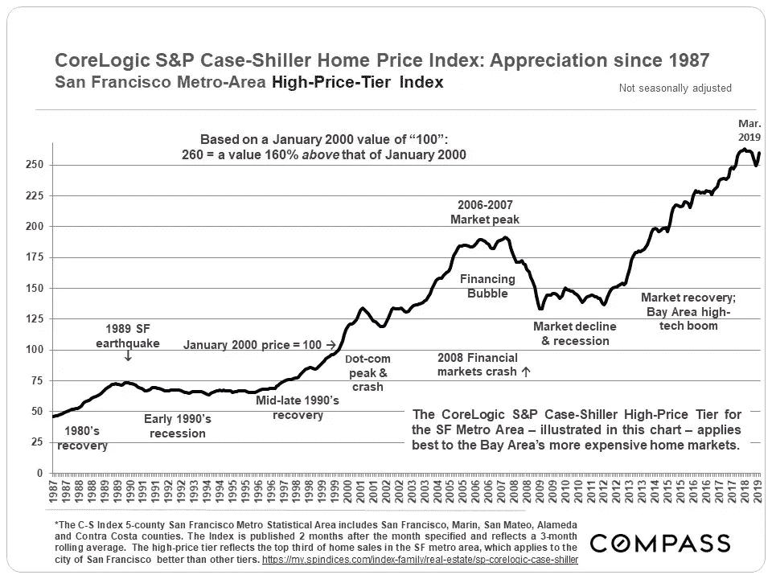

# 为什么硅谷的房地产价格永远不会从新冠肺炎复苏

> 原文：<https://medium.datadriveninvestor.com/why-silicon-valley-real-estate-prices-will-never-recover-from-covid-19-bdf1a6eda010?source=collection_archive---------0----------------------->

Photo by [Kevin Ngo](https://unsplash.com/@kevvomatic?utm_source=unsplash&utm_medium=referral&utm_content=creditCopyText) on [Unsplash](https://unsplash.com/collections/11463474/sf/6bd2aedf24e9fec8c88ec05eda707ca3?utm_source=unsplash&utm_medium=referral&utm_content=creditCopyText)

就在 2019 年，研究人员和房地产经纪人警告说，硅谷“无处增长”拥有 310 万居民的湾区在 0.05% 的土地面积上容纳了 [1%的美国人口。](https://jointventure.org/images/stories/pdf/population-brief-2015-05.pdf)

自 19 世纪晚期以来，硅谷温和的气候、教育体系和工作机会吸引了当地居民。但一个多世纪后，有限的住房库存、2.3%的失业率和 50 万技术工人造就了全国最高的[租金](https://www.dbresearch.com/PROD/RPS_EN-PROD/PROD0000000000494405.pdf)和比全国平均水平高五倍的[中位房价](https://www.zillow.com/san-francisco-ca/home-values/)。

在过去的四十年中，旧金山房地产市场随着美国经济和宏观经济趋势而波动。但是随着每一次衰退——从网络泡沫到 2008 年房地产危机——房屋价值很少下降超过 10 %- 25 %,然后比以前的峰值攀升 70 %- 90%。

Bay Area Real Estate Appreciation from 1987–2019 ([Source](https://www.bayareamarketreports.com/trend/3-recessions-2-bubbles-and-a-baby))

硅谷的发展轨迹似乎不受自然灾害和经济危机的影响。如果地震、经济衰退和恐怖袭击都不能左右房地产价格，那还有什么能呢？

**答案:**一个疫情与远程工作的碰撞。

快进到 2020 年，旧金山是一个买方市场。房租价格已经跌至三年来的最低水平——仅在五月就下跌了 9.2%。随着疫情冠状病毒在美国肆虐，房屋库存和空置率每月都在继续上升

然而，专家认为这种下降是一种异常现象，声称技术工人的外流“并不一定意味着留下来的人能买得起更便宜的房子。”

他们错了。

尽管湾区房价预计在未来 12 个月内将下跌 2.3%，但这只是结束的开始。

## 硅谷的房地产市场注定会无限期下跌，原因有三:

1.  科技公司正在将办公室和招聘工作转移到小城镇，以节省资金。
2.  远程办公成为新常态，让办公室绝迹。
3.  离开的技术人员永远不会回来。

"[硅谷的人口动态与经济密切相关](https://jointventure.org/images/stories/pdf/population-brief-2015-05.pdf)"人口减少意味着住房需求减少。随着冠状病毒危机和经济衰退与向远程工作的大规模转移相冲突，该地区的人口下降将加速。

在疫情之前，科技公司已经开始向更小的中心扩张，并允许员工远程办公。进入封锁期四个月后，数十万技术员工在家工作，其中 40–70%的人正在考虑搬迁。这些趋势将会继续。

与此同时，移民——T4 硅谷人口增长的主要驱动力——在联邦层面被[冻结](https://www.whitehouse.gov/presidential-actions/proclamation-suspending-entry-aliens-present-risk-u-s-labor-market-following-coronavirus-outbreak/)。当 2013 年至 2017 年间有 35，400 名居民离开湾区时，超过 45，000 名移民工人抵消了这一损失。现在不可能了。

一些城市规划者表示，如果开发商拖欠贷款，房价将会反弹。但人口下降、远程工作和不断变化的工作文化将使经济适用房潜在减少的影响相形见绌。

让我们来探究每一个因素。

# 1:新的技术中心

根据彭博的“[大脑集中指数](https://www.bloomberg.com/news/articles/2019-11-18/kansas-draws-enough-brain-power-to-make-it-a-top-tech-hub)”，美国五大科技中心中有三个位于湾区之外。科罗拉多州的博尔德、密歇根州的安阿伯和 DC 的华盛顿州名列榜首，而[福布斯](https://www.forbes.com/sites/trulia/2014/02/06/5-truths-of-tech-hub-housing-costs/#7c509f4526ff)将西雅图、圣地亚哥、罗利和奥斯丁列为后起之秀的热点城市。

在疫情期间和之后，这些地区将继续接受硅谷的移植，因为公司寻求降低他们的管理费用、租金和工资支出。例如，脸书正在亚特兰大、达拉斯和丹佛建立三个新的办公室，作为 T4 扩展其远程劳动力的计划的一部分。

尽管从纽约到西雅图，城市的入住率一直在下降，但随着科技工作者希望在不离开家庭办公室太远的情况下获得更大回报，对郊区住房的需求正在增长。成千上万的工人已经搬迁到加州更便宜的地区，以及德克萨斯州、内华达州、俄勒冈州和亚利桑那州。

在疫情之前，美国 800 万远程工作者中的大多数居住在佐治亚州的亚特兰大、得克萨斯州的弗里斯科和科罗拉多州的高地牧场(不是硅谷)。

既然远程工作已经成为工作，人们将继续向小城市、郊区和农村迁移。工人们不再聚集在一个单一的科技之都，而是会分散到全国乃至全世界许多较小的中心——从贝塞斯达到巴巴多斯再到巴厘岛。

# 2:大量采用远程工作

尽管美国的企业文化几十年来一直抵制远程办公，但科技公司在 T21 疫情之前率先允许远程办公，并在此后率先适应。

当杰克·多西宣布 Twitter 员工可以永远在家工作时，马克·扎克伯格紧随其后。脸书的 50，000 名员工中有 95%可以在今年剩下的时间里远程工作，其中超过一半的人可能会保持这种状态。总的来说，科技公司和创业公司已经(至少)在 2020 年末将[数十万](https://www.cnet.com/news/the-new-work-from-home-policies-at-facebook-twitter-apple-and-more/)员工送回家。

但是，即使人们*希望*在 2021 年重返办公室，他们也无法做到。背负高额间接成本的公司将永远无法在利润率或股东回报方面与完全分散的同行竞争。那些迫使人们通勤到办公室的公司将很难吸引和留住最优秀的人才。

当人们可以在任何地方工作，办公室租约到期时，硅谷将会萎缩。因此，住宅和商业房地产价格将继续暴跌。

# 3:远程工作人员迁移

> 40–99%的技术工人可能会离开湾区。

硅谷是成千上万家创业公司的所在地。世界上最具创新性的公司吸引了一些世界上最优秀的员工。因此，技术人员很快就意识到，如果他们再也不会回到办公室，支付天价租金是没有意义的。

一项盖洛普民意测验发现，尽管 80%的美国人口居住在城市，但只有 12%的人希望从 T10 到 T11。现在，科技工作者有了流动的机会，他们正在充分利用这一机会。

研究表明，员工不在乎免费午餐或豪华办公室。但是 96%的人想要灵活性，特别是远程工作的能力。

根据旧金山门的调查，如果有远程工作的选择，三分之二的湾区居民会考虑离开。同样，2020 年的一项盲目调查发现，61%的硅谷员工愿意搬迁，如果他们可以永远在家工作的话——尽管有减薪的威胁。

[Source: blind](https://usblog.teamblind.com/wp-content/uploads/2020/05/PayCut.pdf)

各公司对薪资问题的处理方式不同。一些公司，如 Twilio 和 T2，会给搬出湾区的员工提供奖金。其他人，比如 T4 的脸书，计划削减所有搬迁人员的工资。(据扎克伯格称，至少 30%的脸书员工正在考虑跳槽。)

然而，保守估计 30-60%的员工会离开。Buffer 在其年度远程工作状态报告[中发现，98%尝试远程工作的人希望在他们的剩余职业生涯中保持远程状态。同样的数量会推荐给他们的朋友。](https://lp.buffer.com/state-of-remote-work-2020)

同样，美国消费者新闻与商业频道|SurveyMonkey 对 9000 多名科技工作者进行的民意调查发现，57%的人希望“一直”或者比疫情之前“更频繁”地远程工作。只有 9%的人“从不”想再次在家工作。

Source: [Buffer State of Remote Work](https://lp.buffer.com/state-of-remote-work-2020)

如果超过一半的技术工人最终离开湾区，硅谷的房地产价格注定要下跌。餐馆、咖啡店、酒吧和其他设施最终会在办公区附近关闭。

马林、纳帕和卡梅尔等邻近市场对住房需求的增加仅仅是个开始。科技工作者不仅会搬到不同的县——他们会搬到不同的州和国家去追求更低的生活成本和更高的生活质量。

> 如果你可以住在[爱沙尼亚](https://youtu.be/z0hUBpzk4Ds)、[巴巴多斯](https://youtu.be/BPUQZ8r-YQc)或佛罗里达，而花费只是它们的一小部分，为什么还要留在硅谷呢？

# 其他科技中心的房地产价格会遭受同样的命运吗？

Photo by [John Towner](https://unsplash.com/@heytowner?utm_source=unsplash&utm_medium=referral&utm_content=creditCopyText) on [Unsplash](https://unsplash.com/collections/11463474/sf/6bd2aedf24e9fec8c88ec05eda707ca3?utm_source=unsplash&utm_medium=referral&utm_content=creditCopyText)

是也不是。如果城市的人口密度由于远程工作而一致下降，住房价值和租金价格将随着需求的下降而持平。

这一趋势的证据已经显而易见。从亚特兰大和奥兰多到 T2、香港、T4、伦敦和新加坡，世界各地的空置率都在上升。

 [## 轻松投资颠覆性技术|数据驱动型投资者

### 研究并做好你的尽职调查，找出 10 个可能主宰未来行业的装袋者可能会很难。的…

www.datadriveninvestor.com](https://www.datadriveninvestor.com/2020/07/13/investing-in-disruptive-technology-made-easy/) 

然而，硅谷是一个例外。很少有其他大都市地区(如果有的话)有同样的地理限制、严格的监管环境和科技公司的集中，这些在过去产生了湾区房地产泡沫。

其他城市只是有更多的发展空间。竞争技术中心的新建筑比湾区多 8 到 10 倍。[与美国前 100 大城市相比，旧金山每 1000 人拥有的新住房单元数量最少](https://www.cnbc.com/2014/02/06/dont-blame-tech-industry-for-tech-hubs-high-home-prices.html)。

尽管其他城市市场可能会下滑，但硅谷的下滑幅度更大。

Median home price in SF compared to California and the U.S. ([Source](https://www.bayareamarketreports.com/trend/3-recessions-2-bubbles-and-a-baby))

# 硅谷的下一步是什么？

Photo by [Raquel Stanton](https://unsplash.com/@raquelcreative?utm_source=unsplash&utm_medium=referral&utm_content=creditCopyText) on [Unsplash](https://unsplash.com/collections/11463474/sf/6bd2aedf24e9fec8c88ec05eda707ca3?utm_source=unsplash&utm_medium=referral&utm_content=creditCopyText)

> “湾区最近几十年的所有重大衰退都与国家或国际经济危机有关，”— [Compass 分析师帕特里克·卡莱尔](https://www.bayareamarketreports.com/trend/3-recessions-2-bubbles-and-a-baby)

很少有人会认为美国正陷入前所未有的经济和健康危机。然而，市场是周期性的。人们很容易认为，硅谷价格稍微便宜一点只是暂时的。

但是，尽管湾区的气候、教育系统和制造业几十年来一直吸引着居民，但这一次是不同的。技术有史以来第一次改变了该地区房价的基本驱动力——改变了人们工作的方式和地点。

在全球疫情和第五次工业革命的推动下，我们正在见证人类移民长期趋势的开始。

技术进步和向远程工作的过渡将不可避免地降低对硅谷房地产的需求。但是冠状病毒已经加速了至少十年的变化。

离开旧金山的热潮是有原因的——人们想要更好的生活质量。他们值得拥有它。

到 2020 年底，办公室将不复存在，硅谷很可能成为自身成功的受害者。

在追求进步的过程中，科技公司帮助制造了海湾地区的住房危机。但是通过创新和远程工作，他们也解决了这个问题。

## 关于远程工作、技术和旅行的未来，请查看我的每周播客[。](https://www.travelingwithkristin.com/digital-nomad-podcast)

**注:7 月 31 日进行了编辑，以澄清* [*美国消费者新闻与商业频道|SurveyMonkey 调查*](https://www.surveymonkey.com/curiosity/cnbc-workforce-survey-may-2020/) *的结果。*

**访问专家视图—** [**订阅 DDI 英特尔**](https://datadriveninvestor.com/ddi-intel)