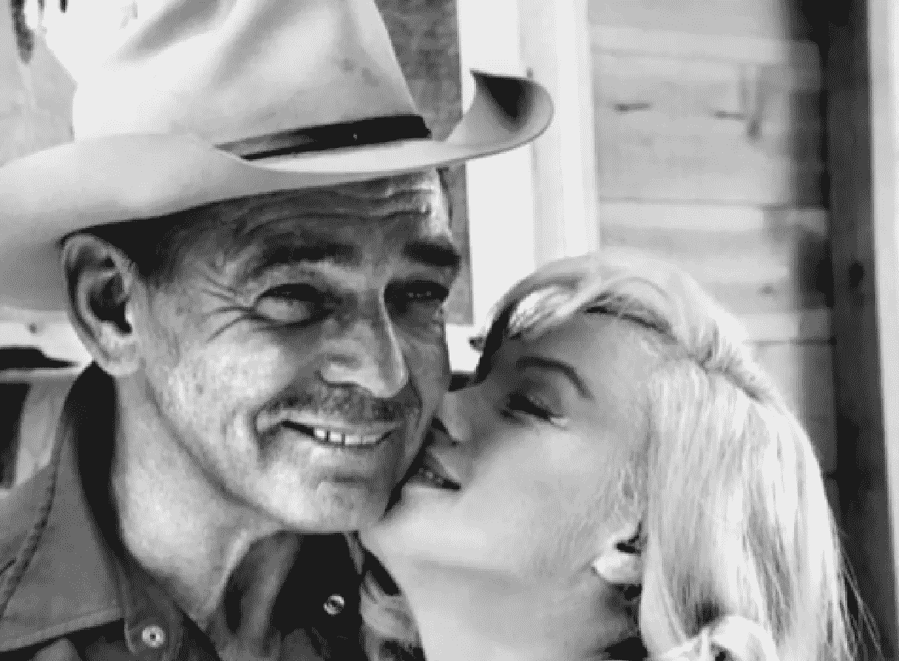

# 为什么有些人比其他人幸运

> 原文：<https://medium.datadriveninvestor.com/why-some-people-are-luckier-than-others-9ef3af4843a3?source=collection_archive---------4----------------------->

## 这都是关于齿轮，克拉克·盖博有伟大的。

Courtesy of YouTube

“我只是一个来自俄亥俄州的幸运的懒汉，只是碰巧在正确的时间出现在正确的地方。”克拉克·盖博

我不能说我很幸运。我*很幸运，但还没有到以此为职业的地步。然而，有些人做到了，包括像克拉克·盖博这样的好莱坞名人。他或多或少承认自己的职业生涯不走运。“人们来看我，因为我知道我的生活很棒，”他说，“他们知道我知道这一点。”他是如此受欢迎，阿道夫·希特勒在二战期间悬赏捉拿他(盖博当时在第八航空队执行飞行任务)。*

 [## 良好的生活是习惯的形成|数据驱动的投资者

### 过度思考是过度紧张。仅仅几个简单的习惯就会在一天中产生巨大的影响。那是…

www.datadriveninvestor.com](https://www.datadriveninvestor.com/2020/01/17/a-good-life-is-habit-forming/) 

盖博在告诉所有人玛丽莲·梦露会让他心脏病发作后死于心脏病发作(在拍摄《T4》的《乱世佳人》T5 时)。谁不想让门罗让他们心脏病发作呢。当然，你会死。但是想象一下她站在你的坟墓上，就像她在《七年之痒》中站在地铁栅栏上一样，我会说这是值得的——即使她已经死了。

> 他不会唱歌，跳舞，或者哭。不是说我能，但是没有人给我提供一个在重拍的*一夜风流*中的主演角色。

无论如何，这整个运气和受欢迎的概念让我困惑，主要是因为盖博不是一个伟大的演员。他不会唱歌，跳舞，或者哭。不是说我能，但是没有人给我提供一个在重拍的*一夜风流*中的主演角色。那么盖博是如何在天赋如此之低的情况下生存下来的——而我却不行？

似乎有些人只是更倾向于好运。我说“面向”，是因为很久以前，一个叫老子的人写了一本名为《道》的书。在书中，他认为生活就是齿轮。当事情进展顺利时，我们的齿轮就啮合了。当事情变糟时，我们的齿轮会脱离啮合。我们称之为“糟糕的一天”

我们都有过糟糕的日子。谁知道这是机械问题？显然有些人比其他人有更多的机械问题。尽管我们很想要一些东西，但生活并不总是让我们拥有它。

盖博显然拥有齿轮和命运。他承认自己在正确的时间出现在了正确的地点。史蒂夫·乔布斯和史蒂夫·沃兹尼亚克也是如此。“当地球上最伟大的发明出现时，我们就在附近，”乔布斯说，他指的是计算机。“这有多幸运？”

古巴导弹危机时他们也在。

有多幸运？

> 以小蒂姆为例。还有哪个时代会允许留长发的尤克里里演奏者演奏颤音？

在正确的时间出现在正确的地点当然很重要。以小蒂姆为例。还有哪个时代会允许留长发的尤克里里演奏者演奏颤音？你能想象他今天出现在*美国达人*上吗？

不知何故，小蒂姆在宇宙中找到了自己的位置。普遍性当然在道中扮演了一个角色。整本书实际上是关于宇宙和宇宙中发生的所有事情——蹩脚的或其他的。

如果生活就是时间安排，我们真的有控制权吗？想想“运气好”这个词。运气真的能决定谁得到什么吗？为什么要给一个五音不全的演员或者一个会弹尤克里里的歌手呢？

为什么不给我们？我们五音不全，却能颤声歌唱。如果自动提示音可以让麦当娜听起来像一个伟大的歌手，我敢肯定我们不会比小蒂姆更糟。

另一方面，我们认为是坏运气的事情实际上可能是好运气。阿尔弗雷德·希区柯克说“我很幸运是一个懦夫，有一个低门槛的恐惧，因为一个英雄不可能做出一部好的悬疑电影。”

儿童书作者谢尔·银色啤酒杯乐队将时间视为重力。在他的诗《蹦床》中，两个人在半空中不断地思念着对方。“一个总是在上升，而另一个在下降。”

> 如果乔布斯和沃兹尼亚克生活在 1728 年，那么苹果就是苹果。

和老子说的差不多。齿轮和蹦床就像生命的整个宇宙结构。时间和地点很重要。比如说，你不可能在错误的世纪。如果乔布斯和沃兹尼亚克生活在 1728 年，那么苹果就是苹果。

幸运的是，他们在人们健忘的时候发明了 Mac 电脑。Mac 以一种非常紧凑的方式解决了信息存储问题。

随着笔记本电脑的出现，你可以坐在星巴克，看起来像一个作家。如果你感到沮丧，你可以把你的笔记本电脑扔出窗外。"史蒂夫·沃兹尼亚克实际上为这种意外设计了 Mac 电脑. "永远不要相信你不能扔出窗外的电脑，”他说，这就是为什么大多数作家使用笔记本电脑。

老子希望人们注意消耗的能量。银色啤酒杯乐队认为我们应该停止弹跳。然而，那句老话“耐心等待，万事如意”并不是我们做事的方式。

我们宁愿蹦蹦跳跳，也不愿小心翼翼。

> 我们在脸书上贴照片，然后当有人说我们的狗不是“小可爱”时，我们会很生气

我们加入看起来像好事多传单的约会网站。我们在网上买东西，发现尺码不对，然后把它列在买卖清单上。我们在脸书上贴照片，然后当有人说我们的狗不是“小可爱”时，我们会很生气

我们的整个构造似乎都是为了弹跳，让我们的齿轮像疯狂的陀螺一样旋转。今天电脑内存如此之大的唯一原因是因为我们自己的记忆很差。

心理学家理查德·怀斯曼在*的电报*中写道，他对幸运和不幸的人进行了研究。幸运的人看到机会。他们着眼于大局，发明一些东西，成为亿万富翁。

不幸的人盯着他们的电视，直到重播把他们变成像小蒂姆一样的白痴。他们错过机会的原因和小蒂姆一样。他把我们惹火了。不幸的人也会把我们惹火。我们不敢相信他们还在看《老友记》。

怀斯曼创建了“幸运学校”，在那里，不幸运的人被教导像幸运的人一样思考。其中一部分包括关掉电视，走出去。有些人开悟了，有些人中风了。

> 我们发现机会是因为机会总是在那里。当人们找不到机会时，通常是因为他们在看《T2》的《老友记》。

结论是，我们的齿轮更有可能参与发现的环境。即使是简单的走出你的舒适区的行为也会导致你的齿轮疯狂转动。我们发现机会是因为机会总是在那里。当人们找不到机会时，通常是因为他们在看《T4》的《老友记》。

我最喜欢的银色啤酒杯乐队诗描述了两个擦肩而过的人，尽管他们如此般配。她有蓝色的皮肤，他也是，他藏起来了，她也是，他们一生都在寻找蓝色，然后擦肩而过——永远不知道。

我想这是另一种说法，你必须留心运气。正如怀斯曼在他的研究中指出的，“不幸的人盯着一页，而幸运的人则翻阅着寻找新的可能性。”

> 在某种程度上，吉利根的岛是一个生活的寓言。如果我们保持不变，我们的齿轮很有可能不会啮合。

就像*吉利根岛*上的教授。每个人都在继续他们的日常生活，试图复制他们被困之前的生活。只有教授一直在寻找出路。没有他，他们可能还在泻湖里钓吉利根。

在某种程度上，吉利根的岛是一个生活的寓言。如果我们保持不变，我们的齿轮很有可能不会啮合。如果我们寻找新的途径，很有可能会。幸运的人知道这一点。不幸的人不会。

至少我们知道克拉克·盖博做到了。他有很好的牙齿。

罗伯特·科马克是讽刺作家、小说家和博客作者。他的第一部小说[“你可以把马牵到水边(但你不能让它潜水)”](http://robertcormack.net/)在网上和大多数主要书店都有售。查看[天马出版社](http://skyhorsepublishing.com/)或[西蒙和舒斯特](http://simonandschuster.ca/)了解更多详情。

**访问专家视图—** [**订阅 DDI 英特尔**](https://datadriveninvestor.com/ddi-intel)