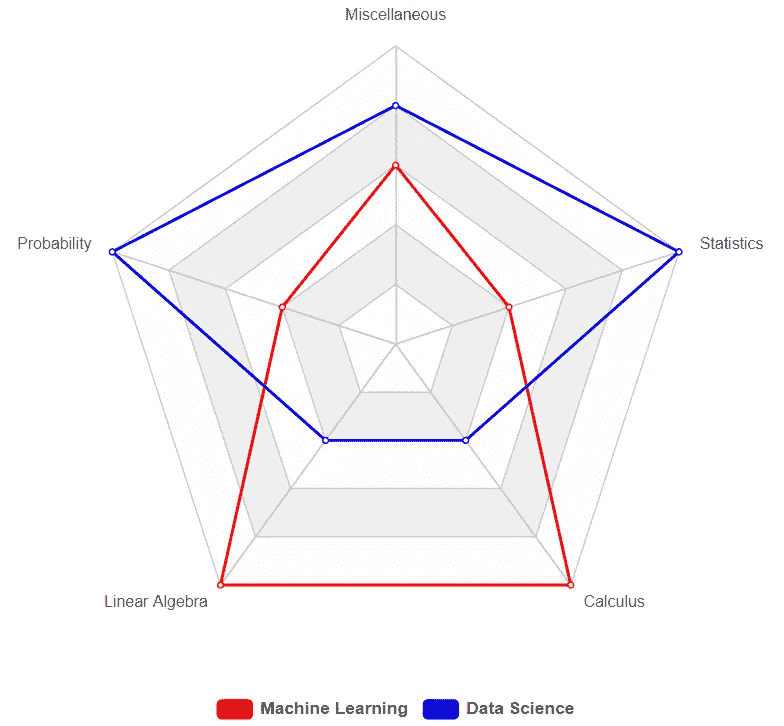
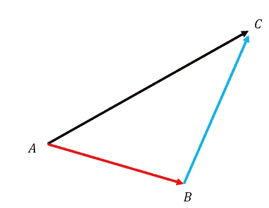
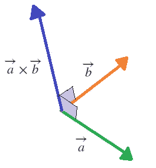
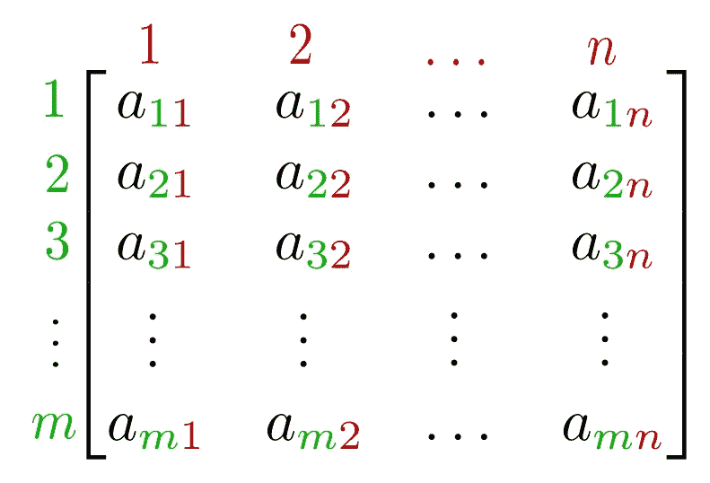
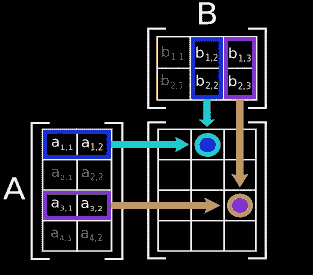
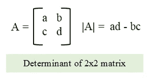
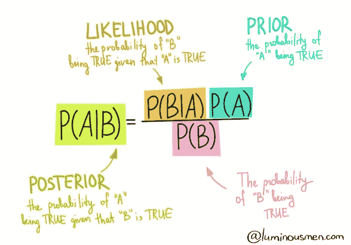

# 为什么要学数学？:Python 中的机器学习

> 原文：<https://medium.datadriveninvestor.com/why-study-mathematics-machine-learning-in-python-588974f6ed51?source=collection_archive---------7----------------------->

> "数学不是关于数字、方程式、计算或算法:它是关于理解."威廉·保罗·瑟斯顿


Image Source: [Lum3n](https://www.pexels.com/@lum3n-44775?utm_content=attributionCopyText&utm_medium=referral&utm_source=pexels) from Pexels

理解是成为机器学习专家的旅程中至关重要的一部分。尽管有人可能会认为学习机器学习背后的数学是不必要的，因为 python 提供了大量的库来执行这些数学运算，但这是一种谬误，在鼓舞人心的 ML 专业人士中产生了一种错误的期望感。

# 机器学习背后的数学

如果你在阅读这篇博客之前就感到有点焦虑，不要担心。对于一些人来说，数学可能相当复杂，尤其是对于非技术背景的人来说。你甚至可以称之为“PMSD”——数学前应激障碍。

然而，在机器学习中，人们可能不需要解决数学问题的能力，相反，人们只需要知道如何在每种情况下应用它。只有当我们知道某项任务时，我们才能命令计算机去完成它。在这个博客中，我们将看到成为机器学习天才所需的各种数学方面。

*   **线性代数**
*   **概率**
*   **统计数据**
*   **微积分**
*   **杂项**



Core ML vs Data Science Mathematics

# 线性代数

线性代数是机器学习中使用最广泛的数学概念。从处理基本值到一起解多个方程，线性代数涵盖了数学中许多不可避免的方面。

## **标量:**

从小的开始，我们有标量。这些是用来代表某个事物的数值。这个东西可以是任何东西，比如温度、金钱、房子大小和其他价值。标量代表量值或绝对值，因此包含在简单的算术中。

*   **操作和实施:**

```
# Addition
20000 + 1500 = 21500# Subtraction
20000 - 1500 = 18500# Multiplication
20000 * 1500 = 30000000# Division
20000 / 1500 = 40/3 = 13.3333
```

## 向量:

对于不同的背景，向量被认为是不同的:

*   在计算机科学中，向量被认为是一系列数字。
*   物理学家将向量视为一个有方向的标量。
*   最后，数学家认为向量是两者的结合。

显然，我们将从机器学习的角度来看待向量，并因此将它们视为一系列数字。为了便于运算，我们用行列表格的形式表示矢量。

*   **运营与实施:**

**矢量加法(点积)** 矢量加法不像标量加法那么直接。它实际上是计算从两个向量得到的位移。



Image Source: [brilliant.org](https://brilliant.org/wiki/vector-addition/)

```
import numpy as np
A = np.array([1,2,3])
B = np.array([4,5,6])
A2 = np.array([[1,2],[3,4]])
B2 = np.array([[5,6],[7,8]])# Both A and B are 1D Array
np.dot(A,B)
np.vdot(A,B)# Both A2 and B2 are 2D Array
print(np.dot(A2,B2))# Preferred Functions for 2D Dot Product:
print(np.matmul(A2,B2))
print(A2 @ B2)# Either A or B is scaler
print(np.dot(A,2))# Preferred Function for Scaler Multiplication with Vector:
print(np.multiply(A,2))
print(A*2)
```

**向量乘法(叉积)** 向量乘法计算一个垂直于给定向量的向量。换句话说，它是垂直于由两个给定向量形成的区域的向量。



Image Source: [brilliant.org](https://brilliant.org/wiki/cross-product-definition/)

```
import numpy as np
A = np.array([1,2,3])
B = np.array([4,5,6])
A2 = np.array([[1,2],[3,4]])
B2 = np.array([[5,6],[7,8]])# Vector Multiplication / Cross Product
print(np.cross(A,B))
print(np.cross(A2,B2))
```

## 矩阵:

矩阵是元素的矩形阵列或表格，按行和列排列。矩阵的维数可以表示为 m×n。矩阵通常用于简洁地写出和处理多个线性方程，称为线性方程组。矩阵中的每个元素称为一个元素。
以下是几种不同类型的矩阵:

*   行矩阵:有一行和多列
*   列矩阵:有一列和多行
*   方阵:m —行数= n —列数
*   单位矩阵:所有元素都是 1
*   对角矩阵:只有对角元素是值，其余为零。



Image Source: [Svgo](https://commons.wikimedia.org/w/index.php?curid=79728977)

*   **运营与实施:**

**矩阵乘法** 矩阵相乘时，第一个矩阵中的行的元素与第二个矩阵中相应的列相乘。如果 A 是一个 n×m 矩阵，B 是一个 m×p 矩阵，它们相乘的结果 AB 是一个 n×p 矩阵，只有当 A 中的列数 m 等于 B 中的行数 m 时才定义这个矩阵。



Image Source: [lumenlearning.com](https://courses.lumenlearning.com/boundless-algebra/chapter/introduction-to-matrices/#:~:text=the%20jth%20column.-,Matrices%20can%20be%20used%20to%20compactly%20write%20and%20work%20with,also%20known%20as%20linear%20maps.)

```
import numpy as np
Mat1 = np.matrix('1 2 3; 4 5 6')
Mat2 = np.matrix('7 8 9; 10 11 12')
Mat3 = np.matrix('7 8; 9 10; 11 12')# Find shape/dimensions of a Matrix
print(np.shape(Mat1))
print(np.shape(Mat2))
print(np.shape(Mat3))# Multiply two matrix
np.matmul(Mat1,Mat3)# Common Error
np.matmul(Mat1,Mat2)
ValueError: matmul: Input operand 1 has a mismatch in its core dimension 0, with gufunc signature (n?,k),(k,m?)->(n?,m?) (size 2 is different from 3)
# Simply means that the n dimension of Mat1 is not equal to m dimension of Mat2\. This is a required condition for matrix multiplication.
```

**矩阵转置** 矩阵的转置是行和列值的交换。这是通过沿其主对角线反射元素来实现的。任何矩阵的转置都用上标 t 表示。


Image Source: [Lucas Vieira](https://commons.wikimedia.org/w/index.php?curid=21897854)

```
import numpy as np
Mat3 = np.matrix('7 8; 9 10; 11 12')# Transpose using NumPy
np.transpose(Mat3)# .T function only works on NumPy arrays
Mat3.T# Other Function
Mat3.getT()
```

**矩阵行列式** 矩阵的行列式给出矩阵中特征值的乘积。它只是告诉你矩阵的标量。



Image Source: [cprogramcodeing.com](https://www.cprogramcoding.com/p/box-sizing-border-box_474.html)

```
import numpy as np# Determinant
Mat4 = np.matrix('1 2 3; 6 5 4; 8 7 9')
np.linalg.det(Mat4)
```

> **注:**行列式只存在于方阵。

**矩阵求逆** 在线性代数中，一个 n 乘 n 的方阵 M 称为可逆的，如果存在一个 n 乘 n 的方阵 P 使得: **MP = PM = I(单位矩阵)**

```
import numpy as npx = np.array([[1,2],[3,4]])
np.linalg.inv(x)
```

**使用矩阵求解方程**

用矩阵解线性方程组有两种方法。

1.  行列梯队法
2.  逆矩阵法

> **注意:**我们不会在纸上讨论他们的工作，但是我们会看到如何使用 Python 中的 NumPy 来求解方程组。

```
import numpy as npa = np.array([[3,1], [1,2]])
b = np.array([9,8])
np.linalg.solve(a, b)
```

> **注:** `*tensordot()*`、`*linalg.tensorinv()*`、`linalg.tensorsolve()`可用于计算 ndarrays 的点积、逆、解。

**特征向量:**

设 X 是一个方阵。非零向量 V 是 X 的具有特征值 Ev 的本征向量，如果:
**XV = EvV** 重新排列这个，我们可以得到一个齐次方程组
**【X-EvI】V = 0** 非平凡解只有当矩阵 **(X-EvI) = 0 时才存在。**

```
import numpy as np# Eigen Values and Eigen Vector
X = np.diag((1,2,3))
Ev, V = np.linalg.eig(X)
print(Ev)
print(V)# Only Eigen Values
X = np.diag((1,2,3))
np.linalg.eigvals(X)
```

# 可能性

概率最简单的定义是某事发生的几率。也就是说，一个值是与某件事情发生的可能性联系在一起的。在我们正式定义概率之前，让我们看一下行话:

*   实验:我们想要计算发生或不发生的可能性的场景。
*   结果:我们从场景中得到的结果。
*   事件:实验中特定结果的情景。
*   概率:事件发生的可能性。

现在我们可以说:“概率是一个事件发生的可能性的度量。”

> 概率=期望事件/总结果

## 更多术语

*   随机实验:结果无法确定预测的实验。
*   样本空间:随机实验的全部可能结果。
*   事件-分离:分离的事件没有任何共同的结果。
*   事件-联合:联合事件可以有共同的结果。

## 不同类型的概率

我们在不同的情况下处理不同类型的概率。我们将简要讨论这些类型:

*   边际概率:是指一个事件的发生不需要任何干预或依赖他人。
*   联合概率:它是对同时一起发生的两个事件的度量。
*   条件概率:它是一种只有在其他事件已经发生的情况下才会发生的事件的度量。

## 概率分布

概率帮助我们理解数据的工作原理。它帮助数据科学家预测未来趋势。对于机器学习来说，概率分布的知识是必须的。概率分布有 3 种基本类型:

*   正态分布:它是表示平均值的对称性质的分布。它创建了一个*钟形曲线*。
*   中心极限定理:它指出，如果样本量足够大，任何独立的随机变量的均值的抽样分布将是正态或接近正态的。
*   概率密度:它是关于一个连续的随机变量在给定值上发生的相对可能性。

所有这些概念对机器学习都至关重要。然而，在这篇博客中，我们将讨论最常用的最大似然定理——贝叶斯定理。

## 贝叶斯定理

贝叶斯定理用于计算两个事件的条件概率。它基于与实验相关的条件的先验知识来计算事件发生的概率。贝叶斯定理的计算方法如下:



Image Source: [Luminousmen.com](https://luminousmen.com/)

上面的信息图很好地展示了我们如何计算贝叶斯定理。

*本博客涵盖了前两部分——线性代数和机器学习背后的数学概率。它涵盖了这些主题的基础和重要部分。本文档旨在提供相关的理论知识。强烈推荐多读线性代数和概率方面的知识，以获取更深入的知识。*

> 感谢阅读。
> 别忘了点击👏！

**进入专家视图—** [**订阅 DDI 英特尔**](https://datadriveninvestor.com/ddi-intel)