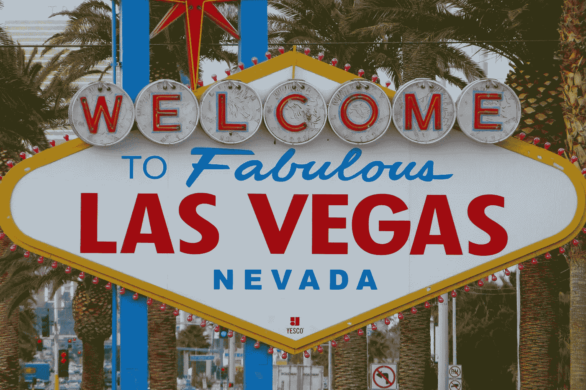

# 如果你是企业家，为什么成功不取决于运气，为什么这对你来说是好消息

> 原文：<https://medium.datadriveninvestor.com/why-success-doesnt-depend-on-luck-if-you-are-an-entrepreneur-and-why-this-is-good-news-for-you-883e7f18287e?source=collection_archive---------6----------------------->

知道伟大的成功者信任什么！

Photo by [Nick Fewings](https://unsplash.com/@jannerboy62?utm_source=unsplash&utm_medium=referral&utm_content=creditCopyText) on [Unsplash](https://unsplash.com/s/photos/gambling?utm_source=unsplash&utm_medium=referral&utm_content=creditCopyText)

# 我不相信运气。

我很快就明白了，运气是不存在的。我母亲在赌场工作了 20 多年，有一条金科玉律从未失效:“*赌场总是赢*”。

如果总是这样，那么**的运气就不存在**。就这么简单。

> 从长远来看，运气是不会影响你的。从长远来看，每个人都在他们应该在的地方。生活是百分百公平的。

当一件“幸运”的事情发生在某人身上时，人们不会看之前发生过的、不“幸运”的一百万种情况。人们只关注有效的，而不是无效的。**这就是不公平的地方**。

 [## 不见面就做交易？风投和企业家的 5 个指南|数据驱动…

### 自从 covid 六个月前登陆美国以来，全球的风险投资家和企业家都不得不适应新的现实…

www.datadriveninvestor.com](https://www.datadriveninvestor.com/2020/09/20/doing-deals-without-meeting-in-person-5-guidelines-for-vcs-and-entrepreneurs/) 

我出生于 1976 年，在我的一生中，我读过许多传记，大多是关于伟大的成就者。

说迈克尔·乔丹、奥普拉·温弗瑞、阿尔伯特·爱因斯坦、本杰明·富兰克林、史蒂夫·乔布斯、华特·迪士尼是“幸运的家伙”是不公平的。

**好消息来了:**

*   你的人生不靠运气是不是很棒？
*   你的生活不是轮盘赌？
*   这难道没有给你一种非凡的感觉，一切都取决于你吗？
*   你感觉不到它所代表的自由吗？

> 你的生活只取决于你和你的工作。句号。

你不需要看我上面提到的那些伟大的成就者。只需要关注你周围的人。那些在生活中获得成功的人。他们都是幸运的家伙吗？我不同意。

我将分享我生活中的一些方面来继续前进，但请不要把它们视为傲慢的标志。**我的一生都建立在谦逊的基础上，做一个正常的人，过正常的生活，养成正常的习惯**。

> 我实现的目标越多，我就越想成为正常人，因为我相信，生活中没有比成为一个傲慢的傻瓜更令人难过的事情了，主要是如果你非常努力地工作(这是我知道的唯一方式)来实现你的所有目标。

在这里，我分享我的感言，只是为了让你相信，而且，我所说的是有效的。

> 工作是我唯一知道的“幸运工具”。

我 8 岁开始编程。从那以后，我想成为一名程序员。知道事物是如何工作的是生活中的一件大事。我估计所有程序员都有这种感觉。

我没有停下来，每天都在编程:Basic、DBase、Visual Basic、Pascal、C、Cobol、Fortran、Java……15 年后我成了计算机科学的工程师。

我想为大型咨询公司工作。“我很幸运”，在与他们中的一些人面谈后，我进入了普华永道会计师事务所。2 年半后，我换了埃森哲(另一个“幸运运动”)。

> 26 岁的时候，我从编程中燃尽(连续 18 年足够了)，我决定建立自己的公司。显然不可能是和编程有关的东西，所以我决定创建一个陪酒代理(疯狂的决定？那是…)。

从头开始真的很难，但是你会学到很多。它告诉你运气绝不是谎言。

## **这家陪酒中介:**

*   变成了娱乐机构。
*   变成了一家企业活动机构。
*   成为了一家全球营销机构。

现在，在 2020 年，在每天工作了将近 20 年后，我们(因为，“很幸运”，[我找到了合适的商业伙伴](https://medium.com/the-innovation/how-to-keep-a-partner-for-17-years-in-a-business-df0a8bb0de8))是一个由 3 家不同公司组成的团队，拥有超过 45 名员工。

> 我坚持认为:这与傲慢无关。这是为了证明，从长远来看，运气是不存在的。

我不喜欢人们说某人“他是个幸运的家伙”或“他赢得那个项目时有多幸运”。人们只关注成功，并在此基础上创造一种解释。

但是他们一直不知道(或者不关注，或者更糟糕的是，不想关注)**那个家伙**“运气不好”。他丢掉了多少项目。多少封没人回复的邮件。多少扇门被关上了。

> 一个明智的建议:不要对迈克尔·乔丹说他很幸运。他肯定会揍你！

*   你真的认为他每天都准备好了并且有动力去训练吗？
*   他不觉得他不想锻炼很多天吗？
*   难道他不想拖延吗？

# 确信这一点。

我们都有弱点，糟糕的日子，我们遭受痛苦，很多时候我们不明白我们为什么要做我们正在做的事情，我们失去了焦点…我们是人。

但是我们也可以做伟大的事情。似乎无法实现的事情。一些让他们感到骄傲的事情。

## 每当我设定人生目标时，我都会遵循以下步骤:

*   我 100%确定我想达到这个目标。我需要完全确信这一点，因为我知道我将不得不在这上面做很多工作。
*   **我开始寻找知识。**这方面哪些是最好的？我在哪里可以找到信息？我可以选哪些课程？我应该加入哪些社区？
*   **我制定了一个工作策略。我需要做些什么？按什么顺序？我什么时候去做？**
*   我制定了一份任务清单，并每天将它们列入日历。
*   日复一日，我什么都不想就开始做这件事。

> 我不知道什么时候，但我知道有一天我会实现我的目标。

如果我没有，也不会是因为“我运气不好”。这可能是因为我很懒，或者我改变了我的优先事项，而那个目标与我不再相关，或者任何其他借口或情况使我改变了主意。

你可能会说，“帕克，如果不幸的是，我得了重病，并且严重影响了我呢？”。

那样的话，我会推荐你去读读哈尔·埃尔罗德的推荐书(我强烈推荐他的畅销书《奇迹的早晨》)。

对于那些不认识他的人来说，哈尔是一个几乎在一场车祸中失去生命(他实际上已经死了几分钟)并在几年后得了癌症的家伙。

> 如果，读完这些，你仍然找借口不去实现你的目标，问题是你自己，而不是“运气”

我知道人们不喜欢听到这种说法，但你应该决定你是否想活下去

*   充满谎言的一生，
*   欺骗自己，
*   抱怨一切(经济危机、冠状病毒、失去的项目……)
*   每个人(糟糕的客户，糟糕的供应商，糟糕的员工，糟糕的合作伙伴…)，

# 运筹学

**你可以“赌”为:**

*   有目标的生活，
*   有意义的生活，
*   充满了伟大的时刻和成就。

这种生活让你带着最大程度的满足去睡觉，带着一种证明那天你打算做的一切都是正确的感觉起床。

在相当长的一段时间里，我的感觉是相反的。每当我发现这种另类的哲学，我从来没有离开过它。

## 获得专家观点— [订阅 DDI 英特尔](https://datadriveninvestor.com/ddi-intel)