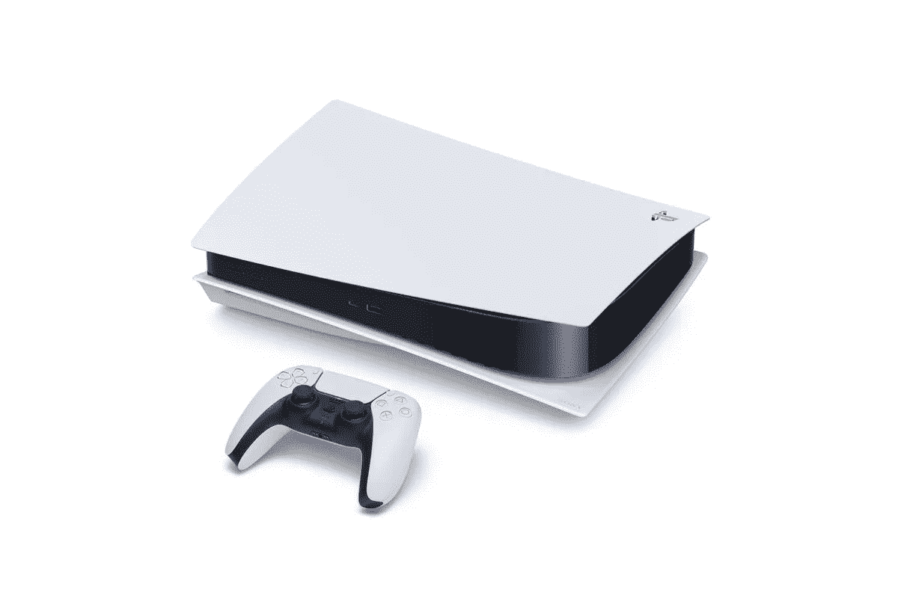

# 为什么科技以某种方式定价

> 原文：<https://medium.datadriveninvestor.com/why-tech-is-priced-a-certain-way-d6fb45aee224?source=collection_archive---------13----------------------->

## 最便宜的 Macbook Pro 怎么会比一台高质量的定制电脑还贵

Photo by [Marvin Meyer](https://unsplash.com/@marvelous?utm_source=medium&utm_medium=referral) on [Unsplash](https://unsplash.com?utm_source=medium&utm_medium=referral)

自从数字时代开始以来，技术的价格变化很大。定价结构对于产品定价来说并不新鲜，但技术的虚高价格及其内在令人困惑的内部规格不断让消费者怀疑是谁决定让低规格笔记本电脑比高端台式机更贵。让我们举几个例子来说明为什么看似相似的技术定价不同(或相似)，主要从硬件和软件开发的角度来看，而不是完全进入公司的定价结构。

## Macbook Pro 与高端电脑

Photo by [Philipp Mandler](https://unsplash.com/@philay?utm_source=medium&utm_medium=referral) on [Unsplash](https://unsplash.com?utm_source=medium&utm_medium=referral)

这两种类型的计算机可以相提并论，真是令人惊讶。Macbook Pros 在美国各地的咖啡店和科技创业公司都能找到。同样，他们的 Windows 塔式机也可以在专业环境和私人环境中找到，重点是游戏和一些最激烈的专业任务。

那么，为什么定制的 PC 与规格差得多的 Macbook Pro 价格差不多，而且往往更便宜呢？那台笔记本电脑怎么可能像台式电脑一样轻松地运行一些非常高级的专业程序呢？

Photo by [Aviv Rachmadian](https://unsplash.com/@avivrchmdn?utm_source=medium&utm_medium=referral) on [Unsplash](https://unsplash.com?utm_source=medium&utm_medium=referral)

首先，Mac 价格虚高的原因很大程度上是因为它的外形。要制造一台可以轻松占据 Macbook 机身 10 倍空间的电脑，只需要额外的成本。对于任何笔记本电脑制造商来说，制造出如此紧密的小部件简直就是奇迹；这在很大程度上解释了成本增加的原因。

这种相对较低规格的机器能够如此轻松地运行专业任务的原因，在很大程度上可以归功于苹果生态系统中软件和硬件之间令人印象深刻的集成。正是出于这个原因，我选择了 Macbook 而不是另一台笔记本电脑进行比较。

Windows 系统的开发人员需要适应来自不同显卡、处理器、RAM 和存储解决方案的更广泛的组件，不仅需要独特的配置，还需要来自不同制造商的组件，MacOS 的开发人员需要为 MacOS 进行开发。仅此而已。他们产品线中的硬件虽然多种多样，但都是由苹果公司控制和构建的。宣布将 ARM 架构引入 Mac 处理器将是实现自上而下全面控制系统的重要一步。

从外形到软件集成。MAC 电脑可以以相似的价格获得与台式 Windows 电脑相似的功能，这让成本看起来更像是一笔交易，而不是敲竹杠。

## 玻色对音频技术

Photo by [SCREEN POST](https://unsplash.com/@screenpost?utm_source=medium&utm_medium=referral) on [Unsplash](https://unsplash.com?utm_source=medium&utm_medium=referral)

这两家耳机制造商生产的耳机价格相似，但差别很大。Bose 因其舒适性和噪音消除能力而备受赞誉，是旅行耳机的黄金标准。出色的蓝牙质量，良好的通话质量，以及营造一种逃离尘世的氛围的能力，使这些耳机成为其中的佼佼者。尽管如此，你不会发现任何音乐制作人在混音时使用这些耳机。虽然它们的音质对大多数用户来说肯定超过了可接受的水平，但它并没有达到其他制造商能够达到的标准。

这就是像 Audio-Technica 这样的公司介入的地方。Audio-Technica 以与 Bose 旗舰降噪耳机相同的价格出售一套他们认为是监听耳机的耳机。诸如此类的耳机号称能提供最丰富、最准确的声音。当然，它们的线路也能提供尽可能好的声音。

价格的平等取决于这些设备各自的优势。Audio-Technica 监听音箱拥有适合生产的准确声音，而 Bose 耳机则提供一流的舒适度、噪音消除和便利性。每个公司都在自己的强项上表现出色，每个公司都根据其客户的需求占据了最合适的市场份额。

 [## 技术拯救雇佣关系第一天|数据驱动的投资者

### 面对困难的经济，有才华的人很难找到工作。在招聘过程中迷失…

www.datadriveninvestor.com](https://www.datadriveninvestor.com/2020/06/29/technology-rescues-relationships-from-hiring-day-1/) 

为了好玩，让我们在这里包括节拍，以及他们适合的价格类别。Beats 耳机因其高得离谱的价格和相对较差的音质受到了发烧友群体的广泛嘲笑。但问题是，它们为什么这么受欢迎？

答案是营销。Bose 和 Audio-Technica 将预算用于工程设计，Beats 将预算用于营销，这无疑为他们带来了回报。

## PS5 与游戏 PC

Photo from The Verge

随着即将发布的 PlayStation 5 即将面世，其价格将与消费游戏领域的最先进技术相媲美。但长期可靠的 PlayStation 评论者描绘了一幅粗略的画面，即 PlayStation 5 发布时的价格可能在 400 美元至 600 美元之间。随着每一代新一代游戏机的发布，沙发游戏的质量突然在追求最先进的 PC 游戏的技术天堂方面取得了巨大的飞跃。

那么，索尼怎么可能将 PlayStation 5 的价格降低到制造一台类似游戏电脑的一半或更低呢？答案在于几个关键领域。

首先是在优化方面。索尼能够在他们的游戏控制台的构造中只包含它所需要的东西。通过减少游戏电脑对多功能性的需求，游戏机制造商可以降低游戏机的价格。无论一个发烧友如何具体地设计一台定制电脑，从头开始设计一台完全专注于玩游戏的电脑是不可能的，只有大型制造商在设计整个系统时才有能力做到这一点。因此，随着索尼能够大规模生产和运输其游戏机，定制 PC 制造带来的一些额外费用和额外支出被削减了。

价格差异的第二个主要原因是商业模式。新的控制台硬件经常被出售，以使公司达到收支平衡甚至亏损。这是因为索尼等公司能够在游戏部门实现的大部分利润是通过软件销售和订阅服务实现的。通过光盘销售的游戏为他们带来利润，而在 PlayStation store 上以相同价格销售的游戏为公司带来更多收入。再加上 PlayStation Plus 的经常性订阅费用，你会发现索尼与游戏相关的大部分利润都来自这里。

产品定价是由多种因素决定的，其中许多因素不仅仅是原材料的成本。但是产品的焦点和公司向消费者提供他们认为有价值的服务的目标决定了一家公司的成败。

**进入专家视角—** [**订阅 DDI 英特尔**](https://datadriveninvestor.com/ddi-intel)