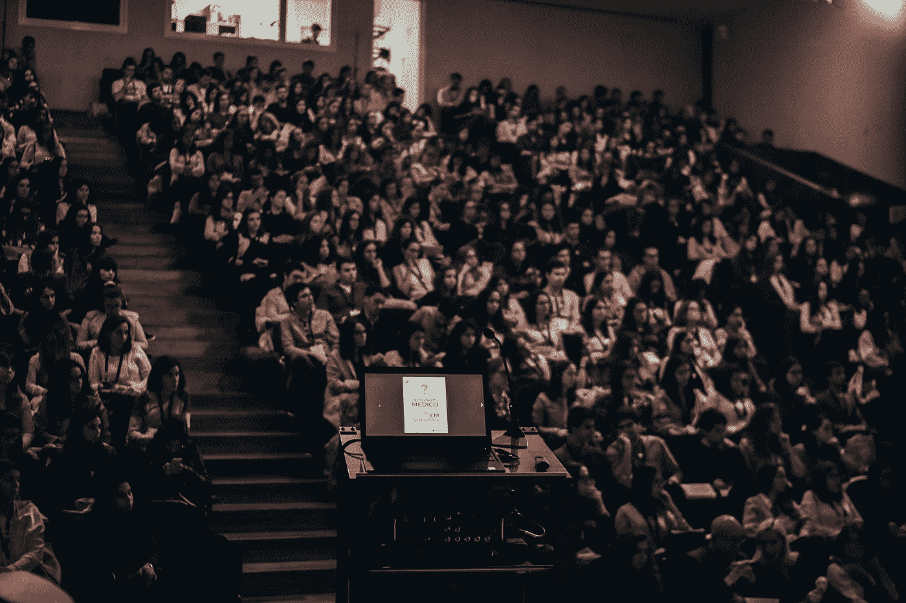

# 为什么 TED 演讲正在摧毁我们

> 原文：<https://medium.datadriveninvestor.com/why-ted-talks-are-destroying-us-4a50fbd99e7a?source=collection_archive---------6----------------------->

以及你能做些什么

Photo by [Miguel Henriques](https://unsplash.com/@miguel_photo?utm_source=medium&utm_medium=referral) on [Unsplash](https://unsplash.com?utm_source=medium&utm_medium=referral)

TED 演讲已经成为伟大思想的中心。来自各行各业的有影响力的人站在舞台上，就心理学、教育、生产力、人际关系、商业等主题发表 5-20 分钟的演讲。

看几个视频，你会觉得豁然开朗。一个研究机构的教授花了几年时间研究的东西，你在 15 分钟内就学会了。

这似乎好得难以置信。

我们认为，通过观看一些 TED 演讲视频，我们已经获得了可以在生活中使用的知识。

残酷的现实是 TED 演讲正在毁灭我们。但是为什么呢？消费内容让我们变得更健康、更聪明、更有生产力，这有什么错？

有两个主要问题，以及一个简单的解决方案。

# 问题#1 —整合

想想一个热门的 Ted 演讲是如何实现的。例如，以安吉拉·杜克沃斯关于勇气概念的 TED 演讲为例。在她的 TED 演讲之前，杜克沃斯写了一本名为*的书，在书中，她讨论了拥有激情和毅力来实现长期目标的重要性。*

*如果你在看杜克沃斯的 TED 演讲之前读了《勇气》,你会发现这本书遗漏了很多细节。杜克沃斯在 30 秒内掩盖了一些概念——同样的概念在她的书中讨论了好几页。*

*看 TED 演讲就像看一部根据书改编的电影。如果你看了《哈利·波特》电影却没有看书，你会被认为是真正有知识的人吗？*

*我会让一个不厌其烦地阅读所有书籍的哈利波特迷来判断。*

# *问题 2——缺乏思考*

*消费 TED 演讲是一种被动的体验。你观看视频，快速消化信息，然后继续你的一天。整堂课是一次完成的。*

*概念之间必须有断裂。在休息的时候，你有时间思考你学到了什么。在沉思的时候，一个人可以沉浸在讨论过的任何想法、论点或概念中。*

*TED 演讲的目的不是鼓励思考。一旦你完成了视频，你就继续你的屏幕时间，无论是检查电子邮件还是在网上冲浪。*

# *解决方法——读一本该死的书*

*是的，没错，打开一本书。与其阅读 TED 演讲，不如阅读一页纸上的文字。*

*书籍迫使你一次将一个概念延伸数周(除非你以这位女士的速度阅读)。*

*当你阅读一本书的时候，你进入了我认为的阅读-思考跷跷板。读一会儿，琢磨一会儿。多读一些，多思考一些。白天读书，晚上思考。*

> *正是沉思或自我反省的时刻，将一本书的内容印入了我们的脑海。*

***最重要的不是内容的消费，而是我们如何将这些信息内化到我们的头脑中和我们的生活中**。*

*说到深度学习，没有捷径可走。我不是说完全抛弃 TED 演讲。短包中有内容的位置。*

*只要确保 TED 演讲不会消除阅读书籍的需求。TED 演讲应该补充书籍，而不是取代书籍。*

***喜欢这篇文章吗？在这里订阅**[**Life Tweak**](https://lifetweakblog.com/about/)**并在新内容发布时得到通知。***