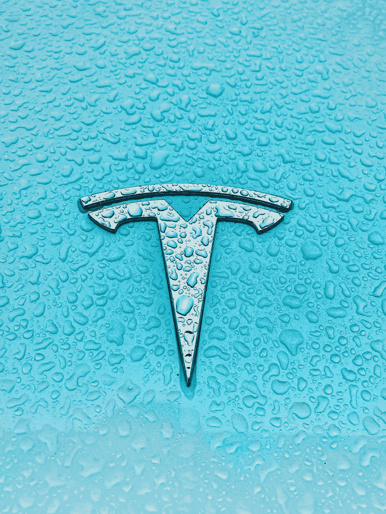

# 为什么 1，900 美元的特斯拉是“免费的钱”

> 原文：<https://medium.datadriveninvestor.com/why-tesla-at-1-900-is-free-money-90fa8a718c5a?source=collection_archive---------3----------------------->

Photo by [Priscilla Du Preez](https://unsplash.com/@priscilladupreez?utm_source=unsplash&utm_medium=referral&utm_content=creditCopyText) on [Unsplash](https://unsplash.com/s/photos/tesla?utm_source=unsplash&utm_medium=referral&utm_content=creditCopyText)

上周，我接到一个朋友的电话，他告诉我，特斯拉[TSLA](https://www.forbes.com/companies/tesla)T2 股票可能是我的致富之路。

他指出，该股最近的交易价格为每股 883 美元，但一些人正在以每股 1000 美元左右的价格购买看涨期权。如果你想知道的话，大约是 1900 美元。

“1900 美元的特斯拉是免费的，”他说。

击球手出局了吗我问。

# 特斯拉价值超过加州经济？

我那位不愿透露姓名的朋友指出，根据我[基于雅虎](https://uk.finance.yahoo.com/quote/TSLA?p=TSLA&.tsrc=fin-srch)数据的计算，如果特斯拉股票涨到 1900 美元，那么该公司将价值 1.8 万亿美元。

“这太疯狂了，”他说。关键是，这样的估值是疯狂的，尽管还有其他市值超过 1 万亿美元的科技公司。(例如，他们包括亚马逊[AMZN](https://www.forbes.com/companies/amazon)+0.2%和苹果[AAPL](https://www.forbes.com/companies/apple)-3.5%。)

他说得有道理。这样的估价怎么可能是合理的呢？

我的朋友说，不可能。

看待这个问题的一种方式是将其与加州的经济规模相比较，加州的经济规模为 3.1 万亿美元，是一些大型产业的所在地。如果说一年后特斯拉的价值可能超过世界第五大经济体的一半，那是毫无意义的。

# 以 1900 美元左右的价格卖出期权，将溢价收入囊中

这就是 1900 美元和免费资金发挥作用的地方。

他发现，将在一年多一点后到期的看涨期权的执行价格约为 1900 美元，卖得相当不错。如果股票价格在到期日超过执行价格，看涨期权将被支付。通常一份股票期权合同中有 100 份股票。

例如，2022 年 3 月 18 日 1，810 美元的认购价最近达到了每股 519 美元。

鉴于特斯拉股价上涨这么多的可能性微乎其微，购买这种股票非常昂贵。但是膨胀的成本也意味着任何有胆量以这个价格出售期权的人都可以赚很多钱。

它是这样工作的:

从你卖出期权的那一刻起，它的剩余价值就开始减少。这就是所谓的时间衰减——时间越长，价值消耗得越多。当股票期权的隐含波动率(即用于期权合约定价的预期波动率)较高时，尤其如此。简单来说，隐含波动率越高，时间衰减越快。

“一般来说，隐含波动率水平越高，θ值就越高，”[根据 OptionsEducation.org](https://www.optionseducation.org/advancedconcepts/theta)的说法。

在这种情况下，出售特斯拉期权是一件好事，因为在某些情况下，期权合约是基于异常高的隐含波动率。根据雅虎的数据，[上面列出的期权最近的隐含波动率为 332%。](https://finance.yahoo.com/quote/TSLA/options?p=TSLA&date=1647561600)

特斯拉期权[的隐含波动率目前平均为 71%](https://www.alphaquery.com/stock/TSLA/volatility-option-statistics/30-day/iv-mean) 。

或者简单地说，大多数期权的价格波动性低于 2022 年 3 月的 1810 美元。

你会通过时间衰减看到实例利润，从而能够以更低的价格回购期权吗？不，在短期内。

“这并不意味着投资者可以出售高隐含波动率股票的期权，并期望立即赚取时间衰减，”Options Education 表示。

但从长远来看，可能是的。

这个想法是，你以 51，900 美元(519 * 100 股)的价格卖出一份期权合约，然后看着时间推移这个价值下降。你要么以更低的价格回购期权，要么让它一文不值地到期。

# 出售特斯拉期权风险很高

不过，如果你决定出售到期日较长的看涨期权，那么你应该明白这是一项高风险交易。你失去的可能远远超过卖出期权所得的价值，因为特斯拉股票的价格理论上可能会升至无穷大。

这是 2021 年 1 月 25 日首次发表在《Forbes.com》上的一个故事的编辑版本。

[**成为中等会员，再也不会错过伟大的故事**](https://medium.com/@simonconstable/membership) **。**