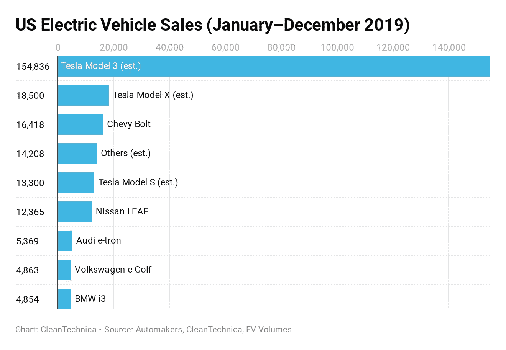
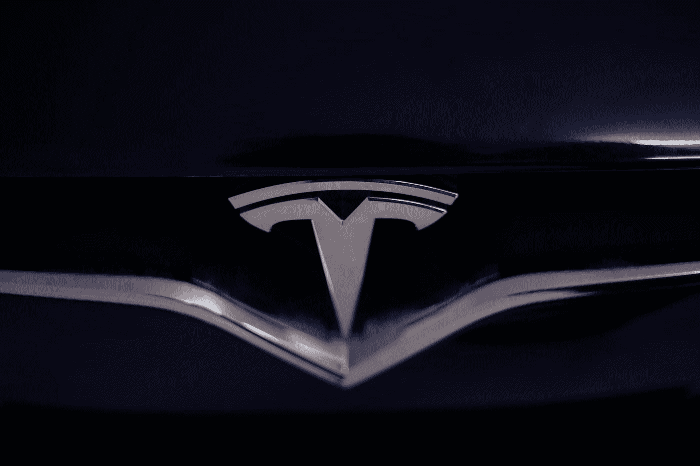

# 为什么特斯拉将是我下一个 15 年的投资

> 原文：<https://medium.datadriveninvestor.com/why-tesla-is-going-to-be-my-next-15-year-investment-3f3d84381ca9?source=collection_archive---------3----------------------->

## 以及埃隆·马斯克如何让所有竞争对手落后 10 年。

Photo by [Vlad Tchompalov](https://unsplash.com/@tchompalov?utm_source=medium&utm_medium=referral) on [Unsplash](https://unsplash.com?utm_source=medium&utm_medium=referral)

股市现在完全疯了！

在这种疫情环境下，很难找到好的交易。在实体经济萎靡不振之际，标准普尔 500 正达到历史最高水平。

罗宾伍德和 M1 金融公司因为新的投资者而欣欣向荣。他们中的一些人从赌场休息室直接来到股市应用程序。

美联储继续通过量化宽松政策向市场放血，杠杆化股票，削弱美元。

世界各地都出现了新的新冠肺炎病例，这让我们认为这种病毒还会存在一段时间。

所以，作为一个投资者，我什么也没做，一直在观察所有的动向。我的投资组合还是 6 个月前的样子。

但是一些新的东西正从所有的混乱和噪音中升起。我不想错过它，否则 15 年后我会后悔的。

# 技术颠覆

当杰夫·布斯还是个孩子的时候，他的父母问他，假设一下，他是喜欢当场赚一百万美元，还是喜欢在 31 天内每天翻倍的一便士。当然，他犯了和其他人一样的错误。他无法想象，像一便士这样的小东西，随着时间的推移，会变得如此之大。

事实上，在短短的 31 天内，一便士翻了一番，变成了 10，737，418.24 美元。在那次教训之后，他确信他再也不会犯那个错误了。

大多数人都知道摩尔定律。英特尔的联合创始人戈登·摩尔在 1965 年发表在*电子*杂志上的一篇文章中描述了我们现在所称的摩尔定律。他认识到，印刷电路板上的晶体管数量每年翻一番，而且至少在未来十年内还会如此。他后来扩展了这一预测，并对其进行了修正，称每两年翻一番的情况还会继续。随着摩尔定律在过去五十年中的发展，实际上大约每十八个月就会翻倍。除了计算能力翻倍之外，我们预计性能每年会下降 21%。

 [## 2020 年最佳短期投资选择精选资源|数据驱动型投资者

### 投资是增加你净财富的一个好方法。如果你通过遵循一个严格的…

www.datadriveninvestor.com](https://www.datadriveninvestor.com/2020/03/28/handpicked-resources-for-the-best-short-term-investment-options-of-2020/) 

这种结合带来了显著的收益。例如，根据*计算机世界*杂志，一兆字节硬盘存储器的成本已经从 1967 年的大约 100 万美元下降到今天的 2 美分。正如杰夫·布斯所说:

> 我们今天在周围看到的所有进步都要归功于过去的双打。18 个月后，计算能力将再翻一番，与此同时，我们过去 50 年所拥有的一切将翻一番。之后的 18 个月到 2 年，又会翻倍。

所有的数字化也创造了一些令人印象深刻的数据捕获，比我们意识到的要多得多，从联网的计算机、人、相机和传感器收集数据才刚刚开始。

即将出现的发展会使我们现在所拥有的看起来很原始。如果感觉很难跟上今天的进度，那就等着接下来的 18 个月吧。

Photo by [Bram Van Oost](https://unsplash.com/@ort?utm_source=medium&utm_medium=referral) on [Unsplash](https://unsplash.com?utm_source=medium&utm_medium=referral)

# 自动驾驶汽车

经过 15 年前的第一次尝试，自动驾驶汽车进入我们行业的时间越来越近。

2019 年初，大部分上路的汽车还处于 1 级(大部分系统仍由驾驶员控制)。只有 Testa 达到了级别 2(驾驶员可以同时脱离转向和加速/减速)。

特斯拉和奥迪(A8)很可能很快就会达到第 3 级自治(如果收到警报，驾驶员仍然需要控制，但不再需要驾驶员在之前的级别中所需的注意力)。

随着所有研究和投资预算的加速，第 4 级自治(这是完全自治的第一级)应该在 2025 年上路。

未来汽车的进入和使用将会发生巨大的变化。汽车的拥有者只在 5%的时间里使用他们的汽车。因此，买一辆车，并允许他人使用它来帮助我支付我所拥有的资产，将成为现实。有了这些选择，汽车的使用率在未来几年应该会增加。也意味着对汽车制造商的需求减少。

汽车公司需要改变他们的商业模式。最有可能的是，他们将把汽车作为一种服务选项来销售，类似于今天 SaaS 在技术交付方面的模式。

# 2020 特斯拉*杀手*

特斯拉应该担心所谓的 T *esla 杀手*吗？在未来的某个地方，他们会来到这个市场与公司竞争。

然而，它们中没有一个能威胁到特斯拉的业务。该公司一直受益于*先行者的优势*，他们每个人都一直在努力在价格、性能、技术或所有这三方面赶上他们。

特斯拉正在转向更实惠的电动汽车，尽管高性能电动汽车面向大众市场。像 Model 3 轿车，Model Y 跨界车，还有新款 cibertruck。

Model 3 以 208，265 辆的销量完全超过了 Model S 和 X，而 S 和 X 的销量为 47，296 辆。

关于竞争，让我们从两款更贵的*特斯拉杀手*开始，它们被称为奥迪 E-Tron 和捷豹 I-Pace，都已经上市。

奥迪 E-Tron 是他们的首款电动跨界 SUV。这是一辆非常吸引人的车。但这款漂亮的 SUV 起价 74800 美元，仍有约 204 英里的续航里程。如果你将它与 Model 3 相比较，它的起步价为 40k，续航里程为 250 英里，或者 Model Y 的起步价为 48k，续航里程为 280 英里。离成为*特斯拉杀手*还差得很远。

捷豹 I-Pace 获得了 2019 年世界年度汽车、年度设计、绿色汽车和欧洲年度汽车。它的起价为 69，850 美元，续航里程为 234 英里。所以，我觉得你也没法和特斯拉的数字比。

让我们试着在市场上找到更便宜的电动车。也许我们能找到真正的*特斯拉杀手*。

我们听到最多的两种电动汽车是雪佛兰 Bolt 和日产 Leaf。雪佛兰 Bolt 售价 36，550 美元，续航里程 226 英里。日产 Leaf 售价 29，990 美元，续航里程为 150 英里。

就价格(40k 对 37k)和范围(250 对 259)而言，雪佛兰 Bolt 可能是最接近 Model 3 的选择。虽然，如果你看看 2019 年前两个季度的销量，特斯拉 Model 3 售出了 111，650 辆汽车，而雪佛兰 Bolt 售出了 13，111 辆。有可比性吗？

Image from @cleantechnica

# 特斯拉将如何扩大电池产量

大约一年前，特斯拉以大约 2.18 亿美元的价格收购了一家名为 Maxwell Technologies 的公司。麦克斯韦在 20 世纪 60 年代被发现。他们创造了超级电容器。超级电容器是一项快速发展且应用日益广泛的技术，能够非常快速有效地储存和释放能量。超级电容器是一种主要能源的补充，可以重复提供快速的动力爆发，如内燃机，燃料电池或电池。

特斯拉汽车会在车上安装超级电容吗？号码

当麦克斯韦尔开发超级电容器时，他们找到了一种生产锂离子电池的新方法。和特斯拉的一样，但是现在他们有了一种更好、更便宜、更可靠的方法来生产它们，这种新技术叫做**干电池电极**。

特斯拉对这种新的细胞生产方法非常着迷，因为它可以解决公司目前面临的许多限制。这不是一种新的电池，而是一种制造电池的新方法。也不是有一个电池就能解决你的额外里程。是关于量产效率的。更快更便宜。

特斯拉正在测试它，显然足够确信这种突破性的电池生产实际上是合法的。如果通过收购 Maxwell，您能够以 2.18 亿美元的成本生产数十亿块电池，您可能会在几个月或几年内看到我们的投资回报。

特斯拉首席执行官埃隆·马斯克(Elon Musk)通过推特宣布，电池日和年度股东大会预计将于 9 月 15 日举行。他还说，这次会议将包括参观细胞生产工厂。

此外，特斯拉可能很快就会有一种可以续航 100 万英里的电池。低成本电池可以持续使用 100 万英里，并使电动特斯拉以相同或低于汽油车的价格销售利润，这是马斯克议程的一部分。

特斯拉的新电池将依赖于新技术，如低钴和无钴电池化学物质。化学添加剂、材料和涂层的使用将降低内应力，使电池能够更长时间地储存更多的能量。

Photo by [Afif Kusuma](https://unsplash.com/@findracadabra?utm_source=medium&utm_medium=referral) on [Unsplash](https://unsplash.com?utm_source=medium&utm_medium=referral)

# 真正的竞争战——价格

特斯拉有着和世界上另一家大公司非常相似的东西。[苹果](https://apple.co/2Pqm72O)。两者都有品牌力。像苹果一样，特斯拉也有这个庞大的粉丝俱乐部，他们入侵社交媒体平台，为公司带来正能量。苹果也有同样的东西。很难解释，但更难触及。设计是两家公司最重要的特点。还有技术进步。

这就是为什么我一直从长期角度买入苹果。这也是我打算在未来 15 年开始购买特斯拉的原因。

但是，仅仅凭借品牌力量，我们无法在财务上取得成功。那么，记住什么也很重要呢？价格。

与苹果不同，苹果一直以比竞争对手更高的价格出售他们的设备，特斯拉希望通过价格、技术和设计击败竞争对手。此外，作为一家公司，特斯拉有更广泛的议程。他们不只是在一个类别中竞争，因为特斯拉不是一家汽车公司。你听到了吗？

> 特斯拉不是一家汽车公司

那么，我们应该将特斯拉与福特或通用进行比较吗？宝马还是奥迪？

特斯拉是一家科技公司，能源公司，电池公司，运输公司，保险公司。

这就是为什么没有人能真正评价公司。几个月前，我开始深入分析特斯拉。阅读和观看所有关于这家非凡公司的纪录片。我也读过埃隆·马斯克的传记。我发现埃隆无处不在。他在为我们的未来做准备。他在思考可再生能源和服务的封闭循环，这些资源和服务可以在全世界的封闭链中循环。

这就是为什么特斯拉不是一家汽车公司。这就是为什么你根本无法与任何汽车公司相比。

Photo by [Austin Distel](https://unsplash.com/@austindistel?utm_source=medium&utm_medium=referral) on [Unsplash](https://unsplash.com?utm_source=medium&utm_medium=referral)

# 到 2030 年，特斯拉价值 1 万亿美元

有很多人仍然相信[停滞谬误](https://bit.ly/3gkM7rr)。他们相信事物会永远保持原样。

这在 2020 年简直不可思议。

所有的[技术颠覆](https://bit.ly/2COJYq7)都出现在人们眼前，难道人们对这一巨大变化的信任还不够吗？

驾驶特斯拉真的是一种独特的体验。有几个报道说有人从保时捷快速转向特斯拉。他们说这是一种完全不同的体验。我相信是的。因为 Testa 不是车。这是车轮上的技术。

但是特斯拉到 2030 年会达到 1 万亿美元吗？这家公司的价值将永远取决于他们卖出多少辆汽车。他们每辆车能赚多少利润。他们会从电池生意中获利多少。公司 CEO 的最后一条推特是什么并不重要。这就是数字说话的地方。

特斯拉可以在未来几年内将电池转化为价值 50 亿美元的业务。价值 50 亿美元的汽车产业。该公司的收入复合增长如此之快，以至于即使是最优秀的亿万富翁之一罗恩·巴伦也在这个非常有启发性的采访中给出了一些客观数据。他认为，到 2030 年，15%的运营利润率和 1500 亿美元的收入将使特斯拉成为一家价值 1 万亿美元的公司。巴伦制定了从 2030 年到今天的框架，这是一个非常聪明的思考未来收益的方式。

特斯拉能登上世界前三大公司的领奖台吗？埃隆·马斯克和他的团队有能力实现这个目标吗？

马斯克和贝索斯或乔布斯一样，都是一个有远见的人。用特斯拉的电池技术给交通工具和电力系统充电是一个巨大的机会。这也是一个巨大的挑战。有很多问题要解决。但是这些家伙不是把所有的问题都当成了机遇吗？

> 问题越大，机会越大

在向世界证明他们是正确的之前，这些远见者面临了多少死胡同？

马斯克现在正在走向这个转折点。特斯拉正在变成一家盈利的公司。标准普尔 500 榜单的管理者，T2 标准普尔道琼斯指数公司有一条规则，新公司在加入之前必须在最近一个季度和过去一年盈利。随着最近的收益，特斯拉刚刚越过了这条线。

特斯拉可能是标准普尔 500 第 17 大公司，指数权重为 0.8%，介于贝宝和辉瑞之间。对于指数共同基金和交易所交易基金的经理来说，这将是一件大事。按照特斯拉目前的价格，被动基金的经理将不得不出售约 350 亿美元，以形成一个足够大的洞来购买特斯拉股票。

# 他们还没有尝到真正的痛苦

泰斯拉在他们幼年的 10 到 15 年里都在完全的痛苦中度过。他们没有盈利。它们在汽车工业中并不重要。没有人相信它会成功。

我认为，大多数汽车公司仍然否认技术的破坏，因为他们知道痛苦会比特斯拉更严重。

为什么？因为他们将不得不放弃他们 30 年来的成功模式业务，只为了在下一个 30 年里生存下去。这对任何汽车公司来说都是一个艰难的决定。

Photo by [Riccardo Annandale](https://unsplash.com/@pavement_special?utm_source=medium&utm_medium=referral) on [Unsplash](https://unsplash.com?utm_source=medium&utm_medium=referral)

我们使用能源的方式将会发生巨大的变化。从好的方面来说，我们将拥有世界上最好的公司来解决地球上最重要的问题。停止燃烧化石燃料。

解除能源管制，将世界上的每一个人都变成能源的微型生产者。低价购买软件和电池。这将是每个人生活中的一个巨大转变。

特斯拉过去 15 年的投资终于变成了一件好事。有那么多人批评方法，技术，埃隆·马斯克这个人。这么多小时的 Youtube 视频，人们争论和怀疑特斯拉的成功。这么多人解释特斯拉是怎么走向破产的。

15 年后的今天，特斯拉证明他们错了。埃隆·马斯克不仅仅是一位梦想家，他还是一位优秀的领导者和首席执行官。

就像苹果和微软这两只我会在未来 15 年继续买入的股票一样，我也将开始买入特斯拉的股票。

颠覆性技术已经出现，而且正处于转折点。可能是疫情危机推动了这一趋势。但是任何重大事件都会这样。我坚信，技术将会像工业革命在过去 100 年里所做的那样，改变我们未来的 15 年。

我不会错过投资这些公司的机会。通过投资这些转型范例。

我将继续投资未来！

你呢？

本文仅供参考，不应视为财务或法律建议。在做任何重大财务决定之前，先咨询财务专家。

**访问专家视图—** [**订阅 DDI 英特尔**](https://datadriveninvestor.com/ddi-intel)