# 为什么认为比特币有可能在 2020 年复苏。

> 原文：<https://medium.datadriveninvestor.com/why-the-belief-of-a-recovery-is-possible-in-bitcoin-61fbc2fd89b2?source=collection_archive---------20----------------------->

回到 2013 年 12 月，比特币达到了约 1200 美元的相对历史高点。认为互联网假钞的价值如此之高简直是疯了。就在比特币达到最高点的一年前，它的价值为 10 美元…这是一年内的 120 倍。

这让我难以置信，因为四年后。比特币达到了约 20，000 美元的历史高点。但是，对于今天的分析，我们对画出连接高点的线不感兴趣。或者，在图表中寻找三角形。今天我们感兴趣的是高点之间发生了什么。

 [## 总部位于瑞士的 ETP 进入加密交易市场|数据驱动的投资者

### 虽然金融市场几乎没有沉闷的时刻，特别是在引入…

www.datadriveninvestor.com](https://www.datadriveninvestor.com/2019/03/10/swiss-based-etp-enters-the-crypto-trading-market/) 

这几乎是好像；他们已经将这些周期编码到比特币的核心中。但这是另一篇文章的主题。今天，我将分析 2013/2014 年 BTCUSD 1D 比特币图表上与 50 毫安和 200 毫安相关的价格行为，并告诉你这对 2020 年的比特币意味着什么。

让我们从观察蜡烛以及它们对 50 毫安和 200 毫安的反应开始。

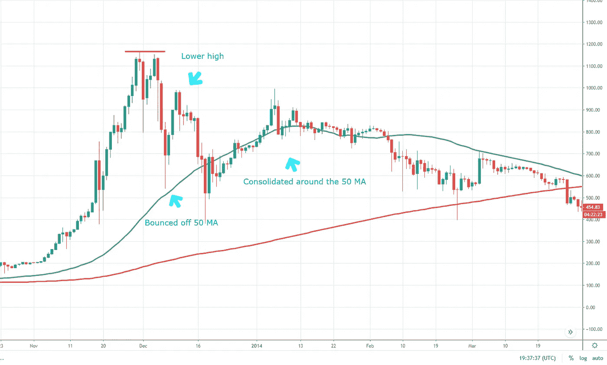

BTCUSD 1D 2013/2014

我注意到的第一件事是，在相对较高的 1200 美元之后，比特币迅速回撤至 50 毫安，并有一只死猫从该水平反弹。然而，我们未能继续走高，形成了一个较低的高点。然后我们回到 50 毫安，并围绕该线整理。

在该均线附近停留了大约一个半月之后，比特币跌破了该均线。价格介于 50 毫安和 200 毫安之间。价格试图重新测试 50 毫安，但它拒绝了我们。

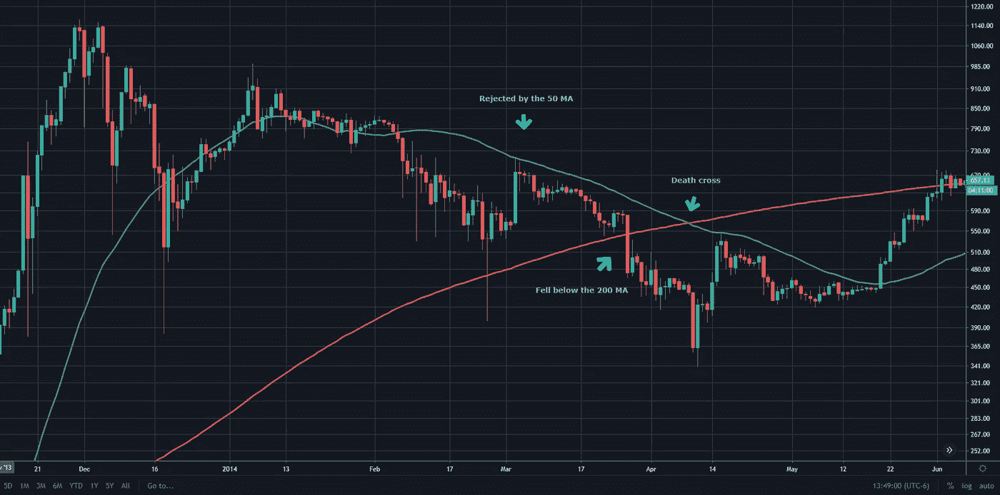

December 2013 — June 2014

在比特币从 50 毫安时被拒绝后，我们跌破了 200 毫安时，著名的死亡交叉发生了。这证实了市场情绪已经转变。曾经光明的牛市变成了血腥的熊市。

比特币在我们突破之前两次重新测试了 50 毫安。当我们终于突破时，它在 200 毫安时拒绝了我们。从那时起，空头控制了市场。

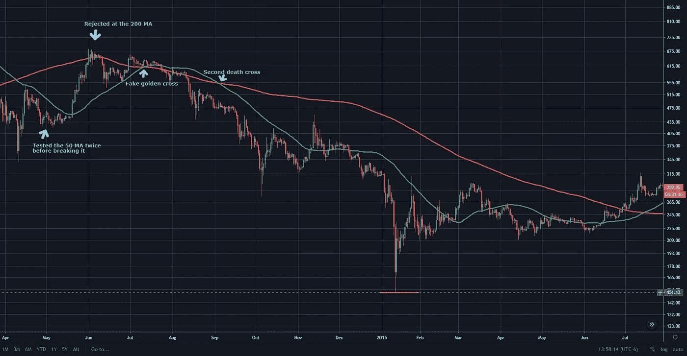

April 2014 — July 2015

比特币又经历了一次死亡交叉。从这一点来看，蜡烛线将保持在 50 毫安以下，偶尔打破它，但很快回落到它以下。比特币将顺着这一趋势跌至约 150 美元的低点。

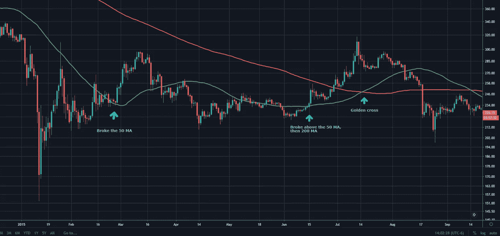

January 2015 — September 2015

比特币再次保持在 50 毫安以下，在突破之前测试了两次。此后，它横向移动到 50 毫安以上，然后在 50 毫安以下。比特币再次突破了 50 毫安，随后又突破了 200 毫安。价格回升，导致黄金交叉。这是市场内部情绪的又一次转变。再次带来比特币的希望。

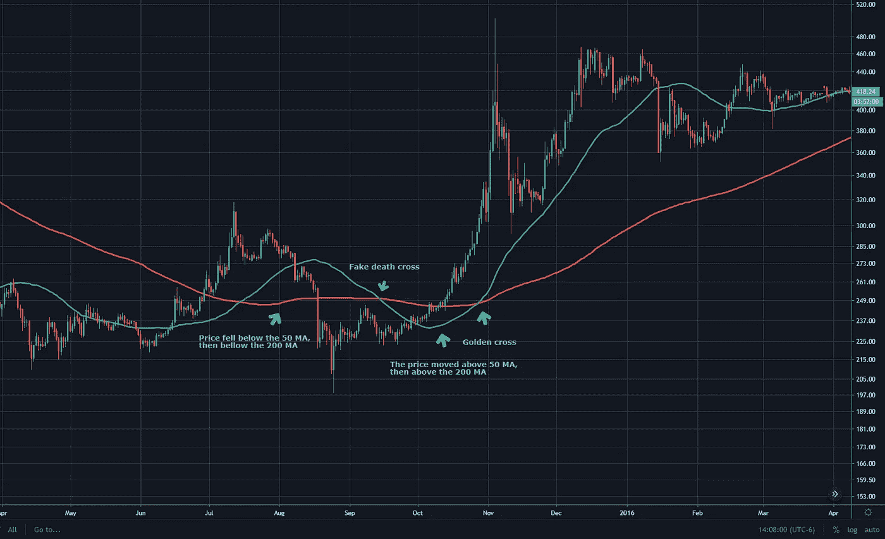

April 2015 — April 2016

除了，意想不到的事情发生了。比特币再次跌破 50 毫安，随后不久又跌破 200 毫安。它形成了一个更高的低点，并横向移动了一段时间。这又造成了一次死亡交叉。价格没有下跌，相反；它突破了 50 毫安和 200 毫安，继续上涨。

这导致了另一个黄金交叉，并证实了将比特币价格推高至 20，000 美元的牛市。在 2017 年 12 月创下 20，000 美元的历史新高后，比特币将不会跌破 200 毫安，直到下一次熊市发生。

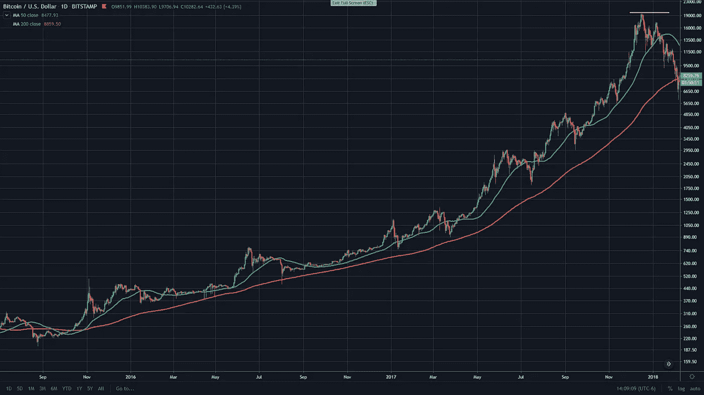

September 2015 — January 2018

现在让我们看看比特币达到约 20，000 美元的历史高点后发生了什么。

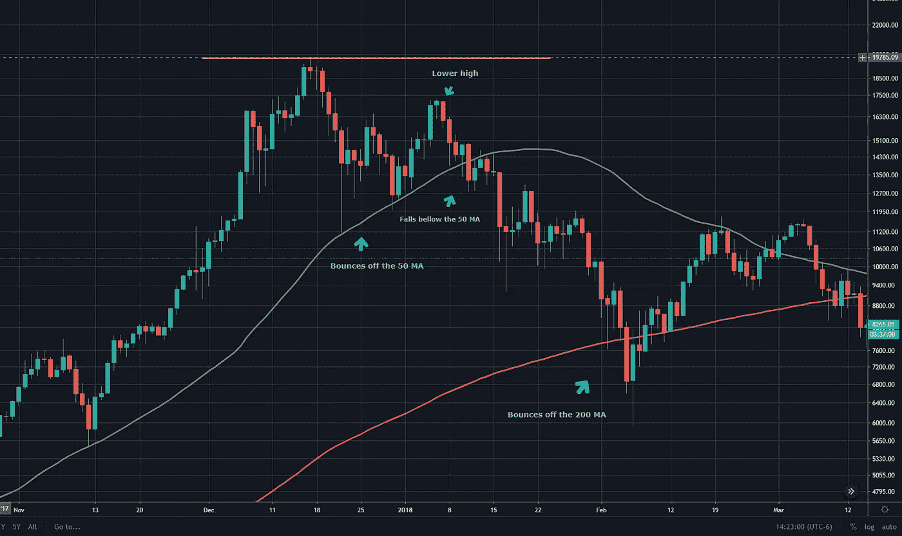

March 2017 — March 2018

从图表中，我们可以看到 2013/2014 年出现的相同模式。比特币的价格达到历史最高水平，然后迅速回落到 50 毫安。此后，价格从 50 毫安反弹，但价格不能恢复到前一个高点，形成一个较低的高点。

在我们未能冲高后，比特币的价格跌破了 50 毫安。这使得测试 200 毫安的价格下降。同样，就像我们在 2013/2014 年看到的那样，价格从这个水平反弹到 50 毫安。

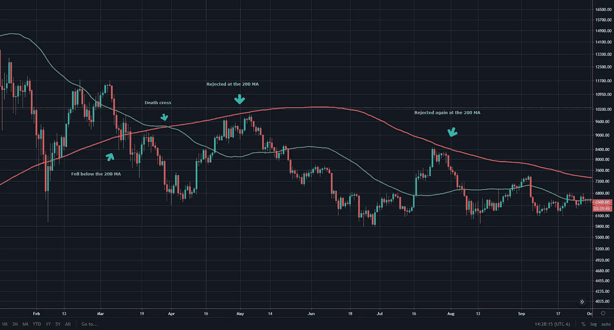

February 2018 — September 2018

比特币在 50 毫安时被拒绝，并进一步下降到 200 毫安以下。情绪再次转变，这是血腥熊市的开始。就像 2014 年的死亡交叉事件一样。比特币的价格将保持在 50 毫安以下。偶尔，比特币的价格会突破 50 毫安。如果发生这种情况，价格将在 200 毫安时被拒绝，并回落到 50 毫安以下。

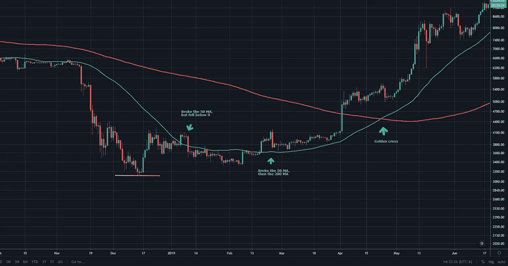

November 2018 — June 2019

在 50 毫安以下盘整数月后，比特币最后一次跌至约 3100 美元的低点。这一趋势与我们在 2014 年看到的惊人地相似。比特币再次从低点反弹，重新测试 50 毫安。就像价格突破了均线，然后又跌回了均线以下。

然后，我们有一个单一的绿色蜡烛直接突破 200 毫安。这再次改变了市场情绪，结束了血腥的熊市，并让市场产生了怀疑。我们继续涨到大约 14，000 美元。这让我问了很多问题。

我不认为这次复苏是意料之中的。人们非常担心会错过市场。这是对错过比特币下一轮大反弹的担忧。叫价 1000-2000 美元比特币的人以更高的价格涌入。

这导致人们猜测比特币会像这样测试新的历史高点。贪婪驱使价格如此之高。记住这一点，我们就能了解下一个周期将进入市场的贪婪。将比特币送上天文数字的水平。结果，很多人会变得贪婪，损失很多钱。

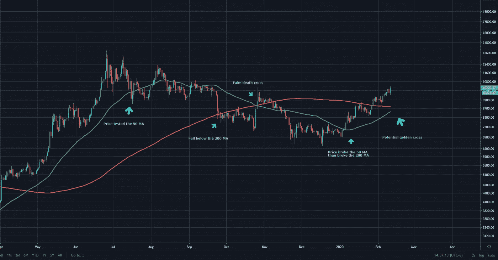

May 2019 — February 2020

回到分析。我们看到的是比特币的价格再次下跌，并在 50 毫安时找到支撑。然后反弹形成一个较低的高压。我们随后跌破 50 毫安，并在 50 毫安以下盘整，直到我们跌破。

我们最终跌破了 200 毫安，这导致了市场的死亡交叉。但是等一下……2014 年我们不是看到这种情况发生了吗？是的，就是这件事。我们在 7100 美元附近反弹，重新测试 200 毫安。再次，我们被拒绝发送我们到更低的低点，形成底部约 6500 美元。

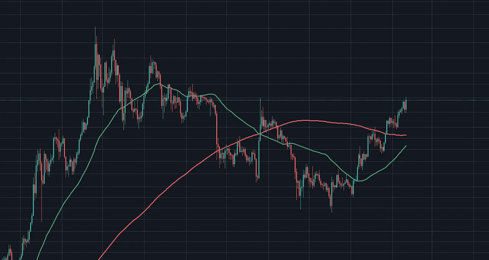

June 2019 — February 2020

那么，我们现在在哪里？我们现在高于 50 毫安和 200 毫安。在接下来的一周，我们将会看到臭名昭著的金十字架。这将确认我们的下一次反弹。过去的这次反弹通过华尔街的小抄(市场心理学)结束了我们 3 到 4 年的周期。

*“过去的表现并不能保证未来的结果。”*

过去无法告诉我们比特币的价格会有多高。它不会告诉我们它什么时候到达那里。它能告诉我们的是，动量何时重新进入市场。这就是我认为比特币价格相对于这两条移动平均线的特殊之处。

从 2013 年和 2014 年发生的事情来看，我可以 90%肯定地说。比特币处于市场心理的希望阶段。过一会儿，市场上的大多数人都会相信比特币有可能复苏。

我希望你喜欢阅读这篇文章！如果你喜欢这篇文章，请在 medium 上关注我，为这个故事鼓掌:)

最诚挚的问候，

本杰明