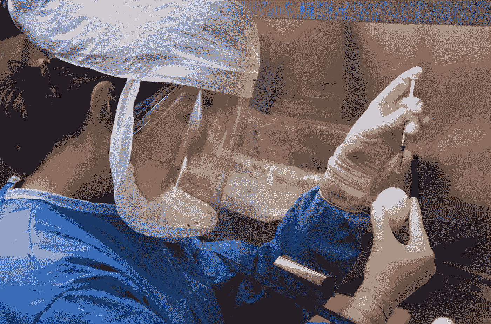
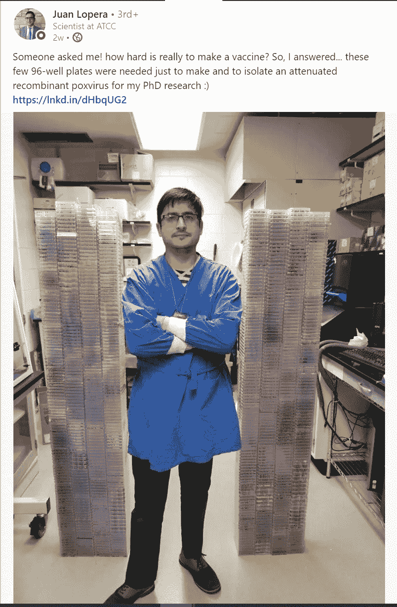
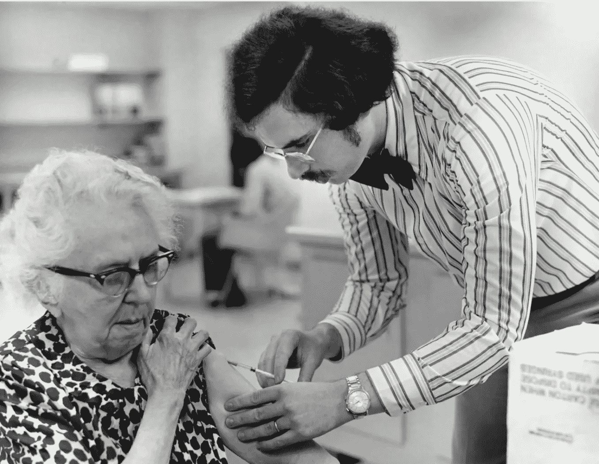
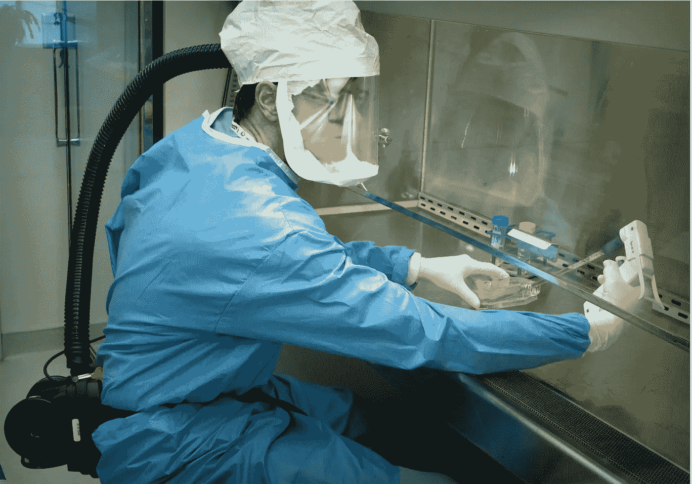

# 为什么 COVID19 疫苗需要这么长时间才能开发出来？

> 原文：<https://medium.datadriveninvestor.com/why-the-covid19-vaccine-is-taking-so-long-to-be-developed-4559144516?source=collection_archive---------14----------------------->

当我们可以在一周内建立一个应用程序，在一天内建立我们的网站，在 20 分钟内给我们的手机充电，为什么疫苗需要 15 到 20 年？

@cdc- Unsplash

我们都被隔离了足够长的时间，遵循社会距离，除了食品杂货或紧急情况外，不走出家门。但是尽管已经做了几个月了，新闻上到处都是。世卫组织宣称我们必须学会与科罗纳共处。我们都被告知，在这场疫情疫情中幸存下来的最佳选择之一是通过使用疫苗获得免疫力。但可悲的是，特朗普说疫苗还需要 12-18 个月！

> 在给《连线》的一份声明中，斯坦福健康传播倡议主任 Seema Yasmin 博士说，“当专家乐观地说他们预计到 2020 年底会有新冠肺炎疫苗时，他们谈论的是紧急使用授权疫苗，而不是完全批准的疫苗，”他说

Yasmin 说:“没有人能肯定地说新冠肺炎疫苗什么时候会出现，因为疫苗的开发分为几个阶段，每个阶段的时间表都有很大的变化。”。“我们以前开发最快的疫苗是腮腺炎疫苗，而这花了四年时间。开发一种疫苗通常需要 10 到 15 年。所以 12 到 18 个月将会打破纪录。”

这是一个常见的问题。为什么在实验室开发疫苗需要这么长时间？ ***我有一张图片可以让你了解制造疫苗的过程。***

LinkedIn Post

目前有 100 多种疫苗正在开发中，以对抗 COVID19。其中只有 3 或 4 个在临床试验中，并在人体上进行测试。在所有这些疫苗中，[一种由牛津开发的超级疫苗 ChAdOx1 nCoV-19 跳过了临床试验。顺便说一句，这是学术和制药界的一场豪赌，它直接从动物试验转向市场生产。目前，世界各地的公司正在生产一百万单位的这种疫苗投放市场。](https://medium.com/datadriveninvestor/why-oxfords-super-vaccine-seems-to-be-ahead-in-the-race-against-covid19-a5511aba84bd)*[***你可以在这里看到关于疫苗的详细信息。***](https://medium.com/datadriveninvestor/why-oxfords-super-vaccine-seems-to-be-ahead-in-the-race-against-covid19-a5511aba84bd)*

*制造疫苗一直是一个单调乏味的过程，下面是一步一步的分解。*

## *№1 —找出我们正在处理的病毒或细菌的基因序列。*

*这是科学家以破纪录的速度完成的。目前，所有国家的科学家都知道 COVID19 的基因组序列。这一过程在一些国家(如法国)需要 3 天时间，而在另一些国家(如印度)需要几周时间。*

*每一个生物体都是由核苷酸序列组成的，核苷酸序列帮助生物体发挥功能。为了理解 COVID19 结构、蛋白质和功能的不同部分，这是必不可少的第一步。*

**

*@cdc- Unsplash*

## *№2 —开发疫苗*

*这可以通过不同的方式来实现，具体取决于正在使用的病毒。*

1.  *早期的策略是将一种较弱的病毒直接引入受试者体内。然而，如果病毒传染性太强或效力太强，就会对病人有害，就像冠状病毒一样。*

*这种方法很快，但在 COVID19 的情况下非常不安全。因为这种病毒的效力以及我们对它的了解。*

*2.另一种方法是将病毒引入另一种动物体内，也许是兔子或马，这种方法过去被使用过，现在仍然用于治疗蛇咬伤。然后使用动物产生的抗体，将其引入已经受到疾病影响的患者体内。这是一种抗体治疗。*

*而抗体治疗已经在进行中。但是必须分离出必要的抗体，这本身就很耗时。可能需要几个月或几年。身体产生数千种不同的抗体。人们必须从成千上万的抗体中分离出最有效、最相容的抗体。考虑到单个抗体实验可能需要一个月的时间。形成数以千计抗体肯定是一个漫长的过程。*

*3.目前，一种更安全但复杂的技术被用于开发疫苗。导致感染的病毒的某一部分被引入体内，这可能是其表面的蛋白质刺突或其遗传序列的一部分。*

**

*@cdc- Unsplash*

*这在体内引起对温和反应的反应，导致产生对抗外来蛋白质的抗体。这些抗体是人体为对抗病毒而产生的免疫力。*

*这是一个多步骤的过程。*

1.  *首先，我们分离病毒序列。*
2.  *接下来，找出是哪个部分导致了感染——是哪个蛋白质或刺突还是受体或表面分子。经过反复试验，你找到了正确的选择。*
3.  *下一步，在有数百万种可能性的 30000 个碱基对序列中，我们必须找到哪个特定的序列编码传染性部分。这种代码可能不在一个地方，可能是一个组合，可能在不同的地方，可能只在宿主细胞内激活。*
4.  *现在我们必须了解它是如何与宿主细胞结合的。*
5.  *经过所有这些步骤，我们终于了解了病毒的功能。*
6.  *我们现在需要了解如何将病毒引入体内，以一种不使人休克或死亡，但能产生足够强的反应使身体检测到它的方式。*
7.  *病毒部分必须被隔离，正确导入，反应必须被判断，这在大多数情况下因人而异。*

*这些步骤中的每一步都需要一个月甚至一年的时间来标准化。想象一下，完美地完成这些步骤中的每一步，这可能需要几年时间，乐观地说，需要 5 年时间。人们花了整个博士学位来研究一种病毒的单一蛋白质，这大约需要 4 年时间，而我们希望在几个月内研制出疫苗。这是在祈求奇迹。*

## *№3 —真正的审判*

*但是这里有一个问题——所有这些步骤都不能在人类身上完成。首先，它们必须在实验室培养皿中的细胞上进行安全测试。一旦他们成功了，他们就会在动物实验中进行测试。这又需要几年时间。一旦他们成功了。*

*他们在志愿者身上进行测试。在人体试验中。到目前为止，大多数疫苗还没有达到人体临床试验的这一阶段。*

*最后一步是在更大的人群中进行试验。*

*这三次试验中的每一次都需要几年时间。假设每次审判要花 2 年时间，我们已经花了 6 年时间。*

*在这个过程中总共损失了 11 年。*

## *№4 —政府批准*

*不同国家的政府需要不同的时间，然而，官僚主义和繁文缛节并没有使这一批准成为一项简单的任务，根据紧急程度，可能需要几个月到几年的批准时间。*

*这是对制造一种简单的疫苗并以有用和有效的形式提供给人们并得到你们国家政府完全批准所需的年数的一个快速估计。*

*参考*

*1.[https://www . Henry Ford . com/blog/2020/04/why-it ' s so long to-create a-vaccine](https://www.henryford.com/blog/2020/04/why-does-it-take-so-long-to-create-a-vaccine)*