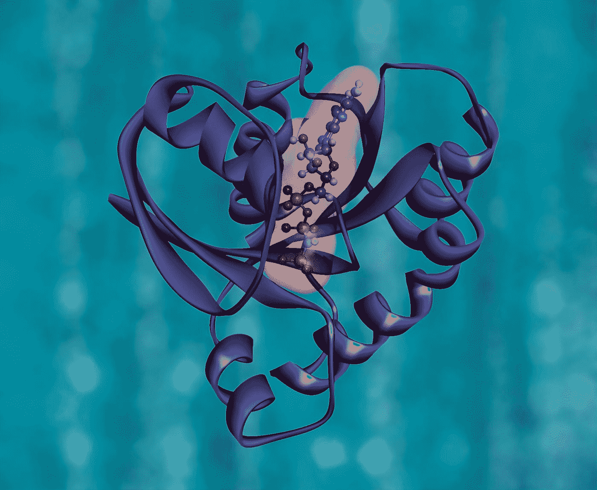

# 为什么治愈镰状细胞病对我们所有人都至关重要

> 原文：<https://medium.datadriveninvestor.com/why-the-cure-for-sickle-cells-is-vital-to-all-of-us-6035be015e79?source=collection_archive---------18----------------------->

## 科学与未来

## 基因编辑是一项颠覆性的技术，引领我们走向延长寿命

Photo by [National Cancer Institute](https://unsplash.com/@nci?utm_source=medium&utm_medium=referral) on [Unsplash](https://unsplash.com?utm_source=medium&utm_medium=referral)

> “未来就像一条走廊，我们只能通过背后的光线才能看到它。”― **小爱德华·怀尔**

一次性基因编辑治疗正在取代终生痛苦的传统治疗。

这就是 [Victora Grey](https://www.wjhl.com/news/national/gene-editing-treatment-shows-promise-for-sickle-cell-disease/) 的情况，她在 2019 年 7 月接受了使用镰状细胞基因编辑工具 CRISPR 的试验治疗。不再需要止痛药，也不再需要定期输血。

据研究人员称，虽然对其他患者的测试仍在进行中，但这种基因编辑技术正在如预期的那样工作，没有意外的影响。一次性治愈这种极其痛苦的遗传性血液疾病看起来很有希望。

这对我们所有人意味着什么？

**颠覆性的月球探测技术**取代传统的医疗保健方法，就在我们眼前。

> 这可能意味着通过治疗和预防严重的终身疾病，寿命将呈指数增长。很快。

首先，让我们对镰状细胞病、基因编辑和 CRISPR 有一个基本的了解——它们是什么，它们是如何工作的。这对于理解和预测我们在医疗保健领域的发展方向，以及由基因编辑引起的医疗保健发展将如何改变我们自己的生活，让我们有机会活得更健康、更长寿非常重要。

## 镰状细胞:一种遗传疾病

华盛顿特区霍华德大学镰状细胞病中心主任詹姆斯·泰勒说，镰状细胞病是最可怕的疾病。

镰状细胞病影响了数百万人，包括在美国的大约 10 万人，大部分是非洲裔。现在唯一的治疗方法是从没有像兄弟姐妹一样患病的密切匹配的捐赠者身上进行骨髓移植，这是大多数人都没有的。随着时间的推移，这种疾病会恶化，并可能导致感染、器官损伤、失明、中风和早期死亡。

镰状细胞是一种遗传性血液疾病，其中有缺陷的血红蛋白导致变形的新月形血细胞，不能很好地携带氧气。它们会粘在一起，堵塞小血管，导致疼痛、器官损伤和中风。患有镰状细胞病的人经常因为这些疼痛而住院，许多人需要定期输血来为身体提供正常的血细胞。

基因编辑可以结束这一切。和许多其他遗传疾病。

## CRISPR:基因编辑工具

> 医生们正在研究基因编辑作为一种一次性的治疗方法。

不再定期去医院或服用止痛药来缓解副作用。基因编辑包括用一种叫做 CRISPR 的工具永久改变血细胞中的 DNA。

CRISPR 代表“规则间隔的短回文重复序列簇”与其他传统技术相比，这是一种简单而强大的编辑基因组的技术，允许科学家轻松地改变 DNA 序列和修改基因功能。

这种基因编辑技术可以治疗和治愈严重的遗传疾病，如镰状细胞病、β地中海贫血和许多其他疾病。

这种治疗方法包括从患者血液中移除干细胞，然后在实验室中使用 CRISPR 去除开关基因。病人被给予强效药物来杀死他们其他有缺陷的造血细胞。然后，他们被送回实验室改造的干细胞。

换句话说，CRISPR 可以作为一个免疫系统。就像 CRISPR 一样，未来可能会发现或制造其他基因编辑工具。

Victoria Gray on her infusion day during a gene-editing trial for sickle cell disease (Anthem Pictures/Sarah Cannon Research Institute via AP)

## 基因编辑作为治疗其他疾病的方法

就像维多利亚·格雷(Victoria Grey)因镰状细胞病接受治疗一样，至少还有另外两人因β-地中海贫血(一种遗传性疾病)接受 CRISPR[成功治疗](https://www.newscientist.com/article/2246020-three-people-with-inherited-diseases-successfully-treated-with-crispr/)。

[CRISPR 婴儿](https://apnews.com/article/4997bb7aa36c45449b488e19ac83e86d)在中国出生，他们对艾滋病病毒具有免疫力。

zolgensma——一种基因治疗药物，虽然非常昂贵，但也可用于治疗婴儿脊髓性肌萎缩症。它被用作一次性注射。这是一种救命的治疗方法

[生物技术公司 United Therapeutics 的创始人 Martine Rothblatt](https://peterhdiamandis.medium.com/martine-rothblatts-life-of-moonshots-7e16c2c83b79) 治愈了她的女儿，她患有一种罕见的肺部疾病，称为肺动脉高压，这种疾病的死亡率接近 100%。在五年内，通过紧张的努力和合作，她利用合成基因组学、CRISPR 和 3D 打印拯救了她的女儿。

## 什么来了？

Jennifer Doudna 博士是 2020 年诺贝尔化学奖的两位获奖者之一，他们在“*开发基因组编辑方法*中发挥了作用，并且是五家生物技术公司的创始人，根据他的说法，下一代 dna 测序、CRISPR 基因编辑和人工智能的融合将彻底改变医疗保健。

> 基因组编辑将使由单个基因引起的疾病得以治愈。我们正在进入一种新型的医疗保健，这种医疗保健更加个性化，针对个人进行微调。

CRISPR 可能成为治疗单基因疾病的工具。

对于像新冠肺炎这样不是由遗传而是由外部因素引起的病毒，基因组编辑可以用来增强免疫系统。

即将到来的还有基因疫苗，它可以对个体的免疫细胞进行编程。

## 但是伦理呢？

根据 Doudna 博士的说法，所有科学家都反对人们对基因编辑的最大恐惧——影响整个个体 dna 的改变，并将改变传递给后代。这也被称为**种系编辑。**

她希望，虽然像 CRISPR 这样的基因编辑工具可以在植物中进行有针对性的改变，但孟山都的情况不会发生——生物技术公司被利润驱动，以环境和健康为代价。如果是这样，那将是一个真正的耻辱。

她解释说，由于基因改造，我们现在所有的食物都比几百年前更容易食用。基因改造对我们有好处。基因编辑可以对植物、动物和人类进行有针对性的改变——使我们能够预防和治疗许多疾病。

> Doudna 博士解释说，不走基因编辑这条路是不道德的。

## 我们必须接受两件重要的事情

首先，有一个技术融合的 T2。不同的技术正在融合在一起。过去，人们相当封闭——科学家和研究人员孤立地工作。不再是了，因为现在，我们采取了五种不同的方法，而不是一种。融合和交叉许可正在发生。因此，事情进展得更快更好。这是许多研究项目正在进行的象征。例如，人工智能(机器学习)和遗传学的融合即将到来。

第二，尽管基因编辑技术需要一些时间来测试、改进和微调，但是**的变化比我们想象的要快。我们必须准备好。**

随着我们非常接近通过基因编辑治愈镰状细胞病，我们看到了一条通向个性化医疗保健的清晰道路，它完全颠覆了当前的系统。长寿的梦想正在实现。

[***Upen Singh***](https://medium.com/about-me-stories/about-me-upen-singh-4d16999f650c)***写的是人和进步。他对改善生活感兴趣。***

他已经游历了 25 个国家，他总是在寻找新的冒险来学习和分享。他拥有西弗吉尼亚大学发展经济学硕士学位。

***他生活在泰国、尼泊尔和美国，不停地旅行。他目前正在尼泊尔偏远的西部参与一个名为*** [***梅塔谷***](http://www.mettavalley.org/) ***的村庄开发项目。***