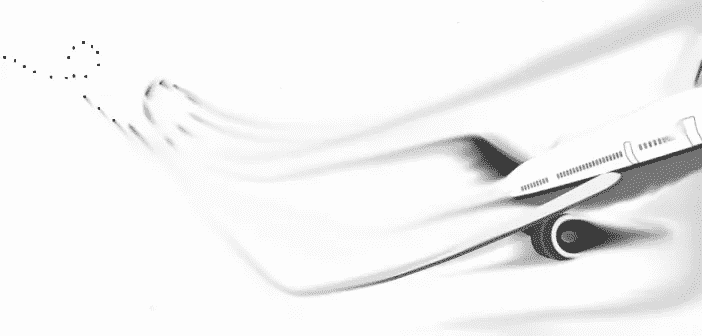

# 尽管“知道”顾客想要什么，为什么顾客并不总是对的。

> 原文：<https://medium.datadriveninvestor.com/why-the-customer-isnt-always-right-despite-knowing-what-they-want-as-a-customer-fdc25a1f387?source=collection_archive---------12----------------------->

“As a passenger, I’d rather the plane crash because of me!”

如果你的业务在某种程度上不像一个代理模式，客户，不管他们承认与否，都会在精神上怀疑你取得结果的能力。对于一个设计师来说，这意味着问他们希望他们的设计是什么样子，或者问他们希望他们的网站上有什么页面，无休止的修改，本质上，理解客户的时间总是比提供服务的人更重要。

我认为所有这些都是胡说八道。当有人雇佣专家来提供服务时，他们会说:“我见过你带别人旅行，他们安全到达目的地。我想加入。嗯，没有人会登上飞往纽约的飞机，去驾驶舱告诉机长如何驾驶飞机带他们去那里。仅仅因为客户“知道”他们想要什么，就意味着你应该给他们，即按照他们想要的方式设计网站，这种想法是不负责任的，因为你把飞机交给了一个完全没有资格驾驶飞机的人。也许他们知道飞机外面的许多事情，但在飞机内部，他们只是一个试图从 A 点到达 B 点的乘客，作为一名机长需要的不仅仅是这些；你必须了解你所驾驶的飞机，你将要飞行的气候，你需要采取的路线，基于实际到达的情况，最重要的是，如果有紧急情况，仍然驾驶飞机。

# 以客户的名义牺牲自己是愚蠢的任务。

大多数网页设计客户看起来都是被自我所驱使的。他们相信他们正在为自己或他们的行业建立一个网站。他们认为他们的[理想客户](https://medium.com/datadriveninvestor/why-to-some-ideal-clients-arent-the-mythical-creature-most-consider-them-to-be-4415075b01b2)的唯一时间是该发工资的时候。没有对网络的真正理解，更多的品牌和它的所有层次，复合，这些类型的项目注定要失败。因此，作为一名设计师，为了你客户的最大利益，忽略他们声称“*理解*”和“*欣赏*”的东西，因为这一切真的是为了分散你对他们成为队长这一不那么秘密的议程的注意力。然后，以你的声誉为代价，当采取的路线未能产生“预期”结果(与预期受众产生共鸣，赢得他们理想客户的信任，并让他们实际购买)时，他们会把飞机坠毁归咎于你，他们绝对是对的。

这就是灾难——*哎呀，*我的意思是，*当你决定建立一个“客户想要的”网站时会发生什么*。客户不可能同时是客户和专家。这就是为什么单页程序被设计成这样的原因。但是，这也是因为缺乏实质内容的设计；仅仅看起来有用的设计；[普通的设计不仅达不到客户的期望，还会耗尽你的利润，结果是严重浪费每个人的时间。](https://medium.com/datadriveninvestor/how-to-get-the-most-value-out-of-your-designs-b8264f1da551)

避免这种情况的唯一方法是建立一个简化的流程，从教育潜在客户建立一个网站的重要性开始，他们的目标受众需要，而不是他们或他们的同事想要什么，到你向客户提供一个网站，并详细说明你的方法背后的原理，能够帮助客户看到它如何符合他们的追求。

# 那么，在这一切中，客户的权利和责任是什么？

简单地说，帮助设计者理解他们提供的服务(对谁有价值)，并且为网站设定一个清晰的目标。

很简单，对吧？假设有些人甚至理解他们所做工作的价值，客户也无法理解，尽管提供了这些信息，设计师也有一套技能来帮助他们将这些数据划分为有效的在线品牌体验——嗯，我知道。当你做的工作被认为是“优于其他工作”*时，这就是有人为之付钱的原因；能帮助他们的你特有的优势；不是因为你会建网站，会装牙套，会涂指甲，会做菜。更深层的东西。*

*不要只看产品。作为一个投资网站的人，你的客户被你的诚实所吸引，设计师必须通过设计创造一种信任的氛围。你不能因为说*你值得信任*就指望信任会神奇地显现出来。*

*找到服务中真正有价值的东西的方法，并为某人的行为制定一个策略，以雪球方式影响最终结果(你被录用)，是避免主观性，并将设计师的工作与真实结果联系起来的关键。*

# *饱和让一切都变得陈词滥调*

*有多少次你听到有人说他们是“世界领先的技术”，“他们是最大的”，或者“他们都是关于积极的”？*

*打哈欠，打哈欠，打哈欠。现在，我敢打赌，你打哈欠并不是因为你一定不同意他们的观点，而是因为世界上每个在地球某个角落做生意的人都已经在说这些话了，所以这显得很陈腐，削弱了他们在你心目中的地位。*

*…是的，我知道我是对的。*

*事实是，这样说话的人通常不清楚自己的优势是什么，或者更糟糕的是，他们知道自己的优势是什么，但感到难以向世界表达自己的意见，因为他们要么害怕别人(主要是他们的同事或他们甚至没有针对的人)可能会怎么想，要么太以自我为中心，不愿投资于专业帮助。*

*如果信任，在任何地方都是关于首先做鼓励它的事情，为什么在网上会有任何不同？是的，这很可怕，但一直都是这样。其他人都不做吗？这就是为什么这对你来说是一个完美的机会，因为它会立即让你与众不同，对于设计师来说，视觉上表现你的一切，变得非常容易。*

*所以，飞机失事与否，作为客户，你真正想要的是什么？另一方面，作为一名设计师，你的工作方式会让人觉得你的目标很空洞吗？*

*我是**品牌桶的创始人和视觉品牌策略师***