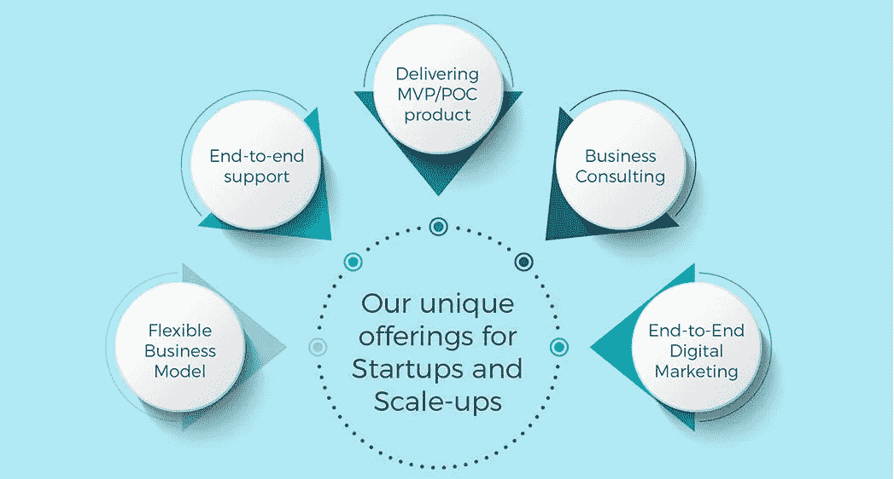

# 为什么初创企业和规模化企业的未来取决于技术合作伙伴

> 原文：<https://medium.datadriveninvestor.com/why-the-future-of-startups-scaleups-depends-on-technology-partner-52ac7d87c2b8?source=collection_archive---------30----------------------->

当今的企业不断朝着持续创新、技术发展、成本控制和产品组合维护的方向努力。正是这些融合了所有这些品质的一流产品帮助公司在竞争中保持领先地位。

加速的创新缩短了数字产品的生命周期，迫使企业保持警觉。这样一个不断发展的生态系统要求软件技术不断升级以保持相关性。

根据 Markets and Markets 的报告，*“产品工程服务市场预计到 2021 年将达到 10，031.2 亿美元，2016 年至 2021 年的 CAGR 为 8.2%。”*

快速变化的客户期望推动企业向最终客户提供优质产品和成本优势。这种压力已经渗透到供应商身上，他们需要创建一种全新的工程服务，致力于将产品更快地投放市场。因此，生命周期的总周转时间减少了。

一个战略伙伴可以在很大程度上促成这一现象的成功。如今，专注于产品工程服务的技术合作伙伴关系正以前所未有的速度增长。它们提升了核心业务流程，并通过低成本的技术专长提供了实质性的战略优势。

# Gateway Digital 的 PES 产品

我们 Gateway Digital 相信为未来创造工程解决方案。我们不仅提供卓越的技术，还在整体生态系统中评估业务并与之合作。

通过在岸、近岸和离岸业务模式的正确组合，我们能够以更快的速度实现更高的投资回报率。我们的[产品工程服务](https://www.thegatewaydigital.com/product-engineering/)套件是一个一站式商店，在产品的整个生命周期中为您提供支持:从概念化到开发和部署。这些是我们擅长的领域:
#产品概念化&创新
#架构设计&原型
#开发&测试
#质量保证&可靠性
#产品维持&支持
#遗留产品迁移
#产品推广

以下是 Gateway Digital 的产品如何对全球技术格局产生巨大影响的一瞥。

# 关于 Gateway 创业创新实验室(GSIL)

Gateway Digital 有一种独特的方法来帮助即将到来的业务持续发展并取得成功。无论您是正在开发一个概念，还是准备部署一个，我们都能满足您的需求。我们接受了 GSIL，目的是在商业和市场之间架起一座桥梁。

初创公司，甚至是规模扩大的公司，都在努力定义市场的基本动态。这些方面包括确定确切的产品-市场匹配，试验客户细分等。Gateway Digital 为他们提供了合适的技术、专业知识、孵化和领域加速能力。

**我们对创业和扩大业务的价值主张**

**战略&计划**
业务&营销战略
>上市战略
>计划产品路线图

**维持&扩展** >维持和扩展战略
>基于成熟的方法维持或扩展产品

**数字营销** >端到端数字营销
>产品生命周期各阶段的服务
>定义战略营销&技术路线图

**研究&开发** >市场研究、技术趋势&生态系统
>业务&功能咨询
>展望端到端产品生命周期

**共同创造&共同创新** >共同创新产品生命周期
>从概念到产品成熟的共同创造

**资源** >具有企业家心态的初创传道者团队
>专注于产品设想的研发团队

# 为什么是我们？

在 [Gateway Digital](https://www.thegatewaydigital.com/) ，我们明白每个企业都是独一无二的，需要量身定制的解决方案。我们的经验和创新导向的解决方案以及协作方法让您的企业保持领先。以下是您应该与我们合作的原因，以及我们如何为您带来改变。

# 9 个不同行业的领域经验
# 25 家以上初创公司的端到端 IT 解决方案提供商
#拥有 2000 多工时经验的专门研究&开发团队
# 5 家以上初创公司的法律&财务顾问
#定义您路线图的独特初创公司咨询框架
#由 20 多名拥有业务领域、生态系统和市场知识的传道者组成的团队

**一起把事情搞大，联系我**[**dhrashti @ gateway digital . de**](mailto:dhrashti@gatewaydigital.de) ***LinkedIn:***[linkedin.com/in/dhrashti-brahmbhatt-9209b4b3](http://linkedin.com/in/dhrashti-brahmbhatt-9209b4b3)

另外，如果你喜欢我们的内容，请点击我们的 LinkedIn 页面:[https://www.linkedin.com/company/gateway-digital-germany/](https://www.linkedin.com/company/gateway-digital-germany/)