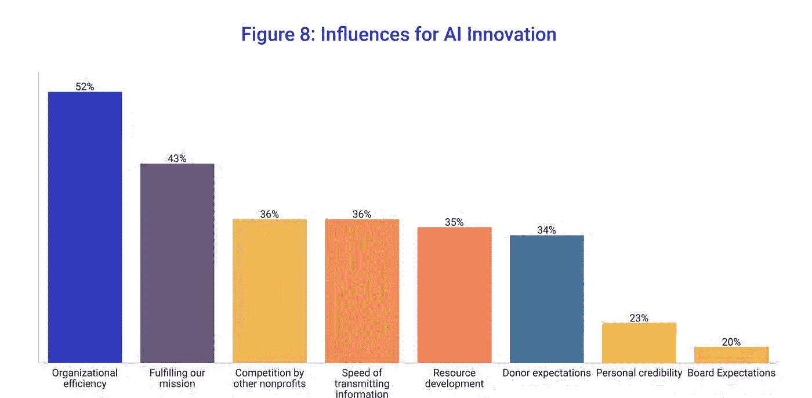

# 为什么人工智能的飞跃将彻底改变非营利技术

> 原文：<https://medium.datadriveninvestor.com/why-the-jump-to-ai-will-revolutionize-nonprofit-tech-4b445e5c0c11?source=collection_archive---------23----------------------->

Credit: [Brian Wallace (Hacker Noon)](https://hackernoon.com/the-future-is-now-ai-for-evil-vs-ai-for-good-8e87093b148)

在我上周的文章中，我讨论了为什么投资者可能会错过非营利技术革命的机会。这篇文章特别关注非营利领域的人工智能，旨在说明这项革命性的技术将如何改变整个社会影响格局。

非营利世界向人工智能的转移是一个稳定而缓慢的前进过程。虽然该领域采用技术的速度普遍较慢，但围绕社交媒体上的[噪音](https://blog.hootsuite.com/social-media-advertising-stats/)和[捐助者人数下降](https://www.tvo.org/article/charities-need-millennials-to-start-giving-but-do-millennials-have-anything-to-give)的竞争日益激烈，这使得有必要加快采用带来美元收入的数字解决方案。

特别是人工智能，它不仅能够处理，而且能够彻底改变非营利组织在过去二十年中面临的无数问题。随着专注于管理大型数据集的人工智能技术的成本迅速下降，以及它们简化内部非营利流程和更好地瞄准潜在捐助者的能力，非营利部门正处于历史上前所未有的技术进步的边缘。

## 数据过载之战

[充满希望的](https://www.hopefulinc.me/)之所以成立，是因为非营利组织在其基础层面上[正在努力管理和处理](http://cdn2.hubspot.net/hubfs/433841/The_State_of_Data_in_The_Nonprofit_Sector.pdf)他们处理的大量数据。如果没有能力管理现有的捐助者和内部数据，设定内部目标和关键绩效指标就变得极具挑战性，更不用说将先进技术上线以实现这些目标了。

为了说明数据处理在社会的这个阶段是多么重要，据估计，仅在今年年底，每个人每秒将产生*17 兆字节的信息。对于任何给定的组织，没有人能够准确地处理如此大量的数据。随着非营利组织收集数据点，包括支付信息、人口统计数据、捐助者兴趣等，这个问题对这个领域来说尤其尖锐。*

*这就是我们引入人工智能作为解决方案的地方。人工智能，在其基础层面上，旨在实现三个关键目标:*

*   *捕获数据*
*   *从数据中学习*
*   *根据见解采取行动*

*利用这样的框架，帮助非营利组织的过程相当简单:*

*   *帮助更小、更年轻的非营利组织获取数据*
*   *随着非营利组织的发展和获取更多的数据，让人工智能和非营利组织的用户了解这些数据如何帮助他们*
*   *提供有数据支持的见解，以刺激筹款并减少与内容制作相关的开销*

*一个[非营利组织可以从其数据](https://www.keela.co/blog/nonprofit-resources/data-analytics-for-nonprofits)中收集到的洞察力数量已经非常惊人，但也为任何希望立即与大型企业级慈善机构、基金会和支持者打交道的非营利技术公司提供了巨大的进入壁垒。非营利组织的每一项业务都必须经过仔细检查，以确定是否以及何时需要人工智能——是否应该在其他基本功能完成之前收购人工智能，以及该组织是否会冒着其稳定性和成功的风险。*

## *人工智能对内部非营利过程的影响*

*根据人工智能倡导咨询委员会(AAAC)最近的一份报告，89%的非营利组织领导人相信人工智能会让他们的组织更有效率。此外，73%的非营利组织认为人工智能创新符合他们的信念，75%的人认为人工智能让他们的生活变得更容易。*

*这是一种已经开始出现在实施方面的趋势，15%接受调查的非营利组织已经在去年将人工智能技术投入使用。*

*尽管如此，72%的非营利组织要么处于研究的早期阶段，要么没有在未来 12 个月内实施人工智能的计划。虽然这与非营利组织大力支持人工智能对效率的影响的原始统计数据相冲突，但同样重要的是要注意到，今天只有 23%的人工智能非营利解决方案真正到达了他们的预期用户手中，这表明缺乏足够的市场渗透。*

*对人工智能实施的大力支持源于人工智能对内部非营利过程的巨大影响。几乎在非营利组织的每一个层面，都存在一些基本任务，这些任务可以很容易地实现自动化，从而将急需的时间返还给组织内过度扩张的营销、执行和筹资团队。*

**

*Credit: [AI in Advancement Advisory Council](https://gravyty.s3.amazonaws.com/2019aaacstateofaiinadvancement.pdf)*

*人工智能如何影响非营利组织的内部工作可以分为我们所说的完全内部和内部/外部过程。实际上，允许非营利组织从内部有效运作的过程和允许他们带来捐赠资金的过程。在以盈利为目的的世界里，这些基本上是你的“面向客户”的过程。*

*对于完全内部运作，人工智能的影响很大程度上来自于它自动化日常任务的能力。具体来说，人工智能能够对非营利组织收到的[大量财务数据进行分类，以便快速识别异常和欺诈，这种能力可以很快应用于该领域，并为大大小小的非营利组织带来巨大利益。](https://biztechmagazine.com/article/2019/04/how-nonprofits-can-effectively-use-ai-tools)*

*此外，利用这种数据解析能力还可以快速允许非营利人力资源人员筛选合格的候选人，并使他们在招聘过程中比非人工智能团队更快地完成招聘。*

*然而，尽管有这些好处，非营利组织真正受益的是人工智能对内部/外部流程的影响。从根本上来说，非营利组织的外部宣传、支持和筹款服务可以通过人工智能的正确实施得到根本改善。*

*例如，人工智能可以提供倡导和筹款专家[复杂的指标](https://www.nonprofitpro.com/article/artificial-intelligence-changing-nonprofits-where-we-are-and-where-were-going/)来评估他们的捐赠者在线上和线下真正关心的事情。在霍普的案例中，我们一直在与非营利组织合作，利用人工智能的处理能力来识别某个组织的社交媒体上发布的哪些关键词、标签、视频和图像会导致捐赠者支持他们的事业。利用这些信息，hopewable 的人工智能然后创建自动草稿帖子，以节省营销团队在制作传统上没有支持数据支持的消息时的时间和精力。*

*大赦国际在吸引新捐助方方面极为有效，但在保持现有捐助方参与供资循环方面也发挥着关键作用。捐赠者留存一直是非营利领域面临的一个极其重要的挑战，截至 2018 年，整个行业的平均捐赠者留存率仅为 45.5% 。在过去的十年里，这种情况一直存在，这表明新技术的出现为改善现状提供了巨大的机会。*

**

*[2018 Fundraising Effectiveness Report](http://afpfep.org/wp-content/uploads/2018/04/2018-Fundraising-Effectiveness-Survey-Report.pdf)*

*人工智能识别大规模数据集中模式的能力使非营利组织能够专注于现有捐助者关心的问题，并精心制作他们的计划和故事，以最大限度地增加再次捐赠的机会。这本身就是非营利组织的一个重要收入来源，因为[每获得 100 美元，随后就会被捐赠者流失造成的惊人的 96 美元的损失所抵消。](http://afpfep.org/wp-content/uploads/2018/04/2018-Fundraising-Effectiveness-Survey-Report.pdf)*

## *结论*

*非营利组织非常适合从基于人工智能的技术中受益，以提高他们的效率，并在未来几年推动非凡的收入水平。虽然非营利组织已经慢慢认识到需要开始实施创新解决方案来确保未来的增长，但世界形势一直在加速人们的情绪，即需要采取更多措施来赶上营利性技术实践。*

*本文是我最近在[为加拿大人工智能、机器学习、数据科学&工程会议做的](https://www.linkedin.com/posts/alexanderjivov_techforgood-techcommunity-tech4good-activity-6662050862510288896-IRXE)演讲的后续，该演讲在高层次上涵盖了与本文相同的主题。*

****免责声明:*** *我是*[*hope Inc*](https://www.hopefulinc.me/)*的首席执行官和联合创始人，这是一家高增长的初创公司，它使非营利组织能够超越喜欢，并利用人工智能通过社交媒体和在线捐赠来源获得更多资金。我们自己目前正在筹集种子资金。如需了解更多信息，请发送电子邮件至*[*ajivov @ hopeflinc . me*](http://ajivo@hopefulinc.me/)*

*本文最初发表在 LinkedIn 上*