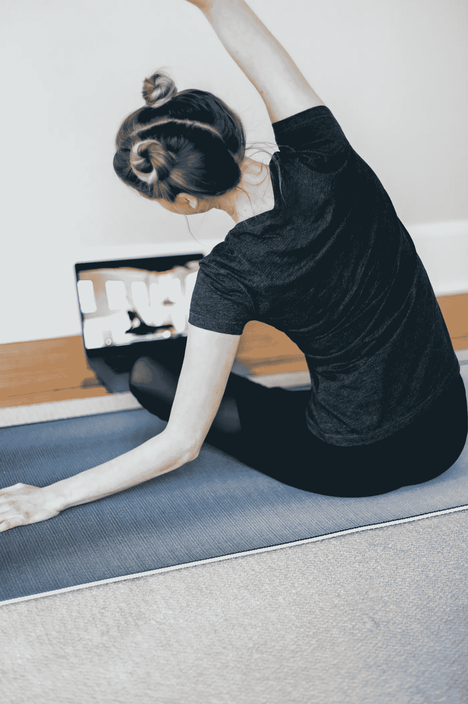

# 为什么疫情将成为健身行业的游戏规则改变者

> 原文：<https://medium.datadriveninvestor.com/why-the-pandemic-will-be-a-game-changer-in-the-fitness-industry-e03e2705ddff?source=collection_archive---------11----------------------->

## 未开发的目标市场、低成本和可复制的内容

Photo by [Kari Shea](https://unsplash.com/@karishea?utm_source=unsplash&utm_medium=referral&utm_content=creditCopyText) on [Unsplash](https://unsplash.com/s/photos/virtual-yoga?utm_source=unsplash&utm_medium=referral&utm_content=creditCopyText)

多亏了疫情，一些行业获得了扩大业务范围、利用技术和接触大众的绝佳机会。在过去的十年里，健身行业经历了巨大的增长，而且还在不断增长。由于疫情的原因，这种增长可能已经放缓，但它也打开了数字空间的大门，而在封锁之前，数字空间从未得到充分利用。

**让我们探究一下原因。**

# 易用性和灵活性将吸引非活跃人口进入这个空间。

与在健身房锻炼相比，使用数字平台在家锻炼有几个优势——它为你提供了各种各样的练习，选择不同的教练进行训练，还提供了在你选择的时间和地点进行锻炼的灵活性。

它 24*7 由用户支配。与传统的健身房模式相比，这是一个巨大的优势，可以吸引不活跃的人进入健身空间。例如，我妈妈除了偶尔练习瑜伽之外，从来没有锻炼过。她现在喜欢在家舒适地练习尊巴舞。

 [## 2020 年最佳短期投资选择精选资源|数据驱动型投资者

### 投资是增加你净财富的一个好方法。如果你通过遵循一个严格的…

www.datadriveninvestor.com](https://www.datadriveninvestor.com/2020/03/28/handpicked-resources-for-the-best-short-term-investment-options-of-2020/) 

同样，数字媒体也有潜力接触到工作时间不固定的人、老年群体、学生，甚至是那些负担不起昂贵健身房费用的人。订阅 aptiv 或 Downdog 比加入社区健身房便宜多了。

此外，对传统健身器材的依赖在最近几年已经大大下降。例如，印度的 Cult 健身中心除了少量的重量外，没有任何重型设备——他们的商业模式以集体锻炼为中心，利用体重锻炼，如 HIIT、尊巴、潜行、力量和调节等。

> 健身俱乐部(一个 1000 亿美元的行业)的消费化是不可避免的。疫情在比以前更广泛的基础上接受了俱乐部的理念，因此将关系从旧世界经济中转移出来的机会比以往任何时候都大。——迈克尔·盖尔，福布斯

# 互联网速度

如今，互联网速度允许在没有任何干扰的情况下进行更长时间的直播会话。借助 Chromecast 和 Firestick 等流媒体设备，您还可以在电视上进行投射，获得近乎超现实的体验。当 5G 变得普遍可用时，这种体验将更加无缝，进一步缩小数字平台和物理平台之间的差距。

# 试验和测试期

疫情为健身行业的数字玩家提供了测试市场潜力的绝佳机会。在此期间，一些应用程序提供了 1 或 2 个月的免费试用期。如果价格不是一个因素，这有助于他们估计用户群的规模。甚至传统的健身房/健身专家也通过 Zoom 和 Skype 提供直播。

从尊巴教练到瑜伽大师，所有健身专业人士都开始探索数字空间。如今，孟买的尊巴教练可以在同一节课上培训从阿姆利则到澳大利亚的学员。一个未被充分利用的数字空间，直到我们进入封锁状态才被利用。

# 算法支持的度量

跟踪指标的能力无疑是传统健身房或健身班的最大优势。今天，我们都想知道——我们的表现如何，我们是否达到了要求的心跳水平，我们燃烧了多少卡路里。

Cure.fit 等数字应用程序有内置的能量跟踪器，可以跟踪你锻炼的每个动作，并向你显示你的锻炼有多严格。它还会在整个训练过程中给你一个等级，提升你的竞争精神。同样，许多其他锻炼应用程序可以让你与可穿戴设备同步，如健身带和智能手表，这些设备可以监控你的速度、心率、氧气摄入量和血压等。这彻底改变了我们的锻炼方式。

# 低维护成本和高杠杆

与实体模型相比，数字模型所需的持续成本要少得多——没有租金，在培训师和设备上的花费相当少，维护费用适中。虽然成本大幅降低，但另一方面，收入却有着指数级的增长机会——录制的瑜伽课程可以被无数次使用，以接触到更广泛的全球观众。这是一个双赢的模式，利用了可复制的内容，其好处可以在更长的时间内获得。

# 结论

健身行业早在新冠肺炎时代之前就已经开始了数字化之旅，但疫情加快了这一方向的推进。综上所述——便利、高速互联网、增长潜力、低成本和高杠杆，数字健身很快就会出现前所未有的增长。的确如此，考虑到我们即将面临的经济衰退，未来用于保持健康的收入将会减少。数字健身播放器可能是救命稻草。此外，当一百万人在短时间内采用一种新的健身方式时，它会彻底改变健身文化。