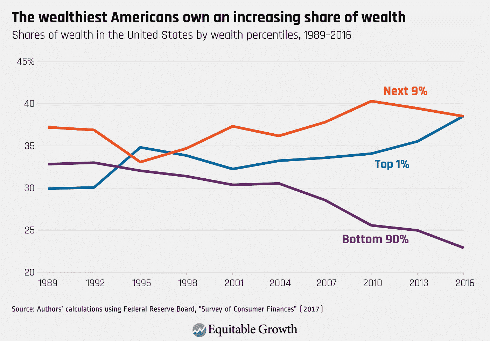
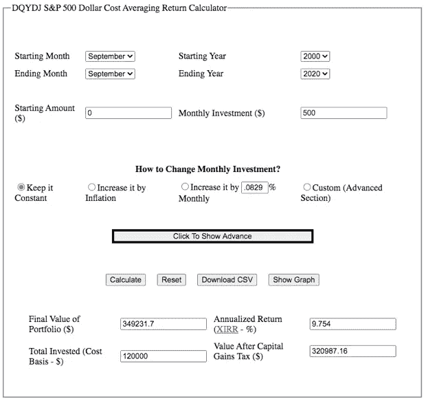
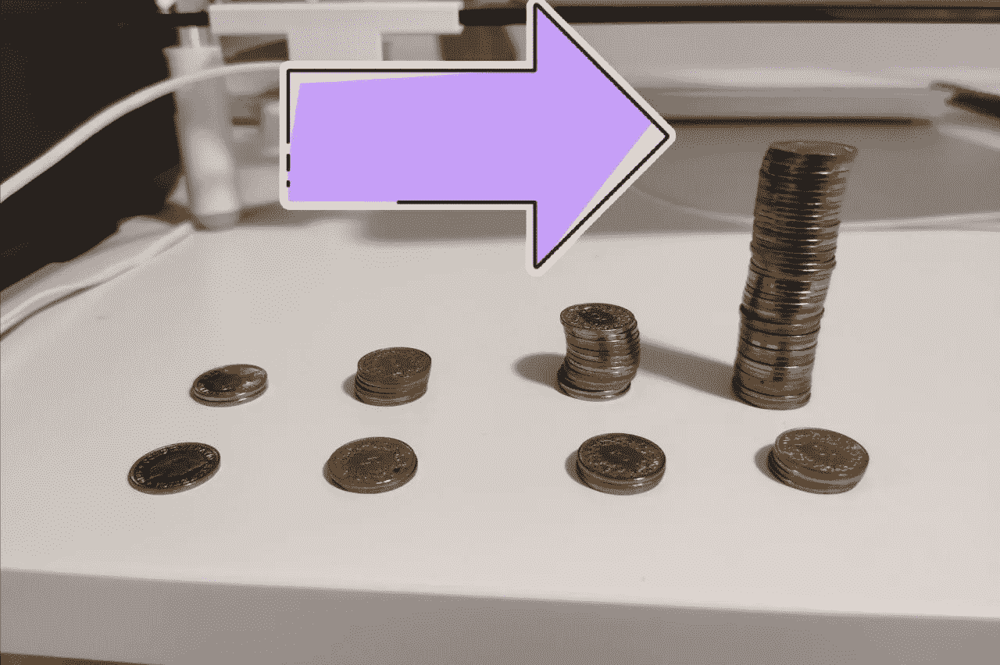

# 为什么穷人更穷，富人更富

> 原文：<https://medium.datadriveninvestor.com/why-the-poor-are-poorer-the-rich-are-richer-802a5437f431?source=collection_archive---------17----------------------->

Photo by [Sharon McCutcheon](https://unsplash.com/@sharonmccutcheon?utm_source=unsplash&utm_medium=referral&utm_content=creditCopyText) on [Unsplash](https://unsplash.com/s/photos/income-inequality?utm_source=unsplash&utm_medium=referral&utm_content=creditCopyText)

本月，普华永道和瑞银发布了 2020 年年度 [<亿万富翁报告>](https://www.pwc.ch/en/publications/2020/UBS-PwC-Billionaires-Report-2020.pdf) 。在这剧变的一年里，你认为亿万富翁的财富是减少了还是增加了？亿万富翁的总数是下降了还是增加了呢？

2020 年 7 月底，亿万富翁财富达到 10.2 万亿美元，创下新高，超过 2017 年近 15%。比 2017 年多了 31 位亿万富翁。在美国，从 1989 年到 2016 年，1%的顶层财富份额上升了近 10%，而底层 90%的财富份额下降了 10%。

为什么穷人越来越穷，富人越来越富？有许多社会原因，但最重要的一个原因是，投资与金钱直接相关。

你们谁有长期投资组合？对于那些不知道的人来说，是什么阻止了你投资呢？

好了，让我们仔细看看人们不投资的常见原因。

最常见的原因是投资风险太大。我不想损失任何钱。通过把钱存入银行账户，在过去的 20 年里，你每年都在[**8.95%到 1.3%**](https://data.worldbank.org/indicator/FP.CPI.TOTL.ZG?end=2019&start=1960&view=chart) 之间亏损。为什么？因为那是世界通货膨胀率，你消费的是全球经济提供的商品和服务。你的银行为你的钱支付多少利息？(根据世界银行的数据，瑞士的平均存款利率为-0.21%。)如果你没有太多的钱，利率几乎是 0%，否则你的利率将是负的。

如果不是每个月都把钱存入银行账户，而是在过去 10 年里投资相同的金额，比如说相当多元化的 S&P500 指数基金，会发生什么？你的钱几乎翻了一倍，确切地说是 1.9 倍。

Source: [https://dqydj.com/sp-500-periodic-reinvestment-calculator-dividends](https://dqydj.com/sp-500-periodic-reinvestment-calculator-dividends)

如果你在过去的 20 年里这么做呢？你的钱几乎会增加两倍，2.8 倍。

Source: [https://dqydj.com/sp-500-periodic-reinvestment-calculator-dividends](https://dqydj.com/sp-500-periodic-reinvestment-calculator-dividends)

你可能会问，S&P 指数恰好是产生良好回报的指数，让我们看看 SMI。从 1997 年到 2019 年，如果你投资了 SMI(瑞士市场指数)，你的钱平均每年增长 7%。但是瑞士银行利率是 7%吗？或者有哪个 bak 给你 7%的利率？因为我们生活在一个全球化的世界，我们受到全球通货膨胀的影响，我们的钱一年比一年少，不像亿万富翁，如果我们不做任何事情，我们会变得越来越穷。

你不仅应该投资，而且应该现在就开始投资。因为你投资的时间越长，你的钱增长得越快。

回到 S&P 投资的例子，如果你每个月投资相同的金额，你的钱**在 10 年内翻了一倍**，**在 20 年内翻了三倍**，**在 30 年内翻了 4.6 倍**，40 年内翻了 11.5 倍**。你投资的时间范围越长，你的钱会为你产生越多的钱。这就是复合的力量。**

**我用硬币形象地展示了把钱存入银行账户和投资 S&P500 指数基金的区别。第二行显示了投资的增长。在第四个十年，投资组合的价值是银行存款的 11.5 倍。(假设通货膨胀率相同，典型的瑞士银行利率为 0%。)**

****

**投资的最佳时机，就是现在的**。****

****定期投资于一个相当多样化的指数基金，坚持投资 10 年、20 年或 30 年。那么你的财富将随时间呈指数增长。你会变得更富有，而不是更贫穷。****

****— — —****

****我是一个热心的学习者和积极的倾听者。我对营销、技术、个人理财、生产力和企业家精神充满热情。关注我的帐户接收每周文章。****

****🎧**在这里听我关于职业金钱和企业家精神的播客:**[**https://www.fasttrack.life/**](https://www.fasttrack.life/)****

****想了解更多关于这个话题的信息吗？****

****[**<如何用你的支柱 3a >**](https://medium.com/makingofamillionaire/how-to-create-wealth-with-your-pillar-3a-300cc281554f) 创造财富****

****[**<如何用你创造财富支柱 3b >**](https://medium.com/makingofamillionaire/how-to-create-wealth-with-you-pillar-3b-3c7c61b71d23)****

****[**智能投资者**](https://amzn.to/2z2GE8t)****

****[**金钱高手游戏:财务自由的 7 个简单步骤**](https://amzn.to/2VUj6vE)****