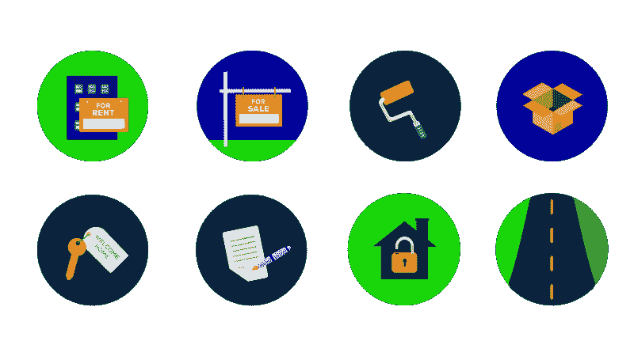
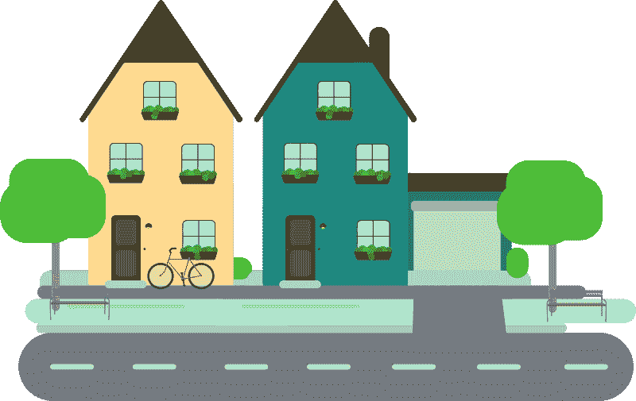
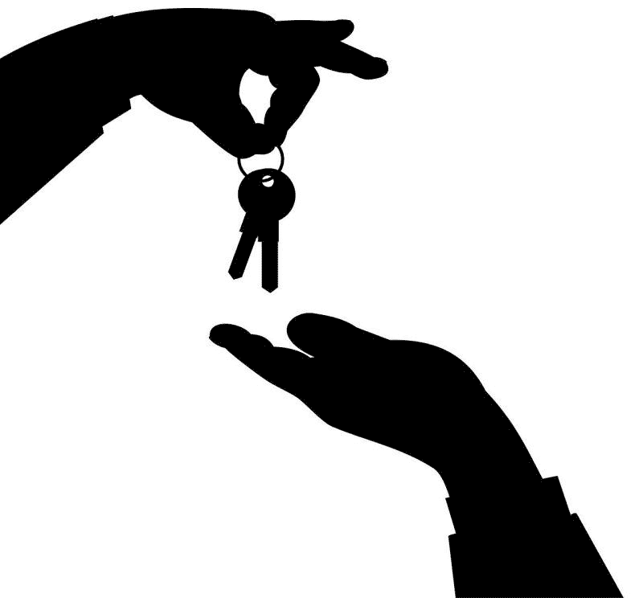
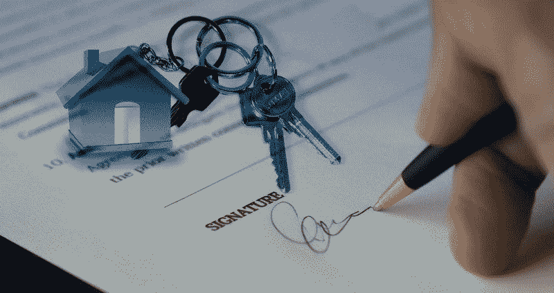
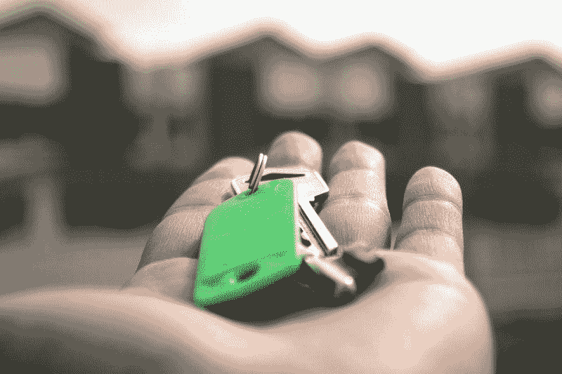

# 为什么房地产市场让我害怕——市场疯人院

> 原文：<https://medium.datadriveninvestor.com/why-the-real-estate-market-scares-me-market-mad-house-8aa127d73e60?source=collection_archive---------14----------------------->

目前，房地产市场吓死我了。我认为冠状病毒对房地产的影响可能远比它对股市的影响更具破坏性。

解释一下，我认为美国股票有很大的实际价值，尽管一些“市场先生”对一些股票定价过高。我认为美国房地产的价值很大；另一方面，虚构的。

然而，美国房地产价格已经涨到了荒谬的水平。美国全国房地产经纪人协会(NAR)估计，2020 年 2 月，美国房价中值上涨 8%，至 270，100 美元。美国消费者新闻与商业频道[报道](https://www.cnbc.com/2020/03/20/february-home-sales-jump-to-highest-in-over-a-decade-but-big-drop-expected.html)事实上，NAR 声称美国房屋销售以 13 年来最快的速度增长。

 [## 算法交易的机器学习|数据驱动的投资者

### 当你的一个朋友在脸书上传你的新海滩照，平台建议给你的脸加上标签，这是…

www.datadriveninvestor.com](https://www.datadriveninvestor.com/2019/01/30/machine-learning-for-stock-market-investing/) 

因此，我认为冠状病毒来袭时，房地产正处于泡沫之中。我预测新冠肺炎可能会戳破泡沫，导致房地产价格暴跌。

# 为什么你需要害怕房地产

你需要害怕房地产，因为大量普通人已经将他们无法承受损失的资金投入到可能迅速崩盘的房地产中。

例如，盖洛普[估计](https://news.gallup.com/poll/266807/percentage-americans-owns-stock.aspx)在 2019 年 4 月，只有 55%的美国人声称拥有股票。然而，Statista [估计](https://www.statista.com/statistics/184902/homeownership-rate-in-the-us-since-2003/)2019 年美国住房自有率为 65.1%。

此外，住房是大多数美国人会购买的最大和最昂贵的东西。令人震惊的是，Statista 告诉我们，高达 65.1%的人口可能将他们的大部分资金套牢在一项投资中，一个可能会失去大部分价值的房子。令人害怕的是，美国人资助了大多数这样的房子。

# 抵押贷款危机 2.0 来了

因此，我们可能会面临比 2007—2008 年抵押贷款崩溃更严重的房地产崩盘。又一次，数千万美国人可能发现自己陷入了水下抵押贷款。

澄清一下，当抵押贷款的欠款超过房屋价值时，它就是“水下的”。例如，你可以用价值 100，000 美元的房屋抵押贷款 300，000 美元。因此，你欠了 20 万美元的债务，你无法还清。

雪上加霜的是，《大西洋月刊》特约撰稿人安妮·劳里[预测](https://www.theatlantic.com/ideas/archive/2020/03/quantifying-coming-recession/608443/)失业率将高达 20%。这样的失业率可以与 20 世纪 30 年代的大萧条相媲美。为了量化 1933 年美国记录的最高失业率为 24.9%， *The Balance* [报道](https://www.thebalance.com/unemployment-rate-by-year-3305506)。

据商业内幕*[报道](https://www.businessinsider.com/the-atlantic-20-unemployment-rate-is-not-impossible-2020-3)，3 月 8 日至 15 日当周，美国申请失业救济人数跃升至 225 万。这打破了 1982 年创下的记录。*

**

*因此，当房地产价格暴跌时，数千万人无法支付抵押贷款。房地产价格将会崩溃，因为人们将没钱购买房产。*

# *商业地产崩盘*

*我预测，冠状病毒将对商业地产造成更大的破坏。值得注意的是，新冠肺炎已经在摧毁商业房地产投资信托基金(REITS)。*

*例如，购物中心运营商**西蒙房地产集团公司**的股价在不到一个月的时间里下跌了近 100 美元。具体来说，市场先生在 2020 年 2 月 24 日为西蒙支付了 140.78 美元。2020 年 3 月 24 日，市场先生以 53.27 美元的价格购买了西蒙公司的股份。此外，西蒙的价格在 2020 年 3 月 18 日跌至 44.92 美元。*

**

*受打击更大的是 Seritage Growth Properties(纽约证券交易所代码:SRG)。Seritage 是持有西尔斯和凯马特大部分房地产的房地产投资信托基金。Seritage 的股价从 2020 年 2 月 24 日的 37.23 美元跌至 2020 年 3 月 24 日的 7.92 美元。*

*我认为房地产投资信托基金的价格显示商业房地产正在崩溃。我预测住宅价格将随之上涨。我预测很多商业地产 REITS 会因为冠状病毒而宣布破产。*

# *房地产会怎么样？*

*我认为美国房地产在冠状病毒之前就已经走上了灾难之路。因此，新冠肺炎所做的一切都是在加速不可避免的事情。*

*如果冠状病毒让在家工作成为许多专业人士的常态，更糟糕的事情可能还在后头。解释一下，我认为这可能会减少对办公空间的需求，并进一步抑制商业房地产市场。*

**

*与此同时，随着惊恐的人们在网上购买一切，大量商店可能会倒闭。因此，美国的城市和郊区可能会被空置的建筑填满。*

*情况可能很糟糕，因为将所有这些空置的商店和办公室转换成其他用途将花费数十亿美元。特别是，他们将不得不拆除许多空置的商店，并用新的建筑取代这些建筑。*

# *房地产崩盘的积极一面*

*相反，房地产崩盘也有积极的一面。*

*房价可能会暴跌，让许多较贫穷的美国人能够买房。此外，许多人可以支付更少的住房费用。这可能会增加许多美国人的收入，因为他们口袋里会有更多的现金。*

**

*此外，开发商或地方政府可以买下空置的办公楼或商店，将其改造成住房。特别是，政府可以购买旧的购物中心，用社会住房来代替。在社会住房中，政府拥有公寓或其他住房单元，并以低价租给任何公民，无论其收入如何。*

*一个相关的好处是拆除和更换；或者改造，所有这些建筑都可以创造就业机会。记住，建筑工作报酬很高。*

*此外，许多有现金的普通美国人可以通过购买房屋并出租给他人而成为房东。因此，大量的人可以通过成为小规模企业家来赚取额外的现金。*

*因此，房地产崩盘不会是一场彻底的灾难。然而，房地产的崩溃将伤害许多人。总之，你需要停止担心股票，害怕房地产。摧毁普通美国人的是房地产崩溃，而不是股票。*

**原载于 2020 年 3 月 24 日*[*【https://marketmadhouse.com】*](https://marketmadhouse.com/why-the-real-estate-market-scares-me/)*。**