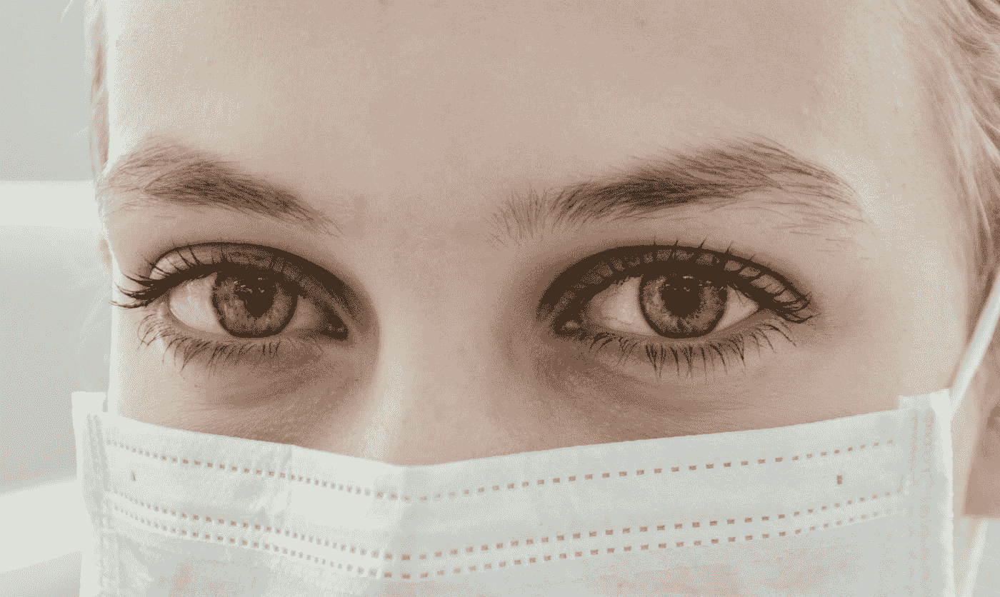

# 为什么未来可能无法治愈疾病

> 原文：<https://medium.datadriveninvestor.com/why-there-might-be-no-cure-for-diseases-in-the-future-8e698851b2a8?source=collection_archive---------18----------------------->

## 抗生素耐药性正在上升，我们现在必须采取行动

Photo by [Ani Kolleshi](https://unsplash.com/@anikolleshi?utm_source=medium&utm_medium=referral) on [Unsplash](https://unsplash.com?utm_source=medium&utm_medium=referral)

抗生素耐药性正在上升。每天我们都会遇到一种新的感染，一种对我们友好的抗生素似乎无效的新疾病，除非我们现在采取行动，否则未来可能无法治愈疾病。

根据世卫组织的统计，每年至少有 70 万人死于抗生素耐药性，其中 23 万人死于结核病。

无论是第三世界还是第一世界，各种收入水平的国家都发现了令人震惊的抗生素耐药性，甚至连常见疾病都无法治疗。

> 世卫组织总干事 Tedros Adhanom Ghebreyesus 说:“耐药性的威胁从未像现在这样迫在眉睫，对解决方案的需求也从未像现在这样迫切。”。

在巴基斯坦这样的国家，结核病仍然是导致死亡的主要原因，在不久的将来，近 95%的巴基斯坦人口可能会对救命的抗生素产生耐药性，这让我感到害怕。

# 什么是抗生素耐药性？

Photo by [Kelly Sikkema](https://unsplash.com/@kellysikkema?utm_source=medium&utm_medium=referral) on [Unsplash](https://unsplash.com?utm_source=medium&utm_medium=referral)

抗生素是用来治疗细菌感染的药物。在使用它们的过程中，如果其中一种细菌对药物产生反应而改变了它的形态，它就会产生耐药性。因此，不是人类或动物，而是细菌本身对特定的抗生素产生了抗药性。

 [## 大笔资金和尖端技术:人工智能/人工智能投资将如何革新医疗保健…

### 在过去几年人工智能(AI)和机器学习(ML)的显著发展中…

www.datadriveninvestor.com](https://www.datadriveninvestor.com/2018/03/22/big-money-and-cutting-edge-technology-how-investment-in-ai-ml-will-revolutionize-the-healthcare-industry/) 

因此，下次细菌攻击一个人时，药物将完全不起作用。目前，淋病、肺结核、血液中毒和食源性感染每天都对抗生素产生越来越多的耐药性，早期似乎很容易治疗的疾病正在成为一种挑战。

## 随着新的耐药感染不时出现，唯一的解决方案似乎是针对这些新感染的新抗生素。

Photo by [Kayla Maurais](https://unsplash.com/@kaylamaurais?utm_source=medium&utm_medium=referral) on [Unsplash](https://unsplash.com?utm_source=medium&utm_medium=referral)

然而，根据世卫组织的高级顾问彼得·拜尔的说法:

*【事实上，我们正在耗尽对这些耐药细菌有效的抗生素】*

*制药公司还没有准备好在新药上投入如此大的资金，最终甚至可能无法治愈耐药菌株。没有多少人愿意冒这个险。*

*开发一种新的抗生素可能需要 10 年时间，所以如果你回到第一阶段，我们确切地知道我们在未来 10 年最多能得到什么。我们确实看到，这不足以应对当前的威胁。”*

*然而，他补充说，他希望制药公司将改变他们的观点，政府能够为他们提供财政激励，以开展他们的研究。*

****“所以，我确实认为这个行业，在某个时间点，他们会扭转局面。这是我们的希望。当然，我们也试图说服政府进行投资。”****

*这不仅是世界各地卫生组织面临的困境，也是我们所有人和我们后代面临的困境。*

# *积极的一面是:*

*组织每天都在想出新的方法来对抗耐药性。例如:*

## *世卫组织为抗药性所做的努力:*

**

*Photo by [Lucas Vasques](https://unsplash.com/@luvqs?utm_source=medium&utm_medium=referral) on [Unsplash](https://unsplash.com?utm_source=medium&utm_medium=referral)*

*随着世卫组织与像*被忽视疾病药物*和 *GARDP* 这样的组织的合作，4 种新的治疗方法有望在 2023 年推出。*

*此外,[全球行动计划](https://www.who.int/news-room/fact-sheets/detail/antibiotic-resistance)旨在:*

*   *提高对抗生素耐药性的认识和理解。*
*   *加强监视和研究。*
*   *减少感染的发生率。*
*   *优化抗菌药物的使用。*
*   *确保在对抗抗生素耐药性方面的可持续投资。*

## *益生菌饮料:*

**

*Photo by [Sara Cervera](https://unsplash.com/@saracervera?utm_source=medium&utm_medium=referral) on [Unsplash](https://unsplash.com?utm_source=medium&utm_medium=referral)*

*在伯明翰大学科学家最新发表的研究中，一种含有益生菌的饮料有可能治愈抗生素耐药性。*

*这种饮料主要含有酸奶和泡菜中的活细菌和酵母，它们通过瞄准细菌细胞内的“质粒”来发挥作用。*

*首席研究员克里斯托弗·托马斯教授说:*

*“这是一个充满希望的开始。在进行第一次临床试验之前，我们的目标是进行修改，以进一步提高我们的 pCURE 质粒的功效。”*

## *事业管理:*

**

*Photo by [Hannah Morgan](https://unsplash.com/@hannahmorgan7?utm_source=medium&utm_medium=referral) on [Unsplash](https://unsplash.com?utm_source=medium&utm_medium=referral)*

*巴基斯坦阿迦汗大学的 Rumina Hasan 博士和 Sadia Shakoor 博士与来自世界各地的其他研究人员一起领导了一项研究，他们分析了来自 60 个国家的污水，使他们有了一个比较数据。他们不仅能够收集抗生素耐药性的预测数据，还能够收集印度、孟加拉国和肯尼亚等国家的潜在原因。*

*“这项研究的结果表明，作为可持续发展目标的一部分，改善卫生、健康和教育将是限制 AMR 全球负担的有效战略，”哈桑博士说。*

## *海洋动物是抗生素耐药性的治疗方法:*

**

*Photo by [Jakob Owens](https://unsplash.com/@jakobowens1?utm_source=medium&utm_medium=referral) on [Unsplash](https://unsplash.com?utm_source=medium&utm_medium=referral)*

*根据 Loredana Stabili 和 Margherita Licc iano 最近的[研究](https://www.mdpi.com/1660-3397/17/7/396) [显示，海洋无脊椎动物有可能被用于治疗抗药性。这些动物身上覆盖着一层光滑的涂层，这种涂层含有抗生素和抗氧化剂，可以用作潜在的药物。](https://www.mdpi.com/1660-3397/17/7/396)*

# *你和我能做的:*

**

*Photo by [Jonathan Gonzalez](https://unsplash.com/@jonogonzo?utm_source=medium&utm_medium=referral) on [Unsplash](https://unsplash.com?utm_source=medium&utm_medium=referral)*

*即使看起来如果我们不能开发新药或改变政府政策，你我也无能为力，但事实并非如此。我们每个人都有自己的角色，我们必须现在就扮演好。*

1.  ***遵循世卫组织安全食品指南:***

*   *保持食物干净*
*   *生熟分开*
*   *彻底煮熟你的食物*
*   *使用干净的水*
*   *将食物保存在安全的温度下*

***2。** **仅在获得认证的医生处方时使用抗生素***

***3** 。当医生说你不需要抗生素时，千万不要使用。*

***4** 。**完成医生开出的抗生素的整个疗程。***

***5。千万不要用剩余的抗生素。***

*6。及时接种疫苗，注意个人卫生。*

## *变化从个人层面开始，我们必须带来这种变化，以防止我们的后代遭受灾难性的结局。*