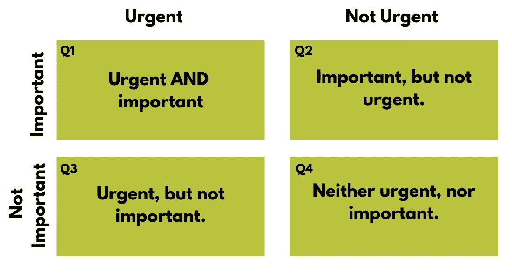

# 为什么企业的时间管理是企业生产力的关键

> 原文：<https://medium.datadriveninvestor.com/why-time-management-for-business-is-key-to-business-productivity-da72f2cbe4f5?source=collection_archive---------32----------------------->

任何企业主(或员工，就此而言)都不会对时间管理是企业最大的话题之一感到惊讶。

每一项业务都需要进行大量的活动，而我们的时间是有限的。因此，有理由认为，能够组织和管理你花在所有这些事情上的时间对一个企业的成功至关重要。

“成功的”时间管理意味着你能够避免错过重要的截止日期，能够有效地兼顾多项不同的任务，能够优先考虑不同客户的需求，保持对管理的掌控，专注于“正确的事情”…以及所有这些，在你分配给自己的时间内完成工作。从本质上说，这是找出如何钉你的生产力。

 [## 2020 年最佳短期投资选择精选资源|数据驱动型投资者

### 投资是增加你净财富的一个好方法。如果你通过遵循一个严格的…

www.datadriveninvestor.com](https://www.datadriveninvestor.com/2020/03/28/handpicked-resources-for-the-best-short-term-investment-options-of-2020/) 

但这是一个挑战，我们都知道。很大程度上是因为似乎永远没有足够的时间去做每一件事。

有大量关于这个主题的资源——非常有用。无数的文章、博客和书籍提供了有用的技巧和窍门，帮助你更好地管理时间，提高效率，克服压力等。如今，越来越多的应用程序和软件程序都有现成的工具来帮助你真正做到这一点。

然而，为了让这些工具有所帮助，它们需要——并且假设——一件关键的事情:你已经知道你需要优先考虑什么；你已经拥有了先于工具的*知识*。

这样想吧。拥有 Photoshop 就足以让你成为专业的照片编辑了吗？拥有厨师级的厨房用具会让你成为厨师级的厨师吗？不…它们是好的开始，很有帮助…但是它们还不够*。*

*你需要这一切背后的技能、知识和理解。在使用这些工具之前，你需要知道如何使用它们。*

*这同样适用于这些时间管理工具。如果你不知道什么是优先考虑的，什么是最重要的，什么是应该关注的“正确的事情”,那么帮助你安排和控制时间的应用程序是没有用的。*

*你仍然需要后退一步……你需要知识**——清晰**——在你能尝试解决什么时候之前。*

*因为虽然商业时间管理在某种程度上是关于有效地组织你的时间……实际上是关于明智地使用你的时间。*

*这是两码事。*

## ***如何确定优先事项，更好地管理时间***

*人们认为“专注”是更好地管理时间的关键。*

*但是，与清晰相比，专注是次要的。*

*清晰是知道该做什么。*

*专注在做。*

*如果你不清楚该做什么，你就不容易集中精力去做。*

*那么，你如何获得你的清晰？你把它带回去，就像经常发生的那样，去看更大的画面。更重要的是，屏蔽掉让你如此忙碌的所有琐事的噪音*。**

**从思考你的**目标、指标和目的**开始。**

**你希望你的企业是什么样的？**

**理想情况下，你想要什么类型的客户？**

**你想挣多少钱？你想工作多少小时？你想如何安排你的日子、周、[月……？](https://the3fs.com/business-model-time-off/)**

**你希望你的事业在你的生活中是什么样的？**

**一旦你提醒自己你的核心目标，然后你会看到你需要做的所有不同的“事情”来让你的企业实际运作。…**

**你的待办事项清单上的所有事情，你已经想了一段时间的所有想法，所有目前填满你一天的活动——从你的客户工作到你的营销再到你的管理。考虑每一个细节(具体的客户，项目的“类型”，你正在做的工作的后勤)如何适应你的目标、目的和目的的更大计划。**

**为了完成*这个*，我一直推荐使用艾森豪威尔的“紧急-重要”矩阵。**

## **艾森豪威尔矩阵**

**对于你正在做或打算做的每一件事，问自己以下问题:**

**“是不是**重要**？”是，还是不是。**

**“是不是**急**？”是，还是不是。**

**然后将每项活动放入相应的“方框”中:**

**第 1 季度=紧急和重要。**

**季度 2 =重要，但不紧急。**

**季度 3 =紧急，但不重要。**

**季度 4 =既不紧急，也不重要。**

**从那里**你应该开始发现一点清晰。****

****

## **认识到什么才是真正重要的，从而有效地管理你的时间，让你的生意更有成效**

**一旦你根据紧急程度和重要性——基于**它们如何引导你达到最终目标**——将待办事项列表上的所有活动和任务组织得井井有条，你就离获得清晰的注意力更近了。**

**那些**Q1 显然是关注**的“正确的事情”。这些任务确实需要你全神贯注。它们是直接引导你走向目标的任务。**

****问题 2 也很重要**——它们也引导你走向最终目标。所以实际上，它们对 T4 非常重要。好的一面是他们没有固定期限的压力。关于*和*的坏消息是它们更容易被推迟。**

**这些商业应用程序的时间管理现在可能会派上用场…你知道你需要安排你的时间做什么…你已经确定它们足够重要，需要优先考虑。因此，缺少一个“官方”的截止日期也许仅仅意味着你需要附加一个你自己的截止日期……？**

****Q3s。毫无疑问，这些棘手的问题会让你忙个不停。它们是“紧急的”…它们有一个截止日期，这意味着它们通常会被推到我们优先列表的最前面。它们显然需要被完成，否则它们不会有那种紧迫性，但是你已经认识到它们对你实现你的总体目标，你的总体战略并不重要。****

**这意味着它们没有第二季度重要——这些事情可能会因为对它们有利而被推迟……纯粹是因为这些第三季度有一个预先存在的截止日期。**

**所以**你正在推迟实现你的目标**，以便**忙于**根本不会帮助你实现目标的事情…这需要改变。**

****解决办法？主要有两个:****

**第一:外包。把那些需要完成但会分散你注意力的任务交给别人是你能做的最有效的事情。这样做的成本几乎总是会得到补偿，因为你现在能够专注于你的 Q1 和 Q2…因为这些*是直接引导你实现目标、指标和目的的活动。***

**如果你不能让自己外包，再看看他们，问问自己:**

**"他们真的急吗？"…“它们真的需要被完成吗？”…因为如果没有，您还有第二个解决方案:将它们移到第 4 季度。**

****Q4 —“不重要或不紧急”类别**是一个非常令人满意的类别。这是你可以直接从清单上划掉的任务清单。**

**不是因为他们结束了。因为它们不需要被完成。**

**我们都有。我们都是在“习惯做”的过程中接受任务，却忘记了思考它们实际上有多有用。**

**随着我们的业务增长和进步，我们需要做的活动也在变化…**

**偶尔退后一步，摆弄一下“紧急-重要”矩阵，这是把那些不必要的任务踢到路边的好机会。**

****时间管理是有效的，不是*只是*高效****

**生产力通常被简单地称为效率。**

**效率——“把事情做对”——对你的企业来说确实是时间管理的重要因素。**

**但是有效:做“正确的事情”更是如此。**

**想一想——**在你不需要做的事情上高效，既不高效也没有效果。这只会分散你做你需要做的事情的注意力。****

**让你很忙…但不一定成功。**

**虽然忙碌可以让我们觉得我们做的事情是对的，我们是“成功的”…但通常不是。事实上，通常是相反的。**

**[**我称之为*忙碌错觉***](https://the3fs.com/the-busyness-delusion/)——认为忙碌=成功，然而实际上没有人*希望*忙碌:我们只想成功……如果你真的诚实的话——不需要忙碌的成功*才是真正的梦想，对吗？***

**我写了一本关于这个话题的书，书名就叫《忙碌的错觉》。如果以上有任何共鸣，我会推荐它，因为它以直接和相关的例子涵盖了所有这些。**

** [## 忙碌错觉书-你的商业目的-3f

### 编辑描述

the3fs.com](https://the3fs.com/the-busyness-delusion-book/) 

….成功不在于忙碌。时间管理实际上并不是管理你的时间，而是管理你的优先事项。

这是关于认识到你正在做的所有事情有多重要，在这种背景下，引导你走向你的最终目标:实现财务安全、自由，并最终实现自我。 [我所说的 3Fs。](https://the3fs.com/what-are-the-3fs/)

或者认识到实际上，他们只是让你忙起来…

弄清楚你的优先事项，知道该关注什么是实现你最终商业目标的最快方法。

它给你清晰的思路，让你知道把时间和精力集中在哪里。

它使时间管理变得容易，因为你知道你需要什么，什么时候完成。

也许你需要一些软件工具来帮助你，也许你不需要。无论哪种方式，你都将走上实现目标的轨道。

如果你需要一些帮助来弄清楚你的“是什么”和优先事项，让我知道。这是我最喜欢帮助别人做的事情。

在我的 5 天免费挑战中，学习如何不需要出卖你的时间就能为你的企业获得时间管理的终极钥匙… [点击此处](http://the3fs.com/get-paid-for-value?utm_source=Medium&utm_medium=Articles&utm_campaign=5DC)了解更多信息。**