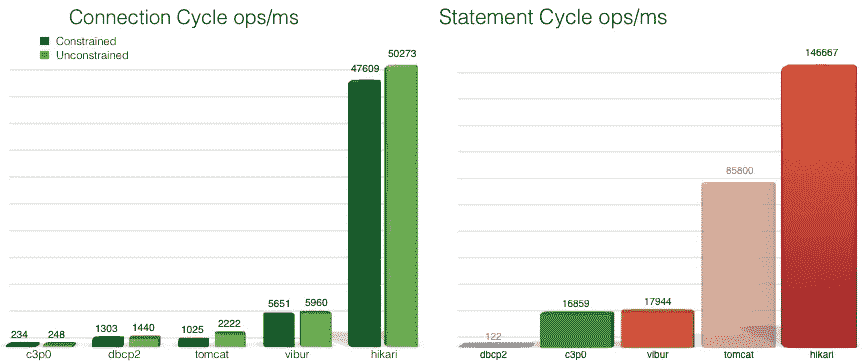

# 为什么要使用光连接池？

> 原文：<https://medium.datadriveninvestor.com/why-to-use-hikari-connection-pool-ce1a482cb9ab?source=collection_archive---------2----------------------->

这篇博客最初发表在我的博客@linqz.io [这里](https://www.linqz.io/2019/03/why-to-use-hikari-connection-pool.html)。

[光](https://brettwooldridge.github.io/HikariCP/)连接池(或光 CP)是这个领域的新生事物，虽然是池机制的后来者，但它的表现优于 [C3P0](https://github.com/swaldman/c3p0) 、 [Apache Commons DBCP](https://commons.apache.org/proper/commons-dbcp/) 、 [BoneCP](http://www.jolbox.com/) 、 [Tomcat](https://tomcat.apache.org/tomcat-7.0-doc/jdbc-pool.html) 、 [Vibur](http://www.vibur.org/) 等提供的连接池。

下面的基准图显示了连接和语句 ops/ms 图:



Hikari Benchmark source : [https://github.com/brettwooldridge/HikariCP](https://github.com/brettwooldridge/HikariCP)

许多博客已经写了关于 [HikariCP](https://github.com/brettwooldridge/HikariCP) 的比较和性能，所以这篇博客试图探索一些内在的复杂问题，例如，为什么它比它的对等连接池更快？有什么特殊代码吗？等等。

最后分享了其他资源的链接，这些链接提高了我对 HikariCP 的理解。

# **引擎盖下功能:**

*   字节码简化:HikariCP 库已经优化了代码，直到编译的字节码最小，以便 CPU 缓存可以加载更多的程序代码，这是通过 Javassist 实现的。(JavaAssist 用于通过 JDK 代理生成动态代理。因为生成的字节数比 JDK 代理少，所以取消了许多不必要的字节码，从而使它的执行速度更快)
*   代理和拦截器的优化:光库减少了大量代码，例如 HikariCP 的语句代理只有 100 行代码。
*   实现 FastList 而不是 ArrayList 是为了避免每次都进行范围检查，因为 get()调用也是在 remove()调用期间执行的，所以避免了从头到尾的完整数组扫描。ArrayList 的 remove(Object)方法从头开始遍历数组，而 FastList 是从数组的末尾开始遍历的，所以当被删除的元素位于末尾时效率会更高，这是通常的情况。以下摘自 FastList.java 的

```
@Override   
public T get(int index)   
{
 return elementData[index];   **// no range check of ArrayList**
}
```

*   移除方法实现:

```
[@Override](http://twitter.com/Override)
public boolean remove(Object element)
{
 for (**int index = size - 1; index >= 0; index--**)
 {
  if (element == elementData[index])
  {
   final int numMoved = size - index - 1;
   if (numMoved > 0)
   {
    System.arraycopy(elementData, index + 1, elementData, index, numMoved);
   }
   elementData[--size] = null;
   return true;
  }
 }
 return false;
}}
```

*   实现了名为 [ConcurrentBag](https://www.javadoc.io/doc/com.zaxxer/HikariCP/2.6.1/com/zaxxer/hikari/util/ConcurrentBag.html) 的自定义集合类型，以提高并发读写的效率。
*   ConcurrentBag 实现提供了无锁设计、线程本地缓存、队列窃取和直接移交优化，从而实现了高度的并发性、极低的延迟和最小化的错误共享。
*   实现了与方法调用相关的、占用最小 CPU 时间片的其他优化。
*   HikariCP jar 大小仅为 135KB，由于代码量较小，执行效率较高。根据软件编码实践中的流行说法“代码越低，出现错误的概率越低”，HikariCP 的错误数量最少。

在这里 查看 ConcurrentBag [**的无锁和线程安全实现的源代码。**](https://github.com/openbouquet/HikariCP/blob/master/src/main/java/com/zaxxer/hikari/util/ConcurrentBag.java)

进一步阅读材料:

*   如何选择数据库连接池:[https://tech blog . top desk . com/coding/choosing-a-database-connection-pool/](https://techblog.topdesk.com/coding/choosing-a-database-connection-pool/)
*   [http://www.programmersought.com/article/319698001/](http://www.programmersought.com/article/319698001/)
*   如何确定池的大小:[https://github . com/brettwooldridge/HikariCP/wiki/About-Pool-Sizing](https://github.com/brettwooldridge/HikariCP/wiki/About-Pool-Sizing)
*   数据库关闭行为:[https://github . com/brettwooldridge/HikariCP/wiki/Bad-Behavior:-Handling-Database-Down](https://github.com/brettwooldridge/HikariCP/wiki/Bad-Behavior:-Handling-Database-Down)
*   性能比较 1:[https://www . wix . engineering/blog/how-does-hikaricp-compare-to-other-connection-pools](https://www.wix.engineering/blog/how-does-hikaricp-compare-to-other-connection-pools)
*   性能对比二:[https://nbsoftsolutions . com/blog/the-difficult-of-hikaricp-in-drop wizard 性能评估难度](https://nbsoftsolutions.com/blog/the-difficulty-of-performance-evaluation-of-hikaricp-in-dropwizard)
*   [https://blog . jooq . org/2017/02/21/jooq-Tuesdays-Brett-wooldridge-shows-what-it-take-to-write-the-fast-Java-connection-pool/](https://blog.jooq.org/2017/02/21/jooq-tuesdays-brett-wooldridge-shows-what-it-takes-to-write-the-fastest-java-connection-pool/)

如果你喜欢这个博客内容，请考虑买一杯咖啡。谢谢大家的支持！

[](http://buymeacoff.ee/cyby0109)

有问题吗？建议？评论？

下一步是什么？ [**在 Medium 上关注我**](https://medium.com/@vaibhav0109) 成为第一个阅读我故事的人。

[](https://www.datadriveninvestor.com/2020/01/16/software-development-process-how-to-pick-the-right-process/) [## 软件开发过程:如何选择正确的过程？数据驱动的投资者

### 软件是任何企业组织成功的生命线。没有软件的帮助，一个…

www.datadriveninvestor.com](https://www.datadriveninvestor.com/2020/01/16/software-development-process-how-to-pick-the-right-process/)