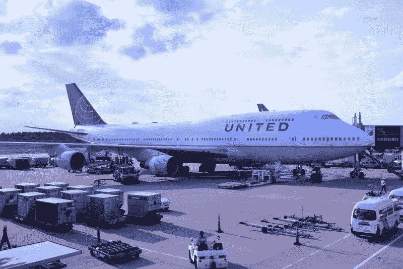
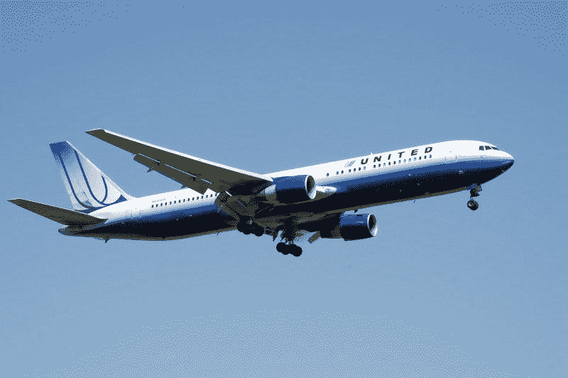
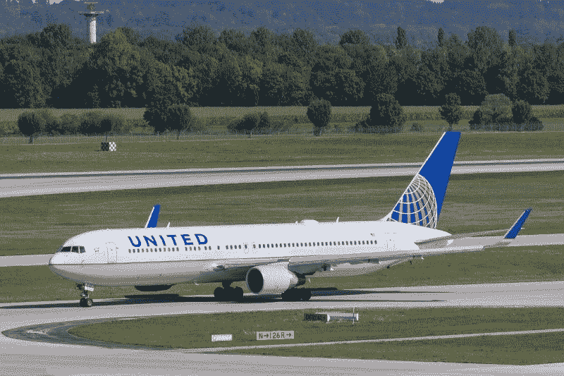
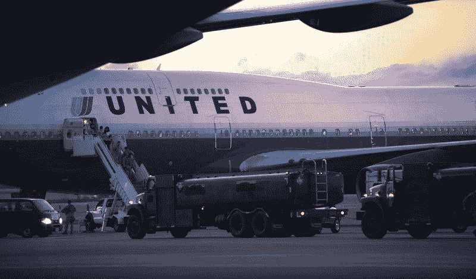
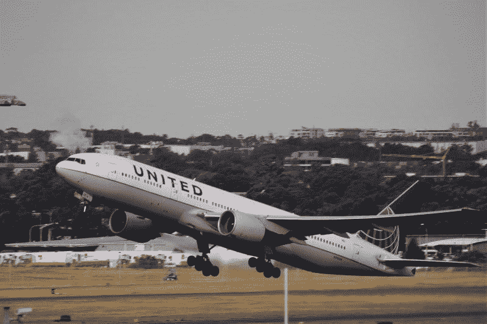

# 为什么联合航空公司的股票会崩盘——市场疯人院

> 原文：<https://medium.datadriveninvestor.com/why-united-airlines-stock-will-crash-market-mad-house-9c251a0c6227?source=collection_archive---------17----------------------->

联合航空公司(纳斯达克股票代码:UAL)正在我们眼前崩溃。2020 年，美联航的股价已经跌去了一半以上。

具体来说，市场先生在 2020 年 1 月 2 日为 UAL 支付了 89.74 美元，在 2020 年 7 月 16 日支付了 34.49 美元。因此，投资者因为冠状病毒而对美联航失去了所有的信心。

投资者并不是唯一对联合航空公司没有信心的人。例如，BGR 的安迪·米克承认；"[你甚至不能付钱让我现在乘坐联合航空或美国航空(纳斯达克股票代码:AAL)的航班](https://bgr.com/2020/07/11/american-airlines-new-study-middle-seat-coronavirus-risk/)"

米克害怕乘坐联合航空公司的航班，因为他认为你可能会在航班上感染冠状病毒。米克认为联合航空公司和美国航空公司的航班很危险，因为它们满员了。因此，乘客不能社交距离和保护自己免受新冠肺炎。

# 航空旅行死了吗？

我认为像米克这样的恐惧使联合航空公司无法从客运航班中赚钱。没有人会坐飞机，因为他们害怕冠状病毒。

在这种情况下，我看不出联合航空公司如何吸引足够的乘客来赚钱。例如，[运输安全管理局(TSA)估计](https://www.paddleyourownkanoo.com/2020/06/30/u-s-air-passenger-numbers-surpass-25-of-pre-covid-levels-for-first-time-since-late-march/)2020 年 6 月 29 日美国航空旅客数量是 2020 年 6 月客运量的 25.46%。

因此，我计算出美国航空旅行在 2019 年 6 月至 2020 年 6 月期间下降了 75.54%。虽然航空乘客人数从 2020 年 4 月 14 日的 87534 人增加到 2020 年 6 月 29 日的 625235 人。因此，航空公司的客运业务是去年的四分之一。

 [## 回购市场注入对经济有何影响——跟踪面包屑|数据驱动的投资者

### 我们发现人们倾向于忘记(包括我们自己)重要的因素、事件或定义…

www.datadriveninvestor.com](https://www.datadriveninvestor.com/2020/05/13/what-repo-market-injections-say-about-the-economy-follow-the-breadcrumbs/) 

# 联合航空结束了吗？

因此，联合航空控股公司(纳斯达克代码:UAL) 计划解雇 45%的员工。

详细来说，联合航空通知其 36，000 名美国员工，他们可能在 2020 年 10 月 1 日后失业， [NPR 报道](https://www.npr.org/sections/coronavirus-live-updates/2020/07/08/889112759/united-airlines-tells-36-000-employees-they-might-lose-their-jobs)。2020 年 10 月 1 日，是联邦政府停止承保美联航工资单的日期。国会在关怀法案中保证了联合航空的工资。

联合航空承认，没有政府的帮助，它无法支付 45%的员工工资。因此，我不再认为联合航空公司是一个可行的公司。然而，我认为国会将在 10 月份之前更新 CARES 法案，因为国会选举定于 2020 年 11 月 3 日举行。

因此，联合航空公司是一家僵尸公司，没有政府支持就无法生存。在这种情况下，我预测曼联会变成一只垃圾股。因此，我预计，到 9 月份，市场先生 2020 年 7 月 16 日为 UAL 支付的 34.49 美元将成为投资者的美好回忆。

# 美联航是垃圾股吗？

**美国联合航空公司(纳斯达克代码:UAL)** 在冠状病毒之前赚钱。例如，截至 2020 年 3 月 31 日的季度，联合航空的收入为 79.79 亿美元，毛利为 56.2 亿美元。

然而，美联航报告称，2020 年前三个月的运营亏损为 9.72 亿美元。相比之下，联合航空公司报告 2019 年最后三个月的季度营业收入为 8.61 亿美元。

此外，Stockrow 估计，在截至 2020 年 3 月 31 日的季度中，联合航空的收入缩水了-16.79%。具体来说，美联航的季度收入从 2019 年 12 月 31 日的 108.88 亿美元下降到 2020 年 3 月 31 日的 79.79 亿美元。

可以预见的是，同期美联航的季度净共同收益从 6.41 亿美元降至-17.04 亿美元。因此，冠状病毒在上个季度重创了联合航空公司。

# 联合航空公司借款生存

此外，联合航空公司的季度现金流从 2019 年 12 月 31 日的 11.81 亿美元降至 2020 年 3 月 31 日的 6300 万美元。鉴于这一数字，我预计联合航空下一季度的运营现金流将为负值。

相反，联合航空公司报告 2020 年 3 月 31 日的期末现金流为 35.48 亿美元。该期末现金流从 2019 年 12 月 31 日的-1.95 亿美元增长。

然而，我认为联合航空公司借走了大部分现金。为了解释这一点，美联航在 2020 年 3 月 31 日报告了 21.89 亿美元的融资现金流。融资现金流代表公司通过出售债务或借款筹集的资金。

# 美联航有什么前途？

所以，我认为美联航没有借款，没有政府支持，是无法生存的。

我预测联邦政府可能最终会拥有联合航空公司。请记住，联邦政府在 2007-2008 年危机后的几年里一直拥有 [**通用汽车(纽约证券交易所代码:GM)**](https://marketmadhouse.com/why-united-airlines-stock-will-crash/#:~:text=U.S.%20taxpayers%20no%20longer%20own,GM%20bailout%20is%20%2410.5%20billion.) 。

我认为山姆大叔可以拥有联合航空和其他航空公司超过十年。我相信政府所有权是不可避免的，因为联合航空只有在联邦政府的帮助下才能支付工资。

我怀疑国会将救助联合航空公司，因为没有政治家希望这个国家再有 45，000 名失业选民。然而，政客们将面临公众的强烈反对，因为看到富裕企业得到纾困的普通民众正在受苦。

# 美联航能活下来吗？

有趣的是，联合航空公司可能有足够的现金来重组和保留其部分业务。

例如，联合航空公司在 2020 年 3 月 31 日有 52.11 亿美元的现金和短期投资。令人震惊的是，我认为联合航空公司将不得不花光所有的现金并裁员一半才能生存。

我相信这里有一件事是肯定的。我认为**联合航空**的股价会崩溃。

鉴于这种可能性，我建议投资者避开美联航。我预测这只股票会崩盘，一直跌到每股 10 美元以下。我认为联合航空公司证明了所有航空股都是垃圾，因此投资者需要远离航空股。

*原载于 2020 年 7 月 16 日*[*【https://marketmadhouse.com】*](https://marketmadhouse.com/why-united-airlines-stock-will-crash/)*。*

**访问专家视图—** [**订阅 DDI 英特尔**](https://datadriveninvestor.com/ddi-intel)