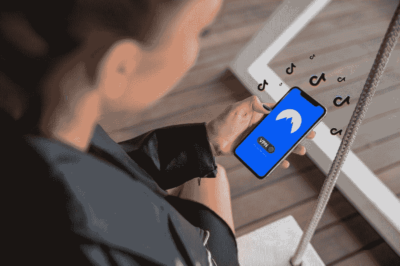

# 沃尔玛为什么想要抖音——市场疯人院

> 原文：<https://medium.datadriveninvestor.com/why-walmart-wants-tiktok-market-mad-house-67f8b9c3d058?source=collection_archive---------20----------------------->

过去一周的奇怪消息是沃尔玛想要抖音。解释一下**，沃尔玛(纽约证券交易所代码:WMT)** 想要加入**微软(纳斯达克代码:MSFT)** 对抖音的收购。

2020 年 8 月 27 日**沃尔玛(WMT)** 的一份新闻稿推测:“我们相信[与美国抖音](https://corporate.walmart.com/newsroom/2020/08/27/walmart-statement-regarding-discussions-with-microsoft-about-tiktok)的潜在合作关系可以增加这一关键功能，并为沃尔玛提供一种重要的方式来接触和服务全渠道客户，以及发展我们的第三方市场和广告业务。”

抖音是字节跳动有限公司拥有的视频社交媒体应用程序总统唐纳德·川普(R-Florida)品牌的“国家安全风险”因此，特朗普威胁要在 2020 年 9 月 15 日关闭抖音的美国业务，除非字节跳动将其出售给美国所有者。

# 沃尔玛的电子商务成功

我认为沃尔玛希望将抖音的社交媒体功能与其电子商务业务相结合。沃尔玛的在线电子商务资产包括市场 Walmart.com 和沃尔玛支付。

沃尔玛在电子商务方面是成功的。事实上，沃尔玛声称其美国电子商务销售额在 2020 年第二季度增长了 97%。数字商务 360 声称沃尔玛的市场提供超过 7500 万种产品。

此外，自 2020 年 2 月以来，沃尔玛的门店取货和送货服务增长了 30%。令人印象深刻的是，沃尔玛美国首席执行官 John Furner 声称，沃尔玛美国杂货销售额在 2020 年第二季度增长了 30 亿美元，在 2020 年增长了 80 亿美元。

# 沃尔玛为什么对抖音感兴趣

相反，沃尔玛无法复制亚马逊的技术创新或抓住大众的想象力。

沃尔玛正试图通过积极的社交活动来避免其部分在线失败。沃尔玛没有足够早地上线，让亚马逊主宰了这个领域。

例如，迪绍尔德估计，沃尔玛是美国第三大电子商务品牌，2020 年 7 月的月访问量为 294.5 次。相比之下，美国电子商务第一名亚马逊吸引了 20.12 亿次访问。

我认为沃尔玛的高管团队认为他们可以避免在社交媒体领域重蹈亚马逊(Amazon)的覆辙。为此，与抖音的合作可以帮助沃尔玛建立一个大型的社交媒体。

 [## 大数据影响电子商务的 4 个关键领域|数据驱动的投资者

### 毫无疑问，大数据可能是电子商务的下一个重大变革者。通过最终给在线零售商一个…

www.datadriveninvestor.com](https://www.datadriveninvestor.com/2019/12/21/4-critical-areas-where-big-data-impacts-ecommerce/) 

# 沃尔玛想要的抖音用户

值得注意的是，抖音声称拥有 [1 亿美国用户](https://newsroom.tiktok.com/en-us/tiktok-files-lawsuit)。沃尔玛希望把 Walmart.com 和沃尔玛的支付放在这些用户之前。

此外，[用户下载抖音超过 20 亿次](https://newsroom.tiktok.com/en-us/tiktok-files-lawsuit)，*感应塔*估计在 2020 年 4 月 28 日。2020 年第一季度，用户下载抖音 3.15 亿次。

此外， *Adweek* 称，2020 年 4 月，抖音为 18 岁以上的美国人带来了 3920 万用户。这一数字从 2020 年 3 月的 2880 万 18 岁以上美国用户和 2020 年 1 月的 2320 万美国用户增长而来。此外，2019 年 4 月，抖音拥有 1260 万 18 岁以上的美国用户。

我认为美国 18 岁以上的抖音用户是沃尔玛想要的人。具体来说，这些人年龄足够大，可以拥有房子、信用卡、银行账户和购物。沃尔玛想要的抖音用户是 25 岁的年轻人，有工作，有银行账户，有信用卡，收入有限。

# 抖音是新的脸书吗？

康姆斯克估计，18 至 24 岁的美国抖音用户比例从 2020 年 1 月的 4.11%下降到 2020 年 4 月的 35.3%。与此同时，抖音 25 岁至 34 岁人群的比例从 22.4%升至 27%。%而抖音 35-44 岁人群的比例从 13.9%上升到 17.1%

沃尔玛不想要抖音，因为青少年正在使用它。相反，沃尔玛想要抖音，因为青少年的母亲、阿姨和姐姐正在使用它。说详细点，妈妈，阿姨，大姐有钱购物。少年没有。

我认为沃尔玛的管理层已经计算出抖音可能成为新的脸书。解释一下，我认为大多数实体零售商；包括沃尔玛，错过了脸书的机会。

本顿维尔的经理们没有注意到购物者正在关注脸书，而不是报纸和广播电视。然而，今天的沃尔玛经理们发现，购物者正在关注抖音，而不是脸书。因此，他们一开始就想加入抖音。

# 沃尔玛赚钱了吗？

沃尔玛(WMT)正在赚大钱。例如，沃尔玛报告 2020 年 7 月 31 日的季度收入为 1377.42 亿美元。

沃尔玛从这些收入中获得了 350.53 亿美元的季度毛利。令人印象深刻的是，沃尔玛的季度毛利从 2020 年 4 月 30 日的 325.96 亿美元增长到 2020 年 1 月 31 日的 339.23 亿美元。2020 年，沃尔玛的季度收入从 1 月 31 日的 1416.71 亿美元下降到 2020 年 4 月 30 日的 1346.22 亿美元。

相反，沃尔玛的季度营业收入从 2020 年 1 月 31 日的 53.22 亿美元增长到 2020 年 4 月 30 日的 52.44 亿美元，再增长到 2020 年 7 月 31 日的 60.59 亿美元。然而，沃尔玛的季度普通净收入从 2020 年 1 月 31 日的 41.41 亿美元增长到 2020 年 3 月 31 日的 39.9 亿美元，再到 2020 年 7 月 31 日的 64.76 亿美元。

# 沃尔玛产生了大量的现金

**沃尔玛(纽约证券交易所代码:WMT)** 产生大量现金。例如，沃尔玛报告季度运营现金流为 119.39 亿美元。经营现金流从 4 月 30 日的 70.17 亿美元上升到 2020 年 1 月 31 日的 107.16 亿美元。

然而，沃尔玛报告称，截至 2020 年 7 月 31 日，季度末现金流仅为 19.69 亿美元。该期末现金流从 2020 年 4 月 30 日的 149.85 亿美元下降，但从 2020 年 1 月 31 日的 8.84 亿美元上升。

因此，截至 2020 年 7 月 31 日，沃尔玛拥有 169.06 亿美元的现金和短期投资。这一数字从 2020 年 4 月 30 日的 149.3 亿美元和 2020 年 1 月 31 日的 94.65 亿美元有所上升。

# 沃尔玛可以把抖音变成一台赚钱机器

因此，沃尔玛是一家现金充裕的公司，正在产生现金。因此，我认为沃尔玛可以把抖音变成一台赚钱机器。

例如，顾客可以通过抖音在沃尔玛购物。顾客可以在抖音点击商品，在抖音用 Walmart Pay 付款，然后在沃尔玛的自助配送塔提货。或者顾客可以通过**联邦快递(纽约证券交易所代码:FDX)** 将产品运送到她家。

特别是，顾客可以在订购之前在抖音上看到衣服、电子产品或工具等产品。然后在抖音上订购产品并付款。因此，沃尔玛可以向顾客推销产品，冠状病毒正困在家里。

因此，沃尔玛管理层可以假设抖音是中产阶级的新电视。解释一下，沃尔玛的经理们认为，今天的足球妈妈会到抖音寻求她的产品创意，就像她的母亲和祖母看电视一样。

因此，沃尔玛想要抖音的另一个原因是作为电视的替代品。事实上，据尼尔森估计，2020 年 5 月，在一个拥有 3.31 亿人口的国家，收视率最高的美国电视网络维亚康姆的 **CBS(纳斯达克代码:VIAC)** 仅吸引了[758 万观众。此外，尼尔森估计，哥伦比亚广播公司的收视率比 2019 年下降了 15%。](https://www.marketwatch.com/story/cbs-is-the-most-watched-tv-network-for-12th-consecutive-year-2020-05-28)

# 沃尔玛是一项非常有价值的投资

鉴于这些数字，我认为电视不再是一个可行的广告媒体，沃尔玛也同意这一点。因此，我认为**沃尔玛(WMT)** 是一家拥有优秀管理层的伟大公司，他们了解市场的变化。

因此，我认为市场先生在 2020 年 9 月 1 日低估了沃尔玛**(纽约证券交易所:WMT)**147 . 59 . 19 美元。此外，沃尔玛将于 2020 年 9 月 8 日支付 54₵的季度股息。

该股息于 2020 年 1 月 2 日从 53₵上涨。Dividned.com 给予沃尔玛的股息收益率为 2.16 美元，2020 年 8 月 31 日的股息收益率为 1.58%。

归根结底，我认为沃尔玛是实体零售业的一项重大价值投资，与抖音合作会好得多。任何人想要一只现金充裕、具有增长潜力、高安全边际和股息的股票，都需要考察一下沃尔玛。

*最初发表于 2020 年 9 月 1 日 https://marketmadhouse.com**的* [*。*](https://marketmadhouse.com/why-walmart-wants-tiktok/)

## 访问专家视图— [订阅 DDI 英特尔](https://datadriveninvestor.com/ddi-intel)