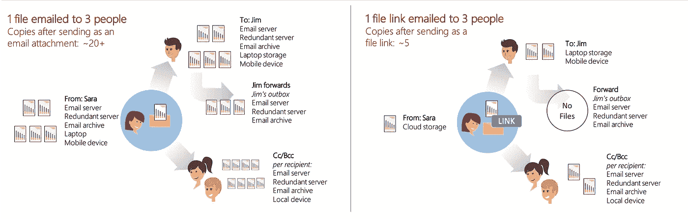
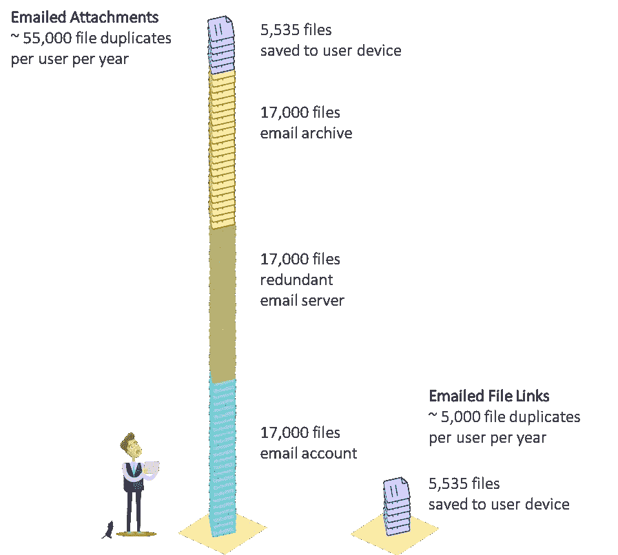
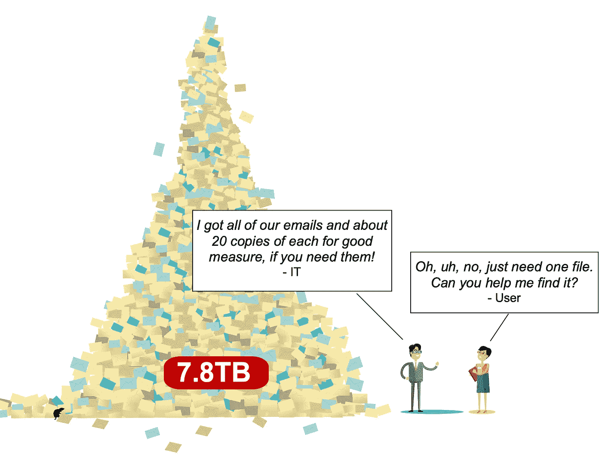
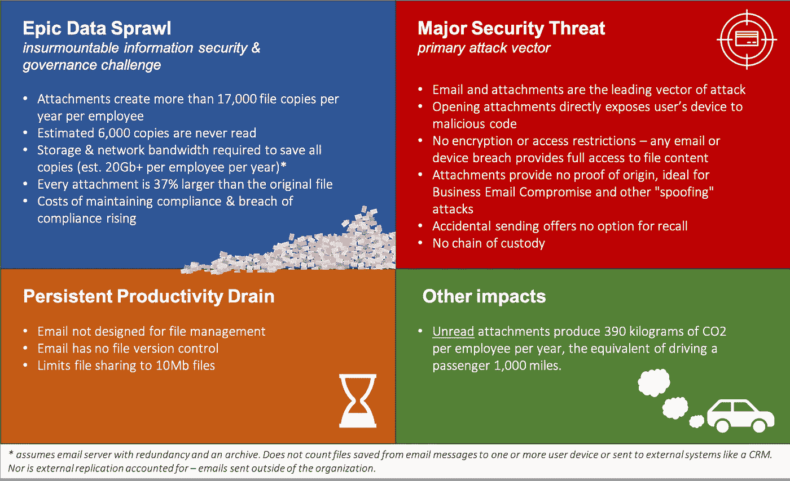
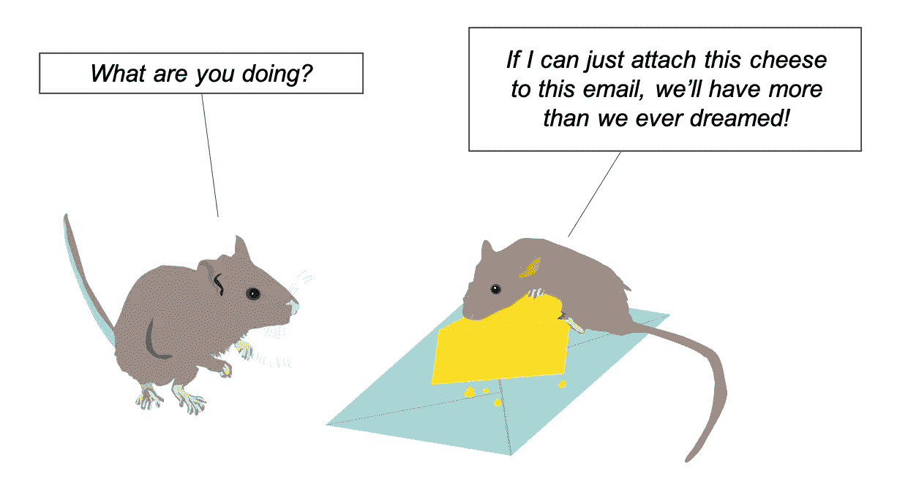

# 我们对电子邮件附件的危险依赖以及如何应对

> 原文：<https://medium.datadriveninvestor.com/why-we-cant-secure-our-data-with-business-as-usual-b4d13bfcf7d3?source=collection_archive---------3----------------------->

如果有现成的选择，继续发送电子邮件附件是昂贵、危险和不必要的。现在是解决我们网络安全挑战的根本原因而不是症状的时候了。

**看似无伤大雅，邮件附件却不是。**一个可以追溯到 50 年前的设计，从一开始就效率低下，现在已经成为一种破坏性的力量，它转移了我们宝贵的资源，因为我们不断地应对它们的附带影响，集体放弃了原本不必如此的现状。

每天大约有 3060 亿封电子邮件被发送和接收。在企业环境中，大约 25%的邮件带有文件附件，即 760 亿封邮件[1]。这些数字很大。其中最大的，当谈到今天的任何沟通。早就应该质疑这种最常见的文件共享方法了，尤其是考虑到花费了数十亿美元试图缓解源于这种过时技术的问题。大量的资源(时间、金钱、努力和失去的机会)被用于保护、治理和管理这种陈旧的文件交换模式的碎片[2]。尤其是，现在是提出质疑的时候了，因为多年来，安全文件链接一直是一种现成的选择。

电子邮件附件的挑战主要源于其架构的两个方面，即内容的重复(数据蔓延)和缺乏安全性。

> 电子邮件是大规模的数据蔓延

## 数据蔓延

在邮件中嵌入文件副本的电子邮件附件模型确保了数据的复制。当与复制(抄送、密件抄送)和转发消息给其他人(甚至是那些永远不会打开嵌入文件的人)的常见最终用户行为相结合时，这种两面性呈指数级增长。根据现有数据，我们可以估计每个业务人员每年发送和接收的文件数量为 17，125 个[7]。由于缺乏数据，此计算假设带有附件的电子邮件中包含一个文件，这显然低估了电子邮件中重复文件的总数。在[之前的一篇文章](https://medium.com/datadriveninvestor/email-attachments-generate-nearly-6-000-unnecessary-and-unsecure-files-per-employee-per-year-a38385bec7a4)中，我们计算出大约 6000 个附件被完全忽略。这些数字仅代表用户收件箱中的文件数量，不包括冗余服务器和归档系统中的副本，这进一步增加了数量。此外，那些被读取的附件通常被保存在本地，从而在收件人的设备中创建另一个副本。最后，这些统计数据中也没有考虑到收件人拥有多台设备(例如笔记本电脑、手机等)所导致的额外重复。)—每个都可以接收自己的副本。在一个拥有一台冗余电子邮件服务器和一个电子邮件归档的企业中，我们可以轻松地假设，每个用户每年至少代表 50，000 多个文件。

File distribution by Email Attachments vs. Share Links. Attachments are copied every time email is stored & attachments are accessed. File links only copy when files are accessed. The scenario does not account for external systems copied (e.g., CRM) or copies created by forwarding the recipient’s email system.

非常保守地说，电子邮件附件代表每个员工每年大约 17，000 个文件，我们得出的结论是，在一个 1，000 人的公司中，由于电子邮件的文件共享方法，每年会产生惊人的 1，700 万个文件副本，或者说，考虑到电子邮件冗余和存档，大约有 5，000 万个文件副本，但不包括电子邮件以外的收件人使用的副本。*电子邮件是大规模的数据扩张。*

Available statistics estimate, on average, around 55,000 file duplicates created per business user per year as a result of email attachments in a scenario of one redundant email server and one archive. The file copies accounted for by file Links only refer to downloads. There are no files in an email when sending a file link.

由于这种重复内容的爆炸式增长，其中大部分无用且效率低下[3]，我们的企业、政府、学校和每一个依赖电子邮件作为主要通信平台的组织都不得不应对信息安全、治理和基础设施成本方面不可逾越的挑战。

## 安全、治理？

如果通过电子邮件发送的文件被加密或跟踪，数据蔓延问题就不会那么糟糕。除非用户采取额外的加密措施，否则电子邮件附件是完全不安全的，无法跟踪它们的位置或谁在查看它们。每个用户每年 17，000 个文件中的每一个都可以被任何拥有电子邮件副本的人轻松访问，这包括破坏电子邮件系统、备份服务器、放错位置的设备、PST 文件等的黑客。—无论是在您的组织中，还是在您与之交流的任何组织中。此外，由于电子邮件附件在系统遭到破坏时无法在发送后撤销，多年前发送的有价值的公司内容仍然存在。

> 就像柴油卡车冒出的烟一样，信息泄露及其导致的责任是我们电子邮件的自然副产品

附件的匿名性也有助于它们被坏人用作网络攻击的手段。通常被归类为攻击的主要载体，电子邮件及其附件提供了一种理想的传送机制，通过这种机制可以绕过公司的防御，并在用户的设备上执行恶意代码，远在公司的防火墙之后[4]。

The sheer volume, distribution, and lack of inherent security of email makes controlling our data an impossible task

公司在数据丢失预防和数据安全解决方案上投入了数百万美元，从要求多因素身份认证、安装网络边界系统，到提供定期的员工信息安全培训[5]。此外，法规要求负责任地保管数据，并对违规行为施以重罚[6]。但是，即使是拥有最大预算的最精明的首席信息官，又怎么能包含互联网最古老、最广泛的技术中固有的基本架构缺陷呢？这种架构以病毒式的效率，跨多个设备和系统复制组织内外不受保护、不可追踪的企业内容副本！？

## 解决办法

实际上，有一个解决方案，而且很有可能你已经用过了。部分是为了应对电子邮件的局限性，云内容存储平台(如 Box、微软 OneDrive、Google Drive、Egnyte)的快速增长提供了一种新的文件交换模式。云存储模型不发送文件的副本，而是发送者存储的文件的链接。这种模式与电子邮件附件模式正好相反。云存储模式的好处是多方面的。由电子邮件附件导致的庞大数据量减少了 75%以上。现在文件只分发给感兴趣的人。消除上述每个用户每年 6，000 个未读文件。如果我们包括消除在组织内外的不同设备、备份和冗余电子邮件系统上发送但从不读取的副本，我们可以估计文件蔓延减少 90%以上。随着分布式文件的急剧减少，传输和保存未使用文件所需的网络带宽和存储也随之减少，此外，由于避免了电子邮件陈旧的文件编码机制，文件大小还额外减少了 37%。仅考虑用户邮箱中的附件，可用的统计数据表明，每个业务用户每年大约有 8*Gb 的文件，或者一个 1，000 人的公司*每年需要大约 7.8Tb 的电子邮件服务器，另外 7.8Tb 用于任何冗余服务器，更多用于归档系统，更多用于保存到本地设备的附件[1]。云存储共享链接的使用消除了所有未被收件人查看或复制到辅助电子邮件基础架构的附件的存储。

The cost of rampant email data sprawl reflects not only in the number of files copied but also the bandwidth & storage required to transmit and store them all. Conservative estimates put a year’s worth of email attachments for a 1,000 person company at 7.8TB or 20Tb when including email redundancy and archives.

关于安全性，云存储链接为发送者和接收者提供了显著的好处。对于发件人来说，可以控制对文件的访问，要求身份验证，只允许查看(不允许下载)，甚至在邮件送达后过期。对于收件人来说，云链接提供了远离本地设备的文件内容的[安全预览](https://medium.com/datadriveninvestor/stopping-the-undetectable-email-virus-44f460cbfffb)，消除了恶意代码执行的危险。它们还通过一个安全的 URL 指向一个经过身份验证的云存储帐户来提供来源，该帐户有一个所有者，有一个详细的审计跟踪，以及对文件如何到达那里的安全控制。在从云存储帐户部署恶意文件的情况下，内部 IT 可以更容易地应对单个 URL，而不是大量分发的电子邮件。最后，文件交付是端到端加密的，这是双方都感兴趣的。

Impact of Email Attachments — there is little to celebrate in email’s attachment file-sharing model

## 行动呼吁

就像经常被引用的疯狂的定义一样，企业继续投入大量的时间、金钱和精力来解决由电子邮件直接导致或加剧的不可克服的挑战所带来的问题。由于电子邮件引发的违规事件每天都在向我们证明，这些努力收效甚微。在组织认识到并解决根本原因之前，他们将继续他们的西西弗任务，永远寻找并花费在下一个技术奇迹创可贴上——无论是人工智能、机器学习、社交图还是另一个流行词。

 [## 艾预测:“颠覆，然后是生产力”|数据驱动的投资者

### 人们越来越担心，随着机器学习和互联网的普及，所有白领工作都将消失

www.datadriveninvestor.com](https://www.datadriveninvestor.com/2018/08/06/ai-forecast-disruption-then-productivity/) 

现实是，我们面对的是几十年前创造的、如今仍在普遍使用的技术的基本架构缺陷。这些根本性的缺陷早就被认识到了。由密码学家和电子邮件技术专家 [Daniel J. Bernstein](https://en.wikipedia.org/wiki/Daniel_J._Bernstein) 发布的开创性[互联网邮件 2000](https://en.wikipedia.org/wiki/Internet_Mail_2000) 提案概述了一种新的架构，其中电子邮件将不再是邮政服务的模拟，即内容被发送给收件人，而是收件人检索由发件人存储的内容——这是一种更有效的设计，同时解决了电子邮件的垃圾邮件、退回、内容扩散和虚假起源问题。然而，重新设计互联网最广泛的通信基础设施是一项挑战。但我们已经进入了一个新的时刻，一个云内容存储在商业世界变得司空见惯的时刻。通过安全存储链接，我们纠正了上述缺陷，实现了已知的解决方案。在用户采用培训方面的投资、用于生成文件链接的电子邮件客户端功能的增加以及诸如 MX [Hero](https://www.mxhero.com/) 等自动创建文件链接的服务，远比全球组织普遍采用的无休止、低效且昂贵的打地鼠游戏成本更低。

> 事实是，我们面对的是一项几十年前创建、如今仍在普遍使用的技术的基本架构缺陷。

总的来说，我们有一个让我们自己、企业和社会付出亿万美元的问题。我们知道解决办法。对于大多数组织来说，云存储很容易访问。是时候区分优先次序并实现它了，也就是说，用共享链接代替电子邮件附件。比起试图修补一项早已过时的技术的附带影响，我们有更多更重要的事情要做。让我们开发疫苗，解决全球变暖，教育我们的年轻人。所以，为了你，为了我，为了我们的世界，请不要再发邮件附件了。

When duplication is a good thing ;)

来源

1.  [激进](http://www.radicati.com/wp/wp-content/uploads/2009/05/email-stats-report-exec-summary.pdf)
2.  [网络犯罪杂志](https://cybersecurityventures.com/hackerpocalypse-cybercrime-report-2016/)
3.  [思科](https://www.cisco.com/c/en/us/support/docs/security/email-security-appliance/118499-qa-esa-00.html)
4.  [维基百科](https://en.wikipedia.org/wiki/Email_attachment)
5.  [高德纳公司](https://www.gartner.com/en/newsroom/press-releases/2018-08-15-gartner-forecasts-worldwide-information-security-spending-to-exceed-124-billion-in-2019)
6.  [证券日报](https://securitytoday.com/articles/2018/07/17/the-average-cost-of-a-data-breach.aspx)
7.  [方法&计算](https://mxhero.box.com/v/datasprawlcalc)(电子表格下载)