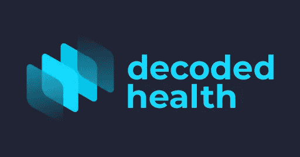
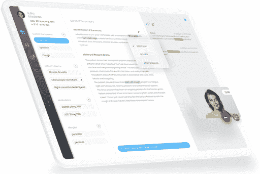
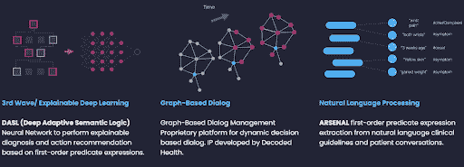

# 为什么我们投资 Decoded Health，也就是“你口袋里的住院医生”

> 原文：<https://medium.datadriveninvestor.com/why-we-invested-in-decoded-health-aka-a-medical-resident-in-your-pocket-2d498723b8ed?source=collection_archive---------13----------------------->

今年 1 月，我们投资了解码健康公司，作为由 Sierra Ventures 牵头的 450 万美元种子资金的一部分。 [Tau Ventures](http://tauventures.com/) 是硅谷的一家人工智能优先基金，主要投资于种子期，但当我们看到巨大的前景时，我们偶尔会进行后续投资。Decoded 之前的投资者包括佩罗·贾恩(Perot Jain)和 [Vituity 也投资了这一轮](https://www.vituity.com/news-and-events/vituity-and-decoded-health-launch-virtual-front-door)。Decoded 为患者和医生提供了一个人工智能，自动化对话和临床任务，因此医疗保健更好、更快、更便宜。他们成立于 2018 年，给我们留下了深刻的印象:(1)强烈的需求，(2)建立以执行为中心的团队，(3)创造差异化的产品。

**1)需要**

美国将五分之一的 GDP 用于医疗保健，几乎是类似发达国家平均水平的两倍。我们的结果并没有明显改善，而且有大量的患者不满意。相当一部分这种情绪可以归因于低效率，无论是过度测试/测试不足还是纯粹的官僚主义。事实上，我们大约三分之一的成本是行政费用——文书工作让病人和医生都疲惫不堪。你会发现某种程度的不满。Decoded 提供了一个人工智能驱动的应用程序，作为患者的第一个接触点，从而在所有这些因素中产生了有意义的差异。在许多医院里，住院医师(实习医师)经常与主治医师(正式注册医师)密切合作。Decoded 提供了一个与 EMR 连接的虚拟医疗住院医生，快速解析患者想要/需要的东西，为他们提供更有效的分类和诊断。最终的决定仍然是由人类做出的，但即使只是将患者更有效地送往急诊室、急诊、初级护理或专科，也会使护理质量产生巨大的差异。

**2)团队**

四位创始人在 SRI International 内部孵化 Decoded [，这是像 Intuitive Surgical、Nuance 和 Siri 这样改变世界的公司背后的同一个风险工作室。](https://medium.com/dish/how-sris-ai-technology-is-changing-the-way-healthcare-is-delivered-5052dde1de37)[马克·汉森](https://www.linkedin.com/in/mphanson/)来自 Nuance，他在那里围绕自然语言处理磨练了自己的产品、业务开发和设计技能。CMO [布伦特·杉本四叶](http://minetrap./)是一名家庭医生，他了解医疗保健的挑战以及如何度过通常长达 9-18 个月的销售周期。 [Brecken Uhl](https://www.linkedin.com/in/brecken/) 是一名专攻数据科学的博士。 [Kevin Bayes](https://www.linkedin.com/in/kevin-bayes-8894b6a/) 和 [Shimi Baliti](https://www.linkedin.com/in/shimibaliti/) 在新西兰担任建筑和工程主管，这证明了从第一天起就建立有效的分布式团队是可能的，这是我们 Tau 的信念。我们还重视 Decoded 的“扩展”团队，其中包括 SRI 和美国第三大医疗服务提供商 Vituity。Vituity 已经在他们的三个网站上推出了 Decoded，并将在包括大型医院在内的更多网站上推出，这让我们相信该公司可以快速扩展。

**3)产品**

Decoded 的核心是 DARPA 资助的围绕理解人类意图和支持临床决策的技术。许多公司已经、正在并将继续致力于解决这个问题，我们认为这个问题对于多个赢家来说已经足够大了。Decoded 特别吸引我们的是，他们围绕所有医学建立了一个本体论，而不仅仅是一种特定的疾病或器官。既全面又准确是一个难以置信的技术挑战；我们看到 Decoded 通过从他们收集的数据中学习而不断改进。最终结果是，他们使医生的效率提高了 60%，从提供者的角度来看，这不仅降低了成本(减少了浪费的工作)，还增加了收入(可以看到更多的病人)。

我们很荣幸也很兴奋成为 Decoded Health 之旅的一部分，利用技术解决一个大问题。更在[http://decodedhealth.com](http://decodedhealth.com/)。

*原载于* [*数据驱动投资人*](https://www.datadriveninvestor.com/2021/02/08/why-we-invested-in-decoded-health-aka-a-medical-resident-in-your-pocket/) *，《我很乐意在其他平台上辛迪加。我是*[*Tau Ventures*](https://www.linkedin.com/pulse/announcing-tau-ventures-amit-garg/)*的管理合伙人和联合创始人，在硅谷工作了 20 年，涉足企业、创业公司和风险投资基金。这些都是专注于实践见解的有目的的短文(我称之为 GL；dr —良好的长度；确实读过)。我的许多文章都在*[*https://www . LinkedIn . com/in/am garg/detail/recent-activity/posts*](https://www.linkedin.com/in/amgarg/detail/recent-activity/posts/)*上，如果它们能让人们对某个话题产生足够的兴趣，从而进行更深入的探讨，我会感到非常兴奋。如果这篇文章有对你有用的见解，请评论和/或给文章和* [*Tau Ventures 的 LinkedIn 页面*](https://www.linkedin.com/company/tauventures) *点赞，感谢你对我们工作的支持。这里表达的所有观点都是我自己的。*