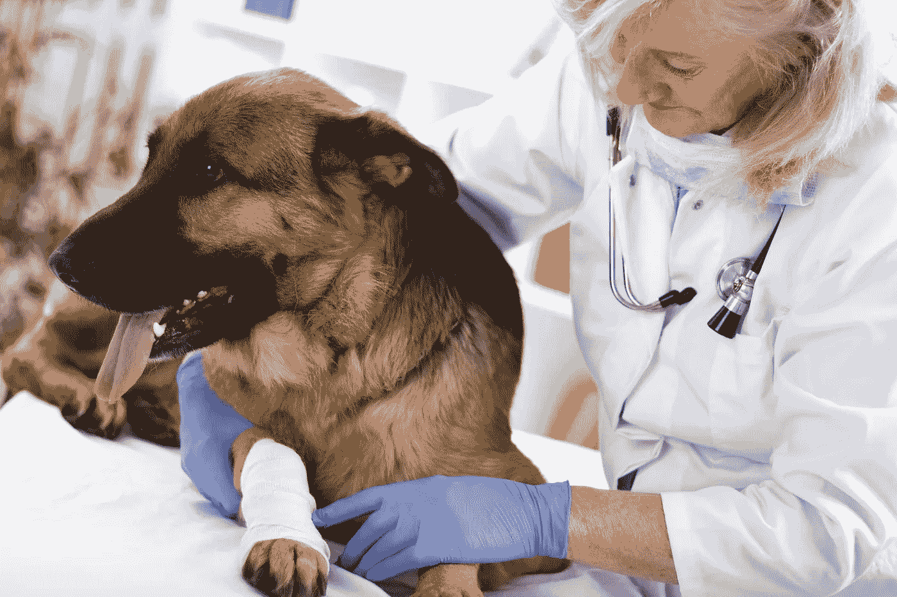
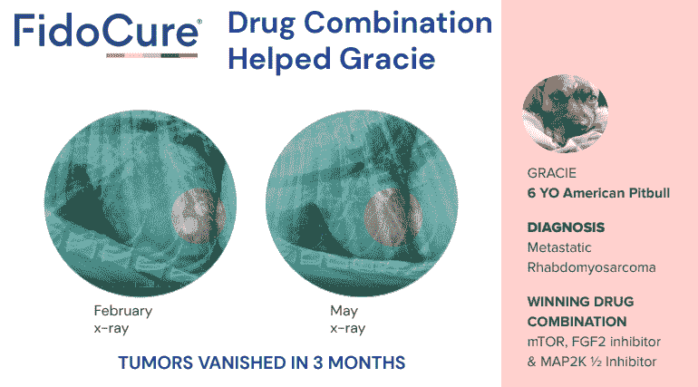
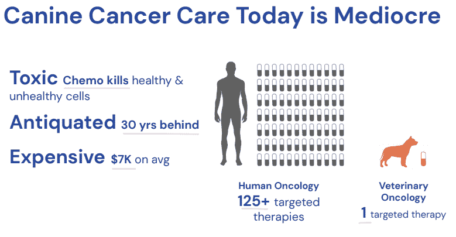
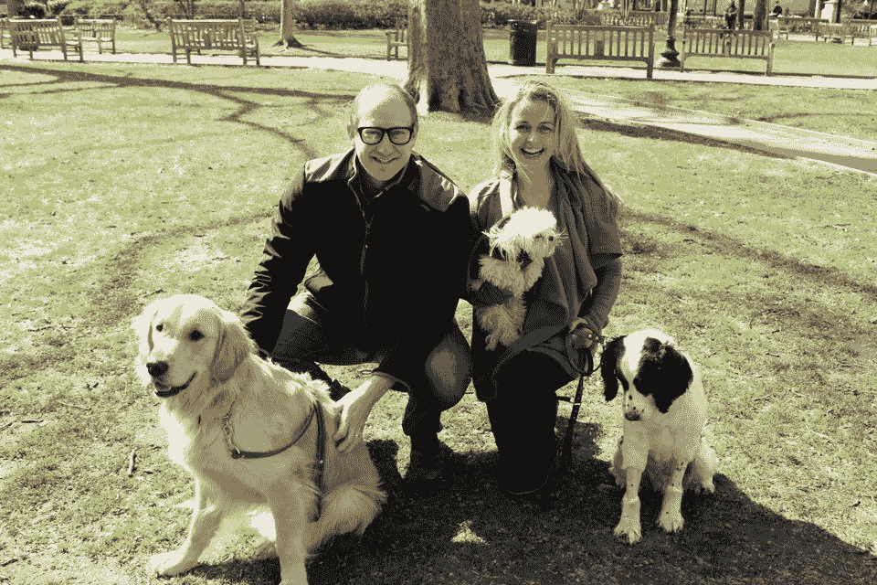
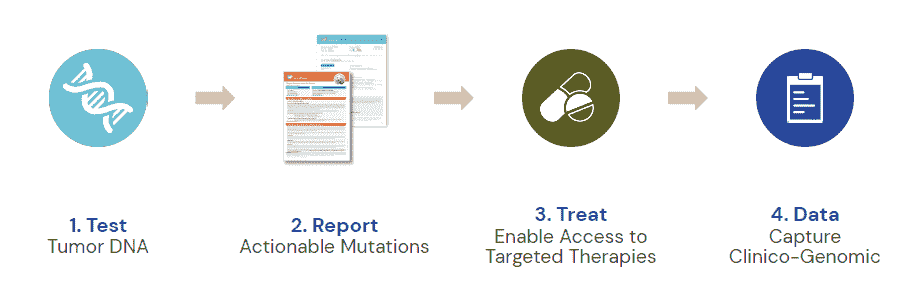

# 为什么我们投资 FidoCure，也就是技术如何帮助拯救狗(最终拯救人类)免于癌症

> 原文：<https://medium.datadriveninvestor.com/why-we-invested-in-fidocure-aka-how-tech-can-help-save-dogs-and-eventually-humans-from-cancer-881693516778?source=collection_archive---------16----------------------->

10 月份，[的同一健康公司 FidoCure](https://www.forbes.com/sites/alexknapp/2020/10/29/meet-the-married-couple-who-just-raised-10-million-to-improve-cancer-treatments-for-dogs/?sh=7c49e6844abb) 宣布了由北极星投资公司(Polaris Ventures)领投的 1000 万美元的 A 轮融资，鉴于我们持续的兴奋，我们增加了我们的头寸。 [Tau Ventures](http://tauventures.com/) ，硅谷的 AI-first 种子基金，是安德森-霍维茨领导的[种子的第一个投资者。FidoCure 有助于为狗提供癌症治疗，最终也可以改善人类的癌症治疗。该公司是 YCombinator 的毕业生，给我们留下了深刻的印象:(1)强烈的需求，(2)建立一个注重执行的团队，以及(3)创造一个差异化的产品。](https://a16z.com/2019/01/23/one-health/)

 [## 离岸？创业的 5 个关键原则|数据驱动的投资者

### 在 Tau Ventures，我们投资了完全在美国的初创公司，首席执行官在美国，其余的在美国

www.datadriveninvestor.com](https://www.datadriveninvestor.com/2020/11/22/offshoring-5-key-principles-for-startups/) 

**1)需要**

美国每年有 600 万只狗患癌症，而人类只有 180 万。狗可能是患癌症最多的物种，几乎是人类的 10 倍(感谢我们对它们进行的所有基因改造)，只有 1/4 的狗得到治疗。仅在美国，狗市场就有 850 亿美元，狗主人平均要向兽医支付 6000-6000 10K 美元，让狗接受癌症治疗(来源:CareCredit)。FidoCure 的主张是，它既可以增加获得 21 世纪癌症治疗的机会，也可以提供一种更具成本效益的替代方案。鉴于与人类相比，治疗狗的保险和监管要少得多，我们也看到该公司更容易进入市场。

**2)团队**

除了强烈的使命感，我们还感谢两位创始人带来的经验。首席执行官 Christina Lopes 曾担任 Cerberus Capital 的董事总经理，在此期间，她与世界各地的实体和个人打交道，同时帮助管理 450 亿美元的资产。CSO /联合创始人本·刘易斯之前在巴西创立了 4Vets，提供全国范围内的多品牌 B2B 兽医和宠物用品分销商。克里斯蒂娜是来自世界经济论坛的年轻全球领导人，类似于全球 40 岁和 40 岁以下的领导人，本是 2004 年奥运会美国皮划艇队的队长，这补充了他们出色的学术资历。他们建立了一个由 14 人组成的团队，专注于工程、产品和业务角色，在硅谷中心的帕洛阿尔托运营。

**3)产品**

该公司的产品类似于狗主人的私人医学，由测试+报告+治疗+数据组成，在许多方面是犬基础医学/熨斗健康。他们最初的渠道是 B2B，但 D2C 变得越来越重要，这是我们非常支持的。该公司刚刚治疗了 1100 只狗，这是对数字渠道持续实验的结果，同时也在关键意见领袖(kol)中确立了自己的地位。从长远来看，我们认为该公司会有更大的作为，因为他们一直在扩大他们的数据库，并开始显示犬类与人类癌症相关的结果。例如，他们在 2020 年 6 月的美国癌症研究协会上展示了他们的结果，并在 2020 年 10 月的一篇论文中发表在《欧洲癌症杂志》上。

我们很荣幸也很兴奋能成为 FidoCure 旅程的一部分，用技术解决一个大问题。更在 http://fidocure.com 的[。](http://fidocure.com/)

*本文图片由 FidoCure 提供。原载于“* [*”数据驱动投资人*](https://www.datadriveninvestor.com/2020/12/06/why-we-invested-in-fidocure-aka-how-tech-can-help-save-dogs-and-eventually-humans-from-cancer/) *，“我很乐意在其他平台上辛迪加。我是*[*Tau Ventures*](https://www.linkedin.com/pulse/announcing-tau-ventures-amit-garg/)*的管理合伙人和联合创始人，在硅谷工作了 20 年，涉足企业、创业公司和风险投资基金。这些都是专注于实践见解的有目的的短文(我称之为 GL；dr —良好的长度；确实读过)。我的许多文章都在*[*https://www . LinkedIn . com/in/am garg/detail/recent-activity/posts*](https://www.linkedin.com/in/amgarg/detail/recent-activity/posts/)*上，如果它们能让人们对某个话题产生足够的兴趣，从而进行更深入的探讨，我会感到非常兴奋。如果这篇文章有对你有用的见解，请在 Tau Ventures 的 LinkedIn 页面* *上对这篇文章和* [*给予评论和/或赞，感谢你对我们工作的支持。这里表达的所有观点都是我自己的。*](https://www.linkedin.com/company/tauventures)

**访问专家视图—** [**订阅 DDI 英特尔**](https://datadriveninvestor.com/ddi-intel)