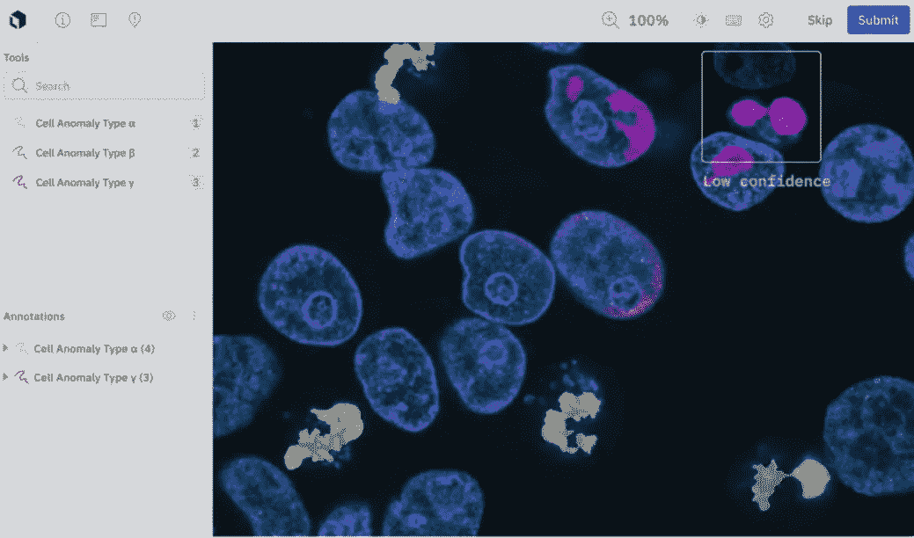
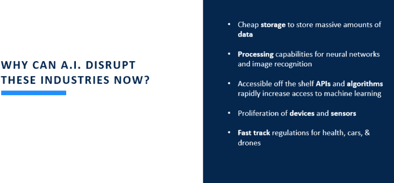
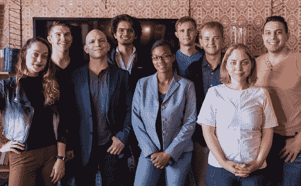
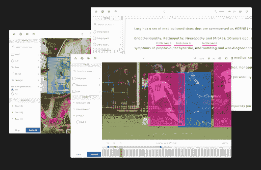

# 为什么我们投资人工智能革命的“鹤嘴锄”

> 原文：<https://medium.datadriveninvestor.com/why-we-invested-in-labelbox-aka-the-pickaxe-of-the-ai-revolution-55c79fd68c8d?source=collection_archive---------21----------------------->

Source: Labelbox

我们刚刚投资了 [Labelbox](https://labelbox.com/) ，作为他们由 B Capital 领投的 4000 万美元 C 轮投资的一部分，以下是一些报道:[商业内幕](https://www.businessinsider.com/labelbox-40m-seriesc-funding-data-labeling-machine-learning-2021-2)、 [VentureBeat](https://venturebeat.com/2021/02/11/labelbox-raises-40-million-for-its-data-labeling-and-annotation-tools/) 、[公司的博客文章](https://labelbox.com/blog/why-we-raised-our-series-c-round/)。Tau Ventures 是硅谷的一家人工智能优先基金，主要投资于种子期，但当我们看到巨大的前景时，我们偶尔会进行后续投资。Labelbox 之前的投资者包括 a16z、Gradient、FirstRound 和 Kleiner 也进行了本轮投资。Labelbox 是一个协作训练数据平台，为计算机视觉应用创建和管理标记数据。该公司成立于 2017 年，给我们留下了深刻的印象:(1)强烈的需求，(2)建立以工程为重点的团队，(3)创造差异化的产品。

**1)需要**

我们建立 Tau Ventures 的明确论点是，人工智能工具的民主化将为空前数量的应用提供动力。事实上，下面是我们自己的幻灯片:

Labelbox 是至关重要的鹤嘴锄，为公司提供了一种组织数据的方式。鉴于这不仅仅是一个增长中的市场，而是一个爆炸式增长的市场，我们还看到了近期/中期的多个赢家。

**2)团队**

从下图所示的 2018 年的小团队到今天的 99 人，Labelbox 以任何创业标准都异常增长。我们从三位联合创始人身上看到了公司的工程实力。首席执行官 Manu Sharma 在 Planet Labs 和 DroneDeploy 等变革型公司设计和制造产品。首席运营官·布赖恩·里格尔在波音 787 梦想飞机上开始了他的职业生涯，并最终帮助国际空间站安装了硬件。我们认识到 Labelbox 领域的激烈竞争，但也相信该团队有能力赢得交易。

*来源:*[*TechCrunch*](https://techcrunch.com/2018/07/30/labelbox/)

**3)产品**

Labelbox 是一个横向产品，因此其客户遍布许多行业。总的来说，该公司有三个主要群体——企业、中端市场和联邦市场——直到最近，所有客户都是入境客户。他们混合使用不同的定价策略，基于每许可费用和基于图像注释数量的使用量。使用费使公司能够根据客户对人工智能的使用按比例增加收入。此外，Labelbox 的技术不像大多数竞争对手那样有人类参与。这使得他们对业务流程外包公司更加友好，这些公司可以利用他们的工具来管理自己的员工。所有这些都考虑到了我们对团队建设和未来潜力的评价。

*来源:标签盒*

我们很荣幸也很兴奋能成为 Labelbox 旅程的一部分，利用技术解决一个大问题。更在 http://labelbox.com 的[。](http://labelbox.com/)

*原载于* [*数据驱动投资人*](https://www.datadriveninvestor.com/2021/02/15/why-we-invested-in-labelbox-aka-the-pickaxe-of-the-ai-revolution/) *，“我很乐意在其他平台上辛迪加。我是*[*Tau Ventures*](https://www.linkedin.com/pulse/announcing-tau-ventures-amit-garg/)*的管理合伙人和联合创始人，在硅谷工作了 20 年，涉足企业、创业公司和风险投资基金。这些都是专注于实践见解的有目的的短文(我称之为 GL；dr —良好的长度；确实读过)。我的许多文章都在*[*https://www . LinkedIn . com/in/am garg/detail/recent-activity/posts*](https://www.linkedin.com/in/amgarg/detail/recent-activity/posts/)*上，如果它们能让人们对某个话题产生足够的兴趣，从而进行更深入的探讨，我会感到非常兴奋。如果这篇文章有对你有用的见解，请在 Tau Ventures 的 LinkedIn 页面* *上对这篇文章和* [*给予评论和/或赞，感谢你对我们工作的支持。这里表达的所有观点都是我自己的。*](https://www.linkedin.com/company/tauventures)