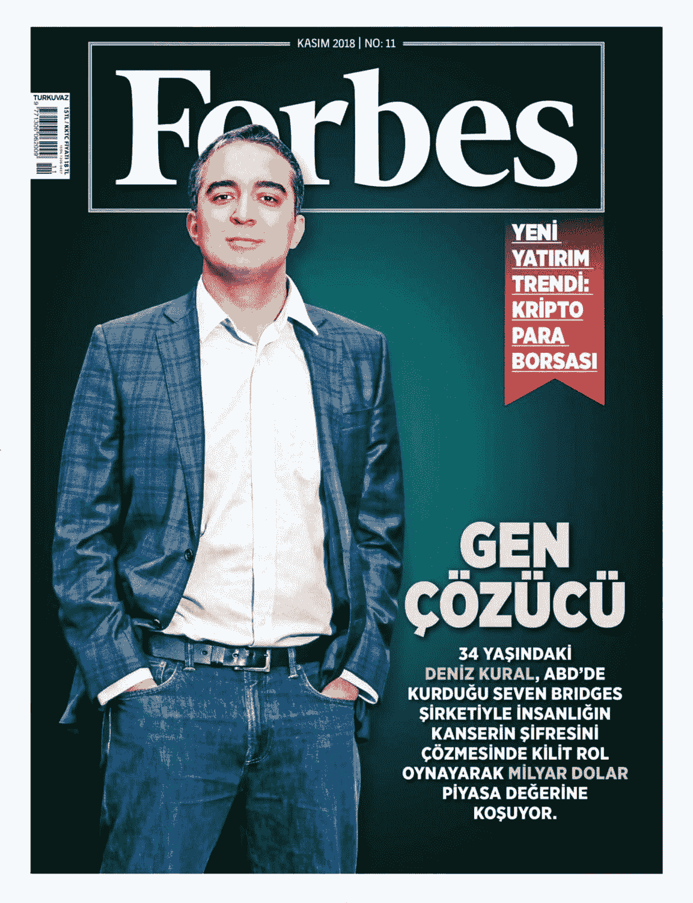

# 为什么我们投资于人工智能，即人工智能如何帮助我们生产抗癌和抗艾滋病的药物

> 原文：<https://medium.datadriveninvestor.com/why-we-invested-in-totient-aka-how-ai-can-help-us-produce-drugs-against-cancer-and-covid-2c1cc8355d04?source=collection_archive---------16----------------------->

9 月 10 日，[人工智能驱动的药物研发公司](https://totient.bio/)[从隐身状态](https://www.prnewswire.com/news-releases/totient-comes-out-of-stealth-with-novel-covid-19-program-and-10m-in-seed-funding-for-ai-driven-drug-discovery-platform-301127375.html)中脱颖而出，[宣布与](https://www.prnewswire.com/news-releases/totient-partners-with-ginkgo-bioworks-to-apply-unique-discovery-platform-to-covid-19-antibody-efforts-301127384.html)[银杏生物工程](https://www.ginkgobioworks.com/)建立关键合作关系，以快速识别抗新冠肺炎病毒的中和抗体。Totient 已经从 Tau Ventures 和其他科技和生命科学投资者那里筹集了超过 1000 万美元的种子资金。

我们对 Totient 的信念根植于(1)雄心勃勃的愿景，(2)既有科学经验又有商业经验的团队，(3)以及早期的平台验证。这篇文章特别关注 Totient，但反映了我们 Tau 对种子期投资的广泛思考。

 [## 2020 年最佳短期投资选择精选资源|数据驱动型投资者

### 投资是增加你净财富的一个好方法。如果你通过遵循一个严格的…

www.datadriveninvestor.com](https://www.datadriveninvestor.com/2020/03/28/handpicked-resources-for-the-best-short-term-investment-options-of-2020/) 

**1)视觉**

免疫系统是一种不可思议的强大力量。我们的身体已经进化了几千年，以抵御外来病原体和预防疾病。然而，有些人的免疫系统比其他人更强。如果我们可以观察那些成功战胜疾病的人，并“借鉴”他们的免疫反应，而不是每次面对新疾病时，我们每个人都必须从头开始新的防御，会怎么样？Totient 使用一个强大的机器学习和生物信息学平台来分析癌症、自身免疫性疾病、病毒感染等疾病的非凡幸存者，并识别和重建这些患者为生存而产生的抗体。他们将这些抗体转化为我们其他人可以服用的药物，最棒的是，因为它们来自人类，所以比我们在实验室合成的任何东西都更安全。

**2)团队**

Totient 目前的团队有 18 人，其中 14 人是科学家和工程师——这是我们所有投资中博士比例最高的。处于前沿的公司在将其创新商业化方面经常面临挑战，但我们在勤奋中认识到了他们的创业敏锐度，并在几个月后增加了我们的所有权。特别是，我们认识到首席执行官德尼兹(下图为福布斯封面人物，他的祖国土耳其)领导技术开发和 CEO 詹姆斯领导业务和运营之间的强大合作伙伴关系。Deniz 和 James 一起工作了近十年，此前共同创立了领先的生物信息学公司 Seven Bridges，该公司被评为 2016 年《麻省理工技术评论》50 家最聪明的公司之一。Totient 团队还在 Kaggle 机器学习冠军赛的 2749 个团队中赢得了第四名，该比赛旨在建立深度神经网络来预测一对原子之间的磁相互作用——他们是排名最高的初创公司。

**3)证据点**

当我们在 Totient 身上下注时，我们相信他们处理数据的能力是最终发现的关键。赌注有了回报:据我们所知，无论是在工业界还是学术界，Totient 都是唯一一个成功验证了从标准批量 RNA 测序(RNA-Seq)数据组装的抗体的团队，这些数据广泛可用，但却是众所周知的嘈杂数据源。这种方法之所以有效，是因为通过对来自 50，000 多名非凡幸存者的样本进行算法调整，获得了强大的统计能力。

当我们进行投资时，Totient 最初专注于癌症，但随着更广泛的科学界动员起来应对冠状病毒疫情，Totient 已经调整了其平台和方法，以帮助发现新冠肺炎的治疗方法。与银杏生物工程公司的合作就是这一努力的结果。在这一发现中，Totient 将对从新冠肺炎幸存者肺部收集的样本运行他们的算法，以识别可用于预防和治疗世界各地患者病毒的抗体。

将药物送到你的手中可能还需要很长时间，因为还有很长的路要走，但我们对现在与 Totient 合作的生物技术和制药公司感到兴奋。

*原载于* [*数据驱动投资人*](https://www.datadriveninvestor.com/2020/09/13/why-we-invested-in-totient-aka-how-ai-can-help-us-produce-drugs-against-cancer-and-covid/) *，《我很乐意在其他平台上辛迪加。我是*[*Tau Ventures*](https://www.linkedin.com/pulse/announcing-tau-ventures-amit-garg/)*的管理合伙人和联合创始人，在硅谷工作了 20 年，涉足企业、创业公司和风险投资基金。这些都是专注于实践见解的有目的的短文(我称之为 GL；dr —良好的长度；确实读过)。我的许多文章都在*[*https://www . LinkedIn . com/in/am garg/detail/recent-activity/posts*](https://www.linkedin.com/in/amgarg/detail/recent-activity/posts/)*上，如果它们能让人们对某个话题产生足够的兴趣，从而进行更深入的探讨，我会感到非常兴奋。如果这篇文章有对你有用的见解，请评论和/或给文章和* [*Tau Ventures 的 LinkedIn 页面*](https://www.linkedin.com/company/tauventures) *点赞，感谢你对我们工作的支持。这里表达的所有观点都是我自己的。*

**访问专家视图—** [**订阅 DDI 英特尔**](https://datadriveninvestor.com/ddi-intel)