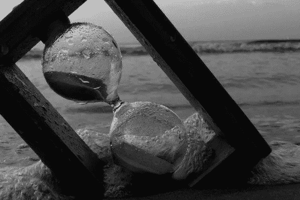

# 为什么我们喜欢平庸的生活？

> 原文：<https://medium.datadriveninvestor.com/why-we-love-our-mediocre-life-8d1b18ada712?source=collection_archive---------12----------------------->

“You live as if you were destined to live forever, no thought of your frailty ever enters your head, of how much time has already gone by you take no heed.” — Seneca

2020 年 4 月 19 日

有一天他“醒来”。他意识到他真的“醒了”。他不会在床上多呆两个小时，只是浏览互联网和玩手机。相反，他站起来开始他的一天。因为他意识到他已经醒来，并被他之前的生活吓坏了。他开始规划自己的生活，以免生活陷入他现在深深恐惧的无序状态。他看着他的笔记本电脑，他发誓要超越人类的平庸，而不是在互联网上浪费生命(他通常会这样做)。

因为他已经醒了，他不想再睡着。他回忆起醒来前的自己。一种无脑的存在，无休止地追逐着自己想要实现的无意义的欲望。回头一看，他再次颤抖，感到一阵强烈的悔恨。“我浪费了太多的生命，”他自言自语，几乎像是在祈祷。“再也不会，再也不会那样生活了。”因为他现在知道他已经意识到他的生活是什么样的。这是一种平庸而无意义的生活。这是一个人的生命，在他死去的那一刻就可以被替代。他知道他必须比那更伟大，比围绕在他周围的绵羊和不久前的绵羊更伟大。他写下自己的承诺，并无休止地沉思。他尝试了他所知道的每一种方法来燃烧他灵魂中的“觉醒”状态。

他晚上睡觉时希望明天醒来，醒来时会感到和今天一样的恐惧和意识。他祈祷自己能从平庸的沉睡中安然无恙，当他永恒的祈祷渐渐黯淡时，修普诺斯在他昏睡的臂弯中认领了他。

 [## 如何让人们真正倾听你|数据驱动的投资者

### 没有神奇的五步公式。这可能不是你现在想听到的，但相信我，从长远来看，这是…

www.datadriveninvestor.com](https://www.datadriveninvestor.com/2020/03/22/how-to-get-people-to-really-listen-to-you/) 

在他睡觉的时候，我小声对他说，希望他不会听到。因为这是一个太悲伤的消息，他醒着的时候听到的。我轻轻地说，“明天当你醒来时，你会回到你现在如此厌恶的那种无脑的生活。你会继续在互联网上浪费生命。你仍然会和你的手机结婚，任何有意义的存在对你来说都是陌生的。这就是平庸对你的诱惑。”我吸了一口气，继续说道:“你不会记得你曾经‘醒来’，你会继续寻找转瞬即逝的幸福，你会让你琐碎的欲望成为你的主人，但是……”

我愣了一下。

我本想悄悄对他说些鼓励的话，但一句也没想到。现实是这样的，我不能编造谎言。无话可说地离开了，我向他沉睡的身体致敬，然后走开了。

这也是人类的悲剧。我以为。能够“醒来”却又重新睡去。事实上，除了人类，没有其他动物会制造这样的悲剧。

“哦，人类真是一件杰作”。